# Project Management and Methodology

<cite>
**Referenced Files in This Document**
- [BMAD_STRUCTURE.md](file://BMAD_STRUCTURE.md)
- [Key Functionalities.txt](file://Key Functionalities.txt)
- [description.txt](file://description.txt)
- [SkillCreator.md](file://SkillCreator.md)
- [manifest.yaml](file://_bmad/_config/manifest.yaml)
- [agent-manifest.csv](file://_bmad/_config/agent-manifest.csv)
- [skill-manifest.csv](file://_bmad/_config/skill-manifest.csv)
- [files-manifest.csv](file://_bmad/_config/files-manifest.csv)
- [config.yaml (core)](file://_bmad/core/config.yaml)
- [config.yaml (bmm)](file://_bmad/bmm/config.yaml)
- [module-help.csv (core)](file://_bmad/core/module-help.csv)
- [module-help.csv (bmm)](file://_bmad/bmm/module-help.csv)
- [epics.md](file://_bmad-output/planning-artifacts/epics.md)
- [ux-design-specification.md](file://_bmad-output/planning-artifacts/ux-design-specification.md)
- [ux-design-directions.html](file://_bmad-output/planning-artifacts/ux-design-directions.html)
- [implementation-readiness-report-2026-04-17.md](file://_bmad-output/planning-artifacts/implementation-readiness-report-2026-04-17.md)
- [api-contracts.md](file://docs/api-contracts.md)
- [architecture.md](file://docs/architecture.md)
- [data-models.md](file://docs/data-models.md)
- [index.md](file://docs/index.md)
- [source-tree-analysis.md](file://docs/source-tree-analysis.md)
</cite>

## Table of Contents
1. [Introduction](#introduction)
2. [Project Structure](#project-structure)
3. [Core Components](#core-components)
4. [Architecture Overview](#architecture-overview)
5. [Detailed Component Analysis](#detailed-component-analysis)
6. [Dependency Analysis](#dependency-analysis)
7. [Performance Considerations](#performance-considerations)
8. [Troubleshooting Guide](#troubleshooting-guide)
9. [Conclusion](#conclusion)
10. [Appendices](#appendices)

## Introduction
This document provides comprehensive project management and methodology guidance for the NonCash project, implementing the BMAD (Business Model and Architecture Design) methodology with agile governance. It covers planning and implementation phases, artifact generation and management, skill and agent configuration, manifest-based organization, governance, QA, milestone tracking, collaboration between stakeholders and technical teams, change management, risk assessment, and timeline management. It also includes templates and tools for documentation and progress tracking derived from the repository’s BMAD configuration and artifacts.

## Project Structure
The NonCash repository organizes project knowledge and BMAD artifacts into a structured, manifest-driven system:
- BMAD core and BMM modules define phases, skills, and workflows.
- Configuration files establish project metadata, output locations, and language settings.
- Planning artifacts capture epics, UX specifications, and implementation readiness reports.
- Knowledge base documents describe architecture, data models, API contracts, and source tree analysis.

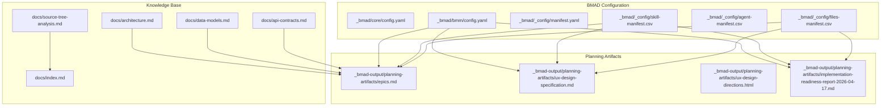

**Diagram sources**
- [config.yaml (bmm):1-17](file://_bmad/bmm/config.yaml#L1-L17)
- [manifest.yaml:1-25](file://_bmad/_config/manifest.yaml#L1-L25)
- [skill-manifest.csv:1-43](file://_bmad/_config/skill-manifest.csv#L1-L43)
- [agent-manifest.csv:1-8](file://_bmad/_config/agent-manifest.csv#L1-L8)
- [files-manifest.csv:1-262](file://_bmad/_config/files-manifest.csv#L1-L262)
- [epics.md:1-319](file://_bmad-output/planning-artifacts/epics.md#L1-L319)
- [ux-design-specification.md:1-353](file://_bmad-output/planning-artifacts/ux-design-specification.md#L1-L353)
- [ux-design-directions.html:1-133](file://_bmad-output/planning-artifacts/ux-design-directions.html#L1-L133)
- [implementation-readiness-report-2026-04-17.md:1-127](file://_bmad-output/planning-artifacts/implementation-readiness-report-2026-04-17.md#L1-L127)
- [architecture.md](file://docs/architecture.md)
- [data-models.md](file://docs/data-models.md)
- [api-contracts.md](file://docs/api-contracts.md)
- [source-tree-analysis.md](file://docs/source-tree-analysis.md)
- [index.md](file://docs/index.md)

**Section sources**
- [config.yaml (bmm):1-17](file://_bmad/bmm/config.yaml#L1-L17)
- [manifest.yaml:1-25](file://_bmad/_config/manifest.yaml#L1-L25)
- [files-manifest.csv:1-262](file://_bmad/_config/files-manifest.csv#L1-L262)

## Core Components
- BMAD Modules and Workflows: The BMM module orchestrates the nine-phase methodology (Research, Planning, Solutioning, Implementation) with skills for research, PRD creation, UX design, architecture, epics/stories, implementation readiness, sprint planning, story dev, QA automation, checkpoints, code review, retrospectives, and change correction.
- Core Module: Provides foundational skills for brainstorming, multi-agent orchestration, documentation indexing, editorial review, adversarial review, edge-case hunting, and distillation of source materials.
- Agent and Skill Manifests: Define roles, capabilities, and canonical skills for specialized agents (Analyst, Tech Writer, PM, UX Designer, Architect, Developer) and the skill catalog used across phases.
- Configuration: Centralized configuration sets project name, skill level, output folders, languages, and knowledge locations for artifacts and documentation.

Key configuration highlights:
- Project name and user context
- Output folders for planning and implementation artifacts
- Knowledge base location for documentation
- Language settings for communication and document output

**Section sources**
- [module-help.csv (bmm):1-34](file://_bmad/bmm/module-help.csv#L1-L34)
- [module-help.csv (core):1-13](file://_bmad/core/module-help.csv#L1-L13)
- [config.yaml (core):1-10](file://_bmad/core/config.yaml#L1-L10)
- [config.yaml (bmm):1-17](file://_bmad/bmm/config.yaml#L1-L17)
- [agent-manifest.csv:1-8](file://_bmad/_config/agent-manifest.csv#L1-L8)
- [skill-manifest.csv:1-43](file://_bmad/_config/skill-manifest.csv#L1-L43)

## Architecture Overview
NonCash adopts a three-layer SaaS architecture:
- Data Access Layer (DAL): Repository pattern with Entity Framework abstraction.
- Business Logic Layer (BLL): Microservices organizing business capabilities.
- User Interface (GUI): Blazor-based frontend.

Security and compliance:
- API Key Authentication for POS integrations.
- JWT Token Management for user sessions.
- Regulatory alignment ensuring digital vouchers are distinct from wallets.

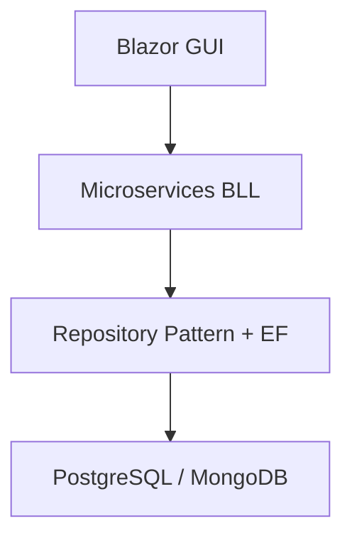

**Diagram sources**
- [BMAD_STRUCTURE.md:39-56](file://BMAD_STRUCTURE.md#L39-L56)
- [description.txt:16-21](file://description.txt#L16-L21)

**Section sources**
- [BMAD_STRUCTURE.md:1-82](file://BMAD_STRUCTURE.md#L1-L82)
- [description.txt:1-31](file://description.txt#L1-L31)

## Detailed Component Analysis

### BMAD Methodology Phases and Workflows
The BMM module defines nine phases with explicit skills and deliverables:
- Research: Domain, market, and technical research.
- Planning: Product brief, PRD creation and validation, UX design.
- Solutioning: Architecture design, epics and stories, implementation readiness.
- Implementation: Sprint planning, story creation/dev, QA automation, checkpoints, code review, retrospectives, and change correction.

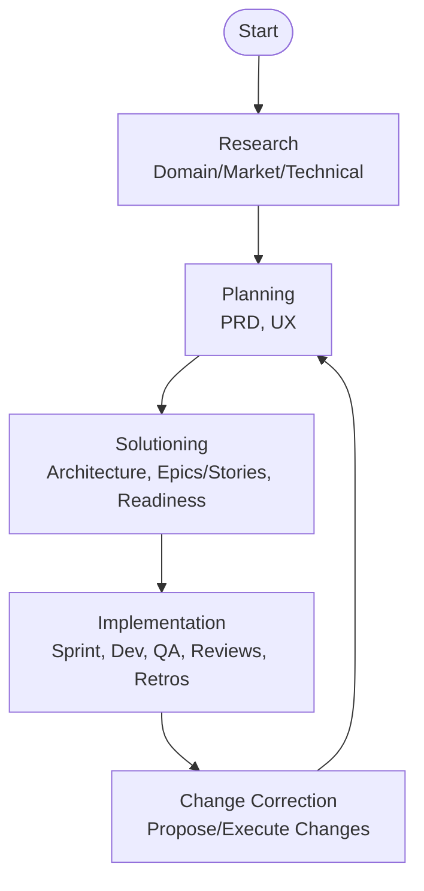

**Diagram sources**
- [module-help.csv (bmm):1-34](file://_bmad/bmm/module-help.csv#L1-L34)

**Section sources**
- [module-help.csv (bmm):1-34](file://_bmad/bmm/module-help.csv#L1-L34)

### Artifact Generation and Management
Artifacts are generated per phase and tracked for completeness and traceability:
- Epics and Stories: Decomposition of functional and non-functional requirements into implementable units with acceptance criteria.
- UX Specifications: Detailed design rationale, patterns, components, and accessibility guidelines.
- Implementation Readiness Reports: Coverage validation against PRD, UX alignment, and quality review.

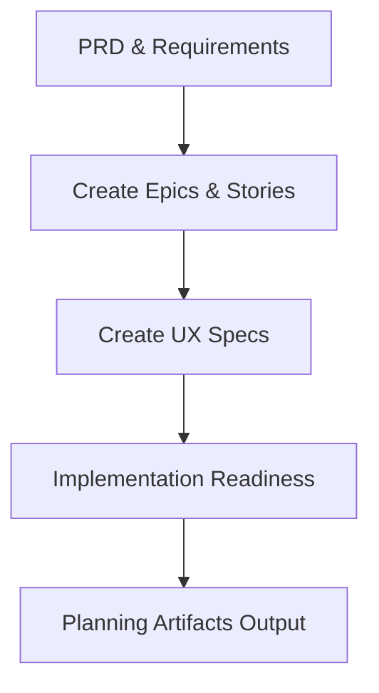

**Diagram sources**
- [epics.md:1-319](file://_bmad-output/planning-artifacts/epics.md#L1-L319)
- [ux-design-specification.md:1-353](file://_bmad-output/planning-artifacts/ux-design-specification.md#L1-L353)
- [implementation-readiness-report-2026-04-17.md:1-127](file://_bmad-output/planning-artifacts/implementation-readiness-report-2026-04-17.md#L1-L127)

**Section sources**
- [epics.md:1-319](file://_bmad-output/planning-artifacts/epics.md#L1-L319)
- [ux-design-specification.md:1-353](file://_bmad-output/planning-artifacts/ux-design-specification.md#L1-L353)
- [implementation-readiness-report-2026-04-17.md:1-127](file://_bmad-output/planning-artifacts/implementation-readiness-report-2026-04-17.md#L1-L127)

### Skill Management System and Agent Configuration
The skill and agent manifests enable a multi-agent, role-based approach:
- Agents: Analyst, Tech Writer, PM, UX Designer, Architect, Developer with defined capabilities, roles, and communication styles.
- Skills: Canonical skills mapped to modules and phases, with standardized YAML frontmatter and step-based workflows.
- Manifests: CSV and YAML catalogs enumerate skills, agents, and associated files for consistent execution.

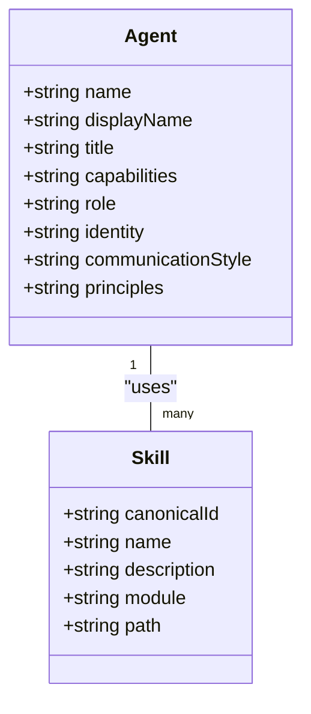

**Diagram sources**
- [agent-manifest.csv:1-8](file://_bmad/_config/agent-manifest.csv#L1-L8)
- [skill-manifest.csv:1-43](file://_bmad/_config/skill-manifest.csv#L1-L43)

**Section sources**
- [agent-manifest.csv:1-8](file://_bmad/_config/agent-manifest.csv#L1-L8)
- [skill-manifest.csv:1-43](file://_bmad/_config/skill-manifest.csv#L1-L43)
- [SkillCreator.md:1-156](file://SkillCreator.md#L1-L156)

### Manifest-Based Project Organization
Manifests govern how files, skills, and agents are organized and referenced:
- Files manifest enumerates templates, prompts, workflows, and resources across modules.
- Skill and agent manifests provide canonical references for execution.
- Core and BMM configurations define output locations and language preferences.

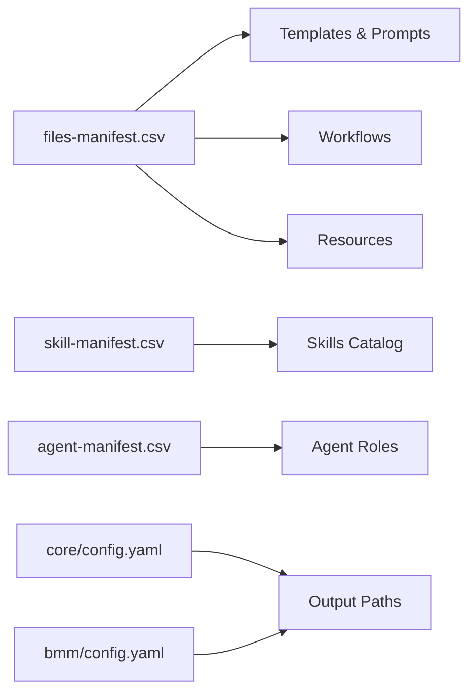

**Diagram sources**
- [files-manifest.csv:1-262](file://_bmad/_config/files-manifest.csv#L1-L262)
- [skill-manifest.csv:1-43](file://_bmad/_config/skill-manifest.csv#L1-L43)
- [agent-manifest.csv:1-8](file://_bmad/_config/agent-manifest.csv#L1-L8)
- [config.yaml (core):1-10](file://_bmad/core/config.yaml#L1-L10)
- [config.yaml (bmm):1-17](file://_bmad/bmm/config.yaml#L1-L17)

**Section sources**
- [files-manifest.csv:1-262](file://_bmad/_config/files-manifest.csv#L1-L262)
- [config.yaml (core):1-10](file://_bmad/core/config.yaml#L1-L10)
- [config.yaml (bmm):1-17](file://_bmad/bmm/config.yaml#L1-L17)

### Project Governance Frameworks
Governance is embedded in BMAD workflows:
- Phase gating: Each phase produces deliverables validated by subsequent skills (e.g., PRD validation, UX alignment, implementation readiness).
- Role-based permissions: Agents reflect RBAC-aligned roles (e.g., Approver, Developer).
- Standards and templates: YAML frontmatter and step-based workflows enforce consistency.

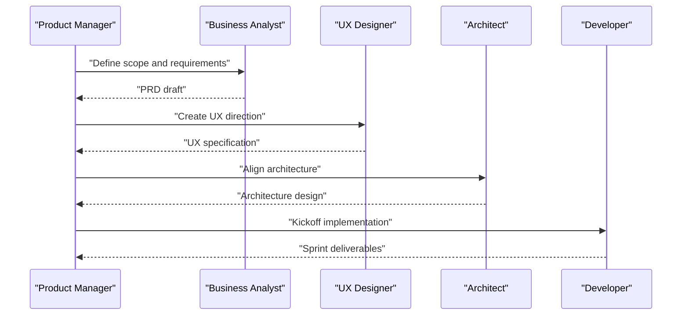

**Diagram sources**
- [module-help.csv (bmm):1-34](file://_bmad/bmm/module-help.csv#L1-L34)
- [agent-manifest.csv:1-8](file://_bmad/_config/agent-manifest.csv#L1-L8)

**Section sources**
- [module-help.csv (bmm):1-34](file://_bmad/bmm/module-help.csv#L1-L34)
- [agent-manifest.csv:1-8](file://_bmad/_config/agent-manifest.csv#L1-L8)

### Quality Assurance Procedures
Quality is ensured through adversarial review, edge-case hunting, and structured validation:
- Adversarial Review: Critical evaluation of deliverables.
- Edge Case Hunter: Exhaustive boundary condition analysis.
- Implementation Readiness: Coverage matrix and quality checklist.

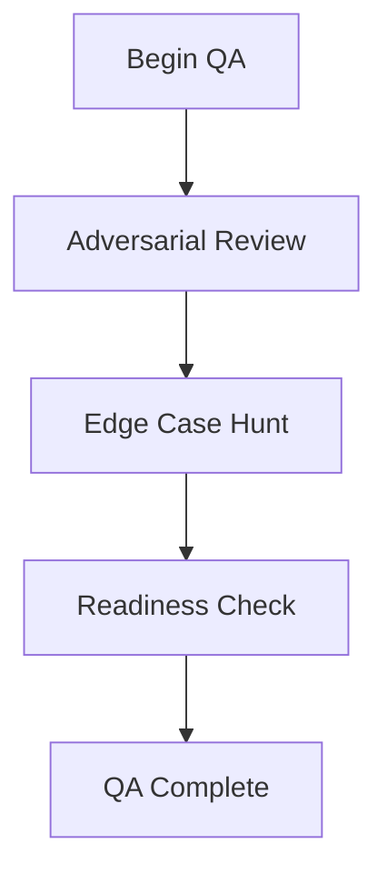

**Diagram sources**
- [module-help.csv (core):1-13](file://_bmad/core/module-help.csv#L1-L13)
- [implementation-readiness-report-2026-04-17.md:85-103](file://_bmad-output/planning-artifacts/implementation-readiness-report-2026-04-17.md#L85-L103)

**Section sources**
- [module-help.csv (core):1-13](file://_bmad/core/module-help.csv#L1-L13)
- [implementation-readiness-report-2026-04-17.md:85-103](file://_bmad-output/planning-artifacts/implementation-readiness-report-2026-04-17.md#L85-L103)

### Milestone Tracking and Timeline Management
Milestones align with BMAD phases and deliverables:
- Research milestones: Market/domain/technical reports.
- Planning milestones: PRD, UX specification, readiness report.
- Implementation milestones: Sprint plans, story completions, QA test suites, retrospectives.

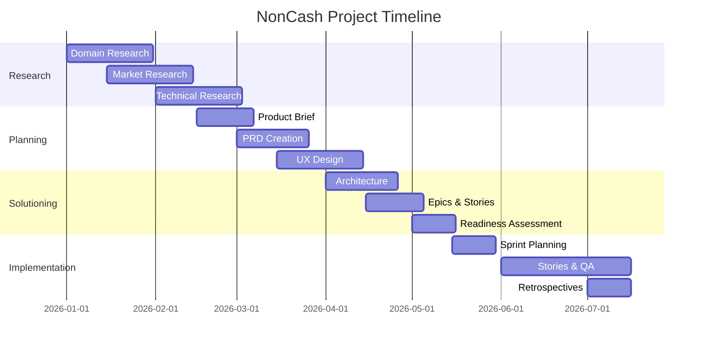

[No sources needed since this diagram shows conceptual workflow, not actual code structure]

### Collaboration Between Stakeholders and Technical Teams
Collaboration is facilitated by:
- Shared artifacts (PRD, UX, architecture) traceable to functional requirements.
- Agent roles representing stakeholder personas (Analyst, PM, UX Designer).
- Structured handoffs between phases with validation gates.

**Section sources**
- [epics.md:14-53](file://_bmad-output/planning-artifacts/epics.md#L14-L53)
- [ux-design-specification.md:17-85](file://_bmad-output/planning-artifacts/ux-design-specification.md#L17-L85)
- [agent-manifest.csv:1-8](file://_bmad/_config/agent-manifest.csv#L1-L8)

### Change Management and Risk Assessment
Change management is supported by:
- Correct Course skill for significant mid-sprint changes.
- Implementation readiness checks identifying gaps (e.g., missing UX docs).
- Risk mitigation through adversarial review and edge-case analysis.

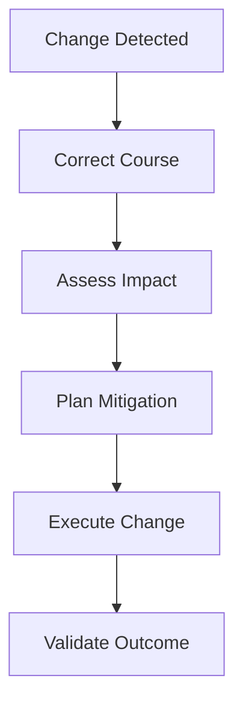

**Diagram sources**
- [module-help.csv (bmm):6-10](file://_bmad/bmm/module-help.csv#L6-L10)
- [implementation-readiness-report-2026-04-17.md:112-127](file://_bmad-output/planning-artifacts/implementation-readiness-report-2026-04-17.md#L112-L127)

**Section sources**
- [module-help.csv (bmm):6-10](file://_bmad/bmm/module-help.csv#L6-L10)
- [implementation-readiness-report-2026-04-17.md:112-127](file://_bmad-output/planning-artifacts/implementation-readiness-report-2026-04-17.md#L112-L127)

### Templates and Tools for Documentation and Progress Tracking
Templates and tools are provided across modules:
- Templates: PRD, epics/stories, UX specification, architecture decision records, project context, and sprint status.
- Workflows: Step-based workflows for research, PRD creation/edit/validate, UX design, architecture, readiness, and implementation.
- Tools: Distillation, editorial review, adversarial review, and multi-agent orchestration.

**Section sources**
- [files-manifest.csv:1-262](file://_bmad/_config/files-manifest.csv#L1-L262)
- [module-help.csv (bmm):1-34](file://_bmad/bmm/module-help.csv#L1-L34)
- [module-help.csv (core):1-13](file://_bmad/core/module-help.csv#L1-L13)

## Dependency Analysis
The project exhibits clear module and artifact dependencies:
- BMM configuration depends on core configuration and manifests.
- Planning artifacts depend on knowledge base documents and functional requirements.
- Implementation readiness depends on epics and UX specifications.

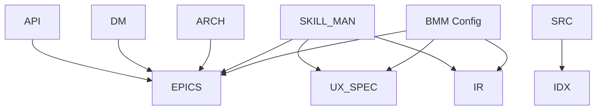

**Diagram sources**
- [config.yaml (bmm):1-17](file://_bmad/bmm/config.yaml#L1-L17)
- [skill-manifest.csv:1-43](file://_bmad/_config/skill-manifest.csv#L1-L43)
- [epics.md:1-319](file://_bmad-output/planning-artifacts/epics.md#L1-L319)
- [ux-design-specification.md:1-353](file://_bmad-output/planning-artifacts/ux-design-specification.md#L1-L353)
- [implementation-readiness-report-2026-04-17.md:1-127](file://_bmad-output/planning-artifacts/implementation-readiness-report-2026-04-17.md#L1-L127)
- [architecture.md](file://docs/architecture.md)
- [data-models.md](file://docs/data-models.md)
- [api-contracts.md](file://docs/api-contracts.md)
- [source-tree-analysis.md](file://docs/source-tree-analysis.md)
- [index.md](file://docs/index.md)

**Section sources**
- [config.yaml (bmm):1-17](file://_bmad/bmm/config.yaml#L1-L17)
- [skill-manifest.csv:1-43](file://_bmad/_config/skill-manifest.csv#L1-L43)

## Performance Considerations
- Asynchronous processing for large-scale operations (e.g., batch distribution) to prevent UI blocking.
- Lightweight client-side rendering for mobile POS terminals with color-coded feedback.
- Real-time updates via SignalR to synchronize redemption events across clients.

[No sources needed since this section provides general guidance]

## Troubleshooting Guide
Common issues and resolutions:
- Missing UX documentation: Use the UX specification template and agent UX Designer to create wireframes and guidelines.
- Coverage gaps in epics: Validate against PRD using the readiness report workflow and adjust story mapping.
- Adversarial review findings: Address flagged edge cases and re-run adversarial review.
- Sprint blockers: Use Correct Course to propose and execute changes aligned with risk and impact.

**Section sources**
- [implementation-readiness-report-2026-04-17.md:74-127](file://_bmad-output/planning-artifacts/implementation-readiness-report-2026-04-17.md#L74-L127)
- [module-help.csv (core):8-13](file://_bmad/core/module-help.csv#L8-L13)
- [module-help.csv (bmm):6-10](file://_bmad/bmm/module-help.csv#L6-L10)

## Conclusion
NonCash leverages BMAD methodology to systematically plan, design, and implement a secure, scalable voucher platform. The manifest-driven organization, agent-based skill execution, and structured governance ensure traceability, quality, and collaboration across phases. By adhering to the documented workflows, templates, and governance practices, the project can maintain alignment with business objectives while delivering robust technical outcomes.

[No sources needed since this section summarizes without analyzing specific files]

## Appendices

### A. Functional Requirements Inventory
- Production planning and approval workflows
- Multi-channel distribution (sale, promotion)
- Social gifting and transfer
- POS redemption with 6-step safety
- Customer and business management
- Outlet configuration and multi-tenancy

**Section sources**
- [Key Functionalities.txt:7-167](file://Key Functionalities.txt#L7-L167)

### B. Architecture and Data Models Overview
- Three-layer SaaS architecture with microservices
- Data models for vouchers, customers, businesses, orders, payments, production plans, and approvals
- API contracts and security measures

**Section sources**
- [BMAD_STRUCTURE.md:17-79](file://BMAD_STRUCTURE.md#L17-L79)
- [description.txt:11-27](file://description.txt#L11-L27)
- [architecture.md](file://docs/architecture.md)
- [data-models.md](file://docs/data-models.md)
- [api-contracts.md](file://docs/api-contracts.md)

### C. UX Design Directions and Components
- Visual directions (Minimal Bank, Neon Cyber, Glassmorphism)
- Core components: DynamicVoucherQR, GlassCard, PosTerminalFlash
- Accessibility and responsive design guidelines

**Section sources**
- [ux-design-directions.html:1-133](file://_bmad-output/planning-artifacts/ux-design-directions.html#L1-L133)
- [ux-design-specification.md:114-353](file://_bmad-output/planning-artifacts/ux-design-specification.md#L114-L353)

### D. Implementation Readiness Summary
- 100% functional requirement coverage
- Quality checklist passed
- Minor warnings: missing UX docs and greenfield init story

**Section sources**
- [implementation-readiness-report-2026-04-17.md:69-127](file://_bmad-output/planning-artifacts/implementation-readiness-report-2026-04-17.md#L69-L127)