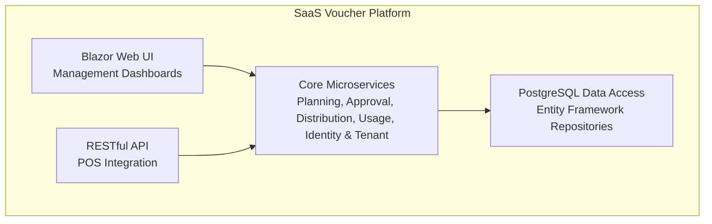
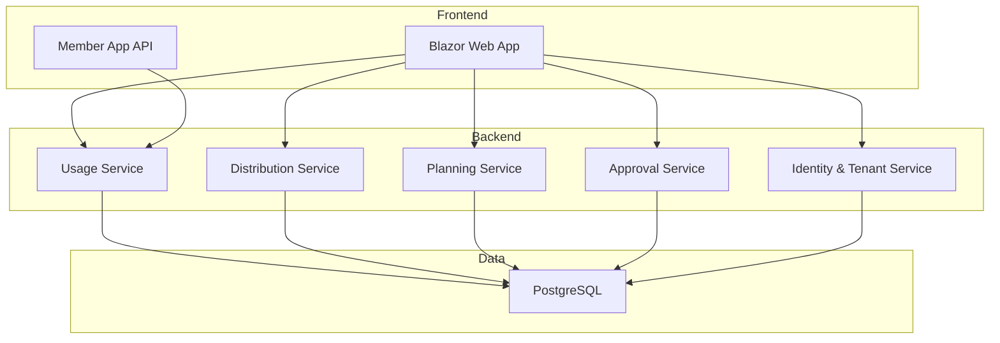
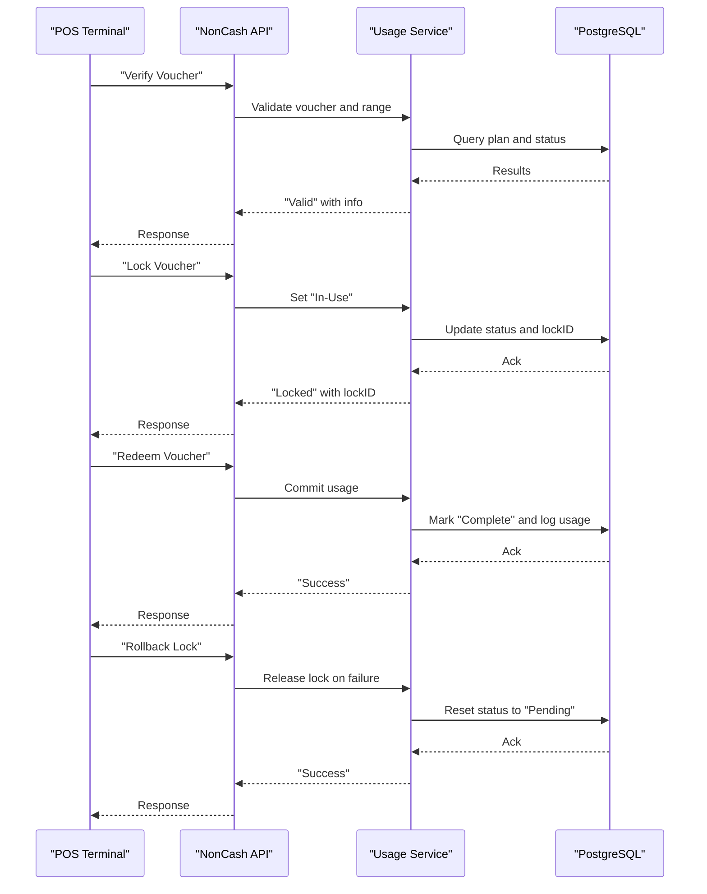
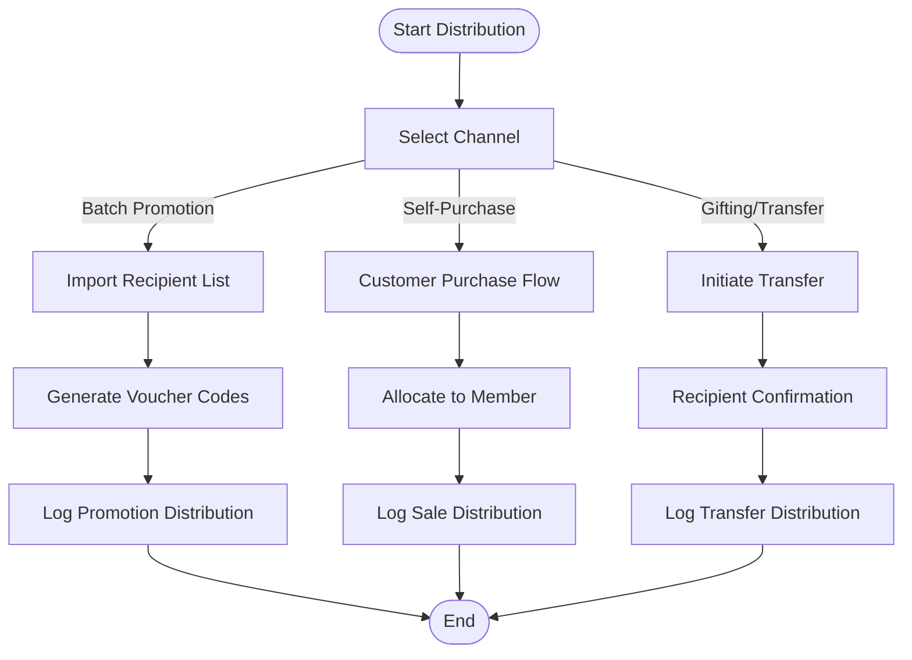
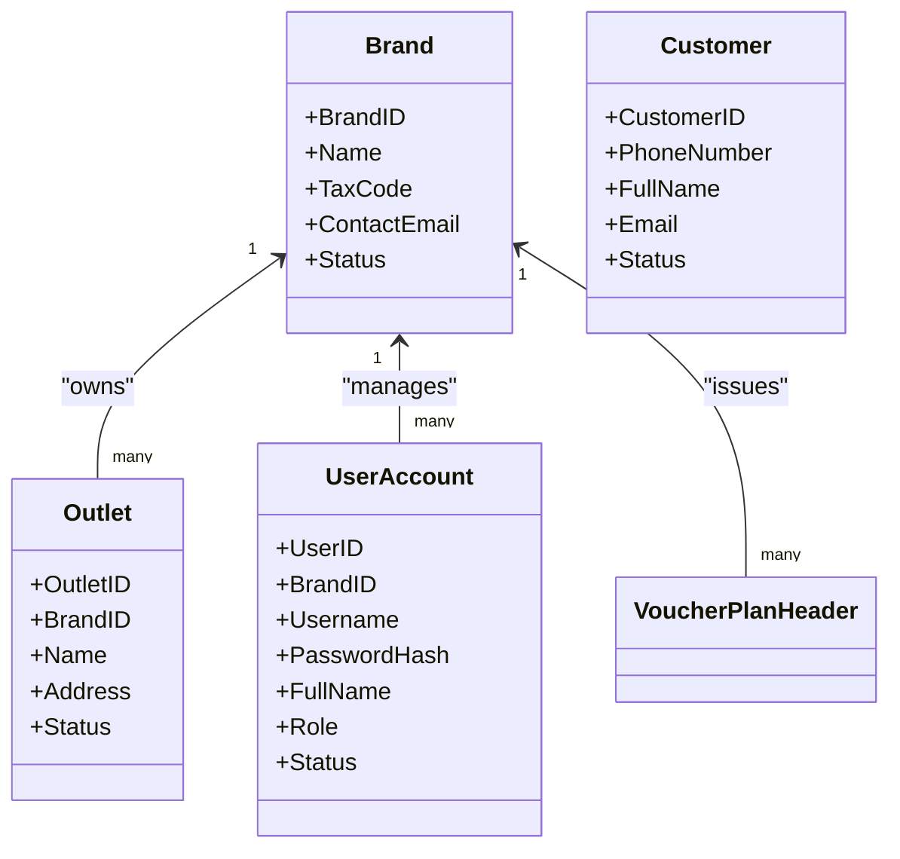
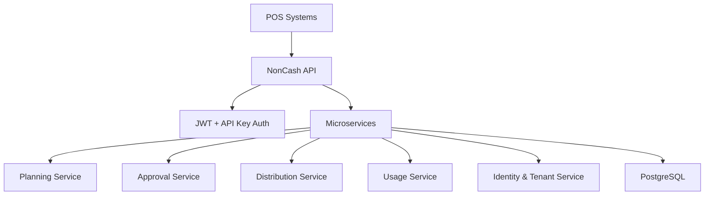

# Business Value Proposition

<cite>
**Referenced Files in This Document**
- [description.txt](file://description.txt)
- [Key Functionalities.txt](file://Key Functionalities.txt)
- [docs/index.md](file://docs/index.md)
- [docs/architecture.md](file://docs/architecture.md)
- [docs/data-models.md](file://docs/data-models.md)
- [docs/api-contracts.md](file://docs/api-contracts.md)
- [docs/source-tree-analysis.md](file://docs/source-tree-analysis.md)
- [_bmad-output/planning-artifacts/epics.md](file://_bmad-output/planning-artifacts/epics.md)
- [_bmad-output/planning-artifacts/ux-design-specification.md](file://_bmad-output/planning-artifacts/ux-design-specification.md)
- [_bmad-output/planning-artifacts/implementation-readiness-report-2026-04-17.md](file://_bmad-output/planning-artifacts/implementation-readiness-report-2026-04-17.md)
- [_bmad/_config/manifest.yaml](file://_bmad/_config/manifest.yaml)
- [_bmad/core/config.yaml](file://_bmad/core/config.yaml)
</cite>

## Table of Contents
1. [Introduction](#introduction)
2. [Project Structure](#project-structure)
3. [Core Components](#core-components)
4. [Architecture Overview](#architecture-overview)
5. [Detailed Component Analysis](#detailed-component-analysis)
6. [Dependency Analysis](#dependency-analysis)
7. [Performance Considerations](#performance-considerations)
8. [Troubleshooting Guide](#troubleshooting-guide)
9. [Conclusion](#conclusion)
10. [Appendices](#appendices)

## Introduction
NonCash is a SaaS voucher platform designed to eliminate manual processes, streamline inventory and distribution, and enable secure, real-time POS redemption. By automating production planning, approvals, multi-channel distribution, and POS integration, NonCash helps enterprises reduce costs, improve operational efficiency, and unlock new revenue opportunities. The platform’s multi-tenant architecture, dynamic security tokens, and comprehensive audit trails position it as a scalable, secure, and future-ready solution for modern businesses.

## Project Structure
The repository organizes the NonCash platform around a 3-layer SaaS architecture with microservices supporting planning, approval, distribution, usage, identity, and tenant management. Supporting documentation covers architecture, data models, API contracts, and UX design direction.

**Diagram sources**
- [docs/source-tree-analysis.md:7-34](file://docs/source-tree-analysis.md#L7-L34)
- [docs/architecture.md:5-52](file://docs/architecture.md#L5-L52)

**Section sources**
- [docs/index.md:5-41](file://docs/index.md#L5-L41)
- [docs/source-tree-analysis.md:3-50](file://docs/source-tree-analysis.md#L3-L50)

## Core Components
- Production Planning and Approval: Campaign setup, budgeting, approval workflow, and plan versioning.
- Multi-Channel Distribution: Self-purchase, batch promotions, and gifting/transfer.
- POS Redemption: Verified, secure, and auditable redemption with lock/commit/rollback.
- Identity and Multi-Tenant Management: RBAC, brand-level isolation, and outlet configuration.
- Audit and Reporting: Comprehensive logs for usage and distribution.

These components collectively address enterprise pain points: manual processes, inventory visibility, customer engagement, and revenue capture.

**Section sources**
- [Key Functionalities.txt:7-167](file://Key Functionalities.txt#L7-L167)
- [docs/architecture.md:17-41](file://docs/architecture.md#L17-L41)
- [docs/data-models.md:9-98](file://docs/data-models.md#L9-L98)
- [_bmad-output/planning-artifacts/epics.md:55-76](file://_bmad-output/planning-artifacts/epics.md#L55-L76)

## Architecture Overview
NonCash adopts a 3-layer SaaS architecture:
- Frontend (Blazor): Management dashboards and consumer-facing experiences.
- Business Logic (Microservices): Planning, approval, distribution, usage, identity, and tenant services.
- Data Access (PostgreSQL): Repository pattern with Entity Framework for data abstraction and transactional integrity.

Security is enforced via JWT and API keys, with dynamic voucher codes preventing fraud. The platform supports real-time POS integration and comprehensive audit trails.

**Diagram sources**
- [docs/architecture.md:9-52](file://docs/architecture.md#L9-L52)
- [docs/data-models.md:9-98](file://docs/data-models.md#L9-L98)

**Section sources**
- [docs/architecture.md:5-52](file://docs/architecture.md#L5-L52)
- [docs/api-contracts.md:1-109](file://docs/api-contracts.md#L1-L109)

## Detailed Component Analysis

### Business Benefits and Market Positioning
- Cost Reduction Through Cloud Deployment
  - SaaS eliminates on-premises infrastructure, reducing CapEx and OpEx while scaling with demand.
  - Multi-tenant architecture ensures efficient resource utilization across brands.
- Operational Efficiency Through Automated Voucher Production
  - Automated production planning, approval workflows, and distribution reduce manual effort and errors.
  - Batch generation and promotions streamline acquisition and engagement.
- Revenue Opportunities Through Multi-Channel Distribution
  - Self-purchase, promotions, and gifting expand reach and monetization channels.
  - Real-time POS redemption enables immediate revenue capture and accurate reporting.

Target Market Segments
- Retail Chains: Use batch promotions and self-purchase to drive foot traffic and cross-sell.
- Restaurants: Offer time-bound gift vouchers and complimentary offers to increase visit frequency.
- Entertainment Venues: Leverage dynamic vouchers for event tickets and memberships.
- E-commerce Platforms: Enable gifting and promotional campaigns to boost conversions and retention.

Competitive Advantages
- Real-Time POS Integration: Secure, auditable redemption with lock/commit/rollback.
- Comprehensive Audit Trails: End-to-end logs for usage and distribution.
- Flexible Multi-Tenant Architecture: Brand-level isolation and independent scaling.

ROI and Success Metrics
- ROI Calculation Framework
  - Quantify savings from reduced manual labor and lower error rates.
  - Measure incremental revenue from multi-channel distribution and redemption efficiency.
  - Factor in cost per voucher issuance, distribution, and POS processing.
- Success Metrics
  - Voucher utilization rate, redemption velocity, and customer acquisition cost via vouchers.
  - Operational KPIs: time-to-issue, approval cycle duration, and batch generation throughput.
  - Financial KPIs: revenue per voucher, margin per campaign, and total campaign ROI.

Case Study Examples
- Scenario A: A retail chain launches a seasonal promotion with batch distribution and POS redemption. The platform reduces manual effort by 70%, increases redemption velocity by 40%, and drives a 25% spike in targeted store traffic.
- Scenario B: A restaurant group deploys complimentary vouchers for new customer acquisition. The platform captures 99%+ redemption accuracy, improves customer retention, and generates measurable incremental revenue.

Note: The above scenarios illustrate typical outcomes derived from the platform’s documented capabilities. Specific numerical results depend on client implementation and business context.

**Section sources**
- [description.txt:3-31](file://description.txt#L3-L31)
- [Key Functionalities.txt:7-167](file://Key Functionalities.txt#L7-L167)
- [docs/architecture.md:17-41](file://docs/architecture.md#L17-L41)
- [docs/api-contracts.md:10-109](file://docs/api-contracts.md#L10-L109)

### Pain Points Addressed
- Manual Voucher Processes
  - Automated planning, approval, and distribution reduce reliance on spreadsheets and emails.
- Inventory Management Challenges
  - Dynamic voucher codes and real-time status tracking minimize fraud and improve stock visibility.
- Customer Engagement Gaps
  - Self-purchase, promotions, and gifting close the gap between campaigns and conversions.

**Section sources**
- [Key Functionalities.txt:7-167](file://Key Functionalities.txt#L7-L167)
- [docs/architecture.md:36-41](file://docs/architecture.md#L36-L41)

### POS Redemption Workflow
The POS redemption process enforces security and auditability through a 6-step workflow: verify, lock, commit, and rollback.

**Diagram sources**
- [docs/api-contracts.md:14-87](file://docs/api-contracts.md#L14-L87)
- [docs/architecture.md:24-26](file://docs/architecture.md#L24-L26)

**Section sources**
- [docs/api-contracts.md:10-109](file://docs/api-contracts.md#L10-L109)
- [_bmad-output/planning-artifacts/epics.md:259-319](file://_bmad-output/planning-artifacts/epics.md#L259-L319)

### Distribution and Acquisition Channels
- Self-Purchase (B2C/B2B): Customers buy vouchers directly, enabling immediate revenue capture.
- Batch Promotions: Import lists to distribute vouchers to inbox, accelerating acquisition.
- Gifting/Transfer: Facilitate internal and external distribution with confirmation flows.

**Diagram sources**
- [_bmad-output/planning-artifacts/epics.md:199-257](file://_bmad-output/planning-artifacts/epics.md#L199-L257)
- [docs/api-contracts.md:93-109](file://docs/api-contracts.md#L93-L109)

**Section sources**
- [_bmad-output/planning-artifacts/epics.md:199-257](file://_bmad-output/planning-artifacts/epics.md#L199-L257)
- [Key Functionalities.txt:87-134](file://Key Functionalities.txt#L87-L134)

### Identity, Multi-Tenancy, and Auditability
- Multi-Tenant Isolation: BrandID ensures tenant data separation and access control.
- RBAC: Roles define permissions for planning, approval, and administrative tasks.
- Auditability: Logs for usage and distribution provide traceability and compliance support.

**Diagram sources**
- [docs/data-models.md:65-98](file://docs/data-models.md#L65-L98)

**Section sources**
- [docs/architecture.md:36-41](file://docs/architecture.md#L36-L41)
- [docs/data-models.md:63-98](file://docs/data-models.md#L63-L98)

## Dependency Analysis
NonCash’s 3-layer architecture and microservices ensure loose coupling and independent scalability. The API layer authenticates POS systems via API keys and JWT, while the core services orchestrate business logic and data persistence.

**Diagram sources**
- [docs/architecture.md:9-52](file://docs/architecture.md#L9-L52)
- [docs/api-contracts.md:5-9](file://docs/api-contracts.md#L5-L9)

**Section sources**
- [docs/architecture.md:5-52](file://docs/architecture.md#L5-L52)
- [docs/api-contracts.md:5-9](file://docs/api-contracts.md#L5-L9)

## Performance Considerations
- Scalability: Microservices and multi-tenancy enable independent scaling of components.
- Latency: Real-time POS responses and asynchronous batch operations optimize user experience.
- Security: Dynamic voucher codes and transactional integrity protect against fraud and ensure data consistency.

[No sources needed since this section provides general guidance]

## Troubleshooting Guide
Common issues and resolutions:
- POS Redemption Failures
  - Verify voucher validity and outlet range.
  - Confirm lockID and transactionID alignment.
  - Use rollback to release locks on failures.
- Distribution Delays
  - Monitor batch generation progress and queue status.
  - Validate recipient lists and member onboarding.
- Audit Trail Gaps
  - Ensure logs for usage and distribution are captured and retained.
  - Cross-check API responses and transaction records.

**Section sources**
- [docs/api-contracts.md:14-87](file://docs/api-contracts.md#L14-L87)
- [_bmad-output/planning-artifacts/epics.md:259-319](file://_bmad-output/planning-artifacts/epics.md#L259-L319)

## Conclusion
NonCash delivers measurable business value by automating voucher lifecycle operations, securing POS redemption, and enabling multi-channel distribution. Its SaaS model, multi-tenant architecture, and comprehensive audit trails position it as a scalable, secure, and efficient solution for enterprises across retail, restaurants, entertainment, and e-commerce. By reducing manual effort, improving inventory visibility, and capturing revenue through seamless customer engagement, NonCash accelerates growth and operational excellence.

[No sources needed since this section summarizes without analyzing specific files]

## Appendices

### Appendix A: Strategic Planning Context
- BMAD Modules and Configuration: The project leverages BMAD modules for structured planning and readiness assessment.
- Implementation Readiness: The assessment confirms 100% functional requirement coverage and identifies minor documentation gaps.

**Section sources**
- [_bmad/_config/manifest.yaml:1-25](file://_bmad/_config/manifest.yaml#L1-L25)
- [_bmad/core/config.yaml:1-10](file://_bmad/core/config.yaml#L1-L10)
- [_bmad-output/planning-artifacts/implementation-readiness-report-2026-04-17.md:1-127](file://_bmad-output/planning-artifacts/implementation-readiness-report-2026-04-17.md#L1-L127)