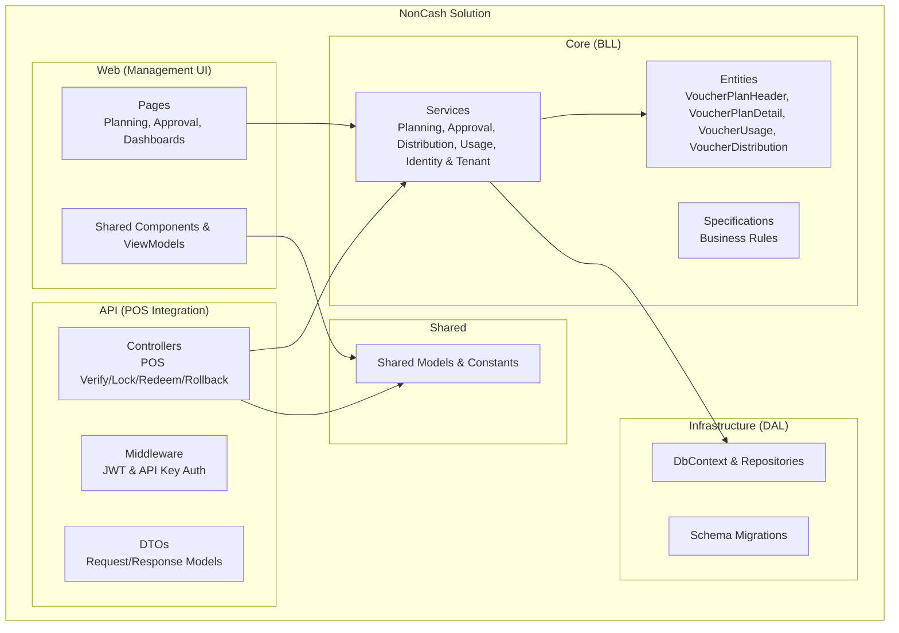
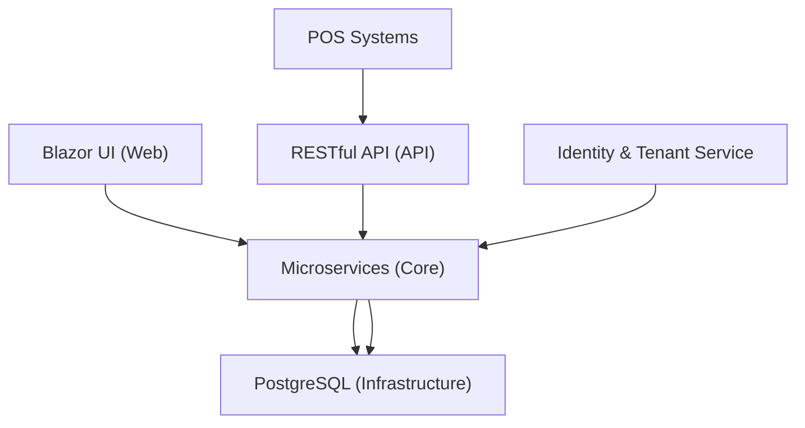
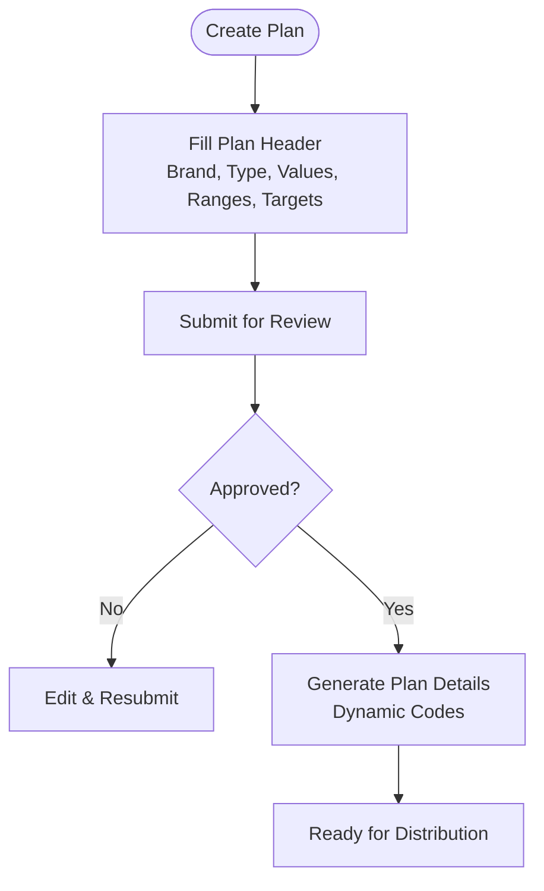
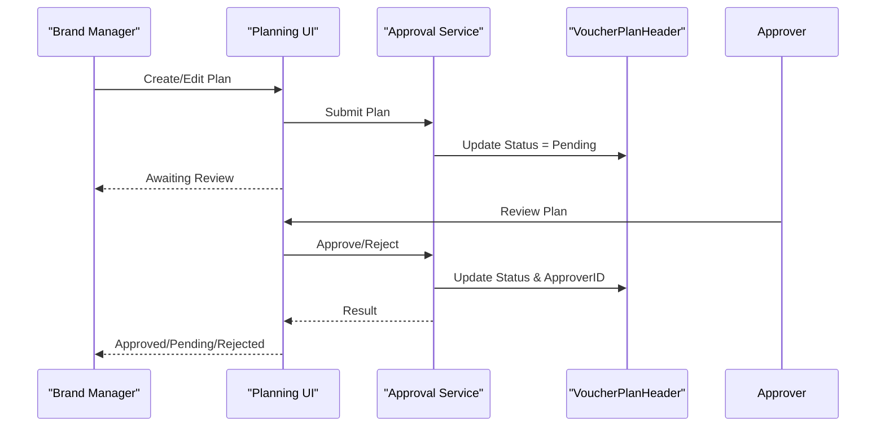
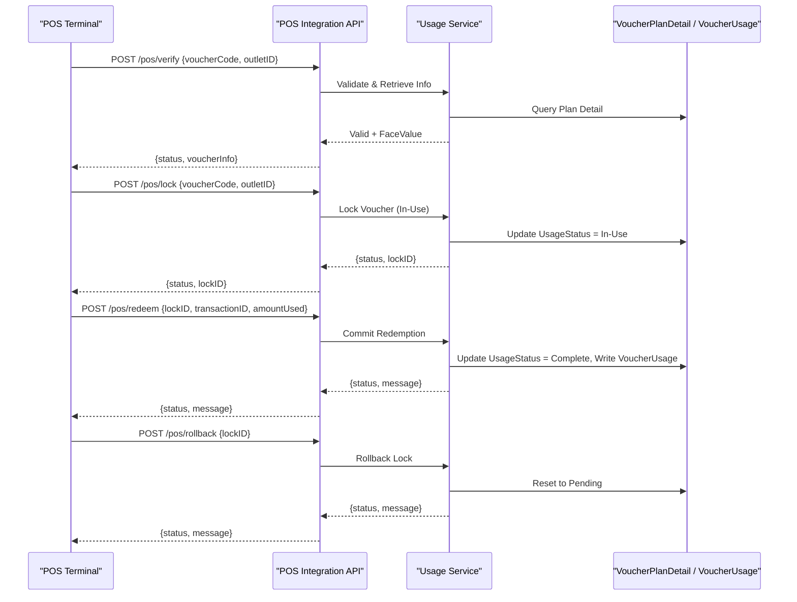
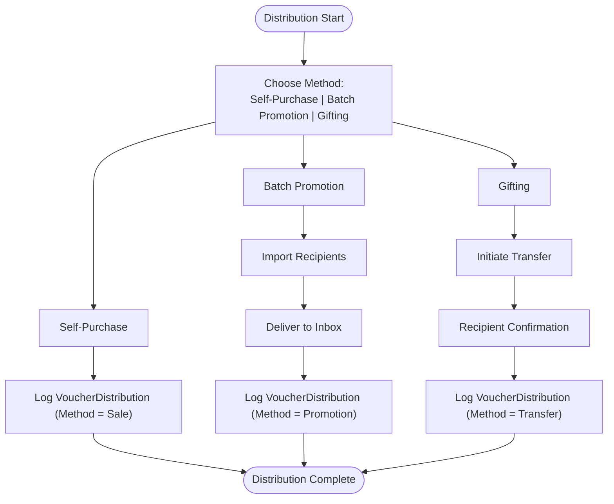
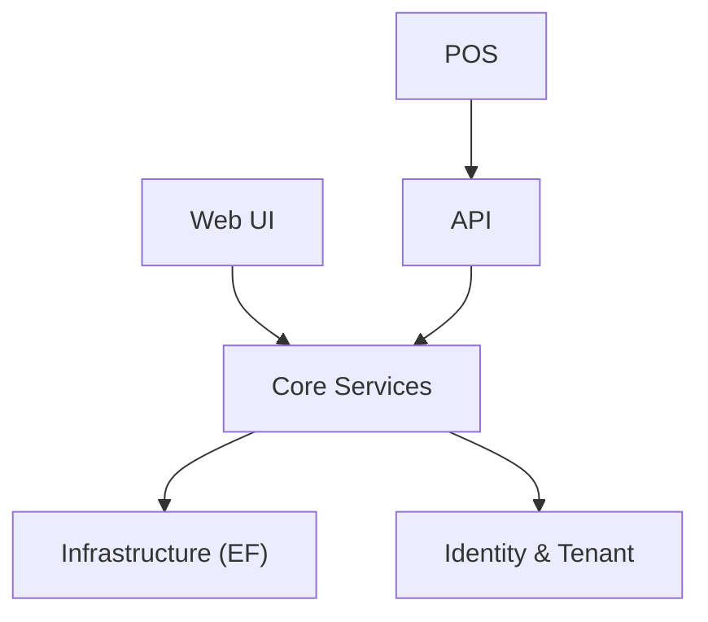

# Key Features Summary

<cite>
**Referenced Files in This Document**
- [Key Functionalities.txt](file://Key%20Functionalities.txt)
- [description.txt](file://description.txt)
- [docs/index.md](file://docs/index.md)
- [docs/architecture.md](file://docs/architecture.md)
- [docs/data-models.md](file://docs/data-models.md)
- [docs/api-contracts.md](file://docs/api-contracts.md)
- [docs/source-tree-analysis.md](file://docs/source-tree-analysis.md)
- [_bmad-output/planning-artifacts/epics.md](file://_bmad-output/planning-artifacts/epics.md)
- [_bmad-output/planning-artifacts/implementation-readiness-report-2026-04-17.md](file://_bmad-output/planning-artifacts/implementation-readiness-report-2026-04-17.md)
- [_bmad-output/planning-artifacts/ux-design-specification.md](file://_bmad-output/planning-artifacts/ux-design-specification.md)
- [_bmad/_config/manifest.yaml](file://_bmad/_config/manifest.yaml)
</cite>

## Table of Contents
1. [Introduction](#introduction)
2. [Project Structure](#project-structure)
3. [Core Components](#core-components)
4. [Architecture Overview](#architecture-overview)
5. [Detailed Component Analysis](#detailed-component-analysis)
6. [Dependency Analysis](#dependency-analysis)
7. [Performance Considerations](#performance-considerations)
8. [Troubleshooting Guide](#troubleshooting-guide)
9. [Conclusion](#conclusion)
10. [Appendices](#appendices)

## Introduction
This document presents a comprehensive summary of NonCash’s key features aligned with the four core pillars: Production Planning, Approval and Publication, Voucher Usage at POS Systems, and Multi-Channel Distribution. It explains each feature’s business value, technical implementation approach, user interaction patterns, interdependencies, workflow sequences, and integration touchpoints. Advanced capabilities such as transaction management, audit trails, and reporting are documented alongside feature prioritization, implementation status, roadmap visibility, customization options, configuration parameters, and extensibility points.

## Project Structure
NonCash is structured as a 3-layer SaaS platform with a microservices-oriented backend and a Blazor-based management UI. The target source tree organizes responsibilities across Core (business logic), Infrastructure (data access), Web (management UI), API (POS integration), and Shared libraries.

**Diagram sources**
- [docs/source-tree-analysis.md:7-34](file://docs/source-tree-analysis.md#L7-L34)
- [docs/architecture.md:17-34](file://docs/architecture.md#L17-L34)

**Section sources**
- [docs/source-tree-analysis.md:3-50](file://docs/source-tree-analysis.md#L3-L50)
- [docs/architecture.md:5-52](file://docs/architecture.md#L5-L52)

## Core Components
- Production Planning: Campaign creation, scheduling, and target setting with multi-tenant isolation and approval workflow.
- Approval and Publication: Multi-level review process with state transitions and publish date enforcement.
- Voucher Usage at POS Systems: Secure, transactional redemption via RESTful APIs with lock-commit/rollback semantics.
- Multi-Channel Distribution: Self-purchase, batch promotions, and gifting with audit logging and ownership tracking.

Each component integrates with identity and tenant services, adheres to RBAC, and enforces dynamic security for voucher codes.

**Section sources**
- [Key Functionalities.txt:7-167](file://Key Functionalities.txt#L7-L167)
- [docs/architecture.md:17-26](file://docs/architecture.md#L17-L26)
- [docs/data-models.md:9-98](file://docs/data-models.md#L9-L98)

## Architecture Overview
NonCash adopts a 3-layer SaaS architecture:
- Frontend: Blazor app for management and consumer interactions.
- Business Logic Layer: Microservices for Planning, Approval, Distribution, Usage, and Identity/Tenant management.
- Data Access Layer: PostgreSQL with Entity Framework Core and repository pattern.

Security includes JWT for users and API keys for POS, with dynamic voucher code generation to prevent fraud.

**Diagram sources**
- [docs/architecture.md:9-34](file://docs/architecture.md#L9-L34)
- [docs/api-contracts.md:5-109](file://docs/api-contracts.md#L5-L109)

**Section sources**
- [docs/architecture.md:5-52](file://docs/architecture.md#L5-L52)
- [docs/api-contracts.md:5-109](file://docs/api-contracts.md#L5-L109)

## Detailed Component Analysis

### 1) Production Planning (Campaign Creation and Scheduling)
- Business value:
  - Aligns voucher issuance with business goals (sales growth, acquisition).
  - Enables precise targeting by brand, outlet range, validity period, and budget.
- Technical implementation:
  - Plan Header captures campaign metadata and constraints; Plan Detail generates secure, dynamic codes post-approval.
  - Targets include quantity to distribute and quantity expected to be used at POS.
- User interaction:
  - Brand Managers create campaigns, set budgets and ranges, and submit for approval.
- Interdependencies:
  - Requires Brand and Outlet setup; relies on Approval workflow; enables Distribution and Usage.
- Audit and reporting:
  - Approval logs and plan versions enable traceability; usage targets inform dashboard reporting.

**Diagram sources**
- [Key Functionalities.txt:15-68](file://Key Functionalities.txt#L15-L68)
- [docs/data-models.md:11-43](file://docs/data-models.md#L11-L43)

**Section sources**
- [Key Functionalities.txt:7-68](file://Key Functionalities.txt#L7-L68)
- [docs/data-models.md:11-43](file://docs/data-models.md#L11-L43)
- [docs/architecture.md:17-26](file://docs/architecture.md#L17-L26)

### 2) Approval and Publication (Multi-Level Workflow Management)
- Business value:
  - Enforces governance and financial controls before live issuance.
  - Supports versioning and traceability of decisions.
- Technical implementation:
  - Approval workflow updates status and records approver identity; publish date controls availability.
- User interaction:
  - Approvers review submitted plans and approve or reject with notes.
- Interdependencies:
  - Plan must be approved before detail generation and distribution.
- Audit and reporting:
  - Review logs and plan versions stored for compliance.

**Diagram sources**
- [Key Functionalities.txt:70-86](file://Key Functionalities.txt#L70-L86)
- [docs/data-models.md:11-33](file://docs/data-models.md#L11-L33)

**Section sources**
- [Key Functionalities.txt:70-86](file://Key Functionalities.txt#L70-L86)
- [docs/data-models.md:11-33](file://docs/data-models.md#L11-L33)

### 3) Voucher Usage at POS Systems (Real-Time Integration)
- Business value:
  - Enables secure, real-time redemption with transactional guarantees.
  - Prevents double-spending and maintains auditability.
- Technical implementation:
  - RESTful API endpoints for verification, locking, committing, and rolling back.
  - Backend enforces lock-state transitions and writes usage logs.
- User interaction:
  - POS scans dynamic voucher code; system validates, locks, and commits or rolls back based on transaction outcome.
- Interdependencies:
  - Requires approved plan and configured outlets; depends on dynamic code generation.
- Audit and reporting:
  - VoucherUsage records include POS terminal, transaction ID, amount used, and timestamps.

**Diagram sources**
- [docs/api-contracts.md:14-87](file://docs/api-contracts.md#L14-L87)
- [docs/data-models.md:46-54](file://docs/data-models.md#L46-L54)

**Section sources**
- [docs/api-contracts.md:14-87](file://docs/api-contracts.md#L14-L87)
- [docs/data-models.md:46-54](file://docs/data-models.md#L46-L54)

### 4) Multi-Channel Distribution (Batch Promotions, Self-Purchase, Gifting)
- Business value:
  - Accelerates acquisition via self-purchase and promotional distribution.
  - Facilitates social sharing and gifting to expand reach.
- Technical implementation:
  - Self-purchase via Member App; batch promotions via import and inbox delivery; gifting requires two-way confirmation.
- User interaction:
  - Consumers purchase or receive vouchers; owners can gift to others via phone number or MemberID.
- Interdependencies:
  - Requires approved plan and outlet configuration; tracks ownership and distribution methods.
- Audit and reporting:
  - VoucherDistribution logs method (Sale, Promotion, Transfer), timestamps, and member associations.

**Diagram sources**
- [Key Functionalities.txt:88-134](file://Key Functionalities.txt#L88-L134)
- [docs/data-models.md:55-62](file://docs/data-models.md#L55-L62)

**Section sources**
- [Key Functionalities.txt:88-134](file://Key Functionalities.txt#L88-L134)
- [docs/data-models.md:55-62](file://docs/data-models.md#L55-L62)

### Advanced Features
- Transaction Management:
  - POS redemption uses begin/commit/rollback semantics to ensure data integrity.
- Audit Trails:
  - VoucherUsage and VoucherDistribution capture all actions with timestamps and identifiers.
- Reporting Capabilities:
  - Distribution tracking dashboard compares actual distribution and usage against plan targets.

**Section sources**
- [Key Functionalities.txt:146-156](file://Key Functionalities.txt#L146-L156)
- [docs/data-models.md:46-62](file://docs/data-models.md#L46-L62)

### Feature Interdependencies and Workflow Sequences
- Planning → Approval → Detail Generation → Distribution → Usage.
- POS Redemption depends on approved plan and configured outlets.
- Distribution methods rely on plan approval and outlet availability.

**Diagram sources**
- [docs/architecture.md:17-26](file://docs/architecture.md#L17-L26)
- [docs/data-models.md:11-62](file://docs/data-models.md#L11-L62)

**Section sources**
- [docs/architecture.md:17-26](file://docs/architecture.md#L17-L26)
- [docs/data-models.md:11-62](file://docs/data-models.md#L11-L62)

## Dependency Analysis
- Layer Coupling:
  - Web UI depends on Core services; API depends on Core and Shared models; Core depends on Infrastructure for persistence.
- External Integrations:
  - POS systems authenticate via API Key; consumers authenticate via JWT.
- Identity and Multi-Tenancy:
  - BrandID isolates data; UserAccount roles govern access; Outlet configuration authorizes POS usage.

**Diagram sources**
- [docs/architecture.md:17-34](file://docs/architecture.md#L17-L34)
- [docs/api-contracts.md:7](file://docs/api-contracts.md#L7)

**Section sources**
- [docs/architecture.md:17-34](file://docs/architecture.md#L17-L34)
- [docs/api-contracts.md:7](file://docs/api-contracts.md#L7)

## Performance Considerations
- Asynchronous Processing:
  - Large-scale batch generation handled asynchronously to avoid UI blocking.
- Real-Time Updates:
  - SignalR used to push state changes to consumer apps instantly.
- Security Throughput:
  - Dynamic code generation and validation optimized for low-latency POS interactions.

**Section sources**
- [_bmad-output/planning-artifacts/ux-design-specification.md:242-261](file://_bmad-output/planning-artifacts/ux-design-specification.md#L242-L261)
- [_bmad-output/planning-artifacts/ux-design-specification.md:263-267](file://_bmad-output/planning-artifacts/ux-design-specification.md#L263-L267)

## Troubleshooting Guide
- POS Redemption Failures:
  - Verify voucher validity, outlet permissions, and lock state; use rollback to release locked vouchers.
- Distribution Issues:
  - Confirm plan approval, outlet configuration, and recipient eligibility; check VoucherDistribution logs.
- Audit and Compliance:
  - Review VoucherUsage and VoucherDistribution entries for completeness and accuracy.

**Section sources**
- [docs/api-contracts.md:14-87](file://docs/api-contracts.md#L14-L87)
- [docs/data-models.md:46-62](file://docs/data-models.md#L46-L62)

## Conclusion
NonCash’s four core pillars—Production Planning, Approval and Publication, Voucher Usage at POS Systems, and Multi-Channel Distribution—are tightly integrated with a secure, transactional backend and a responsive UI. The system emphasizes governance, auditability, and real-time operational excellence, with clear interdependencies and robust extensibility points for future enhancements.

## Appendices

### Feature Prioritization Matrix and Implementation Status
- Priority: High
- Status: Ready (with minor warnings)
- Coverage: 100% of functional requirements mapped to epics and stories.

**Section sources**
- [_bmad-output/planning-artifacts/implementation-readiness-report-2026-04-17.md:53-73](file://_bmad-output/planning-artifacts/implementation-readiness-report-2026-04-17.md#L53-L73)
- [_bmad-output/planning-artifacts/implementation-readiness-report-2026-04-17.md:112-127](file://_bmad-output/planning-artifacts/implementation-readiness-report-2026-04-17.md#L112-L127)

### Roadmap Visibility
- Epics and stories define the implementation path across Profiles, Planning, Distribution, and Redemption.
- UX design direction provides UI/UX guidance for consumer and admin experiences.

**Section sources**
- [_bmad-output/planning-artifacts/epics.md:55-76](file://_bmad-output/planning-artifacts/epics.md#L55-L76)
- [_bmad-output/planning-artifacts/ux-design-specification.md:17-85](file://_bmad-output/planning-artifacts/ux-design-specification.md#L17-L85)

### Configuration Parameters and Extensibility Points
- Configuration:
  - API Key per outlet; JWT tokens for user sessions; dynamic voucher code rotation.
- Extensibility:
  - Microservices architecture allows incremental feature additions; Shared models enable cross-layer reuse.
  - BMAD configuration indicates modular tooling readiness.

**Section sources**
- [docs/architecture.md:36-41](file://docs/architecture.md#L36-L41)
- [_bmad/_config/manifest.yaml:1-25](file://_bmad/_config/manifest.yaml#L1-L25)