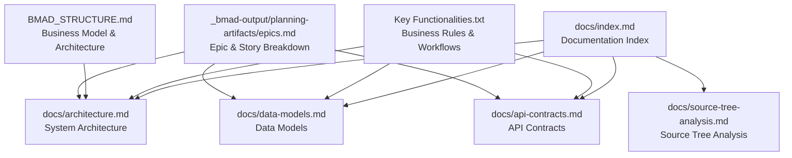
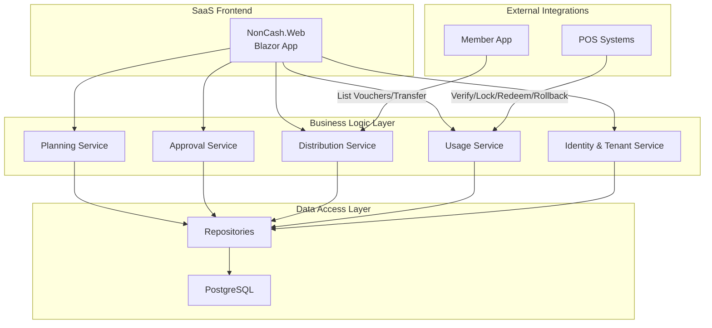
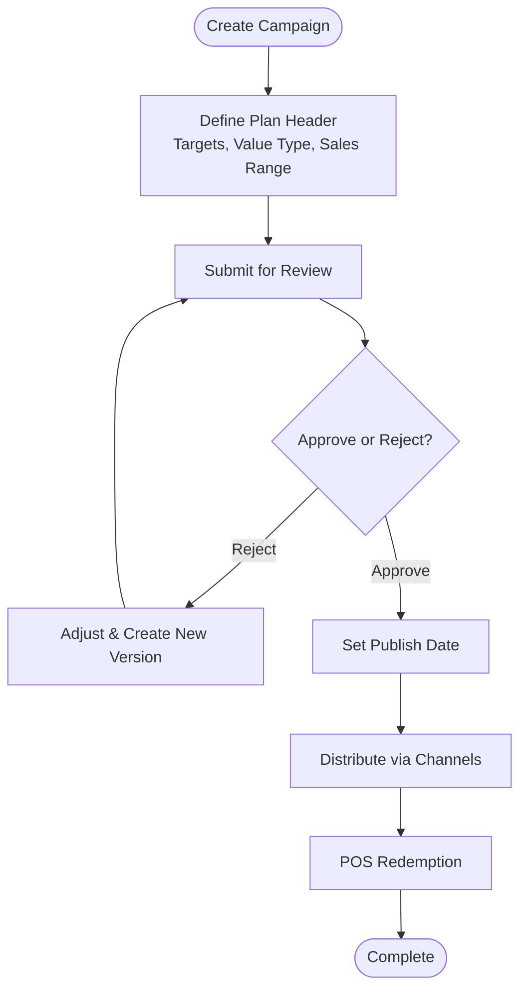
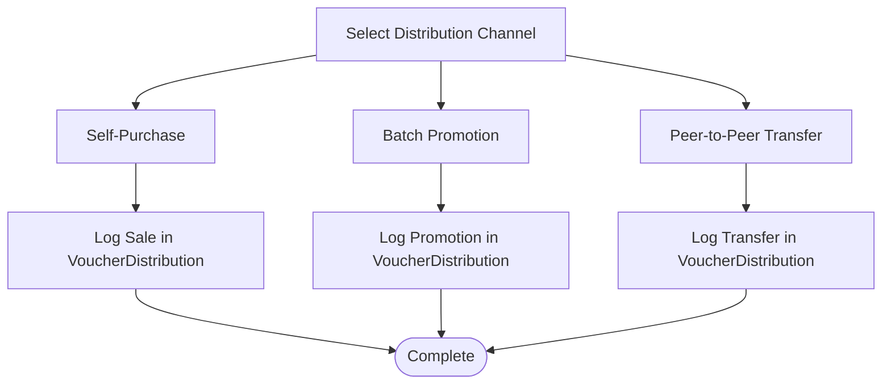
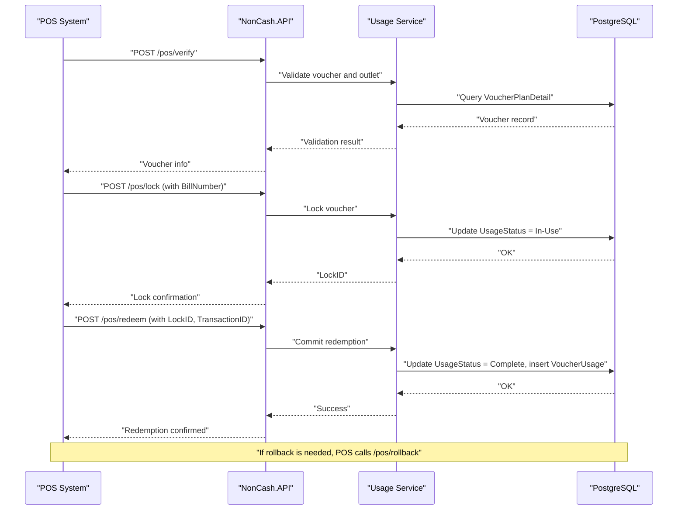
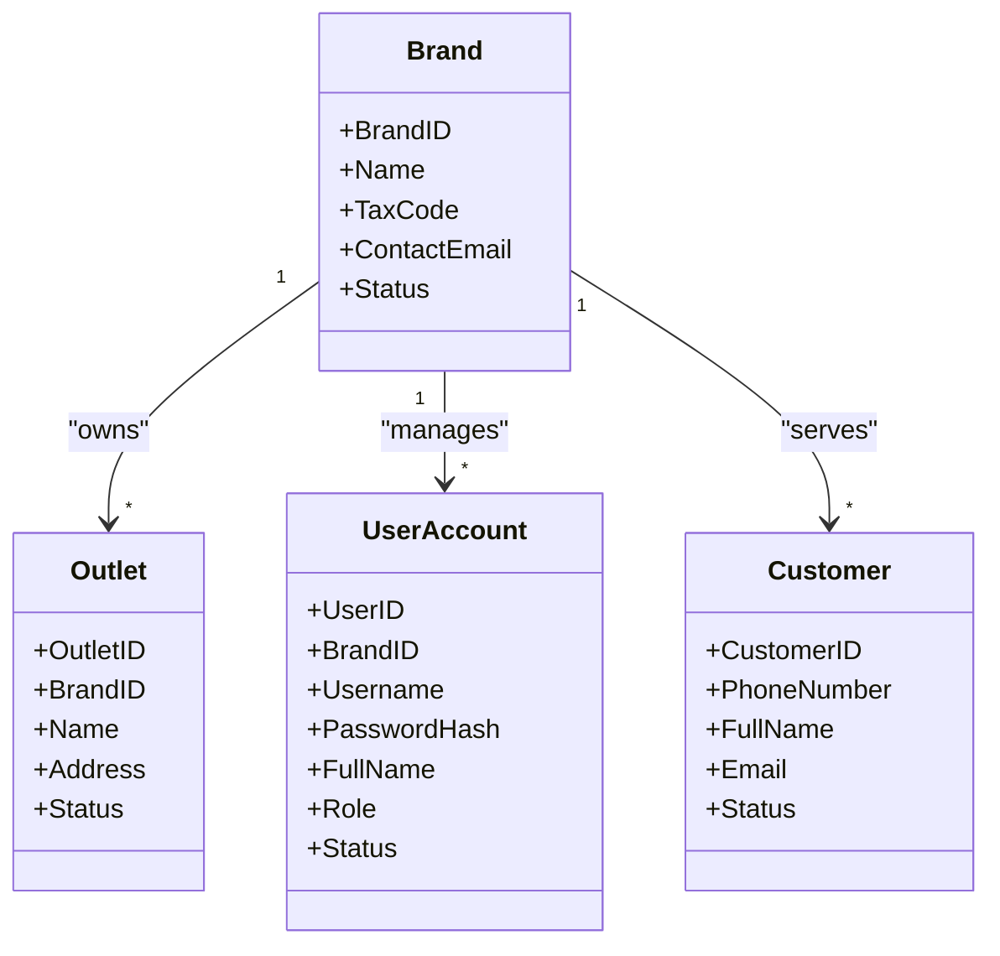
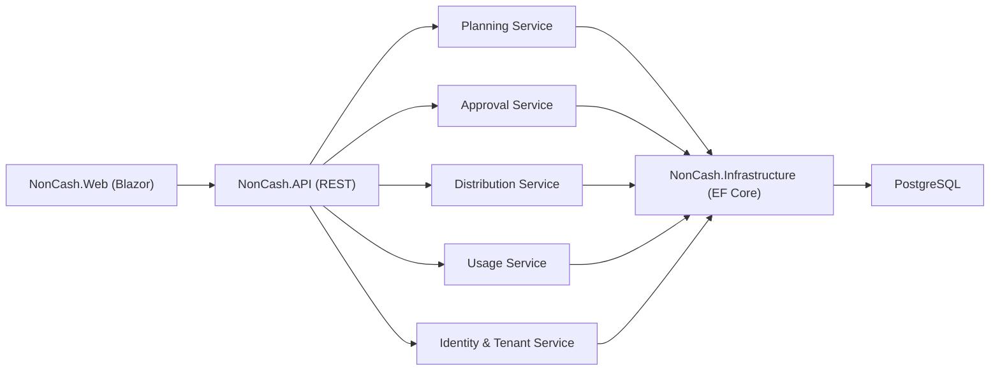

# Project Overview

<cite>
**Referenced Files in This Document**
- [description.txt](file://description.txt)
- [Key Functionalities.txt](file://Key Functionalities.txt)
- [docs/index.md](file://docs/index.md)
- [docs/architecture.md](file://docs/architecture.md)
- [docs/data-models.md](file://docs/data-models.md)
- [docs/api-contracts.md](file://docs/api-contracts.md)
- [docs/source-tree-analysis.md](file://docs/source-tree-analysis.md)
- [BMAD_STRUCTURE.md](file://BMAD_STRUCTURE.md)
- [_bmad-output/planning-artifacts/epics.md](file://_bmad-output/planning-artifacts/epics.md)
</cite>

## Table of Contents
1. [Introduction](#introduction)
2. [Project Structure](#project-structure)
3. [Core Components](#core-components)
4. [Architecture Overview](#architecture-overview)
5. [Detailed Component Analysis](#detailed-component-analysis)
6. [Dependency Analysis](#dependency-analysis)
7. [Performance Considerations](#performance-considerations)
8. [Troubleshooting Guide](#troubleshooting-guide)
9. [Conclusion](#conclusion)
10. [Appendices](#appendices)

## Introduction
NonCash is a Software as a Service (SaaS) platform designed to enable businesses to plan, produce, distribute, and redeem promotional vouchers. The platform’s core purpose is to provide a secure, scalable, and multi-tenant environment where brands can orchestrate voucher campaigns, manage distribution across channels (including self-purchase and batch promotions), and integrate seamlessly with POS systems for secure redemption.

Key value propositions:
- Multi-channel distribution: Self-purchase, batch promotions, and peer-to-peer transfers.
- POS system integration: RESTful APIs for verification, locking, redemption, and rollback with strict transactional guarantees.
- Multi-tenant architecture: Strong isolation by BrandID to ensure data privacy and operational autonomy across tenants.

Target market segments:
- Retail businesses (e.g., restaurants, hotels) seeking to drive sales and customer acquisition through targeted voucher campaigns.
- Brands requiring robust voucher lifecycle management with compliance-aware controls and auditability.

## Project Structure
The repository organizes content around documentation, functional specifications, and planning artifacts that collectively define the NonCash platform. The documentation index and architecture documents outline the SaaS model, layered architecture, and microservices organization. The functional specifications describe production planning, approval, distribution, and POS redemption workflows. Planning artifacts further refine these into epics and stories.

**Diagram sources**
- [docs/index.md:1-41](file://docs/index.md#L1-L41)
- [docs/architecture.md:1-52](file://docs/architecture.md#L1-L52)
- [docs/data-models.md:1-98](file://docs/data-models.md#L1-L98)
- [docs/api-contracts.md:1-109](file://docs/api-contracts.md#L1-L109)
- [docs/source-tree-analysis.md:1-50](file://docs/source-tree-analysis.md#L1-L50)
- [Key Functionalities.txt:1-167](file://Key Functionalities.txt#L1-L167)
- [BMAD_STRUCTURE.md:1-82](file://BMAD_STRUCTURE.md#L1-L82)
- [_bmad-output/planning-artifacts/epics.md:1-319](file://_bmad-output/planning-artifacts/epics.md#L1-L319)

**Section sources**
- [docs/index.md:1-41](file://docs/index.md#L1-L41)
- [docs/source-tree-analysis.md:1-50](file://docs/source-tree-analysis.md#L1-L50)

## Core Components
- Voucher campaigns: Defined by VoucherPlanHeader and VoucherPlanDetail, campaigns encapsulate branding, value type, validity windows, sales ranges, and distribution targets. Campaigns are reviewed and published through an approval workflow.
- Brand management: Brands act as tenants, owning Outlets and controlling access via RBAC and multi-tenant isolation enforced by BrandID.
- Distribution engine: Supports self-purchase, batch promotions, and peer-to-peer transfers, with tracking in VoucherDistribution.
- POS redemption pipeline: RESTful APIs for verification, locking, committing, and rolling back redemptions, ensuring transactional integrity and preventing double-spending.
- Identity and tenant services: Manage UserAccounts, Customer profiles, and Outlet configurations, enforcing multi-tenant boundaries and role-based access.

**Section sources**
- [Key Functionalities.txt:7-167](file://Key Functionalities.txt#L7-L167)
- [docs/data-models.md:9-98](file://docs/data-models.md#L9-L98)
- [docs/architecture.md:17-31](file://docs/architecture.md#L17-L31)
- [docs/api-contracts.md:10-109](file://docs/api-contracts.md#L10-L109)

## Architecture Overview
NonCash follows a 3-layer SaaS architecture:
- Frontend (Blazor): Management portal for planning, approvals, and dashboards.
- Business Logic Layer (Microservices): Core services for planning, approval, distribution, usage, identity, and tenant management.
- Data Access Layer (PostgreSQL): Repository pattern with Entity Framework Core for data abstraction and transactional consistency.

Security and multi-tenancy:
- Multi-tenant isolation via BrandID ensures each tenant operates independently.
- Dynamic voucher codes (similar to JWT logic) protect against reuse and tampering.
- POS systems authenticate via API keys and are restricted to configured outlet ranges.

**Diagram sources**
- [docs/architecture.md:5-52](file://docs/architecture.md#L5-L52)
- [docs/source-tree-analysis.md:7-34](file://docs/source-tree-analysis.md#L7-L34)
- [docs/api-contracts.md:10-109](file://docs/api-contracts.md#L10-L109)

**Section sources**
- [docs/architecture.md:5-52](file://docs/architecture.md#L5-L52)
- [docs/source-tree-analysis.md:7-34](file://docs/source-tree-analysis.md#L7-L34)

## Detailed Component Analysis

### Voucher Campaigns and Approval Workflow
Voucher campaigns are defined by a plan header and detailed line items. The approval workflow manages plan submission, review, and publication, with versioning for rejected plans.

**Diagram sources**
- [Key Functionalities.txt:70-86](file://Key Functionalities.txt#L70-L86)
- [docs/data-models.md:11-43](file://docs/data-models.md#L11-L43)
- [_bmad-output/planning-artifacts/epics.md:139-197](file://_bmad-output/planning-artifacts/epics.md#L139-L197)

**Section sources**
- [Key Functionalities.txt:70-86](file://Key Functionalities.txt#L70-L86)
- [docs/data-models.md:11-43](file://docs/data-models.md#L11-L43)
- [_bmad-output/planning-artifacts/epics.md:139-197](file://_bmad-output/planning-artifacts/epics.md#L139-L197)

### Multi-Channel Distribution
Distribution supports self-purchase, batch promotions, and peer-to-peer transfers. Each distribution event is tracked in VoucherDistribution.

**Diagram sources**
- [Key Functionalities.txt:88-134](file://Key Functionalities.txt#L88-L134)
- [docs/data-models.md:55-61](file://docs/data-models.md#L55-L61)
- [_bmad-output/planning-artifacts/epics.md:199-257](file://_bmad-output/planning-artifacts/epics.md#L199-L257)

**Section sources**
- [Key Functionalities.txt:88-134](file://Key Functionalities.txt#L88-L134)
- [docs/data-models.md:55-61](file://docs/data-models.md#L55-L61)
- [_bmad-output/planning-artifacts/epics.md:199-257](file://_bmad-output/planning-artifacts/epics.md#L199-L257)

### POS Redemption Workflow
POS redemption is a controlled, transactional process with verification, locking, commit, and rollback to ensure integrity and prevent misuse.

**Diagram sources**
- [docs/api-contracts.md:14-87](file://docs/api-contracts.md#L14-L87)
- [docs/data-models.md:46-53](file://docs/data-models.md#L46-L53)
- [_bmad-output/planning-artifacts/epics.md:259-317](file://_bmad-output/planning-artifacts/epics.md#L259-L317)

**Section sources**
- [docs/api-contracts.md:14-87](file://docs/api-contracts.md#L14-L87)
- [docs/data-models.md:46-53](file://docs/data-models.md#L46-L53)
- [_bmad-output/planning-artifacts/epics.md:259-317](file://_bmad-output/planning-artifacts/epics.md#L259-L317)

### Multi-Tenant Isolation and Brand Management
Brands operate as tenants with dedicated Outlets and UserAccounts. Multi-tenant isolation is enforced by BrandID across all services and data access.

**Diagram sources**
- [docs/data-models.md:65-98](file://docs/data-models.md#L65-L98)
- [docs/architecture.md:38-40](file://docs/architecture.md#L38-L40)

**Section sources**
- [docs/data-models.md:65-98](file://docs/data-models.md#L65-L98)
- [docs/architecture.md:38-40](file://docs/architecture.md#L38-L40)

### Practical Business Use Cases
- Batch promotions: Upload a list of phone numbers to automatically create members (if missing) and deliver vouchers to their inboxes.
- POS redemption: At checkout, POS verifies the voucher, locks it for the transaction, commits upon successful payment, and logs the usage.
- Peer-to-peer transfers: Owners initiate transfers to recipients’ phone numbers; recipients confirm to finalize ownership change.

**Section sources**
- [Key Functionalities.txt:118-134](file://Key Functionalities.txt#L118-L134)
- [docs/api-contracts.md:14-87](file://docs/api-contracts.md#L14-L87)
- [_bmad-output/planning-artifacts/epics.md:205-242](file://_bmad-output/planning-artifacts/epics.md#L205-L242)

## Dependency Analysis
The platform’s dependencies center on the 3-layer architecture and microservices organization. The frontend depends on backend services, which in turn depend on the data access layer. External POS systems integrate via RESTful APIs secured by API keys and JWT tokens.

**Diagram sources**
- [docs/source-tree-analysis.md:7-34](file://docs/source-tree-analysis.md#L7-L34)
- [docs/architecture.md:17-31](file://docs/architecture.md#L17-L31)

**Section sources**
- [docs/source-tree-analysis.md:7-34](file://docs/source-tree-analysis.md#L7-L34)
- [docs/architecture.md:17-31](file://docs/architecture.md#L17-L31)

## Performance Considerations
- Use of PostgreSQL with Entity Framework Core enables efficient relational modeling and transactional consistency, especially for POS redemption workflows.
- Microservices architecture allows independent scaling of services (Planning, Approval, Distribution, Usage, Identity & Tenant).
- Dynamic voucher code generation reduces risk of reuse and improves security without impacting performance.
- API key and JWT-based authentication minimize overhead while securing external integrations.

[No sources needed since this section provides general guidance]

## Troubleshooting Guide
Common issues and resolutions:
- Voucher verification failures: Ensure the voucher is within validity dates and accepted at the specified outlet; verify POS outlet configuration aligns with the campaign’s sales range.
- Redemption lock conflicts: Confirm that only one transaction holds the lock at a time; rollback any failed transactions to release the lock.
- Distribution tracking discrepancies: Cross-check VoucherDistribution entries against campaign targets and review batch promotion logs.
- Multi-tenant access errors: Verify BrandID and RBAC roles for UserAccounts; ensure tenant isolation is intact.

**Section sources**
- [docs/api-contracts.md:14-87](file://docs/api-contracts.md#L14-L87)
- [docs/data-models.md:46-61](file://docs/data-models.md#L46-L61)
- [docs/architecture.md:38-40](file://docs/architecture.md#L38-L40)

## Conclusion
NonCash delivers a comprehensive SaaS platform for voucher production and management, combining robust multi-channel distribution, secure POS integration, and strong multi-tenant isolation. Its 3-layer architecture and microservices organization support scalability, maintainability, and compliance, while the documented workflows and APIs provide clear pathways for stakeholder adoption and developer implementation.

[No sources needed since this section summarizes without analyzing specific files]

## Appendices
- Additional planning and requirements are captured in the BMAD structure and epic breakdown, detailing functional and non-functional requirements, acceptance criteria, and story mappings.

**Section sources**
- [BMAD_STRUCTURE.md:1-82](file://BMAD_STRUCTURE.md#L1-L82)
- [_bmad-output/planning-artifacts/epics.md:1-319](file://_bmad-output/planning-artifacts/epics.md#L1-L319)