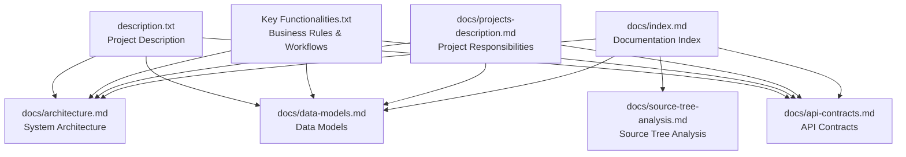
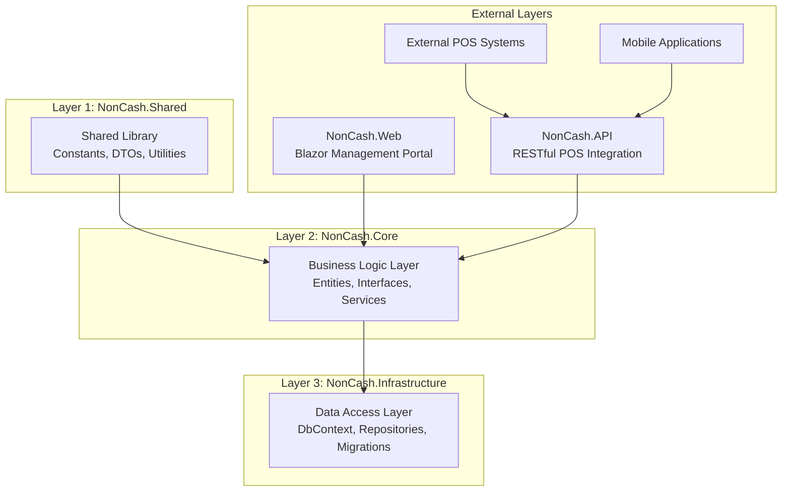
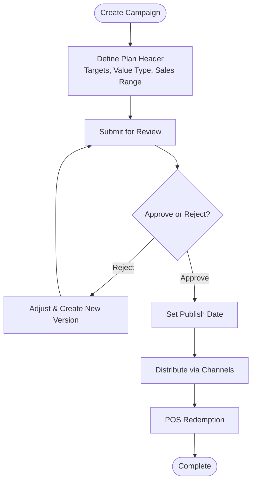
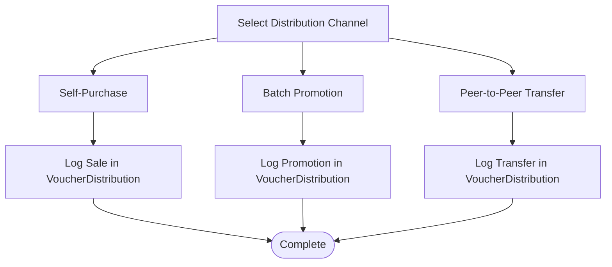
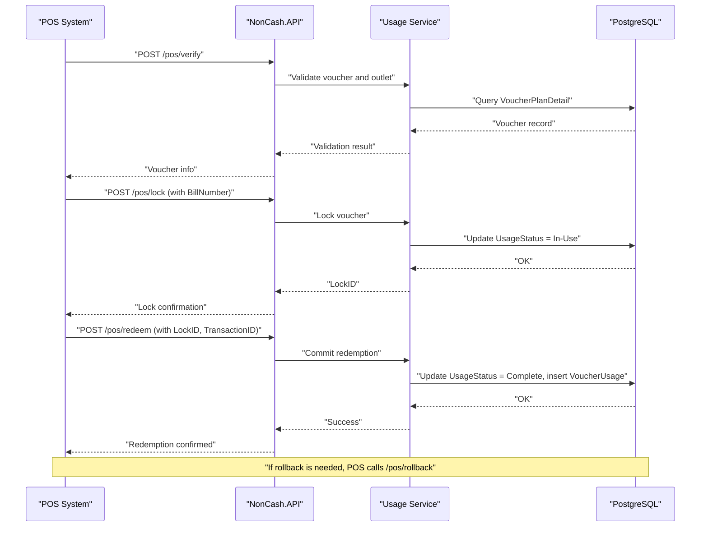
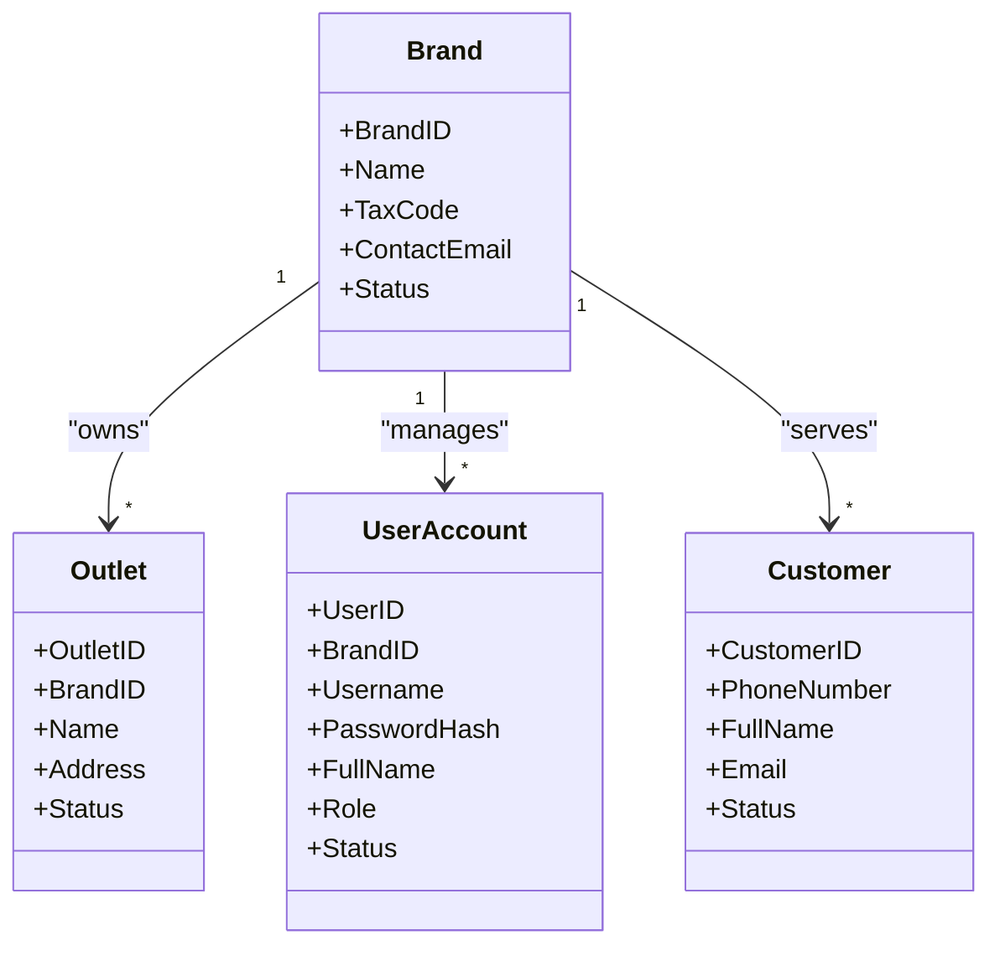
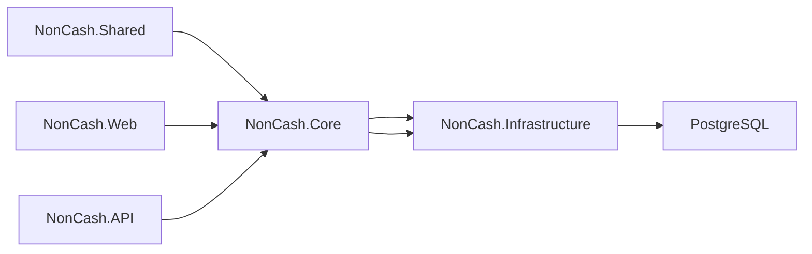

# Project Overview

<cite>
**Referenced Files in This Document**
- [description.txt](file://description.txt)
- [Key Functionalities.txt](file://Key Functionalities.txt)
- [docs/index.md](file://docs/index.md)
- [docs/architecture.md](file://docs/architecture.md)
- [docs/data-models.md](file://docs/data-models.md)
- [docs/api-contracts.md](file://docs/api-contracts.md)
- [docs/source-tree-analysis.md](file://docs/source-tree-analysis.md)
- [docs/projects-description.md](file://docs/projects-description.md)
- [BMAD_STRUCTURE.md](file://BMAD_STRUCTURE.md)
- [_bmad-output/planning-artifacts/epics.md](file://_bmad-output/planning-artifacts/epics.md)
</cite>

## Update Summary
**Changes Made**
- Enhanced project structure section with detailed 3-layer architecture explanation from docs/projects-description.md
- Updated core components section to reflect the comprehensive project responsibilities
- Added detailed layer responsibilities and separation of concerns
- Integrated the new project structure documentation into the architectural overview

## Table of Contents
1. [Introduction](#introduction)
2. [Project Structure](#project-structure)
3. [Core Components](#core-components)
4. [Architecture Overview](#architecture-overview)
5. [Detailed Component Analysis](#detailed-component-analysis)
6. [Dependency Analysis](#dependency-analysis)
7. [Performance Considerations](#performance-considerations)
8. [Troubleshooting Guide](#troubleshooting-guide)
9. [Conclusion](#conclusion)
10. [Appendices](#appendices)

## Introduction
NonCash is a Software as a Service (SaaS) platform designed to enable businesses to plan, produce, distribute, and redeem promotional vouchers. The platform's core purpose is to provide a secure, scalable, and multi-tenant environment where brands can orchestrate voucher campaigns, manage distribution across channels (including self-purchase and batch promotions), and integrate seamlessly with POS systems for secure redemption.

Key value propositions:
- Multi-channel distribution: Self-purchase, batch promotions, and peer-to-peer transfers.
- POS system integration: RESTful APIs for verification, locking, redemption, and rollback with strict transactional guarantees.
- Multi-tenant architecture: Strong isolation by BrandID to ensure data privacy and operational autonomy across tenants.

Target market segments:
- Retail businesses (e.g., restaurants, hotels) seeking to drive sales and customer acquisition through targeted voucher campaigns.
- Brands requiring robust voucher lifecycle management with compliance-aware controls and auditability.

## Project Structure
The NonCash project follows a comprehensive 3-layer architecture with clear separation of concerns across six distinct projects. Each project has specific responsibilities that contribute to the overall SaaS platform functionality.

```mermaid
graph TB
A["docs/index.md<br/>Documentation Index"] --> B["docs/architecture.md<br/>System Architecture"]
A --> C["docs/data-models.md<br/>Data Models"]
A --> D["docs/api-contracts.md<br/>API Contracts"]
A --> E["docs/source-tree-analysis.md<br/>Source Tree Analysis"]
F["docs/projects-description.md<br/>Project Responsibilities"] --> B
F --> C
F --> D
G["Key Functionalities.txt<br/>Business Rules & Workflows"] --> B
G --> C
G --> D
H["description.txt<br/>Project Description"] --> B
H --> C
H --> D
```

**Diagram sources**
- [docs/index.md:1-41](file://docs/index.md#L1-L41)
- [docs/architecture.md:1-52](file://docs/architecture.md#L1-L52)
- [docs/data-models.md:1-98](file://docs/data-models.md#L1-L98)
- [docs/api-contracts.md:1-109](file://docs/api-contracts.md#L1-L109)
- [docs/source-tree-analysis.md:1-50](file://docs/source-tree-analysis.md#L1-L50)
- [docs/projects-description.md:1-58](file://docs/projects-description.md#L1-L58)
- [Key Functionalities.txt:1-167](file://Key Functionalities.txt#L1-L167)
- [description.txt:1-31](file://description.txt#L1-L31)

**Section sources**
- [docs/index.md:1-41](file://docs/index.md#L1-L41)
- [docs/source-tree-analysis.md:1-50](file://docs/source-tree-analysis.md#L1-L50)
- [docs/projects-description.md:1-58](file://docs/projects-description.md#L1-L58)

## Core Components
The NonCash platform consists of six interconnected projects, each serving specific architectural layers and responsibilities:

### NonCash.Shared (Shared Library)
**Type:** Class Library
**Purpose:** Foundation layer containing shared components used by all other projects
**Components:**
- Constants and shared enums (e.g., `VoucherStatus`, `ApprovalState`)
- DTOs (Data Transfer Objects) for HTTP API communication
- Common extension methods and utilities
- Shared models and validation logic

### NonCash.Core (Business Logic Layer)
**Type:** Class Library  
**Purpose:** Heart of the system containing all business logic and domain entities
**Responsibilities:**
- **Entities:** Core business objects (Voucher, Customer, Business, ProductionPlan)
- **Interfaces:** Repository contracts defining data access contracts
- **Services:** Business logic implementation including `CreatePlan()`, `ApprovePlan()`, `UseVoucher()`
- **Specifications:** Business rules and validation logic (e.g., Expiry logic)

### NonCash.Infrastructure (Data Access Layer)
**Type:** Class Library
**Purpose:** Data access and persistence layer
**Responsibilities:**
- **DbContext:** Entity Framework Core database context
- **Repositories:** Data access implementations for all entity types
- **Migrations:** PostgreSQL schema evolution scripts
- **External services:** Third-party integrations (email/SMS)

### NonCash.API (Integration Layer)
**Type:** ASP.NET Core Web API
**Purpose:** RESTful API endpoint provider for external POS systems and applications
**Characteristics:**
- **Security:** JWT token and API key authentication
- **Controllers:** HTTP endpoint handlers (`POST /api/voucher/use`)
- **Middleware:** Custom authentication and authorization middleware

### NonCash.Web (User Interface)
**Type:** Blazor Web App
**Purpose:** Internal management portal for business administrators
**Responsibilities:**
- Production planning and campaign management
- Approval workflows and reporting
- User management and RBAC administration
- Voucher monitoring and analytics

### NonCash.Tests (Testing Layer)
**Type:** xUnit Test Projects
**Purpose:** Quality assurance and validation
- **UnitTests:** Independent testing of Core layer functions
- **IntegrationTests:** End-to-end testing of API workflows

**Section sources**
- [docs/projects-description.md:7-58](file://docs/projects-description.md#L7-L58)
- [docs/source-tree-analysis.md:7-34](file://docs/source-tree-analysis.md#L7-L34)
- [Key Functionalities.txt:7-167](file://Key Functionalities.txt#L7-L167)

## Architecture Overview
NonCash follows a comprehensive 3-layer SaaS architecture with clear separation of concerns and microservices organization. The architecture ensures scalability, maintainability, and security through well-defined boundaries between layers.

### Layer Responsibilities

```mermaid
graph TB
subgraph "Layer 1: NonCash.Shared"
SH["Shared Library<br/>Constants, DTOs, Utilities"]
end
subgraph "Layer 2: NonCash.Core"
CORE["Business Logic Layer<br/>Entities, Interfaces, Services"]
end
subgraph "Layer 3: NonCash.Infrastructure"
INF["Data Access Layer<br/>DbContext, Repositories, Migrations"]
end
subgraph "External Layers"
WEB["NonCash.Web<br/>Blazor Management Portal"]
API["NonCash.API<br/>RESTful POS Integration"]
POS["External POS Systems"]
MEMBER["Mobile Applications"]
end
SH --> CORE
CORE --> INF
WEB --> CORE
API --> CORE
POS --> API
MEMBER --> API
```

**Diagram sources**
- [docs/projects-description.md:16-31](file://docs/projects-description.md#L16-L31)
- [docs/source-tree-analysis.md:36-44](file://docs/source-tree-analysis.md#L36-L44)

### Security and Multi-Tenancy
- **Multi-tenant isolation:** Strict `BrandID` enforcement ensures tenant data privacy
- **Dynamic security:** Voucher codes use rotating logic (similar to JWT) for fraud prevention
- **External integration security:** API keys and JWT tokens for POS system authentication
- **Role-based access control:** Comprehensive RBAC for UserAccounts and Customer profiles

### Technical Stack
- **Frontend:** Blazor Web App for management portal
- **Backend:** C# / .NET Core microservices
- **Database:** PostgreSQL with Entity Framework Core
- **Authentication:** JWT tokens and API keys
- **Deployment:** SaaS cloud-optimized environment

**Section sources**
- [docs/architecture.md:5-52](file://docs/architecture.md#L5-L52)
- [docs/projects-description.md:32-58](file://docs/projects-description.md#L32-L58)
- [description.txt:16-27](file://description.txt#L16-L27)

## Detailed Component Analysis

### Voucher Campaigns and Approval Workflow
Voucher campaigns are structured around plan headers and detailed line items with comprehensive approval and publication workflows.

```mermaid
flowchart TD
Start(["Create Campaign"]) --> PlanHeader["Define Plan Header<br/>Targets, Value Type, Sales Range"]
PlanHeader --> Submit["Submit for Review"]
Submit --> Review{"Approve or Reject?"}
Review --> |Reject| Adjust["Adjust & Create New Version"]
Adjust --> Submit
Review --> |Approve| Publish["Set Publish Date"]
Publish --> Distribute["Distribute via Channels"]
Distribute --> Redeem["POS Redemption"]
Redeem --> End(["Complete"])
```

**Diagram sources**
- [Key Functionalities.txt:70-86](file://Key Functionalities.txt#L70-L86)
- [docs/data-models.md:11-43](file://docs/data-models.md#L11-L43)
- [docs/projects-description.md:16-22](file://docs/projects-description.md#L16-L22)

**Section sources**
- [Key Functionalities.txt:70-86](file://Key Functionalities.txt#L70-L86)
- [docs/data-models.md:11-43](file://docs/data-models.md#L11-L43)
- [docs/projects-description.md:16-22](file://docs/projects-description.md#L16-L22)

### Multi-Channel Distribution
Distribution supports self-purchase, batch promotions, and peer-to-peer transfers with comprehensive tracking and management capabilities.

```mermaid
flowchart TD
Channel["Select Distribution Channel"] --> SelfPurchase["Self-Purchase"]
Channel --> BatchPromo["Batch Promotion"]
Channel --> Transfer["Peer-to-Peer Transfer"]
SelfPurchase --> LogSale["Log Sale in VoucherDistribution"]
BatchPromo --> LogPromo["Log Promotion in VoucherDistribution"]
Transfer --> LogTransfer["Log Transfer in VoucherDistribution"]
LogSale --> End(["Complete"])
LogPromo --> End
LogTransfer --> End
```

**Diagram sources**
- [Key Functionalities.txt:88-134](file://Key Functionalities.txt#L88-L134)
- [docs/data-models.md:55-61](file://docs/data-models.md#L55-L61)
- [docs/projects-description.md:24-31](file://docs/projects-description.md#L24-L31)

**Section sources**
- [Key Functionalities.txt:88-134](file://Key Functionalities.txt#L88-L134)
- [docs/data-models.md:55-61](file://docs/data-models.md#L55-L61)
- [docs/projects-description.md:24-31](file://docs/projects-description.md#L24-L31)

### POS Redemption Workflow
POS redemption follows a controlled transactional process with verification, locking, commit, and rollback mechanisms to ensure integrity and prevent misuse.

```mermaid
sequenceDiagram
participant POS as "POS System"
participant API as "NonCash.API"
participant SVC as "Usage Service"
participant DB as "PostgreSQL"
POS->>API : "POST /pos/verify"
API->>SVC : "Validate voucher and outlet"
SVC->>DB : "Query VoucherPlanDetail"
DB-->>SVC : "Voucher record"
SVC-->>API : "Validation result"
API-->>POS : "Voucher info"
POS->>API : "POST /pos/lock (with BillNumber)"
API->>SVC : "Lock voucher"
SVC->>DB : "Update UsageStatus = In-Use"
DB-->>SVC : "OK"
SVC-->>API : "LockID"
API-->>POS : "Lock confirmation"
POS->>API : "POST /pos/redeem (with LockID, TransactionID)"
API->>SVC : "Commit redemption"
SVC->>DB : "Update UsageStatus = Complete, insert VoucherUsage"
DB-->>SVC : "OK"
SVC-->>API : "Success"
API-->>POS : "Redemption confirmed"
Note over POS,DB : "If rollback is needed, POS calls /pos/rollback"
```

**Diagram sources**
- [docs/api-contracts.md:14-87](file://docs/api-contracts.md#L14-L87)
- [docs/data-models.md:46-53](file://docs/data-models.md#L46-L53)
- [docs/projects-description.md:32-37](file://docs/projects-description.md#L32-L37)

**Section sources**
- [docs/api-contracts.md:14-87](file://docs/api-contracts.md#L14-L87)
- [docs/data-models.md:46-53](file://docs/data-models.md#L46-L53)
- [docs/projects-description.md:32-37](file://docs/projects-description.md#L32-L37)

### Multi-Tenant Isolation and Brand Management
Brands operate as independent tenants with dedicated resources and strict isolation boundaries enforced across all system components.

```mermaid
classDiagram
class Brand {
+BrandID
+Name
+TaxCode
+ContactEmail
+Status
}
class Outlet {
+OutletID
+BrandID
+Name
+Address
+Status
}
class UserAccount {
+UserID
+BrandID
+Username
+PasswordHash
+FullName
+Role
+Status
}
class Customer {
+CustomerID
+PhoneNumber
+FullName
+Email
+Status
}
Brand "1" --> "*" Outlet : "owns"
Brand "1" --> "*" UserAccount : "manages"
Brand "1" --> "*" Customer : "serves"
```

**Diagram sources**
- [docs/data-models.md:65-98](file://docs/data-models.md#L65-L98)
- [docs/projects-description.md:40-45](file://docs/projects-description.md#L40-L45)

**Section sources**
- [docs/data-models.md:65-98](file://docs/data-models.md#L65-L98)
- [docs/projects-description.md:40-45](file://docs/projects-description.md#L40-L45)

### Practical Business Use Cases
- **Batch promotions:** Automated distribution to customer lists with member creation and inbox delivery
- **POS redemption:** End-to-end transaction processing with real-time verification and locking
- **Peer-to-peer transfers:** Secure voucher ownership transfer with confirmation workflows
- **Multi-tenant management:** Independent brand operations with RBAC and resource isolation

**Section sources**
- [Key Functionalities.txt:118-134](file://Key Functionalities.txt#L118-L134)
- [docs/api-contracts.md:14-87](file://docs/api-contracts.md#L14-L87)
- [docs/projects-description.md:47-52](file://docs/projects-description.md#L47-L52)

## Dependency Analysis
The platform's dependency structure reflects the clean 3-layer architecture with clear separation between shared libraries, business logic, and data access layers.

```mermaid
graph LR
SH["NonCash.Shared"] --> CORE["NonCash.Core"]
CORE --> INF["NonCash.Infrastructure"]
WEB["NonCash.Web"] --> CORE
API["NonCash.API"] --> CORE
INF --> DB["PostgreSQL"]
CORE --> INF
```

**Diagram sources**
- [docs/source-tree-analysis.md:7-34](file://docs/source-tree-analysis.md#L7-L34)
- [docs/projects-description.md:16-31](file://docs/projects-description.md#L16-L31)

**Section sources**
- [docs/source-tree-analysis.md:7-34](file://docs/source-tree-analysis.md#L7-L34)
- [docs/projects-description.md:16-31](file://docs/projects-description.md#L16-L31)

## Performance Considerations
- **Database optimization:** PostgreSQL with Entity Framework Core provides efficient relational operations and transactional consistency
- **Microservices scaling:** Independent service deployment enables targeted scaling of Planning, Approval, Distribution, Usage, and Identity services
- **Security overhead:** Dynamic voucher code generation and JWT authentication add minimal performance impact while enhancing security
- **API security:** API key and JWT-based authentication minimize processing overhead for external integrations

## Troubleshooting Guide
Common issues and resolutions:
- **Voucher verification failures:** Validate campaign validity dates and outlet acceptance; check POS outlet configuration alignment
- **Redemption lock conflicts:** Ensure single transaction holds lock; implement proper rollback for failed transactions
- **Distribution tracking discrepancies:** Verify VoucherDistribution entries against campaign targets and batch promotion logs
- **Multi-tenant access errors:** Confirm BrandID and RBAC roles; validate tenant isolation boundaries
- **Service communication failures:** Check microservice dependencies and database connectivity

**Section sources**
- [docs/api-contracts.md:14-87](file://docs/api-contracts.md#L14-L87)
- [docs/data-models.md:46-61](file://docs/data-models.md#L46-L61)
- [docs/projects-description.md:36-40](file://docs/projects-description.md#L36-L40)

## Conclusion
NonCash delivers a comprehensive SaaS platform for voucher production and management through its well-structured 3-layer architecture. The platform's six-project organization ensures clear separation of concerns, with NonCash.Shared providing foundational components, NonCash.Core handling business logic, and NonCash.Infrastructure managing data access. The detailed project responsibilities documented in docs/projects-description.md demonstrate the commitment to maintainable, scalable, and secure voucher management solutions. The integration of comprehensive testing, security measures, and multi-tenant isolation positions NonCash as a robust platform for modern business voucher management needs.

## Appendices
Additional planning and requirements are captured in the comprehensive project documentation, including detailed functional specifications, architectural guidelines, and implementation strategies that support the platform's SaaS deployment model.

**Section sources**
- [BMAD_STRUCTURE.md:1-82](file://BMAD_STRUCTURE.md#L1-L82)
- [_bmad-output/planning-artifacts/epics.md:1-319](file://_bmad-output/planning-artifacts/epics.md#L1-L319)
- [docs/projects-description.md:1-58](file://docs/projects-description.md#L1-L58)