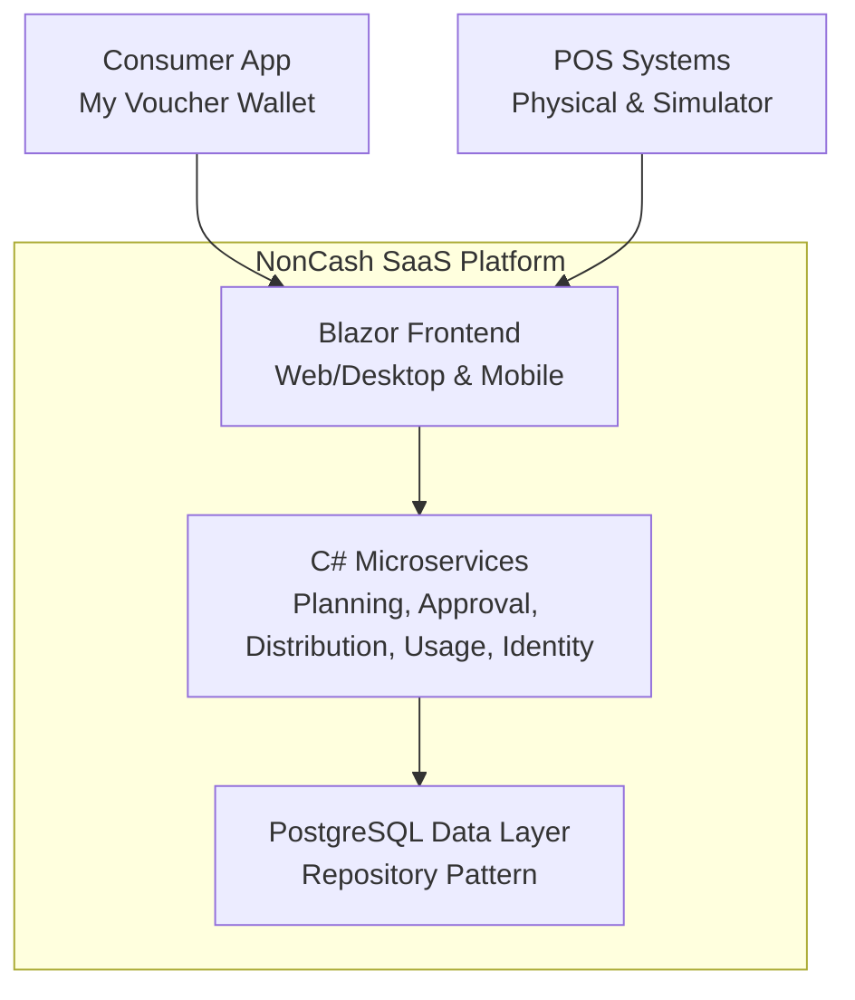
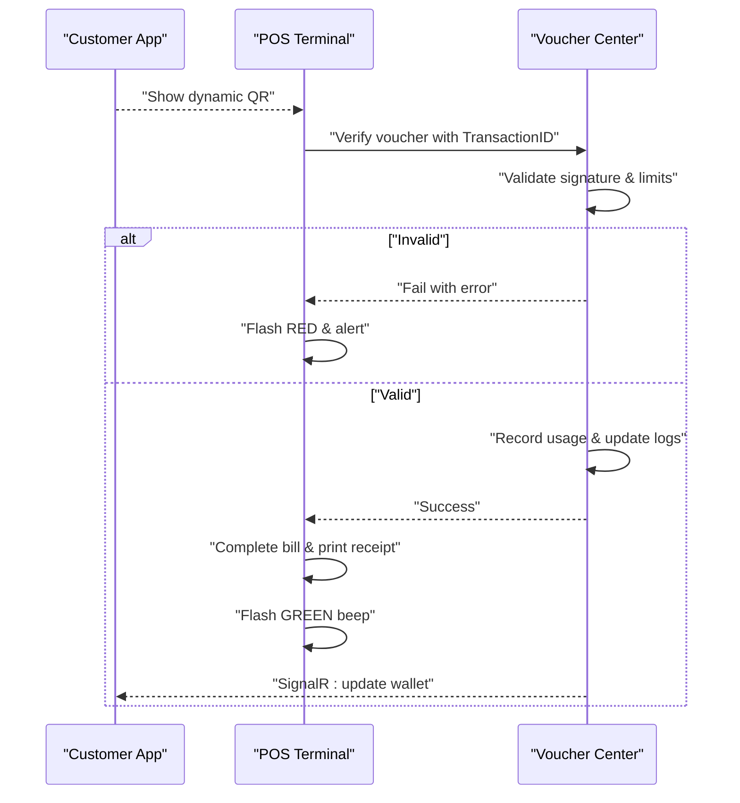
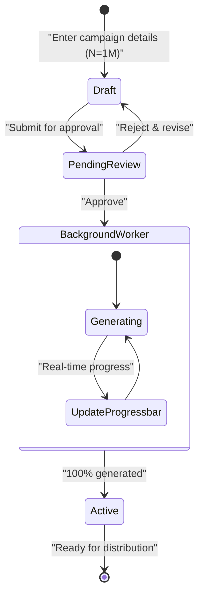
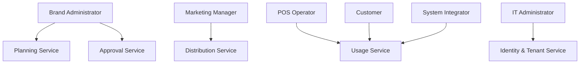

# Target Audience Definition

<cite>
**Referenced Files in This Document**
- [Key Functionalities.txt](file://Key Functionalities.txt)
- [description.txt](file://description.txt)
- [docs/index.md](file://docs/index.md)
- [docs/architecture.md](file://docs/architecture.md)
- [docs/data-models.md](file://docs/data-models.md)
- [_bmad-output/planning-artifacts/ux-design-specification.md](file://_bmad-output/planning-artifacts/ux-design-specification.md)
- [_bmad-output/planning-artifacts/epics.md](file://_bmad-output/planning-artifacts/epics.md)
- [_bmad-output/planning-artifacts/implementation-readiness-report-2026-04-17.md](file://_bmad-output/planning-artifacts/implementation-readiness-report-2026-04-17.md)
- [_bmad/_config/agent-manifest.csv](file://_bmad/_config/agent-manifest.csv)
- [_bmad/_config/skill-manifest.csv](file://_bmad/_config/skill-manifest.csv)
</cite>

## Table of Contents
1. [Introduction](#introduction)
2. [Project Structure](#project-structure)
3. [Core Components](#core-components)
4. [Architecture Overview](#architecture-overview)
5. [Detailed Component Analysis](#detailed-component-analysis)
6. [Dependency Analysis](#dependency-analysis)
7. [Performance Considerations](#performance-considerations)
8. [Troubleshooting Guide](#troubleshooting-guide)
9. [Conclusion](#conclusion)
10. [Appendices](#appendices)

## Introduction
This document defines the target audiences for NonCash, focusing on stakeholder identification and user persona development. It consolidates business requirements, system architecture, and UX direction to describe primary and secondary audiences, their roles and responsibilities, technical proficiency expectations, and how NonCash addresses their specific pain points. It also covers geographic considerations, industry verticals, business size segments, user journey mapping, adoption barriers, success factors, training and support needs, and change management considerations.

## Project Structure
NonCash is a SaaS platform with a three-layer architecture supporting multi-tenant brands, point-of-sale (POS) redemption, and end-user voucher wallets. The system organizes functionality into microservices and provides clear separation between front-end (Blazor), business logic (C# microservices), and data access (PostgreSQL). The UX specification and epics further define user-facing journeys and acceptance criteria.



**Diagram sources**
- [docs/architecture.md:5-52](file://docs/architecture.md#L5-L52)
- [docs/index.md:9](file://docs/index.md#L9)

**Section sources**
- [docs/index.md:1-41](file://docs/index.md#L1-L41)
- [docs/architecture.md:1-52](file://docs/architecture.md#L1-L52)

## Core Components
- Brand administrators manage multi-location operations and oversee voucher lifecycle from planning to redemption.
- Marketing managers plan promotional campaigns and coordinate multi-channel distribution.
- POS operators handle daily transactions and ensure fast, reliable redemption.
- Customers engage with digital vouchers via a simplified wallet app.

Secondary audiences include system integrators, IT administrators, and business analysts who support deployment, maintenance, and performance monitoring.

**Section sources**
- [Key Functionalities.txt:70-167](file://Key Functionalities.txt#L70-L167)
- [docs/architecture.md:17-26](file://docs/architecture.md#L17-L26)
- [_bmad-output/planning-artifacts/ux-design-specification.md:22-26](file://_bmad-output/planning-artifacts/ux-design-specification.md#L22-L26)

## Architecture Overview
The platform’s 3-layer architecture supports:
- Multi-tenancy by BrandID to isolate data and operations.
- Dynamic security tokens for vouchers and API keys for POS systems.
- Microservices for planning, approval, distribution, usage, and identity/tenant management.

```mermaid
classDiagram
class Brand {
+BrandID
+Name
+TaxCode
+ContactEmail
+Status
}
class Outlet {
+OutletID
+BrandID
+Name
+Address
+Status
}
class UserAccount {
+UserID
+BrandID
+Username
+Role
+Status
}
class Customer {
+CustomerID
+PhoneNumber
+FullName
+Email
+Status
}
Brand "1" o-- "many" Outlet : "owns"
Brand "1" o-- "many" UserAccount : "employs"
Customer ||--o{ VoucherDistribution : "receives"
```

**Diagram sources**
- [docs/data-models.md:65-98](file://docs/data-models.md#L65-L98)

**Section sources**
- [docs/architecture.md:36-41](file://docs/architecture.md#L36-L41)
- [docs/data-models.md:1-98](file://docs/data-models.md#L1-L98)

## Detailed Component Analysis

### Primary Audiences

#### Brand Administrators (Multi-Location Operations)
- Roles and responsibilities:
  - Create and approve voucher plans with budget, targets, and outlet ranges.
  - Configure outlets and manage distribution channels (sales, promotions, transfers).
  - Monitor redemption performance and campaign effectiveness.
- Technical proficiency:
  - Intermediate to advanced desktop users comfortable with dashboards and data grids.
- Pain points addressed:
  - Centralized planning and approval reduce manual coordination.
  - Batch generation and distribution minimize operational overhead.
  - Real-time dashboards and logs enable quick decision-making.
- Geographic considerations:
  - Suitable for national chains and franchises with standardized operations.
- Industry verticals:
  - Retail, F&B, entertainment, travel, and B2B markets.
- Business size segments:
  - Mid to large enterprises with multiple outlets and centralized procurement.

Success factors:
- Clear approval workflows and audit trails.
- Intuitive batch operation controls and progress indicators.
- Strong reporting and alerting for deviations from targets.

Adoption barriers:
- Resistance to process change from legacy spreadsheets.
- Concerns about POS integration and token security.

Training and support:
- Role-based onboarding covering planning, approvals, and distribution.
- Hands-on workshops for batch operations and POS configuration.
- Ongoing support via admin helpdesk and knowledge base.

Change management:
- Pilot with select outlets before full rollout.
- Establish internal champions to drive adoption.

**Section sources**
- [Key Functionalities.txt:7-86](file://Key Functionalities.txt#L7-L86)
- [docs/architecture.md:17-26](file://docs/architecture.md#L17-L26)
- [_bmad-output/planning-artifacts/ux-design-specification.md:22-26](file://_bmad-output/planning-artifacts/ux-design-specification.md#L22-L26)

#### Marketing Managers (Promotional Campaigns)
- Roles and responsibilities:
  - Design and execute promotional campaigns across channels.
  - Coordinate batch promotions and monitor acquisition goals.
- Technical proficiency:
  - Intermediate desktop users; rely on visual dashboards and drag-and-drop features.
- Pain points addressed:
  - Automated batch promotion reduces manual effort.
  - Real-time tracking aligns campaign performance with targets.
- Geographic considerations:
  - Urban and suburban markets with strong mobile penetration.
- Industry verticals:
  - Consumer goods, retail, restaurants, and service providers.
- Business size segments:
  - SMEs to large corporations depending on campaign scale.

Success factors:
- Seamless integration between planning and distribution.
- Easy-to-use campaign builder and analytics.

Adoption barriers:
- Overwhelm from too many options or unclear workflows.

Training and support:
- Campaign templates and guided workflows.
- Quick-reference guides and video tutorials.

Change management:
- Start with small campaigns to build confidence.

**Section sources**
- [Key Functionalities.txt:87-134](file://Key Functionalities.txt#L87-L134)
- [_bmad-output/planning-artifacts/epics.md:65-76](file://_bmad-output/planning-artifacts/epics.md#L65-L76)

#### POS Operators (Daily Transactions)
- Roles and responsibilities:
  - Redeem vouchers quickly and reliably at checkout.
  - Handle rollback scenarios and communicate outcomes to customers.
- Technical proficiency:
  - Basic computer literacy; require minimal training.
- Pain points addressed:
  - Fast, color-coded feedback minimizes confusion.
  - Simple POS terminal interface reduces errors.
- Geographic considerations:
  - High footfall urban stores and suburban retail centers.
- Industry verticals:
  - Retail, restaurants, pharmacies, and service stations.
- Business size segments:
  - Franchisees, independent retailers, and chain stores.

Success factors:
- Instant success feedback and clear error messaging.
- Reliable POS token security and transaction integrity.

Adoption barriers:
- Skepticism about new technology or fear of mistakes.

Training and support:
- On-site setup and quick-reference POS guides.
- Helpdesk for immediate troubleshooting.

Change management:
- Demonstrate POS benefits with live demos and pilot stores.

**Section sources**
- [Key Functionalities.txt:135-156](file://Key Functionalities.txt#L135-L156)
- [_bmad-output/planning-artifacts/ux-design-specification.md:206-241](file://_bmad-output/planning-artifacts/ux-design-specification.md#L206-L241)

#### Customers (Digital Vouchers)
- Roles and responsibilities:
  - View, use, and transfer vouchers through the wallet app.
- Technical proficiency:
  - Broad demographic; require simple, intuitive UX.
- Pain points addressed:
  - Dynamic, rotating voucher code enhances trust and security.
  - Minimal steps for purchase, transfer, and redemption.
- Geographic considerations:
  - Urban and suburban areas with smartphone ownership.
- Industry verticals:
  - General retail, food services, and B2B supply chains.
- Business size segments:
  - Individual consumers and small to medium organizations.

Success factors:
- Trust-building UX (dynamic code, countdown timer).
- Smooth redemption flow with instant feedback.

Adoption barriers:
- Privacy concerns and screenshots.
- Low digital literacy among older demographics.

Training and support:
- In-app tutorials and tooltips.
- Support chat and FAQ for common issues.

Change management:
- Highlight security and convenience benefits.
- Gradual rollout with incentives.

**Section sources**
- [Key Functionalities.txt:158-167](file://Key Functionalities.txt#L158-L167)
- [_bmad-output/planning-artifacts/ux-design-specification.md:22-26](file://_bmad-output/planning-artifacts/ux-design-specification.md#L22-L26)

### Secondary Audiences

#### System Integrators
- Roles and responsibilities:
  - Deploy and integrate POS systems, configure API keys, and troubleshoot connectivity.
- Technical proficiency:
  - Advanced; strong in APIs, security, and middleware.
- Pain points addressed:
  - Clear API contracts and token security reduce integration risk.
- Success factors:
  - Well-defined POS integration and token lifecycle.

Adoption barriers:
- Complex legacy POS ecosystems.

Training and support:
- Integration guides, SDKs, and dedicated support.

Change management:
- Phased integration with testing and validation.

**Section sources**
- [docs/architecture.md:36-41](file://docs/architecture.md#L36-L41)
- [docs/data-models.md:46-62](file://docs/data-models.md#L46-L62)

#### IT Administrators
- Roles and responsibilities:
  - Manage tenants, user accounts, RBAC, and multi-tenancy isolation.
- Technical proficiency:
  - Advanced; database, identity, and security administration.
- Pain points addressed:
  - Role-based access control and tenant isolation protect data.
- Success factors:
  - Clean separation of duties and auditability.

Adoption barriers:
- Legacy identity systems and compliance requirements.

Training and support:
- Admin consoles, RBAC playbooks, and security hardening guides.

Change management:
- Implement least privilege and regular audits.

**Section sources**
- [docs/architecture.md:25](file://docs/architecture.md#L25)
- [docs/data-models.md:81-98](file://docs/data-models.md#L81-L98)

#### Business Analysts
- Roles and responsibilities:
  - Analyze campaign performance, redemption trends, and ROI.
- Technical proficiency:
  - Intermediate; comfortable with dashboards and reports.
- Pain points addressed:
  - Real-time dashboards and exportable reports streamline analysis.
- Success factors:
  - Integrated analytics across planning, distribution, and usage.

Adoption barriers:
- Data silos and inconsistent reporting.

Training and support:
- Pre-built dashboards and analyst toolkits.

Change management:
- Establish KPIs and regular reporting cadence.

**Section sources**
- [_bmad-output/planning-artifacts/ux-design-specification.md:35-54](file://_bmad-output/planning-artifacts/ux-design-specification.md#L35-L54)
- [docs/data-models.md:46-62](file://docs/data-models.md#L46-L62)

### User Journey Mapping

#### POS Redemption (Defining Experience)


**Diagram sources**
- [_bmad-output/planning-artifacts/ux-design-specification.md:208-241](file://_bmad-output/planning-artifacts/ux-design-specification.md#L208-L241)

#### Batch Voucher Generation (Large-Scale Publishing)


**Diagram sources**
- [_bmad-output/planning-artifacts/ux-design-specification.md:242-262](file://_bmad-output/planning-artifacts/ux-design-specification.md#L242-L262)

### Adoption Barriers and Success Factors
- Adoption barriers:
  - Legacy systems and resistance to change.
  - Complexity of POS integration and token security.
  - Training gaps and lack of change management.
- Success factors:
  - Clear UX, fast redemption, and transparent security.
  - Strong governance, RBAC, and tenant isolation.
  - Real-time dashboards and robust reporting.

**Section sources**
- [_bmad-output/planning-artifacts/ux-design-specification.md:27-34](file://_bmad-output/planning-artifacts/ux-design-specification.md#L27-L34)
- [docs/architecture.md:36-41](file://docs/architecture.md#L36-L41)

### Training Requirements, Support Needs, and Change Management
- Training:
  - Role-specific onboarding (brand admins, marketers, POS cashiers, IT).
  - Hands-on workshops for batch operations and POS configuration.
- Support:
  - Dedicated helpdesks, knowledge bases, and community forums.
- Change management:
  - Pilot programs, internal champions, and continuous improvement cycles.

**Section sources**
- [_bmad-output/planning-artifacts/ux-design-specification.md:35-54](file://_bmad-output/planning-artifacts/ux-design-specification.md#L35-L54)
- [_bmad-output/planning-artifacts/implementation-readiness-report-2026-04-17.md:120-127](file://_bmad-output/planning-artifacts/implementation-readiness-report-2026-04-17.md#L120-L127)

## Dependency Analysis
NonCash’s personas depend on the following system dependencies:
- Multi-tenancy by BrandID for data isolation.
- Dynamic voucher tokens and POS API keys for security.
- Microservices for planning, approval, distribution, usage, and identity/tenant management.



**Diagram sources**
- [docs/architecture.md:17-26](file://docs/architecture.md#L17-L26)
- [docs/data-models.md:65-98](file://docs/data-models.md#L65-L98)

**Section sources**
- [docs/architecture.md:17-26](file://docs/architecture.md#L17-L26)
- [docs/data-models.md:65-98](file://docs/data-models.md#L65-L98)

## Performance Considerations
- POS redemption must complete under 500 ms for success feedback.
- Batch generation must remain responsive via background workers.
- Real-time dashboards and SignalR updates ensure timely visibility.

**Section sources**
- [_bmad-output/planning-artifacts/ux-design-specification.md:142-147](file://_bmad-output/planning-artifacts/ux-design-specification.md#L142-L147)
- [_bmad-output/planning-artifacts/ux-design-specification.md:263-267](file://_bmad-output/planning-artifacts/ux-design-specification.md#L263-L267)

## Troubleshooting Guide
- POS rollback scenarios: clear error messages and visual feedback.
- Batch generation failures: progress logging and retry mechanisms.
- Customer blacklist issues: visibility and remediation pathways.
- RBAC and tenant isolation: audit trails and role validation.

**Section sources**
- [_bmad-output/planning-artifacts/ux-design-specification.md:208-241](file://_bmad-output/planning-artifacts/ux-design-specification.md#L208-L241)
- [docs/data-models.md:46-62](file://docs/data-models.md#L46-L62)

## Conclusion
NonCash targets a broad ecosystem of stakeholders, from brand administrators and marketing managers to POS operators and end customers. Its 3-layer architecture, microservices, and strong security posture enable seamless planning, distribution, and redemption. By aligning persona-driven UX with robust backend capabilities, NonCash accelerates adoption, improves operational efficiency, and delivers a trusted voucher experience across industries and geographies.

## Appendices
- Additional context on roles and skills:
  - Agent roles and capabilities for analysts, UX designers, architects, and developers.
  - Skills for stakeholder engagement, research, and solutioning.

**Section sources**
- [_bmad/_config/agent-manifest.csv:1-8](file://_bmad/_config/agent-manifest.csv#L1-L8)
- [_bmad/_config/skill-manifest.csv:1-43](file://_bmad/_config/skill-manifest.csv#L1-L43)