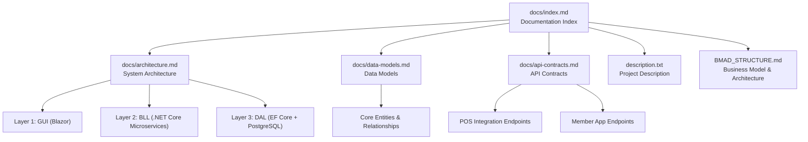
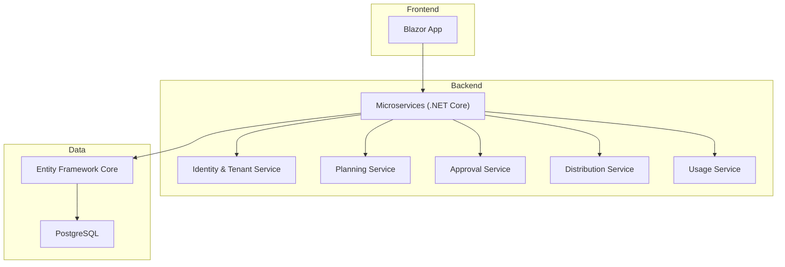
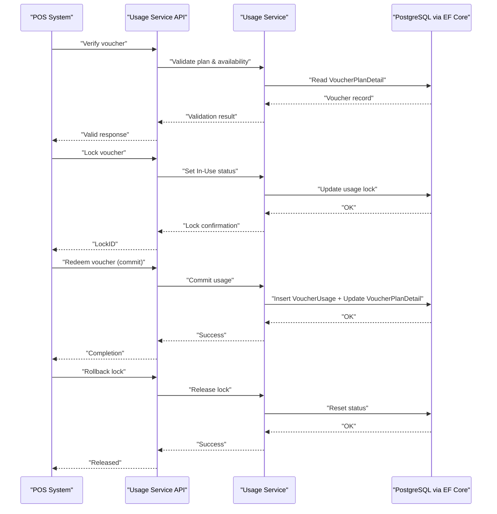
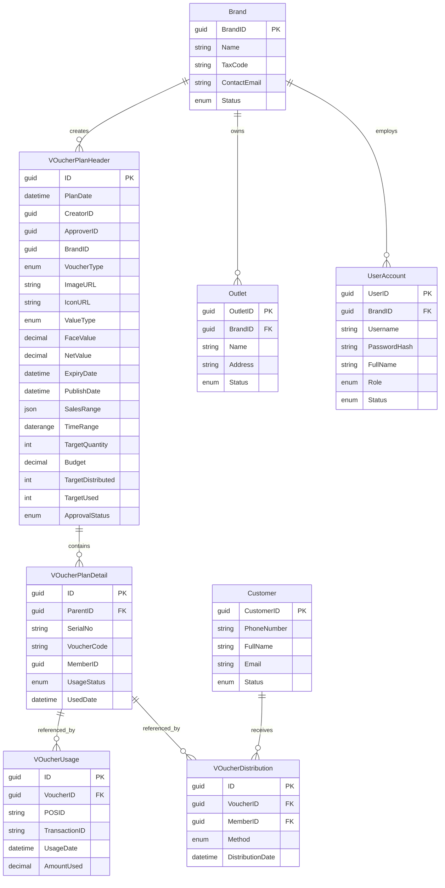
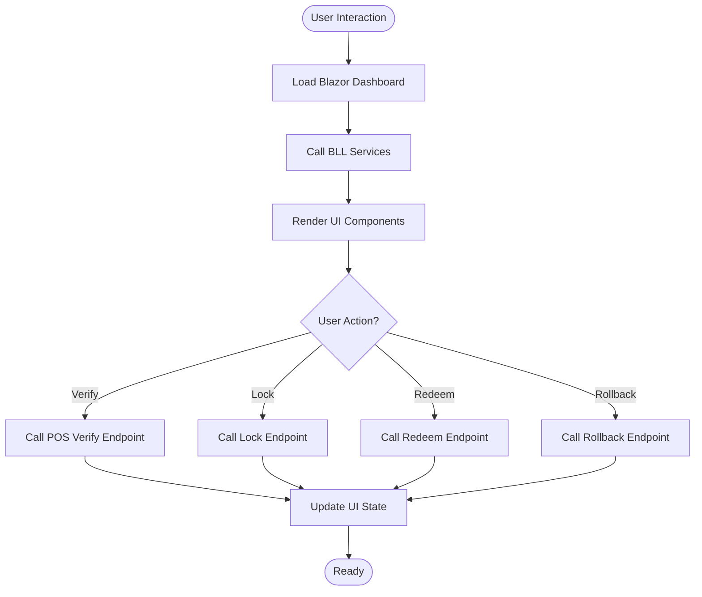
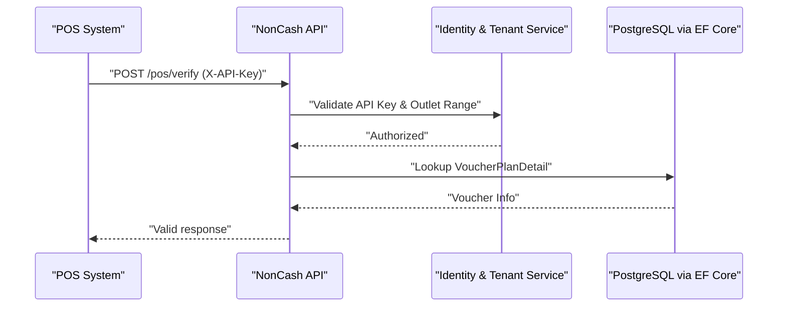
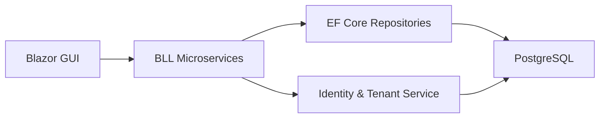

# Technology Stack Overview

<cite>
**Referenced Files in This Document**
- [description.txt](file://description.txt)
- [BMAD_STRUCTURE.md](file://BMAD_STRUCTURE.md)
- [docs/architecture.md](file://docs/architecture.md)
- [docs/data-models.md](file://docs/data-models.md)
- [docs/api-contracts.md](file://docs/api-contracts.md)
- [docs/index.md](file://docs/index.md)
</cite>

## Table of Contents
1. [Introduction](#introduction)
2. [Project Structure](#project-structure)
3. [Core Components](#core-components)
4. [Architecture Overview](#architecture-overview)
5. [Detailed Component Analysis](#detailed-component-analysis)
6. [Dependency Analysis](#dependency-analysis)
7. [Performance Considerations](#performance-considerations)
8. [Troubleshooting Guide](#troubleshooting-guide)
9. [Conclusion](#conclusion)
10. [Appendices](#appendices)

## Introduction
This document presents the NonCash technology stack overview, focusing on the complete technical foundation and architectural choices. The platform is a SaaS solution for voucher production and management, designed around a three-layer architecture with clear separation of concerns. The backend leverages C#/.NET Core microservices, the frontend uses Blazor for a unified development experience, and the data layer employs PostgreSQL with Entity Framework Core. Security is enforced through API Key and JWT mechanisms, while POS integration is standardized via RESTful API contracts.

## Project Structure
The repository organizes documentation and strategy artifacts to guide development and deployment. The documentation index provides a structured entry point to system architecture, data models, API contracts, and source tree analysis. The project description and BMAD structure outline the business objectives, model, and high-level architecture decisions.

**Diagram sources**
- [docs/index.md:1-41](file://docs/index.md#L1-L41)
- [docs/architecture.md:1-52](file://docs/architecture.md#L1-L52)
- [docs/data-models.md:1-98](file://docs/data-models.md#L1-L98)
- [docs/api-contracts.md:1-109](file://docs/api-contracts.md#L1-L109)
- [description.txt:1-31](file://description.txt#L1-L31)
- [BMAD_STRUCTURE.md:1-82](file://BMAD_STRUCTURE.md#L1-L82)

**Section sources**
- [docs/index.md:1-41](file://docs/index.md#L1-L41)
- [description.txt:1-31](file://description.txt#L1-L31)
- [BMAD_STRUCTURE.md:1-82](file://BMAD_STRUCTURE.md#L1-L82)

## Core Components
- Backend: C#/.NET Core microservices for business logic and service orchestration.
- Database: PostgreSQL chosen for cost and performance, with Entity Framework Core for ORM.
- Frontend: Blazor for a unified development experience across server and WebAssembly modes.
- Security: API Key authentication for external integrations and JWT for user sessions.
- Integration: RESTful API contracts define POS and Member App interactions.

**Section sources**
- [description.txt:11-27](file://description.txt#L11-L27)
- [BMAD_STRUCTURE.md:39-56](file://BMAD_STRUCTURE.md#L39-L56)
- [docs/architecture.md:9-35](file://docs/architecture.md#L9-L35)
- [docs/api-contracts.md:5-9](file://docs/api-contracts.md#L5-L9)

## Architecture Overview
The NonCash platform follows a three-layer SaaS architecture:
- GUI (Frontend): Blazor manages user interactions and dashboards.
- BLL (Core): Organized into microservices for planning, approval, distribution, usage, and identity/tenant management.
- DAL (Infrastructure): Entity Framework Core with PostgreSQL handles data access and transactions.

**Diagram sources**
- [docs/architecture.md:9-35](file://docs/architecture.md#L9-L35)
- [docs/data-models.md:1-98](file://docs/data-models.md#L1-L98)

**Section sources**
- [docs/architecture.md:5-35](file://docs/architecture.md#L5-L35)
- [BMAD_STRUCTURE.md:39-56](file://BMAD_STRUCTURE.md#L39-L56)

## Detailed Component Analysis

### Backend: C#/.NET Core Microservices
- Organization: Microservices pattern enables independent scalability and loose coupling.
- Responsibilities:
  - Planning Service: Campaign planning, budgeting, and targets.
  - Approval Service: Routing and state management for plan reviews.
  - Distribution Service: Sales, promotions, and inbox delivery.
  - Usage Service: POS redemption workflow with lock/commit/rollback semantics.
  - Identity & Tenant Service: RBAC for UserAccount, multi-tenancy for Brand/Outlet, and Customer profiles.
- Security: JWT-based authentication and dynamic voucher code logic.

**Diagram sources**
- [docs/architecture.md:17-26](file://docs/architecture.md#L17-L26)
- [docs/api-contracts.md:14-87](file://docs/api-contracts.md#L14-L87)
- [docs/data-models.md:46-62](file://docs/data-models.md#L46-L62)

**Section sources**
- [docs/architecture.md:17-26](file://docs/architecture.md#L17-L26)
- [docs/api-contracts.md:14-87](file://docs/api-contracts.md#L14-L87)
- [docs/data-models.md:46-62](file://docs/data-models.md#L46-L62)

### Database: PostgreSQL with Entity Framework Core
- ORM Benefits:
  - Strongly-typed queries and migrations.
  - Repository pattern decouples DAL from BLL.
  - Transactions ensure consistency for POS usage workflows.
- Data Models:
  - VoucherPlanHeader and VoucherPlanDetail for production planning.
  - VoucherUsage and VoucherDistribution for tracking.
  - Brand, Outlet, UserAccount, and Customer for identity and operations.

**Diagram sources**
- [docs/data-models.md:11-98](file://docs/data-models.md#L11-L98)

**Section sources**
- [docs/architecture.md:28-35](file://docs/architecture.md#L28-L35)
- [docs/data-models.md:9-98](file://docs/data-models.md#L9-L98)
- [BMAD_STRUCTURE.md:59-74](file://BMAD_STRUCTURE.md#L59-L74)

### Frontend: Blazor Unified Development Experience
- Responsibilities:
  - Dashboards for production planning and approval tracking.
  - Visualizations for voucher usage and performance metrics.
  - Communication with BLL via service-to-service calls or internal APIs.
- Modes: Blazor Server or WebAssembly, enabling flexible deployment strategies.

**Diagram sources**
- [docs/architecture.md:9-16](file://docs/architecture.md#L9-L16)
- [docs/api-contracts.md:14-87](file://docs/api-contracts.md#L14-L87)

**Section sources**
- [docs/architecture.md:9-16](file://docs/architecture.md#L9-L16)
- [BMAD_STRUCTURE.md:53-56](file://BMAD_STRUCTURE.md#L53-L56)

### Security and Integration Points
- Authentication:
  - API Key for POS and external system authentication.
  - JWT for user sessions and authorization.
- Multi-tenancy:
  - Strict isolation via BrandID to ensure tenant boundaries.
- Dynamic Security:
  - Voucher codes use rotating logic akin to JWT to prevent reuse and unauthorized scanning.
- Integration Security:
  - POS systems authenticated via API Keys and restricted to predefined outlet ranges.

**Diagram sources**
- [docs/architecture.md:36-41](file://docs/architecture.md#L36-L41)
- [docs/api-contracts.md:7-9](file://docs/api-contracts.md#L7-L9)

**Section sources**
- [docs/architecture.md:36-41](file://docs/architecture.md#L36-L41)
- [docs/api-contracts.md:7-9](file://docs/api-contracts.md#L7-L9)
- [description.txt:22-24](file://description.txt#L22-L24)

## Dependency Analysis
The system exhibits clear layering and service decomposition:
- GUI depends on BLL services.
- BLL depends on DAL abstractions (repositories) and shared domain logic.
- DAL depends on EF Core and PostgreSQL.
- Identity and tenant management underpins cross-cutting concerns.

**Diagram sources**
- [docs/architecture.md:9-35](file://docs/architecture.md#L9-L35)
- [docs/data-models.md:63-98](file://docs/data-models.md#L63-L98)

**Section sources**
- [docs/architecture.md:9-35](file://docs/architecture.md#L9-L35)
- [BMAD_STRUCTURE.md:44-56](file://BMAD_STRUCTURE.md#L44-L56)

## Performance Considerations
- Database Performance:
  - PostgreSQL selected for cost and performance characteristics.
  - Transactions ensure consistency for concurrent POS usage scenarios.
- ORM Efficiency:
  - EF Core provides efficient query translation and migration support.
- Scalability:
  - Microservices enable independent scaling of planning, approval, distribution, usage, and identity services.
- Frontend Responsiveness:
  - Blazor’s component model supports reactive UI updates and efficient rendering.

[No sources needed since this section provides general guidance]

## Troubleshooting Guide
- Authentication Failures:
  - Verify API Key presence and validity for POS endpoints.
  - Confirm JWT token issuance and expiration for user sessions.
- Voucher Redemption Issues:
  - Ensure lock lifecycle is followed: verify → lock → redeem or rollback.
  - Check outlet range alignment with plan configuration.
- Data Consistency:
  - Validate transaction boundaries for usage inserts and status updates.

**Section sources**
- [docs/api-contracts.md:7-9](file://docs/api-contracts.md#L7-L9)
- [docs/architecture.md:36-41](file://docs/architecture.md#L36-L41)

## Conclusion
NonCash adopts a robust, scalable, and secure SaaS architecture centered on C#/.NET Core microservices, Blazor frontend, and PostgreSQL with Entity Framework Core. The three-layer design enforces separation of concerns, while microservices promote independent scalability. Security is layered with API Keys and JWT, and POS integration is standardized via RESTful contracts. This foundation supports future enhancements and technology upgrades while maintaining maintainability and performance.

[No sources needed since this section summarizes without analyzing specific files]

## Appendices

### Technology Decision Matrix
- Backend: C#/.NET Core was chosen for productivity, performance, and ecosystem maturity.
- Database: PostgreSQL selected for cost and performance, with EF Core for ORM benefits.
- Frontend: Blazor for unified development experience across server and client contexts.
- Security: API Key for external integrations and JWT for user sessions.
- Integration: RESTful API contracts define POS and Member App interactions.

**Section sources**
- [description.txt:11-27](file://description.txt#L11-L27)
- [docs/architecture.md:42-52](file://docs/architecture.md#L42-L52)

### Version Compatibility Requirements
- Backend: C# and .NET Core versions aligned with current LTS support.
- Database: PostgreSQL version compatible with EF Core provider.
- Frontend: Blazor supported in current .NET releases.
- Security: JWT libraries and API Key middleware aligned with .NET ecosystem.

[No sources needed since this section provides general guidance]

### Integration Points with Third-Party Services
- POS Systems: Authenticate via API Key and integrate via REST endpoints.
- Member Apps: Authenticate via JWT and consume member-centric endpoints.
- Identity Providers: Optional integration for federated authentication aligned with JWT.

**Section sources**
- [docs/api-contracts.md:5-9](file://docs/api-contracts.md#L5-L9)
- [docs/architecture.md:36-41](file://docs/architecture.md#L36-L41)

### Development Environment Setup
- Prerequisites: .NET SDK, PostgreSQL, and a modern IDE.
- Database: Initialize schema using EF Core migrations.
- Services: Run microservices locally or containerized for development.
- Frontend: Launch Blazor app in development mode.

[No sources needed since this section provides general guidance]

### Build Processes and Deployment Pipeline
- Build: Restore packages, compile projects, and run tests.
- Containerization: Package services and database in containers for deployment.
- Orchestration: Deploy to cloud platforms supporting containers and managed databases.
- CI/CD: Automate builds, tests, and deployments with pipeline stages.

[No sources needed since this section provides general guidance]

### Alternative Stacks and Rationale
- Java/Spring Boot: Strong enterprise support but requires more boilerplate for microservices.
- Node.js/Express: Rapid prototyping but less type safety and ecosystem maturity for complex domains.
- Python/Django: Good for data-heavy apps but less suitable for real-time POS integrations.
- Go: Excellent performance but less ergonomic for rapid UI development compared to Blazor.
- PostgreSQL vs MongoDB: Relational consistency and ACID guarantees favor PostgreSQL for financial and transactional workflows.

[No sources needed since this section provides general guidance]