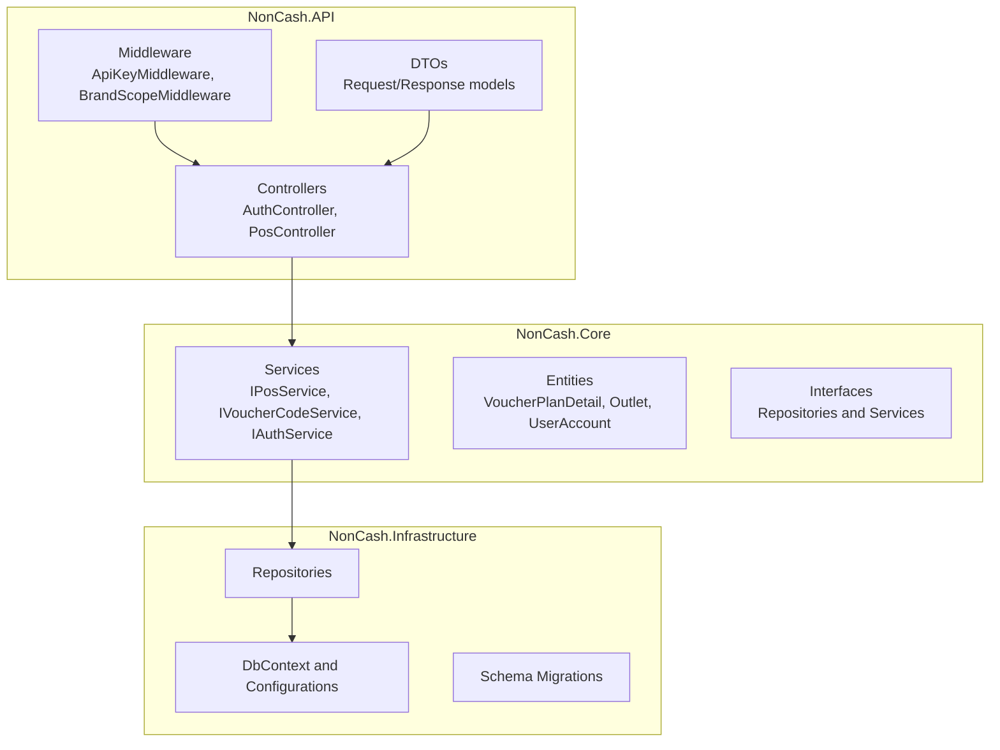
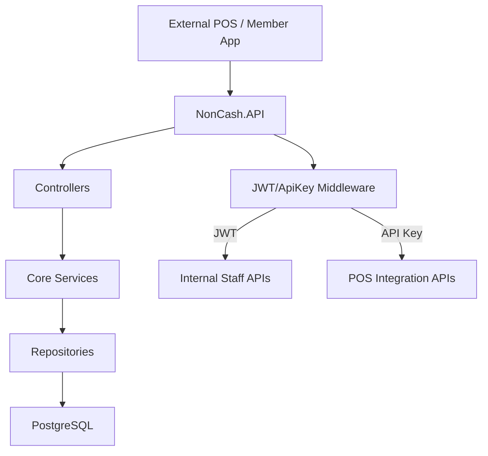
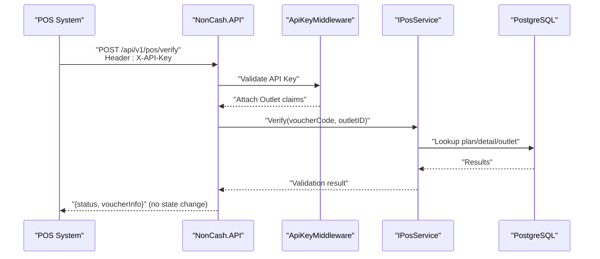
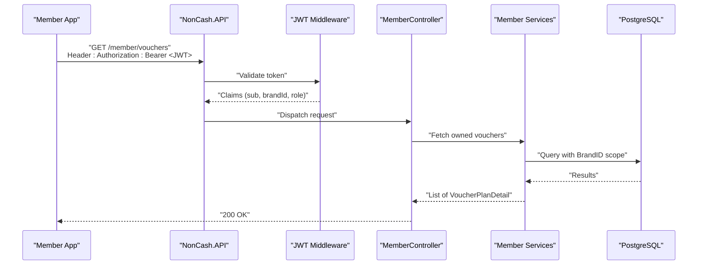
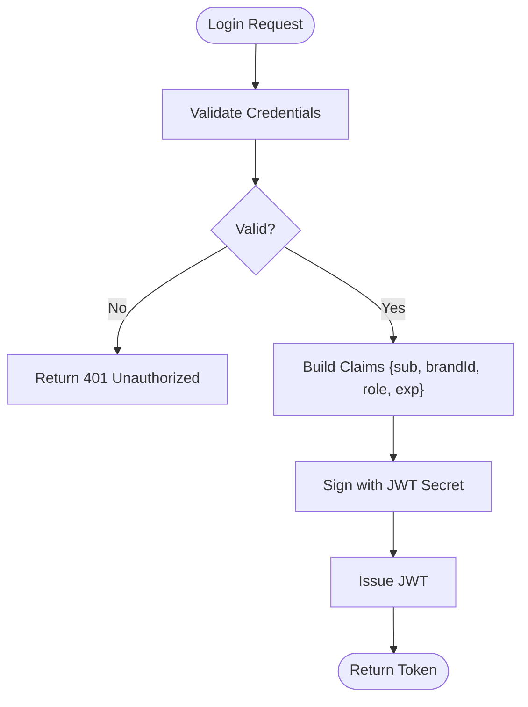
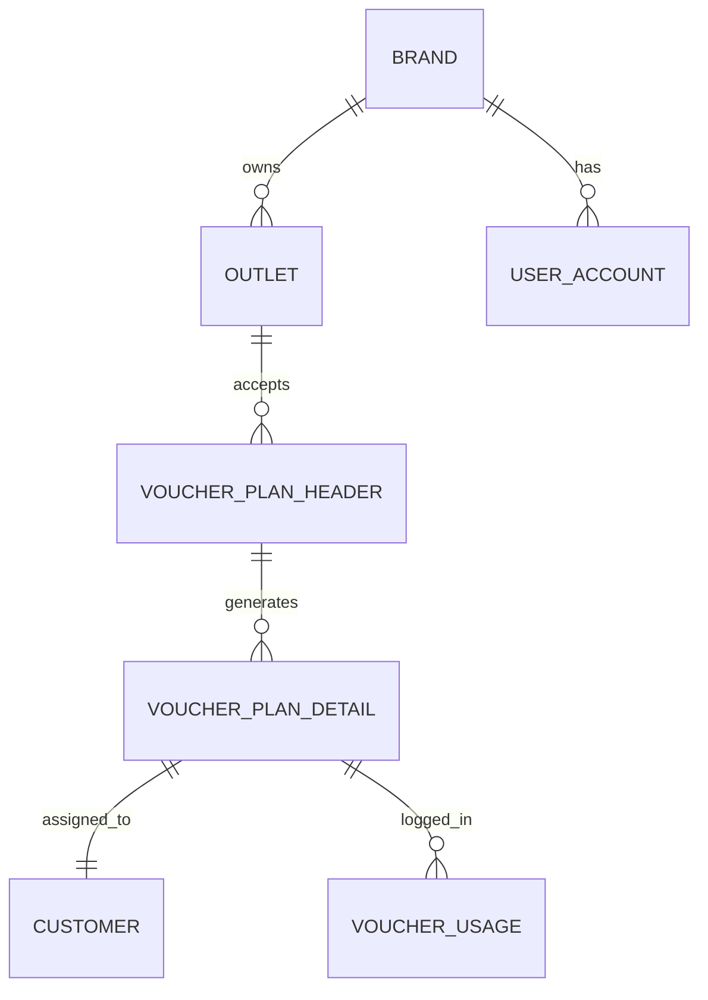
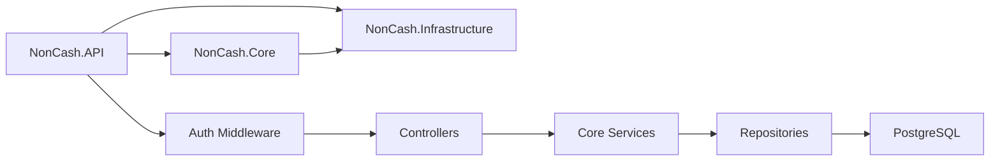

# API Security and Protection

<cite>
**Referenced Files in This Document**
- [api-contracts.md](file://docs/api-contracts.md)
- [architecture.md](file://docs/architecture.md)
- [data-models.md](file://docs/data-models.md)
- [index.md](file://docs/index.md)
- [source-tree-analysis.md](file://docs/source-tree-analysis.md)
- [Key Functionalities.txt](file://Key Functionalities.txt)
- [1-4-staff-accounts-rbac.md](file://_bmad-output/implementation-artifacts/1-4-staff-accounts-rbac.md)
- [1-2-outlet-configuration.md](file://_bmad-output/implementation-artifacts/1-2-outlet-configuration.md)
- [2-2-generate-plan-details.md](file://_bmad-output/implementation-artifacts/2-2-generate-plan-details.md)
- [4-1-check-for-information.md](file://_bmad-output/implementation-artifacts/4-1-check-for-information.md)
- [4-2-prepare-and-lock.md](file://_bmad-output/implementation-artifacts/4-2-prepare-and-lock.md)
- [4-3-commit-and-log.md](file://_bmad-output/implementation-artifacts/4-3-commit-and-log.md)
- [4-4-rollback-mechanism.md](file://_bmad-output/implementation-artifacts/4-4-rollback-mechanism.md)
</cite>

## Table of Contents
1. [Introduction](#introduction)
2. [Project Structure](#project-structure)
3. [Core Components](#core-components)
4. [Architecture Overview](#architecture-overview)
5. [Detailed Component Analysis](#detailed-component-analysis)
6. [Dependency Analysis](#dependency-analysis)
7. [Performance Considerations](#performance-considerations)
8. [Troubleshooting Guide](#troubleshooting-guide)
9. [Conclusion](#conclusion)
10. [Appendices](#appendices)

## Introduction
This document provides comprehensive API security documentation for the NonCash platform. It focuses on endpoint protection, input validation, and integration security measures for all public APIs. It also documents POS system integration security, including API key binding to specific voucher ranges, dynamic code validation, and replay attack prevention. Guidance is included for data validation rules, parameter sanitization, protection against injection attacks, error handling to avoid information leakage, monitoring for suspicious activity, and secure implementation patterns.

## Project Structure
The NonCash project follows a 3-layer SaaS architecture with clear separation of concerns:
- Core (Business Logic Layer) contains entities, services, and specifications.
- Infrastructure handles data access via Entity Framework Core and PostgreSQL.
- API exposes RESTful endpoints for POS integration and internal services.
- Shared library contains reusable models and constants.
- Web hosts the management portal for staff users.

**Diagram sources**
- [source-tree-analysis.md:36-44](file://docs/source-tree-analysis.md#L36-L44)
- [1-4-staff-accounts-rbac.md:84-99](file://_bmad-output/implementation-artifacts/1-4-staff-accounts-rbac.md#L84-L99)
- [4-1-check-for-information.md:72-79](file://_bmad-output/implementation-artifacts/4-1-check-for-information.md#L72-L79)

**Section sources**
- [source-tree-analysis.md:36-44](file://docs/source-tree-analysis.md#L36-L44)
- [index.md:34-37](file://docs/index.md#L34-L37)

## Core Components
- Authentication and Authorization:
  - JWT-based authentication for internal/staff APIs with role-based access control (RBAC).
  - API Key-based authentication for POS endpoints.
  - Multi-tenancy enforced via BrandID in JWT and scoped queries.
- Dynamic Voucher Code:
  - Voucher codes are short-lived, signed tokens (JWT-style) preventing static reuse and copy-fraud.
- POS Workflow:
  - Stateless verify endpoint (no state change).
  - Lock endpoint begins transaction boundary with atomic updates and optional idempotency.
  - Commit endpoint permanently marks usage and logs transaction.
  - Rollback endpoint releases locks and restores availability.

Security-relevant contracts and behaviors are defined in the API contracts and implementation artifacts.

**Section sources**
- [api-contracts.md:5-109](file://docs/api-contracts.md#L5-L109)
- [1-4-staff-accounts-rbac.md:28-44](file://_bmad-output/implementation-artifacts/1-4-staff-accounts-rbac.md#L28-L44)
- [2-2-generate-plan-details.md:36-42](file://_bmad-output/implementation-artifacts/2-2-generate-plan-details.md#L36-L42)
- [4-1-check-for-information.md:13-26](file://_bmad-output/implementation-artifacts/4-1-check-for-information.md#L13-L26)
- [4-2-prepare-and-lock.md:13-20](file://_bmad-output/implementation-artifacts/4-2-prepare-and-lock.md#L13-L20)
- [4-3-commit-and-log.md:45-50](file://_bmad-output/implementation-artifacts/4-3-commit-and-log.md#L45-L50)
- [4-4-rollback-mechanism.md:81-87](file://_bmad-output/implementation-artifacts/4-4-rollback-mechanism.md#L81-L87)

## Architecture Overview
The NonCash platform employs layered architecture with explicit security controls:
- API layer enforces authentication and authorization before invoking business logic.
- Business logic layer encapsulates domain rules and transaction boundaries.
- Data access layer ensures data consistency and multi-tenancy via scoped queries.

**Diagram sources**
- [architecture.md:5-52](file://docs/architecture.md#L5-L52)
- [1-4-staff-accounts-rbac.md:107-110](file://_bmad-output/implementation-artifacts/1-4-staff-accounts-rbac.md#L107-L110)
- [4-1-check-for-information.md:67-69](file://_bmad-output/implementation-artifacts/4-1-check-for-information.md#L67-L69)

**Section sources**
- [architecture.md:36-52](file://docs/architecture.md#L36-L52)
- [index.md:34-37](file://docs/index.md#L34-L37)

## Detailed Component Analysis

### POS Integration API Security
The POS integration API is designed to be secure and resilient:
- Authentication:
  - API Key header: X-API-Key.
  - API Key validation occurs before JWT middleware in the pipeline.
  - API Key binding to specific outlets and brands ensures multi-tenancy.
- Authorization:
  - POS endpoints are API Key authenticated; JWT is reserved for internal/staff APIs.
- Endpoint Security Considerations:
  - Verify: Stateless read-only operation; no state changes.
  - Lock: Atomic state change; idempotency; optional lock expiry.
  - Commit: Atomic transaction boundary; idempotency via transaction ID.
  - Rollback: Atomic release; rejects already-completed states.

**Diagram sources**
- [4-1-check-for-information.md:53-59](file://_bmad-output/implementation-artifacts/4-1-check-for-information.md#L53-L59)
- [4-1-check-for-information.md:85-90](file://_bmad-output/implementation-artifacts/4-1-check-for-information.md#L85-L90)

**Section sources**
- [api-contracts.md:10-87](file://docs/api-contracts.md#L10-L87)
- [4-1-check-for-information.md:13-26](file://_bmad-output/implementation-artifacts/4-1-check-for-information.md#L13-L26)
- [4-1-check-for-information.md:67-69](file://_bmad-output/implementation-artifacts/4-1-check-for-information.md#L67-L69)
- [4-2-prepare-and-lock.md:13-20](file://_bmad-output/implementation-artifacts/4-2-prepare-and-lock.md#L13-L20)
- [4-3-commit-and-log.md:45-50](file://_bmad-output/implementation-artifacts/4-3-commit-and-log.md#L45-L50)
- [4-4-rollback-mechanism.md:81-87](file://_bmad-output/implementation-artifacts/4-4-rollback-mechanism.md#L81-L87)

### Member App API Security
Member App endpoints require JWT Bearer authentication:
- List My Vouchers: Requires Authorization: Bearer <JWT>.
- Transfer Voucher: Requires Authorization: Bearer <JWT>; returns 202 Accepted pending recipient confirmation.

**Diagram sources**
- [api-contracts.md:89-109](file://docs/api-contracts.md#L89-L109)
- [1-4-staff-accounts-rbac.md:107-110](file://_bmad-output/implementation-artifacts/1-4-staff-accounts-rbac.md#L107-L110)

**Section sources**
- [api-contracts.md:89-109](file://docs/api-contracts.md#L89-L109)
- [1-4-staff-accounts-rbac.md:28-44](file://_bmad-output/implementation-artifacts/1-4-staff-accounts-rbac.md#L28-L44)

### Internal Staff API Security (RBAC and Multi-tenancy)
- JWT token generation includes subject, brandId, role, and expiration.
- Multi-tenancy enforced: BrandID in JWT overrides any request-body BrandID for tenant-scoped endpoints.
- Role-based access control: Admin, Planner, Approver, BrandManager with distinct rights.
- Password hashing with salt; JWT secret key minimum length and environment variable storage.

**Diagram sources**
- [1-4-staff-accounts-rbac.md:28-32](file://_bmad-output/implementation-artifacts/1-4-staff-accounts-rbac.md#L28-L32)

**Section sources**
- [1-4-staff-accounts-rbac.md:13-17](file://_bmad-output/implementation-artifacts/1-4-staff-accounts-rbac.md#L13-L17)
- [1-4-staff-accounts-rbac.md:107-110](file://_bmad-output/implementation-artifacts/1-4-staff-accounts-rbac.md#L107-L110)
- [1-4-staff-accounts-rbac.md:115-116](file://_bmad-output/implementation-artifacts/1-4-staff-accounts-rbac.md#L115-L116)

### Data Models and Multi-tenancy Enforcement
- Entities:
  - VoucherPlanHeader, VoucherPlanDetail, VoucherUsage, VoucherDistribution.
  - Brand, Outlet, UserAccount, Customer.
- Multi-tenancy:
  - BrandID used to scope data access; queries filtered by BrandID.
  - Outlet API Key binding ensures POS integration scope.
- Dynamic Voucher Code:
  - VoucherCode is a short-lived signed token; secrets stored per detail or platform-wide with salts.

**Diagram sources**
- [data-models.md:9-98](file://docs/data-models.md#L9-L98)
- [1-2-outlet-configuration.md:19-22](file://_bmad-output/implementation-artifacts/1-2-outlet-configuration.md#L19-L22)
- [2-2-generate-plan-details.md:92-96](file://_bmad-output/implementation-artifacts/2-2-generate-plan-details.md#L92-L96)

**Section sources**
- [data-models.md:9-98](file://docs/data-models.md#L9-L98)
- [1-2-outlet-configuration.md:67-70](file://_bmad-output/implementation-artifacts/1-2-outlet-configuration.md#L67-L70)
- [2-2-generate-plan-details.md:36-42](file://_bmad-output/implementation-artifacts/2-2-generate-plan-details.md#L36-L42)

## Dependency Analysis
- API layer depends on Core services for business logic and Infrastructure for persistence.
- Middleware enforces authentication and authorization before controllers.
- POS endpoints depend on dynamic code validation and outlet scope enforcement.
- Internal/staff endpoints depend on JWT validation and RBAC.

**Diagram sources**
- [source-tree-analysis.md:36-44](file://docs/source-tree-analysis.md#L36-L44)
- [4-1-check-for-information.md:72-79](file://_bmad-output/implementation-artifacts/4-1-check-for-information.md#L72-L79)

**Section sources**
- [source-tree-analysis.md:36-44](file://docs/source-tree-analysis.md#L36-L44)
- [4-1-check-for-information.md:67-69](file://_bmad-output/implementation-artifacts/4-1-check-for-information.md#L67-L69)

## Performance Considerations
- Stateless verify endpoint avoids write amplification and reduces contention.
- Atomic transactions for lock/commit minimize retries and improve throughput.
- Idempotency guards reduce duplicate work and improve resilience.
- Multi-tenancy filters at the query layer reduce unnecessary scans.

## Troubleshooting Guide
- Authentication failures:
  - Verify JWT secret configuration and expiration.
  - Confirm API Key presence and correct outlet binding.
- Authorization failures:
  - Ensure BrandID in JWT matches requested resource scope.
  - Validate role permissions for internal endpoints.
- POS workflow anomalies:
  - Verify lock idempotency and expiry behavior.
  - Confirm commit idempotency via transaction ID.
  - Check rollback semantics for already-completed states.
- Data integrity:
  - Audit VoucherUsage entries for duplicate commits.
  - Monitor usage status transitions for race conditions.

**Section sources**
- [4-2-prepare-and-lock.md:91-98](file://_bmad-output/implementation-artifacts/4-2-prepare-and-lock.md#L91-L98)
- [4-3-commit-and-log.md:45-60](file://_bmad-output/implementation-artifacts/4-3-commit-and-log.md#L45-L60)
- [4-4-rollback-mechanism.md:89-96](file://_bmad-output/implementation-artifacts/4-4-rollback-mechanism.md#L89-L96)

## Conclusion
NonCash implements a layered, multi-tenant architecture with strong authentication and authorization controls. POS endpoints leverage API Key binding and dynamic voucher codes to prevent fraud, while internal endpoints rely on JWT with RBAC. The POS workflow enforces atomicity, idempotency, and clear state transitions to ensure integrity. Adhering to the documented security requirements and implementation patterns will maintain a robust and secure API ecosystem.

## Appendices

### API Security Requirements Summary
- Authentication Headers:
  - POS: X-API-Key header for API Key authentication.
  - Member App: Authorization: Bearer <JWT> for JWT authentication.
- Request Validation:
  - Validate dynamic voucher code signature and expiry.
  - Enforce outlet scope and time-window constraints.
  - Reject forged/expired/invalid codes with non-leaking responses.
- Rate Limiting and CORS:
  - Configure rate limiting per endpoint and globally.
  - Set CORS origins to trusted domains only.
- Error Handling:
  - Avoid leaking internal details; return generic messages.
  - Use appropriate HTTP status codes without exposing stack traces.
- Monitoring:
  - Log authentication/authorization events and anomalies.
  - Track POS workflow steps and failure modes.

**Section sources**
- [api-contracts.md:5-109](file://docs/api-contracts.md#L5-L109)
- [4-1-check-for-information.md:92-95](file://_bmad-output/implementation-artifacts/4-1-check-for-information.md#L92-L95)
- [1-4-staff-accounts-rbac.md:115-116](file://_bmad-output/implementation-artifacts/1-4-staff-accounts-rbac.md#L115-L116)

### Secure Implementation Patterns
- Use middleware to enforce authentication before controller actions.
- Validate inputs early and fail fast with minimal information leakage.
- Employ atomic transactions for state-changing operations.
- Implement idempotency keys for critical endpoints.
- Rotate API Keys and JWT secrets regularly; store secrets in environment variables.

**Section sources**
- [4-3-commit-and-log.md:45-50](file://_bmad-output/implementation-artifacts/4-3-commit-and-log.md#L45-L50)
- [4-2-prepare-and-lock.md:91-94](file://_bmad-output/implementation-artifacts/4-2-prepare-and-lock.md#L91-L94)
- [1-4-staff-accounts-rbac.md:115-116](file://_bmad-output/implementation-artifacts/1-4-staff-accounts-rbac.md#L115-L116)

### Common Security Vulnerabilities in API Design
- Missing authentication/authorization leading to unauthorized access.
- Insecure error messages revealing internal implementation details.
- Insufficient input validation enabling injection or misuse.
- Lack of rate limiting enabling brute force or abuse.
- Weak cryptographic practices for tokens or secrets.
- Inadequate transaction boundaries causing inconsistent states.

**Section sources**
- [index.md:34-37](file://docs/index.md#L34-L37)
- [4-1-check-for-information.md:92-95](file://_bmad-output/implementation-artifacts/4-1-check-for-information.md#L92-L95)