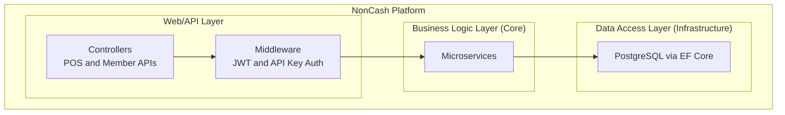
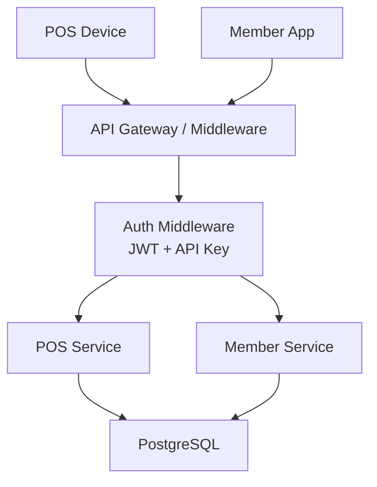
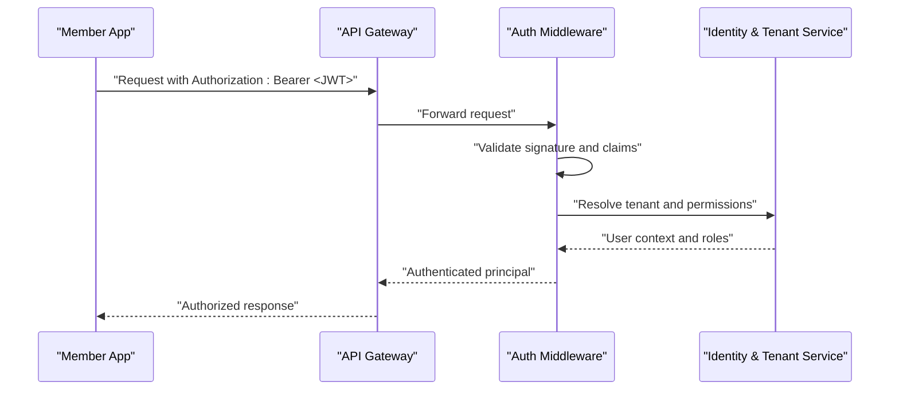
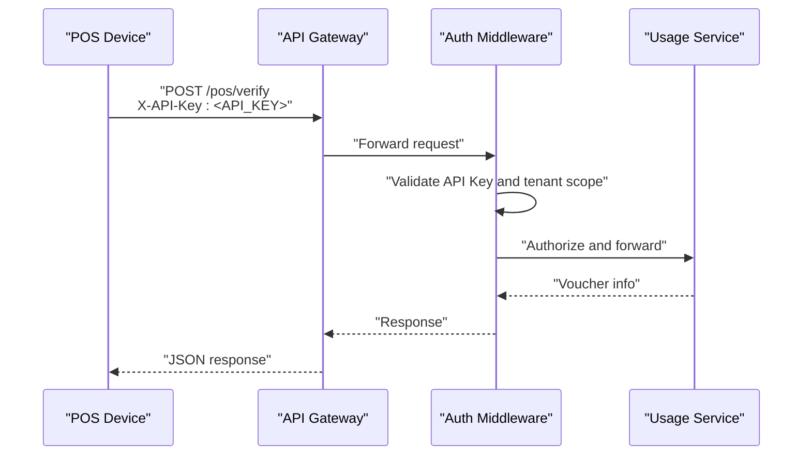
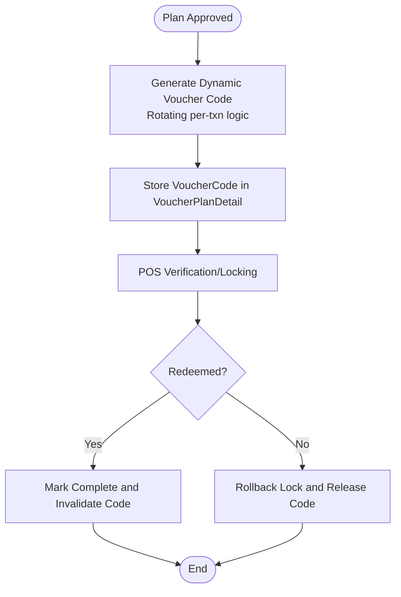
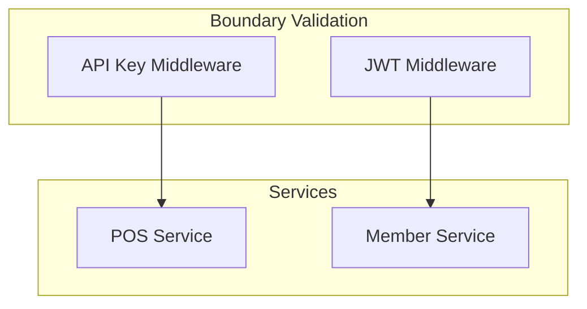
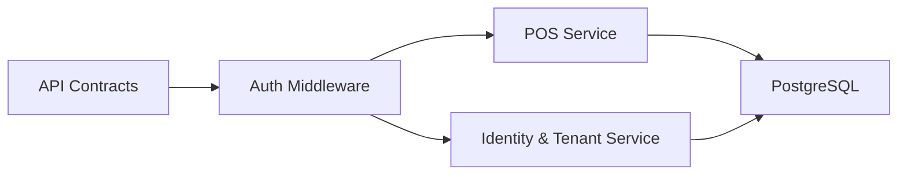

# Authentication Systems

<cite>
**Referenced Files in This Document**
- [api-contracts.md](file://docs/api-contracts.md)
- [architecture.md](file://docs/architecture.md)
- [data-models.md](file://docs/data-models.md)
- [index.md](file://docs/index.md)
- [source-tree-analysis.md](file://docs/source-tree-analysis.md)
- [epics.md](file://_bmad-output/planning-artifacts/epics.md)
- [implementation-readiness-report-2026-04-17.md](file://_bmad-output/planning-artifacts/implementation-readiness-report-2026-04-17.md)
- [ux-design-specification.md](file://_bmad-output/planning-artifacts/ux-design-specification.md)
- [config.yaml](file://_bmad/bmm/config.yaml)
- [config.yaml](file://_bmad/core/config.yaml)
</cite>

## Table of Contents
1. [Introduction](#introduction)
2. [Project Structure](#project-structure)
3. [Core Components](#core-components)
4. [Architecture Overview](#architecture-overview)
5. [Detailed Component Analysis](#detailed-component-analysis)
6. [Dependency Analysis](#dependency-analysis)
7. [Performance Considerations](#performance-considerations)
8. [Troubleshooting Guide](#troubleshooting-guide)
9. [Conclusion](#conclusion)
10. [Appendices](#appendices)

## Introduction
This document provides comprehensive authentication documentation for the NonCash platform, focusing on JWT token management and API key authentication systems. It explains how JWT tokens are generated and validated, how API keys are used for POS integration, and how both mechanisms work together across service boundaries. It also covers security considerations for token storage, transmission, and revocation, along with implementation examples and mitigation strategies for common authentication vulnerabilities.

## Project Structure
The NonCash platform follows a three-layer architecture with explicit security requirements. Authentication is enforced at the API boundary via middleware and documented in API contracts.

**Diagram sources**
- [source-tree-analysis.md:23-26](file://docs/source-tree-analysis.md#L23-L26)
- [architecture.md:17-26](file://docs/architecture.md#L17-L26)

**Section sources**
- [source-tree-analysis.md:7-34](file://docs/source-tree-analysis.md#L7-L34)
- [architecture.md:5-52](file://docs/architecture.md#L5-L52)
- [index.md:34-38](file://docs/index.md#L34-L38)

## Core Components
- JWT-based authentication for user-facing APIs (Member App).
- API Key-based authentication for POS system integration.
- Middleware enforcing authentication and authorization at the API boundary.
- Dynamic voucher code generation aligned with JWT-like principles to prevent reuse and fraud.

Key references:
- API contracts specify JWT usage for Member App endpoints and API Key usage for POS endpoints.
- Architecture documents emphasize JWT and API Key usage and dynamic security for vouchers.
- Planning artifacts confirm JWT for users and API Keys for POS, plus dynamic voucher code generation.

**Section sources**
- [api-contracts.md:5-96](file://docs/api-contracts.md#L5-L96)
- [architecture.md:25-40](file://docs/architecture.md#L25-L40)
- [epics.md:27,35,168](file://_bmad-output/planning-artifacts/epics.md#L27,L35,L168)

## Architecture Overview
The platform enforces dual authentication:
- JWT Bearer tokens for Member App and administrative access.
- API Key header for POS endpoints.

**Diagram sources**
- [api-contracts.md:5-96](file://docs/api-contracts.md#L5-L96)
- [architecture.md:25-40](file://docs/architecture.md#L25-L40)

**Section sources**
- [api-contracts.md:5-96](file://docs/api-contracts.md#L5-L96)
- [architecture.md:25-40](file://docs/architecture.md#L25-L40)

## Detailed Component Analysis

### JWT Token Management
JWT is used for user authentication and authorization in the Member App and related administrative flows. The platform’s architecture and API contracts define the usage of bearer tokens.

- Token issuance and validation occur at the API boundary via middleware.
- Authorization header format: Bearer <JWT>.
- Claims structure and expiration handling are implemented in the authentication middleware and services.

**Diagram sources**
- [api-contracts.md:94-96](file://docs/api-contracts.md#L94-L96)
- [architecture.md:25](file://docs/architecture.md#L25)

**Section sources**
- [api-contracts.md:94-96](file://docs/api-contracts.md#L94-L96)
- [architecture.md:25](file://docs/architecture.md#L25)

### API Key Authentication for POS Integration
POS systems authenticate using API Keys passed via a dedicated header. The API contracts define the endpoints and authentication requirements.

- Header: X-API-Key
- Endpoints: POS verification, locking, redemption, and rollback operations
- Multi-tenancy and range restrictions are enforced during key provisioning and validation.

**Diagram sources**
- [api-contracts.md:14-87](file://docs/api-contracts.md#L14-L87)
- [architecture.md:39-40](file://docs/architecture.md#L39-L40)

**Section sources**
- [api-contracts.md:5-87](file://docs/api-contracts.md#L5-L87)
- [architecture.md:39-40](file://docs/architecture.md#L39-L40)

### Dynamic Voucher Code Generation (JWT-like Principles)
Voucher codes leverage a rotating, dynamic code concept similar to JWT logic to prevent reuse and unauthorized scanning. This aligns with the platform’s security posture and is reflected in data models and planning artifacts.

- VoucherCode is stored as a dynamic/JWT-like code for usage.
- Planning artifacts describe dynamic voucher code generation and rotation.
- UX design references token-like countdown behavior to reinforce perceived security and freshness.

**Diagram sources**
- [data-models.md:34-43](file://docs/data-models.md#L34-L43)
- [epics.md:168](file://_bmad-output/planning-artifacts/epics.md#L168)
- [ux-design-specification.md:31,76,281](file://_bmad-output/planning-artifacts/ux-design-specification.md#L31,L76,L281)

**Section sources**
- [data-models.md:34-43](file://docs/data-models.md#L34-L43)
- [epics.md:27,35,168](file://_bmad-output/planning-artifacts/epics.md#L27,L35,L168)
- [ux-design-specification.md:31,76,281](file://_bmad-output/planning-artifacts/ux-design-specification.md#L31,L76,L281)

### Dual-Authentication Approach Across Service Boundaries
- Member App endpoints require JWT Bearer tokens.
- POS endpoints require API Key header.
- Middleware validates credentials and enforces tenant isolation and role-based access.
- Voucher lifecycle (verify, lock, redeem, rollback) is governed by POS service logic and database consistency.

**Diagram sources**
- [api-contracts.md:5-96](file://docs/api-contracts.md#L5-L96)
- [architecture.md:25-40](file://docs/architecture.md#L25-L40)

**Section sources**
- [api-contracts.md:5-96](file://docs/api-contracts.md#L5-L96)
- [architecture.md:25-40](file://docs/architecture.md#L25-L40)

## Dependency Analysis
Authentication depends on:
- Middleware for credential extraction and validation.
- Identity and tenant service for user context and RBAC.
- POS and usage services for voucher lifecycle operations.
- Data models for storing dynamic voucher codes and usage records.

**Diagram sources**
- [api-contracts.md:5-96](file://docs/api-contracts.md#L5-L96)
- [architecture.md:25-40](file://docs/architecture.md#L25-L40)

**Section sources**
- [api-contracts.md:5-96](file://docs/api-contracts.md#L5-L96)
- [architecture.md:25-40](file://docs/architecture.md#L25-L40)

## Performance Considerations
- Prefer short-lived JWT access tokens with refresh mechanisms to minimize long-running sessions.
- Cache validated API keys and tenant scopes at the gateway level to reduce repeated lookups.
- Use efficient cryptographic libraries for JWT signature verification and enforce symmetric/asymmetric key rotation policies.
- Apply rate limiting and circuit breakers around authentication endpoints to mitigate abuse.

[No sources needed since this section provides general guidance]

## Troubleshooting Guide
Common issues and mitigations:
- Invalid or expired JWT:
  - Validate issuer, audience, and expiration claims.
  - Implement token refresh flows and sliding expiration where appropriate.
- Invalid or revoked API Key:
  - Maintain key lifecycle tracking and enable immediate revocation.
  - Enforce key scope and tenant binding at validation time.
- Cross-service token misuse:
  - Enforce strict tenant isolation and role checks in middleware.
  - Log and audit all authentication attempts for forensic analysis.
- Voucher reuse or replay attacks:
  - Leverage dynamic voucher code logic and database constraints to prevent reuse.
  - Track lockID and transactionID to ensure atomic commit/rollback semantics.

**Section sources**
- [implementation-readiness-report-2026-04-17.md:50](file://_bmad-output/planning-artifacts/implementation-readiness-report-2026-04-17.md#L50)
- [epics.md:27,35,168](file://_bmad-output/planning-artifacts/epics.md#L27,L35,L168)

## Conclusion
NonCash employs a robust dual-authentication model: JWT for user-facing flows and API Keys for POS integration. The architecture enforces tenant isolation, dynamic security for vouchers, and middleware-based validation across services. By following the implementation examples and security recommendations outlined here, teams can build secure, maintainable authentication flows that scale with the platform.

[No sources needed since this section summarizes without analyzing specific files]

## Appendices

### Implementation Examples

- JWT Authentication Flow (Member App):
  - Use Authorization header with Bearer <JWT> for protected endpoints.
  - Validate token signature, issuer, audience, and expiration in middleware.
  - Resolve user identity and roles via Identity & Tenant Service.

- API Key Authentication Flow (POS Integration):
  - Send X-API-Key header with each POS endpoint request.
  - Validate key against provisioned ranges and tenant scope.
  - Enforce endpoint-specific permissions and transactional consistency.

- Voucher Lifecycle with Dynamic Codes:
  - Generate dynamic VoucherCode aligned with JWT-like rotation principles.
  - Track usage via lockID and transactionID to ensure atomicity.
  - Invalidate or release codes on successful redemption or rollback.

**Section sources**
- [api-contracts.md:5-96](file://docs/api-contracts.md#L5-L96)
- [data-models.md:34-43](file://docs/data-models.md#L34-L43)
- [epics.md:168](file://_bmad-output/planning-artifacts/epics.md#L168)

### Security Considerations
- Token Storage:
  - Never persist raw secrets; store hashed values for server-side validation.
  - Use secure, HTTP-only, and SameSite cookies for session tokens when applicable.
- Transmission:
  - Enforce TLS termination at the gateway and throughout the platform.
  - Avoid logging sensitive headers or payloads.
- Revocation:
  - Maintain blocklists for compromised JWTs and API keys.
  - Implement short token lifetimes and frequent rotation for high-risk operations.
- Vulnerabilities and Mitigations:
  - Replay attacks: Use nonce/timestamp validation and idempotency keys.
  - Token theft: Employ short-lived tokens, refresh tokens, and device binding.
  - Key exposure: Rotate keys regularly, limit scope, and revoke on compromise.

**Section sources**
- [implementation-readiness-report-2026-04-17.md:50](file://_bmad-output/planning-artifacts/implementation-readiness-report-2026-04-17.md#L50)
- [epics.md:27,35](file://_bmad-output/planning-artifacts/epics.md#L27,L35)