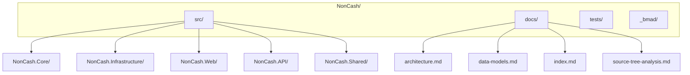
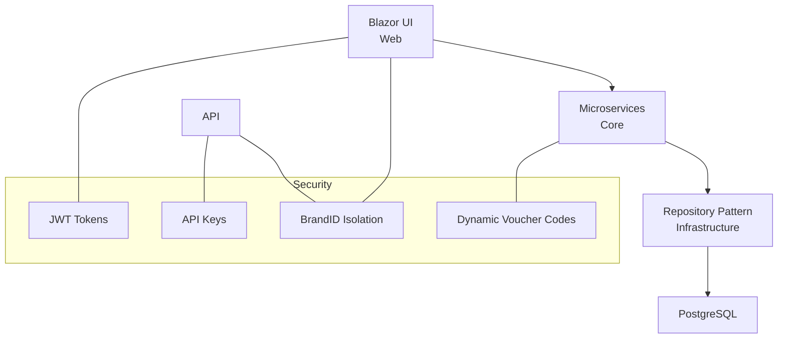
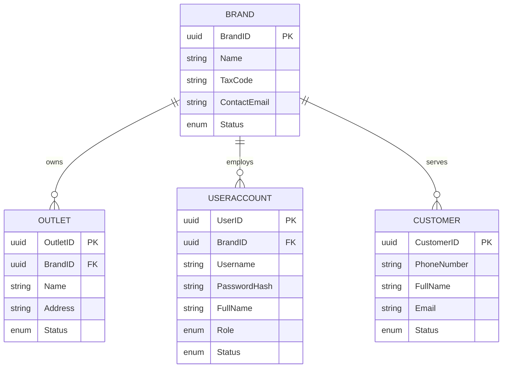
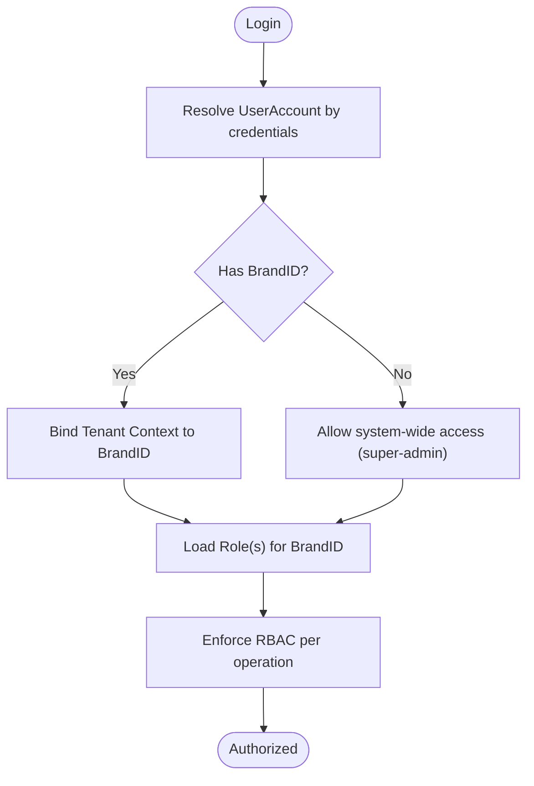
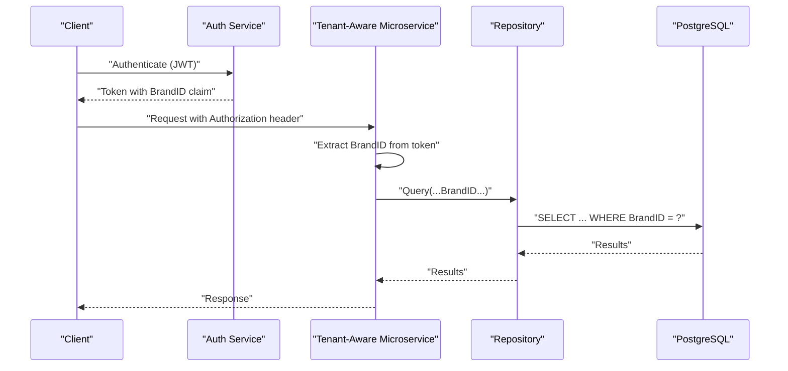
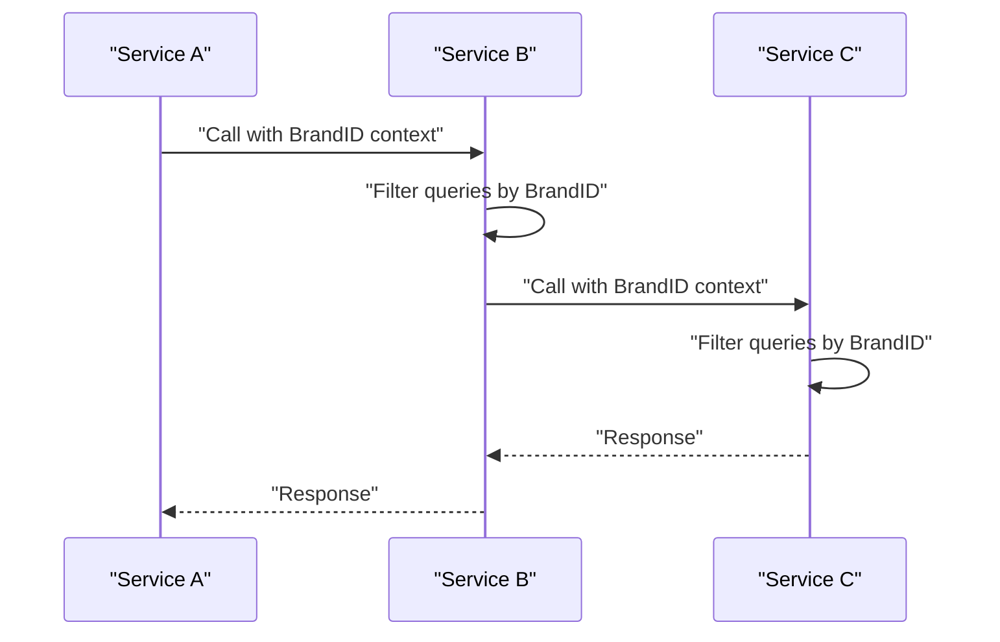
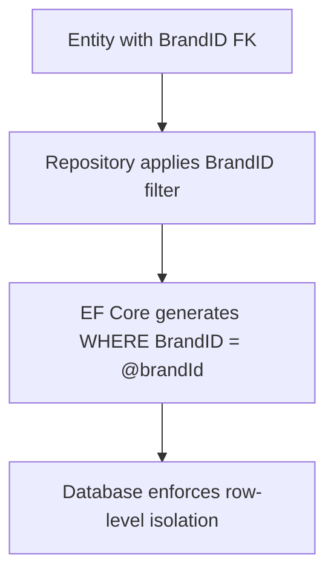
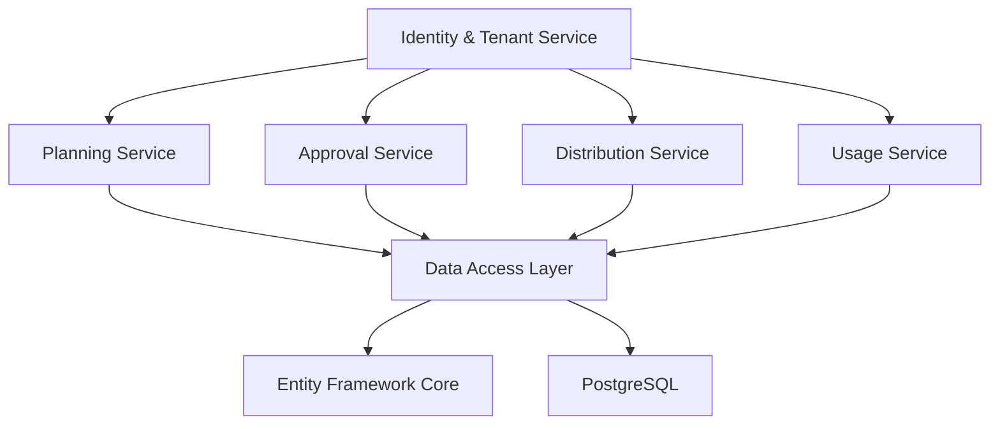

# Multi-Tenancy Architecture

<cite>
**Referenced Files in This Document**
- [architecture.md](file://docs/architecture.md)
- [data-models.md](file://docs/data-models.md)
- [index.md](file://docs/index.md)
- [Key Functionalities.txt](file://Key Functionalities.txt)
- [source-tree-analysis.md](file://docs/source-tree-analysis.md)
- [epics.md](file://_bmad-output/planning-artifacts/epics.md)
- [project-scan-report.json](file://docs/project-scan-report.json)
</cite>

## Table of Contents
1. [Introduction](#introduction)
2. [Project Structure](#project-structure)
3. [Core Components](#core-components)
4. [Architecture Overview](#architecture-overview)
5. [Detailed Component Analysis](#detailed-component-analysis)
6. [Dependency Analysis](#dependency-analysis)
7. [Performance Considerations](#performance-considerations)
8. [Troubleshooting Guide](#troubleshooting-guide)
9. [Conclusion](#conclusion)
10. [Appendices](#appendices)

## Introduction
This document explains the NonCash multi-tenancy architecture with a focus on BrandID-based tenant isolation and tenant security boundaries. It details how BrandID ensures complete separation between tenants using the SaaS platform, including data access controls, query filtering, and context propagation across microservices. It also documents tenant isolation for UserAccount, Outlet, and Customer entities, role-based access control (RBAC) within tenant boundaries, staff assignment to BrandID contexts, database-level security measures, query auditing, and mitigation strategies for potential bypass scenarios. Finally, it provides examples of tenant-aware service implementations and data access patterns.

## Project Structure
The NonCash project follows a 3-layer SaaS architecture with microservices. The target source tree organizes the backend into Core (business logic), Infrastructure (data access), Web (Blazor UI), API (POS integration), and Shared libraries. The documentation index links to architecture, data models, API contracts, and source tree analysis.

**Diagram sources**
- [source-tree-analysis.md:1-34](file://docs/source-tree-analysis.md#L1-L34)

**Section sources**
- [index.md:12-32](file://docs/index.md#L12-L32)
- [source-tree-analysis.md:1-34](file://docs/source-tree-analysis.md#L1-L34)

## Core Components
- Identity & Tenant Service: Centralized RBAC for UserAccount and multi-tenancy for Brand and Outlet, plus profile management for Customer.
- Planning Service: Manages voucher plan creation, budgeting, and targets.
- Approval Service: Handles routing and state management of plan reviews.
- Distribution Service: Manages voucher sales, batch promotions, and inbox delivery.
- Usage Service: Orchestrates POS redemption workflow (Lock -> Commit/Rollback).
- Data Access Layer (DAL): PostgreSQL with Entity Framework Core and Repository pattern.

These components collectively enforce BrandID-based tenant isolation and secure access to tenant-specific resources.

**Section sources**
- [architecture.md:17-26](file://docs/architecture.md#L17-L26)
- [architecture.md:28-52](file://docs/architecture.md#L28-L52)

## Architecture Overview
NonCash adopts a 3-layer SaaS architecture:
- Frontend (Blazor) interacts with the Business Logic Layer (microservices).
- Business Logic Layer (BLL) microservices encapsulate domain logic and coordinate with the Data Access Layer (DAL).
- DAL abstracts database operations using Entity Framework Core and repositories, targeting PostgreSQL.

Security is enforced through:
- Multi-tenancy using BrandID to isolate tenant data.
- JWT-based authentication for staff users.
- API Keys for POS systems, scoped to predefined ranges.
- Dynamic voucher codes to prevent reuse and unauthorized scanning.

**Diagram sources**
- [architecture.md:5-52](file://docs/architecture.md#L5-L52)

**Section sources**
- [architecture.md:5-52](file://docs/architecture.md#L5-L52)

## Detailed Component Analysis

### Tenant Isolation Mechanisms by Entity
- Brand (Tenant)
  - Represents businesses sharing the SaaS platform.
  - Primary key is BrandID; used as the tenant discriminator across all tenant-aware entities.
- Outlet (Point of Sale / Store)
  - Child of Brand; each Outlet belongs to a single BrandID.
  - Used to scope POS access and distribution permissions.
- UserAccount (Back-office Users)
  - Optional BrandID linkage for non-super-admin roles.
  - RBAC roles (Admin, Planner, Approver) apply within the assigned BrandID context.
- Customer (End-user / App Member)
  - Tenant-scoped records; used for ownership and distribution tracking.

**Diagram sources**
- [data-models.md:65-97](file://docs/data-models.md#L65-L97)

**Section sources**
- [data-models.md:65-97](file://docs/data-models.md#L65-L97)

### RBAC Within Tenant Boundaries
- Roles: Admin, Planner, Approver.
- Scope: Each role grants rights to specific business objects within a single BrandID.
- Staff assignment: UserAccount.BrandID binds staff to a tenant context; super-admin accounts may have null BrandID for system-wide access.

**Diagram sources**
- [data-models.md:81-89](file://docs/data-models.md#L81-L89)
- [epics.md:124-136](file://_bmad-output/planning-artifacts/epics.md#L124-L136)

**Section sources**
- [data-models.md:81-89](file://docs/data-models.md#L81-L89)
- [epics.md:124-136](file://_bmad-output/planning-artifacts/epics.md#L124-L136)

### Data Access Controls and Query Filtering
- Tenant-aware queries must filter by BrandID for all tenant entities (Brand, Outlet, UserAccount, Customer).
- Repository pattern enforces consistent filtering across the DAL.
- Microservices must propagate BrandID context from authentication to downstream services.

**Diagram sources**
- [architecture.md:36-40](file://docs/architecture.md#L36-L40)
- [data-models.md:65-97](file://docs/data-models.md#L65-L97)

**Section sources**
- [architecture.md:36-40](file://docs/architecture.md#L36-L40)
- [data-models.md:65-97](file://docs/data-models.md#L65-L97)

### Context Propagation Across Microservices
- JWT tokens carry BrandID claims; services extract and apply BrandID for all downstream operations.
- Inter-service communication should include tenant context to avoid accidental cross-tenant access.

**Diagram sources**
- [architecture.md:36-40](file://docs/architecture.md#L36-L40)

**Section sources**
- [architecture.md:36-40](file://docs/architecture.md#L36-L40)

### Database-Level Security Measures
- Column-level constraints: BrandID foreign keys on Outlet, UserAccount, and other tenant entities.
- Row-level filtering: All queries must include BrandID predicate.
- Transactions: DAL manages database consistency, especially for POS usage workflows.
- Schema migrations: Controlled evolution of tenant-aware schemas.

**Diagram sources**
- [data-models.md:73-89](file://docs/data-models.md#L73-L89)
- [architecture.md:28-35](file://docs/architecture.md#L28-L35)

**Section sources**
- [data-models.md:73-89](file://docs/data-models.md#L73-L89)
- [architecture.md:28-35](file://docs/architecture.md#L28-L35)

### Query Auditing and Compliance
- Audit trail: Log tenant-scoped operations with BrandID, actor (UserAccount.UserID), action, and timestamp.
- Compliance: Ensure audit logs are retained per regulatory requirements and are tamper-evident.

[No sources needed since this section provides general guidance]

### Potential Bypass Scenarios and Mitigations
- JWT tampering: Use signed tokens and validate signatures server-side; reject unsigned or malformed tokens.
- Missing BrandID filters: Enforce global repository filters and fail closed on missing predicates.
- Cross-tenant data leakage: Validate BrandID on every write and read; disallow wildcard queries.
- API Key misuse: Scope API Keys to specific ranges and rotate keys regularly; monitor usage anomalies.
- POS integration flaws: Authenticate POS via API Keys and enforce range restrictions; log all POS requests.

**Section sources**
- [architecture.md:36-40](file://docs/architecture.md#L36-L40)

### Examples of Tenant-Aware Service Implementations
- Identity & Tenant Service
  - Validates JWT claims, resolves UserAccount, enforces RBAC within BrandID.
  - Example path: [Identity & Tenant Service](file://docs/architecture.md#L25)
- Planning Service
  - Requires BrandID for creating VoucherPlanHeader; filters lists by BrandID.
  - Example path: [VoucherPlanHeader:11-32](file://docs/data-models.md#L11-L32)
- Distribution Service
  - Limits distribution to Outlets under the same BrandID; tracks distribution per BrandID.
  - Example path: [VoucherDistribution:55-61](file://docs/data-models.md#L55-L61)
- Usage Service
  - Enforces POS redemption within BrandID and Outlet scope; uses transactional commit/rollback.
  - Example path: [VoucherUsage:46-53](file://docs/data-models.md#L46-L53)
- Data Access Layer
  - Repository pattern enforces BrandID filtering; transactional consistency for POS.
  - Example path: [Repository Pattern:29-34](file://docs/architecture.md#L29-L34)

**Section sources**
- [architecture.md:17-26](file://docs/architecture.md#L17-L26)
- [data-models.md:11-61](file://docs/data-models.md#L11-L61)
- [data-models.md:46-53](file://docs/data-models.md#L46-L53)
- [architecture.md:28-35](file://docs/architecture.md#L28-L35)

## Dependency Analysis
The system’s microservices depend on shared identity and tenant enforcement, while DAL depends on EF Core and PostgreSQL. RBAC and BrandID filtering are cross-cutting concerns applied by services and repositories.

**Diagram sources**
- [architecture.md:17-26](file://docs/architecture.md#L17-L26)
- [architecture.md:28-35](file://docs/architecture.md#L28-L35)

**Section sources**
- [architecture.md:17-26](file://docs/architecture.md#L17-L26)
- [architecture.md:28-35](file://docs/architecture.md#L28-L35)

## Performance Considerations
- Indexing: Ensure BrandID is indexed on tenant entities to speed up filtering.
- Caching: Cache tenant metadata (e.g., Outlet lists) per BrandID with invalidation on changes.
- Pagination: Always filter by BrandID before paginating to avoid scanning irrelevant rows.
- Transactions: Keep POS transactions short-lived; minimize contention on voucher locks.

[No sources needed since this section provides general guidance]

## Troubleshooting Guide
- Authentication failures: Verify JWT signature and claims; confirm BrandID presence for non-super-admin users.
- Authorization errors: Confirm UserAccount.Role and BrandID binding; check RBAC mappings.
- Data access issues: Ensure all queries include BrandID filter; verify repository-level guards.
- POS integration problems: Validate API Key scope and ranges; review POS request logs.

**Section sources**
- [architecture.md:36-40](file://docs/architecture.md#L36-L40)
- [data-models.md:81-89](file://docs/data-models.md#L81-L89)

## Conclusion
NonCash implements robust multi-tenancy centered on BrandID to ensure strict tenant isolation across Brand, Outlet, UserAccount, and Customer entities. JWT-based authentication and RBAC enforce role-scoped access within BrandID boundaries, while the Repository pattern and transactional DAL provide database-level consistency. By propagating BrandID context across microservices, enforcing query filters, and implementing logging and auditing, the system minimizes the risk of cross-tenant data exposure and supports secure POS redemption workflows.

[No sources needed since this section summarizes without analyzing specific files]

## Appendices
- Project scan report indicates a conceptual backend monolith classification at initial scan stage; target architecture is microservices-driven per documentation.
- Source tree analysis outlines the recommended directory structure for Core, Infrastructure, Web, API, and Shared components.

**Section sources**
- [project-scan-report.json:14-23](file://docs/project-scan-report.json#L14-L23)
- [source-tree-analysis.md:1-34](file://docs/source-tree-analysis.md#L1-L34)