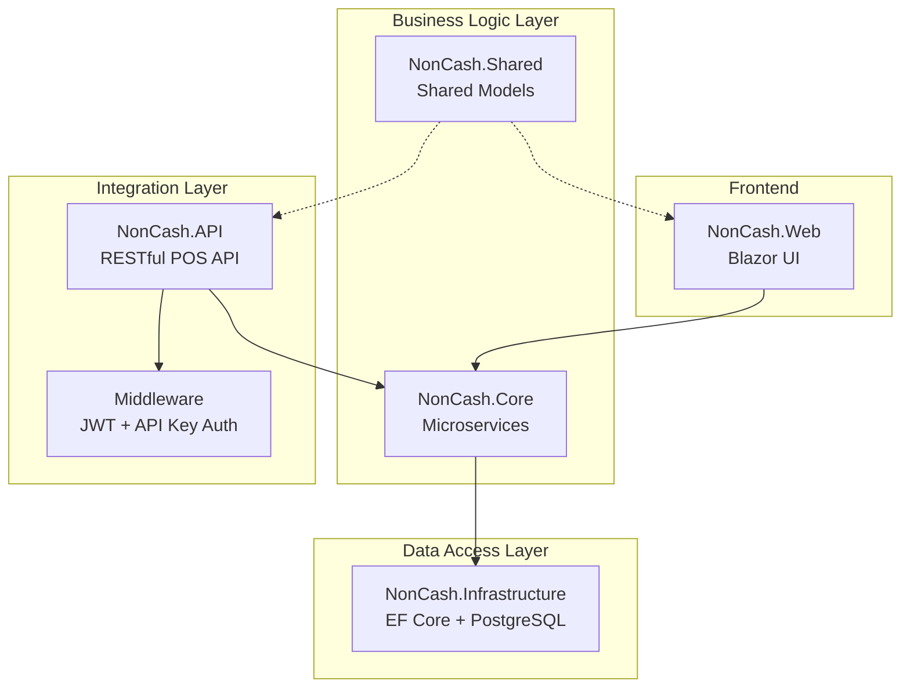
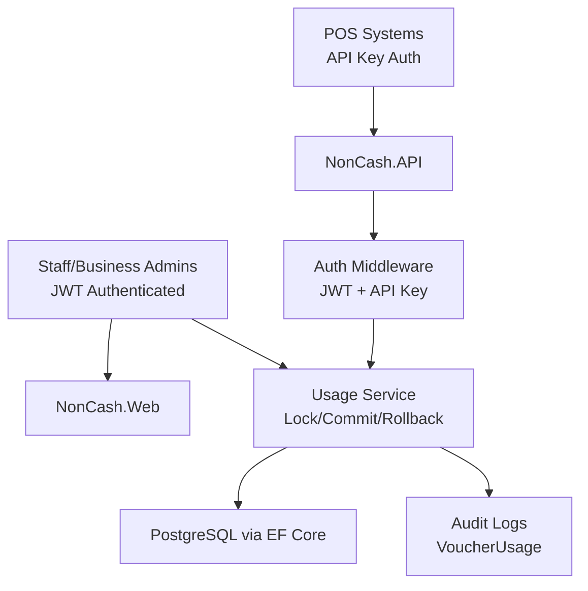
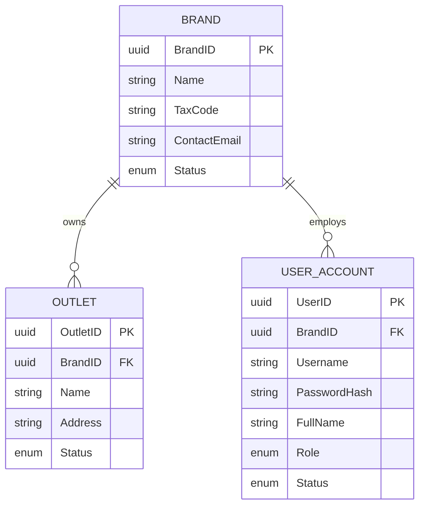
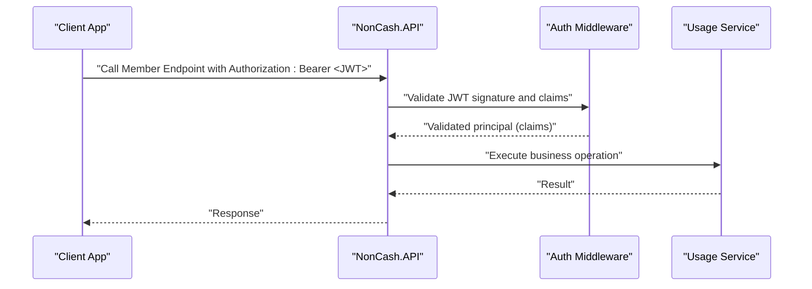
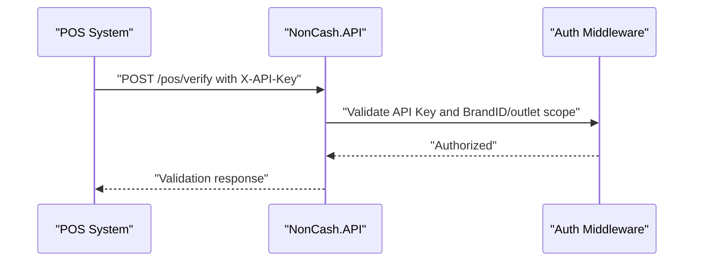
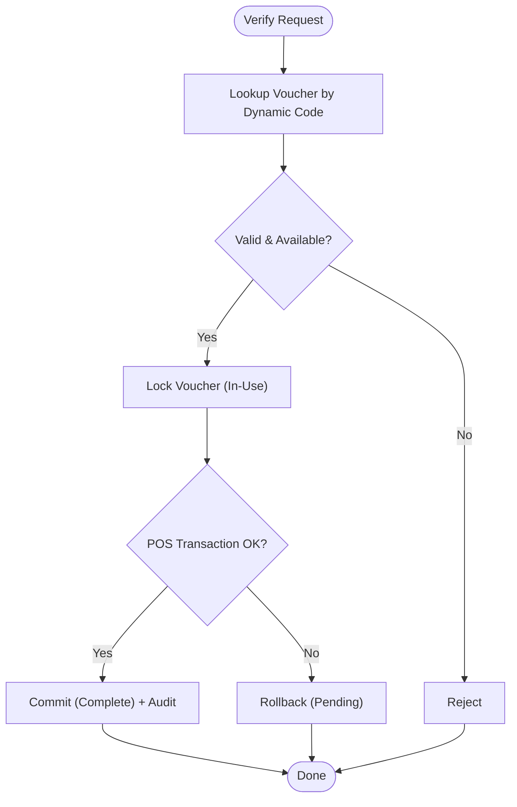
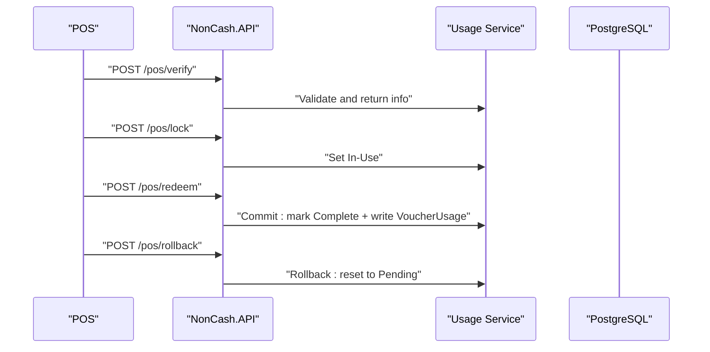
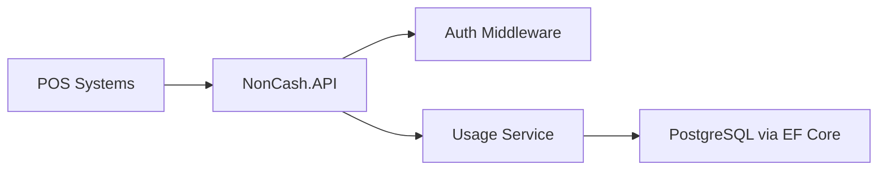

# Security Architecture

<cite>
**Referenced Files in This Document**
- [description.txt](file://description.txt)
- [architecture.md](file://docs/architecture.md)
- [api-contracts.md](file://docs/api-contracts.md)
- [data-models.md](file://docs/data-models.md)
- [index.md](file://docs/index.md)
- [Key Functionalities.txt](file://Key Functionalities.txt)
- [epics.md](file://_bmad-output/planning-artifacts/epics.md)
- [source-tree-analysis.md](file://docs/source-tree-analysis.md)
</cite>

## Table of Contents
1. [Introduction](#introduction)
2. [Project Structure](#project-structure)
3. [Core Components](#core-components)
4. [Architecture Overview](#architecture-overview)
5. [Detailed Component Analysis](#detailed-component-analysis)
6. [Dependency Analysis](#dependency-analysis)
7. [Performance Considerations](#performance-considerations)
8. [Troubleshooting Guide](#troubleshooting-guide)
9. [Conclusion](#conclusion)
10. [Appendices](#appendices)

## Introduction
This document presents the NonCash platform’s security architecture with a focus on multi-tenancy, authentication, and transaction security. It explains how JWT tokens and API keys protect system access, how dynamic voucher codes mitigate fraud, and how the POS redemption lifecycle enforces lock/commit/rollback integrity. It also documents role-based access control (RBAC) via BrandID isolation, audit trails, and compliance-relevant controls.

## Project Structure
The NonCash project follows a 3-layer SaaS architecture with clear separation of concerns:
- Frontend (Blazor): Management UI for staff and marketing users.
- Business Logic Layer (Microservices): Core services for planning, approval, distribution, usage, identity, and tenant management.
- Data Access Layer (PostgreSQL via Entity Framework): Persistent storage and transactional integrity for POS usage.

**Diagram sources**
- [source-tree-analysis.md:7-34](file://docs/source-tree-analysis.md#L7-L34)
- [architecture.md:9-35](file://docs/architecture.md#L9-L35)

**Section sources**
- [source-tree-analysis.md:7-34](file://docs/source-tree-analysis.md#L7-L34)
- [architecture.md:9-35](file://docs/architecture.md#L9-L35)

## Core Components
- Multi-tenancy with BrandID isolation: Ensures tenant boundaries across users, outlets, and data.
- JWT-based authentication for staff/back-office users.
- API Key authentication for POS systems.
- Dynamic voucher code generation to prevent reuse and unauthorized scanning.
- Transaction lifecycle for POS redemption: verify → lock → commit/rollback with audit logging.

**Section sources**
- [architecture.md:36-41](file://docs/architecture.md#L36-L41)
- [api-contracts.md:5-8](file://docs/api-contracts.md#L5-L8)
- [data-models.md:65-98](file://docs/data-models.md#L65-L98)
- [Key Functionalities.txt:25-68](file://Key Functionalities.txt#L25-L68)

## Architecture Overview
NonCash employs a layered SaaS design with microservices for modularity and scalability. Security is enforced at the integration boundary (POS API) via API Key and at the staff portal via JWT. Multi-tenancy is strictly enforced using BrandID across identities, outlets, and voucher plans.

**Diagram sources**
- [architecture.md:17-26](file://docs/architecture.md#L17-L26)
- [api-contracts.md:5-8](file://docs/api-contracts.md#L5-L8)
- [data-models.md:46-62](file://docs/data-models.md#L46-L62)

**Section sources**
- [architecture.md:36-41](file://docs/architecture.md#L36-L41)
- [api-contracts.md:5-8](file://docs/api-contracts.md#L5-L8)

## Detailed Component Analysis

### Multi-Tenancy and RBAC with BrandID
- Tenant isolation: All entities (UserAccount, Outlet, VoucherPlanHeader) reference BrandID to ensure data segregation.
- Staff RBAC: UserAccount roles (Admin, Planner, Approver) define functional permissions within a BrandID scope.
- Super-admin capability: UserAccount BrandID may be null for system-wide administrative tasks.

**Diagram sources**
- [data-models.md:65-90](file://docs/data-models.md#L65-L90)

**Section sources**
- [data-models.md:65-90](file://docs/data-models.md#L65-L90)
- [epics.md:124-138](file://_bmad-output/planning-artifacts/epics.md#L124-L138)

### JWT Token Management (Generation, Validation, Refresh)
- Authentication surface: JWT bearer tokens are required for member app endpoints and staff portal access.
- Token lifecycle: JWTs enable session-based access for staff/back-office users; refresh strategy is implied by typical JWT patterns (not detailed here).
- Scope enforcement: Tokens carry claims aligned with RBAC roles and BrandID to restrict access to tenant data.

**Diagram sources**
- [api-contracts.md:93-108](file://docs/api-contracts.md#L93-L108)
- [architecture.md:24-26](file://docs/architecture.md#L24-L26)

**Section sources**
- [api-contracts.md:93-108](file://docs/api-contracts.md#L93-L108)
- [architecture.md:24-26](file://docs/architecture.md#L24-L26)

### API Key Authentication for POS Integration
- Authentication method: X-API-Key header for POS systems.
- Scope binding: POS systems are restricted to specific outlet ranges defined during planning; API Key ties to a BrandID and configured outlet set.
- Endpoint protection: All POS endpoints require API Key plus JWT for staff-facing endpoints.

**Diagram sources**
- [api-contracts.md:14-34](file://docs/api-contracts.md#L14-L34)
- [architecture.md:38-40](file://docs/architecture.md#L38-L40)

**Section sources**
- [api-contracts.md:5-8](file://docs/api-contracts.md#L5-L8)
- [architecture.md:38-40](file://docs/architecture.md#L38-L40)

### Dynamic Voucher Code Generation and Fraud Prevention
- Dynamic code concept: VoucherCode is a rotating, JWT-like value used at POS to prevent reuse and unauthorized scanning.
- Operational constraints: POS verify does not alter state; lock transitions to In-Use; commit completes usage; rollback reverts to Pending.

**Diagram sources**
- [Key Functionalities.txt:56-68](file://Key Functionalities.txt#L56-L68)
- [epics.md:278-317](file://_bmad-output/planning-artifacts/epics.md#L278-L317)

**Section sources**
- [Key Functionalities.txt:56-68](file://Key Functionalities.txt#L56-L68)
- [epics.md:278-317](file://_bmad-output/planning-artifacts/epics.md#L278-L317)

### Transaction Security Model: Lock/Commit/Rollback and Audit Trail
- Integrity model: POS verify does not change state; lock sets In-Use; commit writes VoucherUsage and marks Complete; rollback releases lock without audit.
- Audit trail: VoucherUsage records POSID, TransactionID, AmountUsed, and UsageDate for every successful redemption.
- Data consistency: DAL manages transactions to ensure atomicity for POS operations.

**Diagram sources**
- [api-contracts.md:14-87](file://docs/api-contracts.md#L14-L87)
- [data-models.md:46-54](file://docs/data-models.md#L46-L54)
- [architecture.md:34-35](file://docs/architecture.md#L34-L35)

**Section sources**
- [api-contracts.md:14-87](file://docs/api-contracts.md#L14-L87)
- [data-models.md:46-54](file://docs/data-models.md#L46-L54)
- [architecture.md:34-35](file://docs/architecture.md#L34-L35)

### API Security Considerations by Endpoint
- POS Verify: Requires API Key; returns validity without altering state.
- POS Lock: Requires API Key; transitions to In-Use; binds to outlet and transaction context.
- POS Redeem: Requires API Key; commits usage and writes audit record.
- POS Rollback: Requires API Key; reverts lock to Pending.
- Member App List My Vouchers: Requires JWT Bearer token.
- Member App Transfer Voucher: Requires JWT Bearer token; two-party confirmation pattern.

**Section sources**
- [api-contracts.md:14-108](file://docs/api-contracts.md#L14-L108)
- [index.md:34-38](file://docs/index.md#L34-L38)

### Data Encryption and Privacy Controls
- Transport security: Enforce TLS for all endpoints.
- Secrets management: Store API Keys and JWT signing keys securely; rotate periodically.
- Data-at-rest: Encrypt sensitive fields per local regulations; align with PCI/DSS where applicable.
- Logging hygiene: Redact sensitive data in logs; avoid storing raw dynamic codes.

[No sources needed since this section provides general guidance]

### Compliance Considerations
- Access control: RBAC with BrandID scope and role definitions.
- Auditability: VoucherUsage captures POSID, TransactionID, AmountUsed, and timestamps.
- Data minimization: Collect only necessary personal data; honor deletion requests.
- Regulatory alignment: Align encryption, retention, and reporting with regional standards.

[No sources needed since this section provides general guidance]

## Dependency Analysis
The POS API depends on middleware for authentication and on microservices for business logic, which in turn depend on the data access layer for transactional consistency.

**Diagram sources**
- [source-tree-analysis.md:23-26](file://docs/source-tree-analysis.md#L23-L26)
- [architecture.md:24-35](file://docs/architecture.md#L24-L35)

**Section sources**
- [source-tree-analysis.md:23-26](file://docs/source-tree-analysis.md#L23-L26)
- [architecture.md:24-35](file://docs/architecture.md#L24-L35)

## Performance Considerations
- Database transactions: Use short-lived transactions for lock/commit to minimize contention.
- Caching: Cache outlet and brand metadata for POS verify to reduce latency.
- Idempotency: Design redeem/rollback endpoints idempotent to handle retries safely.
- Monitoring: Track POS latency and failure rates; alert on anomalies.

[No sources needed since this section provides general guidance]

## Troubleshooting Guide
Common issues and mitigations:
- Voucher appears valid but cannot be locked: Verify API Key scope and outlet range; confirm the voucher is Pending.
- Redeem fails after lock: Ensure POS sends transaction identifiers; check rollback path for failed transactions.
- Audit gaps: Confirm commit path executes and VoucherUsage is written; verify database transaction boundaries.
- RBAC access denied: Validate JWT claims and BrandID scope; ensure role permits requested action.

**Section sources**
- [api-contracts.md:14-87](file://docs/api-contracts.md#L14-L87)
- [data-models.md:46-54](file://docs/data-models.md#L46-L54)
- [epics.md:278-317](file://_bmad-output/planning-artifacts/epics.md#L278-L317)

## Conclusion
NonCash’s security model combines multi-tenancy with BrandID, strict RBAC, JWT for staff, API Keys for POS, and a robust transaction lifecycle with auditability. Dynamic voucher codes and transactional integrity further strengthen anti-fraud controls. Adhering to the guidelines and best practices outlined here will help maintain a secure, compliant, and trustworthy platform.

[No sources needed since this section summarizes without analyzing specific files]

## Appendices

### Security Best Practices for Developers and Administrators
- Develop: Enforce tenant scoping on all queries; validate API Key against BrandID and outlet ranges; implement idempotent POS endpoints; log audit events with sufficient context.
- Operate: Rotate secrets regularly; monitor for suspicious patterns; enforce least privilege; apply defense-in-depth (network policies, WAF, rate limiting).
- Comply: Maintain audit logs; implement data retention and deletion policies; ensure encryption and secure transport; train users on phishing and credential hygiene.

[No sources needed since this section provides general guidance]