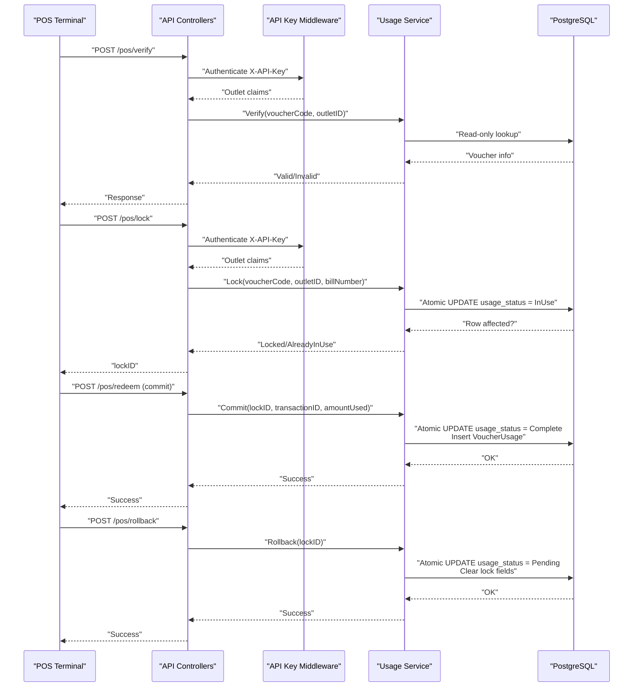
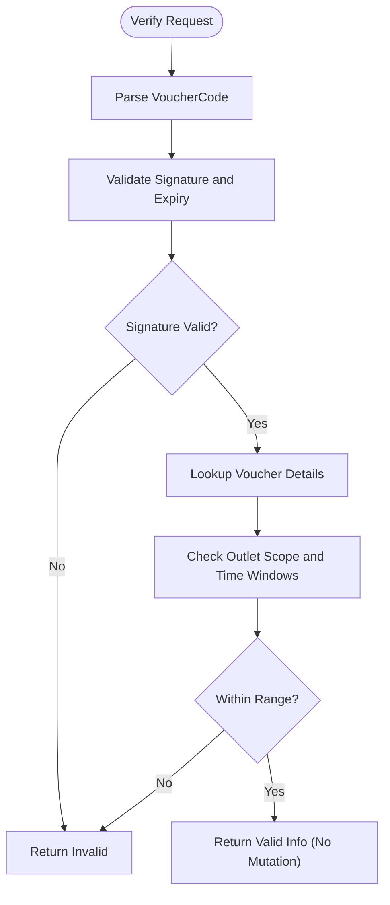
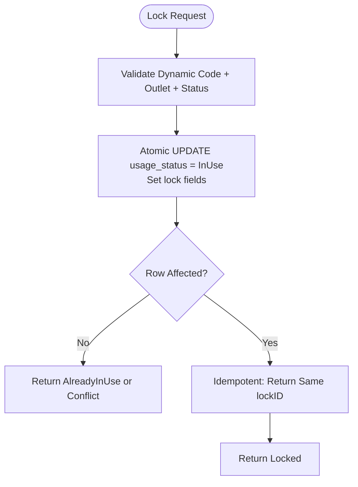
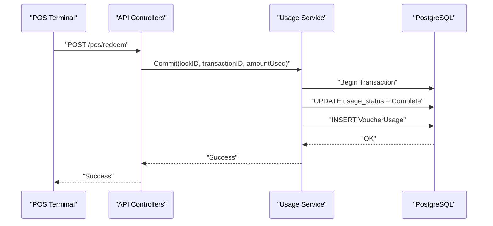
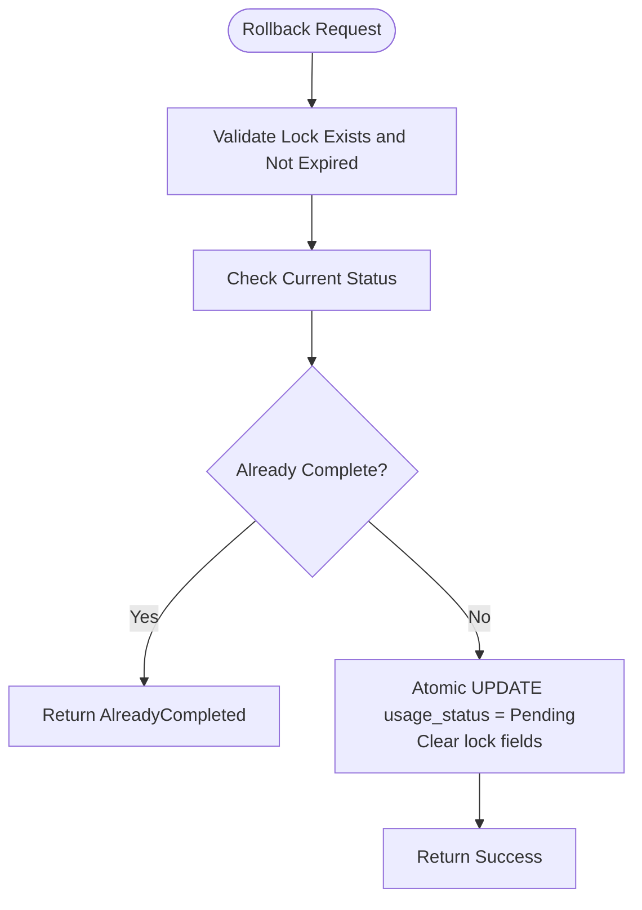
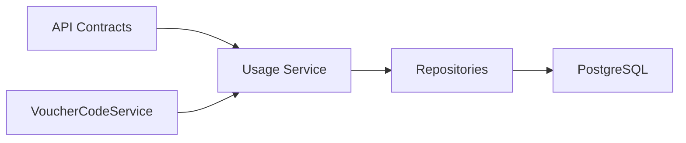

# Transaction Security Model

<cite>
**Referenced Files in This Document**
- [api-contracts.md](file://docs/api-contracts.md)
- [data-models.md](file://docs/data-models.md)
- [architecture.md](file://docs/architecture.md)
- [Key Functionalities.txt](file://Key Functionalities.txt)
- [4-1-check-for-information.md](file://_bmad-output/implementation-artifacts/4-1-check-for-information.md)
- [4-2-prepare-and-lock.md](file://_bmad-output/implementation-artifacts/4-2-prepare-and-lock.md)
- [4-3-commit-and-log.md](file://_bmad-output/implementation-artifacts/4-3-commit-and-log.md)
- [4-4-rollback-mechanism.md](file://_bmad-output/implementation-artifacts/4-4-rollback-mechanism.md)
</cite>

## Table of Contents
1. [Introduction](#introduction)
2. [Project Structure](#project-structure)
3. [Core Components](#core-components)
4. [Architecture Overview](#architecture-overview)
5. [Detailed Component Analysis](#detailed-component-analysis)
6. [Dependency Analysis](#dependency-analysis)
7. [Performance Considerations](#performance-considerations)
8. [Troubleshooting Guide](#troubleshooting-guide)
9. [Conclusion](#conclusion)
10. [Appendices](#appendices)

## Introduction
This document specifies the transaction security model for the NonCash POS redemption workflow. It focuses on the lock/commit/rollback security model, the dynamic voucher code generation mechanism that prevents reuse and unauthorized scanning, and the three-phase transaction lifecycle. It also documents audit trail implementation, fraud detection mechanisms, reconciliation procedures, and security considerations for timeouts, race conditions, and concurrent access scenarios.

## Project Structure
The NonCash platform follows a 3-layer SaaS architecture with a Business Logic Layer (BLL) orchestrating POS redemption workflows. The POS integration endpoints are defined in the API contracts and implemented in the API layer, with the Usage Service coordinating lock, commit, and rollback operations backed by the Data Access Layer (DAL) and PostgreSQL.

```mermaid
graph TB
subgraph "POS"
POS["POS Terminal"]
end
subgraph "API Layer"
API["API Controllers"]
MW["API Key Middleware"]
end
subgraph "BLL"
SVC["Usage Service (IPosService)"]
CODE["VoucherCodeService"]
end
subgraph "DAL"
DB["PostgreSQL"]
REPO["Repositories"]
end
POS --> API
API --> MW
MW --> SVC
SVC --> REPO
REPO --> DB
SVC --> CODE
```

**Diagram sources**
- [architecture.md:36-52](file://docs/architecture.md#L36-L52)
- [api-contracts.md:10-88](file://docs/api-contracts.md#L10-L88)

**Section sources**
- [architecture.md:17-52](file://docs/architecture.md#L17-L52)
- [api-contracts.md:10-88](file://docs/api-contracts.md#L10-L88)

## Core Components
- POS Integration API: Defines verify, lock, redeem (commit), and rollback endpoints with API Key authentication.
- Usage Service: Orchestrates POS redemption transactions (lock, commit, rollback) with strict atomicity and idempotency guarantees.
- Dynamic Voucher Code Service: Generates short-lived, signed tokens preventing reuse and unauthorized scanning.
- Data Models: VoucherPlanDetail (with UsageStatus and lock fields), VoucherUsage (audit/log), and supporting entities.

**Section sources**
- [api-contracts.md:14-88](file://docs/api-contracts.md#L14-L88)
- [data-models.md:34-53](file://docs/data-models.md#L34-L53)
- [4-2-prepare-and-lock.md:78-82](file://_bmad-output/implementation-artifacts/4-2-prepare-and-lock.md#L78-L82)
- [4-3-commit-and-log.md:79-83](file://_bmad-output/implementation-artifacts/4-3-commit-and-log.md#L79-L83)
- [4-4-rollback-mechanism.md:77-79](file://_bmad-output/implementation-artifacts/4-4-rollback-mechanism.md#L77-L79)

## Architecture Overview
The POS redemption workflow is a three-phase transaction:
- Phase 1: Verify (non-mutating read)
- Phase 2: Lock (prevents double spending)
- Phase 3: Commit (finalizes successful redemption) or Rollback (releases lock and resets status)



**Diagram sources**
- [api-contracts.md:14-88](file://docs/api-contracts.md#L14-L88)
- [4-1-check-for-information.md:13-42](file://_bmad-output/implementation-artifacts/4-1-check-for-information.md#L13-L42)
- [4-2-prepare-and-lock.md:13-38](file://_bmad-output/implementation-artifacts/4-2-prepare-and-lock.md#L13-L38)
- [4-3-commit-and-log.md:13-31](file://_bmad-output/implementation-artifacts/4-3-commit-and-log.md#L13-L31)
- [4-4-rollback-mechanism.md:13-20](file://_bmad-output/implementation-artifacts/4-4-rollback-mechanism.md#L13-L20)

## Detailed Component Analysis

### Dynamic Voucher Code Generation and Validation
- Purpose: Prevent reuse and unauthorized scanning by generating short-lived, signed tokens similar to JWT.
- Approach:
  - Payload includes the voucher detail identifier and timestamps (issued-at/expiry).
  - Signed with a shared secret per voucher detail (or platform secret plus salt).
  - POS verify endpoint validates signature and expiry without mutating state.
  - Member App fetches the current code on demand rather than caching static values.
- Security:
  - Short expiry (minutes) ensures captured screenshots become invalid quickly.
  - Secrets are stored securely; never returned in API responses.
  - Concurrent generation uses database-level uniqueness constraints to avoid race conditions.



**Diagram sources**
- [4-1-check-for-information.md:13-42](file://_bmad-output/implementation-artifacts/4-1-check-for-information.md#L13-L42)
- [2-2-generate-plan-details.md:36-114](file://_bmad-output/implementation-artifacts/2-2-generate-plan-details.md#L36-L114)

**Section sources**
- [2-2-generate-plan-details.md:36-114](file://_bmad-output/implementation-artifacts/2-2-generate-plan-details.md#L36-L114)
- [4-1-check-for-information.md:13-42](file://_bmad-output/implementation-artifacts/4-1-check-for-information.md#L13-L42)
- [Key Functionalities.txt:56-62](file://Key Functionalities.txt#L56-L62)

### Lock Phase (Prevent Double Spending)
- Purpose: Atomically transition a voucher from Pending to InUse and associate a transient lock identity.
- Implementation:
  - API endpoint accepts voucher code, outlet ID, and bill number.
  - Validates dynamic code, outlet scope, time, and status.
  - Atomic UPDATE with WHERE clause to ensure only one locker succeeds.
  - Generates a lock identifier (GUID) stored on the voucher detail record.
  - Supports idempotency by returning the same lockID for duplicate requests.
  - Optional expiry (e.g., 10 minutes) releases the lock automatically.
- Concurrency and Safety:
  - Database-level atomicity prevents race conditions.
  - LockID acts as a distributed transaction token for commit/rollback.



**Diagram sources**
- [4-2-prepare-and-lock.md:13-38](file://_bmad-output/implementation-artifacts/4-2-prepare-and-lock.md#L13-L38)
- [4-2-prepare-and-lock.md:78-82](file://_bmad-output/implementation-artifacts/4-2-prepare-and-lock.md#L78-L82)

**Section sources**
- [4-2-prepare-and-lock.md:13-38](file://_bmad-output/implementation-artifacts/4-2-prepare-and-lock.md#L13-L38)
- [4-2-prepare-and-lock.md:91-95](file://_bmad-output/implementation-artifacts/4-2-prepare-and-lock.md#L91-L95)
- [Key Functionalities.txt:61-62](file://Key Functionalities.txt#L61-L62)

### Commit Phase (Finalize Successful Redemption)
- Purpose: Permanently mark the voucher as used and record the transaction.
- Implementation:
  - Validates lock existence, match to the voucher, and non-expiry.
  - Atomic transaction updates the voucher detail and inserts a VoucherUsage record.
  - Clears the lock fields to invalidate further commits.
  - Idempotency: Duplicate commit requests are handled safely without duplicate logs.
- Audit and Integrity:
  - VoucherUsage captures POS ID, transaction ID, usage date, and amount used.
  - Unique index on transaction ID prevents duplicate logging.



**Diagram sources**
- [4-3-commit-and-log.md:13-31](file://_bmad-output/implementation-artifacts/4-3-commit-and-log.md#L13-L31)
- [4-3-commit-and-log.md:79-83](file://_bmad-output/implementation-artifacts/4-3-commit-and-log.md#L79-L83)

**Section sources**
- [4-3-commit-and-log.md:13-31](file://_bmad-output/implementation-artifacts/4-3-commit-and-log.md#L13-L31)
- [4-3-commit-and-log.md:92-96](file://_bmad-output/implementation-artifacts/4-3-commit-and-log.md#L92-L96)
- [data-models.md:46-53](file://docs/data-models.md#L46-L53)

### Rollback Phase (Reverse Failed Transactions)
- Purpose: Release a lock and reset the voucher to Pending when a transaction fails or is canceled.
- Implementation:
  - Validates lock existence and non-expiry.
  - Atomic UPDATE resets status and clears lock fields.
  - Rejects rollback attempts on already-complete vouchers.
  - Gracefully handles expired locks (already Pending).
  - Idempotent: duplicate rollback requests are safe.
- Audit Trail:
  - Optional audit log entry for traceability (MVP allows rollback without audit log).



**Diagram sources**
- [4-4-rollback-mechanism.md:13-20](file://_bmad-output/implementation-artifacts/4-4-rollback-mechanism.md#L13-L20)
- [4-4-rollback-mechanism.md:77-79](file://_bmad-output/implementation-artifacts/4-4-rollback-mechanism.md#L77-L79)

**Section sources**
- [4-4-rollback-mechanism.md:13-20](file://_bmad-output/implementation-artifacts/4-4-rollback-mechanism.md#L13-L20)
- [4-4-rollback-mechanism.md:89-92](file://_bmad-output/implementation-artifacts/4-4-rollback-mechanism.md#L89-L92)

### Audit Trail and Fraud Detection
- VoucherUsage Records:
  - Capture POS ID, transaction ID, usage date, and amount used.
  - Unique index on transaction ID prevents duplicate logging.
- Optional Audit Logs:
  - Rollback operations may optionally create audit entries for traceability.
- Fraud Detection Mechanisms:
  - Dynamic voucher codes with short expiry reduce replay risk.
  - API Key authentication restricts POS access to authorized outlets.
  - Lock expiry prevents indefinite holds.
  - Idempotency guards protect against duplicate commits/rollbacks.
- Reconciliation Procedures:
  - Daily reconciliation compares VoucherUsage totals with POS transaction logs.
  - Discrepancies trigger investigation and remediation.

**Section sources**
- [4-3-commit-and-log.md:79-83](file://_bmad-output/implementation-artifacts/4-3-commit-and-log.md#L79-L83)
- [4-4-rollback-mechanism.md:39-43](file://_bmad-output/implementation-artifacts/4-4-rollback-mechanism.md#L39-L43)
- [data-models.md:46-53](file://docs/data-models.md#L46-L53)

## Dependency Analysis
The POS redemption workflow depends on:
- API contracts for endpoint definitions and authentication.
- Usage Service orchestrating lock/commit/rollback with strict atomicity.
- Dynamic Voucher Code Service for secure, time-bound codes.
- Data models and repositories for persistence and integrity.



**Diagram sources**
- [api-contracts.md:14-88](file://docs/api-contracts.md#L14-L88)
- [2-2-generate-plan-details.md:49-52](file://_bmad-output/implementation-artifacts/2-2-generate-plan-details.md#L49-L52)
- [4-2-prepare-and-lock.md:70-77](file://_bmad-output/implementation-artifacts/4-2-prepare-and-lock.md#L70-L77)
- [4-3-commit-and-log.md:70-77](file://_bmad-output/implementation-artifacts/4-3-commit-and-log.md#L70-L77)
- [4-4-rollback-mechanism.md:70-75](file://_bmad-output/implementation-artifacts/4-4-rollback-mechanism.md#L70-L75)

**Section sources**
- [api-contracts.md:14-88](file://docs/api-contracts.md#L14-L88)
- [2-2-generate-plan-details.md:49-52](file://_bmad-output/implementation-artifacts/2-2-generate-plan-details.md#L49-L52)
- [4-2-prepare-and-lock.md:70-77](file://_bmad-output/implementation-artifacts/4-2-prepare-and-lock.md#L70-L77)
- [4-3-commit-and-log.md:70-77](file://_bmad-output/implementation-artifacts/4-3-commit-and-log.md#L70-L77)
- [4-4-rollback-mechanism.md:70-75](file://_bmad-output/implementation-artifacts/4-4-rollback-mechanism.md#L70-L75)

## Performance Considerations
- Database-Level Atomicity: Use conditional UPDATE statements with WHERE clauses to minimize contention and ensure correctness.
- Idempotency: Design commit and rollback handlers to tolerate retries without side effects.
- Lock Expiry: Implement periodic cleanup to release stale locks and prevent resource starvation.
- Indexing: Ensure unique indexes on transaction ID and serial numbers to optimize lookups and enforce uniqueness.
- Concurrency Testing: Validate behavior under high load with parallel lock attempts and duplicate requests.

[No sources needed since this section provides general guidance]

## Troubleshooting Guide
Common issues and resolutions:
- Lock AlreadyInUse: Another terminal acquired the lock first; instruct POS to retry after verifying status.
- LockExpired: Lock was auto-released; POS must re-verify and re-lock before committing.
- AlreadyCompleted: Attempted rollback on a completed voucher; no changes are made.
- Duplicate Commit/Rollback: Idempotent handlers return success without duplicating records.
- Transaction Failure During Commit: Atomic rollback prevents partial state changes; investigate DB errors and retry.

**Section sources**
- [4-2-prepare-and-lock.md:28-32](file://_bmad-output/implementation-artifacts/4-2-prepare-and-lock.md#L28-L32)
- [4-3-commit-and-log.md:32-36](file://_bmad-output/implementation-artifacts/4-3-commit-and-log.md#L32-L36)
- [4-4-rollback-mechanism.md:21-25](file://_bmad-output/implementation-artifacts/4-4-rollback-mechanism.md#L21-L25)
- [4-3-commit-and-log.md:97-99](file://_bmad-output/implementation-artifacts/4-3-commit-and-log.md#L97-L99)

## Conclusion
The NonCash POS redemption workflow employs a robust lock/commit/rollback security model with dynamic voucher code generation to prevent reuse and unauthorized scanning. Strict atomicity, idempotency, and concurrency controls ensure transaction integrity. The VoucherUsage audit trail and optional rollback logs support fraud detection and reconciliation. Adhering to the outlined security practices and testing standards will maintain system reliability and trustworthiness.

[No sources needed since this section summarizes without analyzing specific files]

## Appendices

### API Endpoint Definitions
- Verify: Validates dynamic code and returns voucher info without mutation.
- Lock: Atomically locks a voucher and returns a lock identifier.
- Redeem (Commit): Finalizes redemption within an atomic transaction.
- Rollback: Releases a lock and resets status.

**Section sources**
- [api-contracts.md:14-88](file://docs/api-contracts.md#L14-L88)

### Data Model Highlights
- VoucherPlanDetail: Holds UsageStatus, lock fields, and metadata.
- VoucherUsage: Captures POS transaction details for audit and reconciliation.

**Section sources**
- [data-models.md:34-53](file://docs/data-models.md#L34-L53)