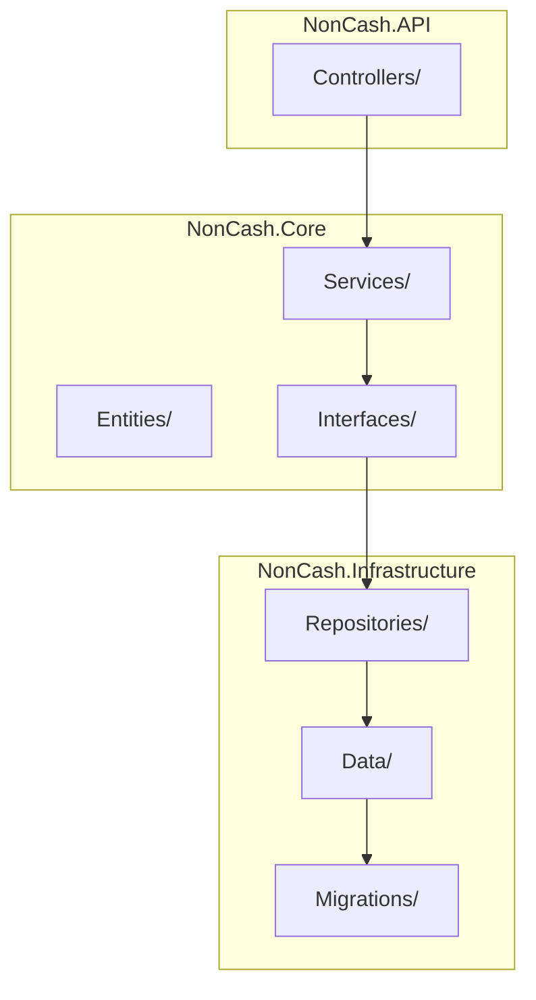
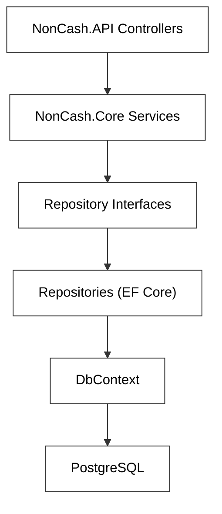
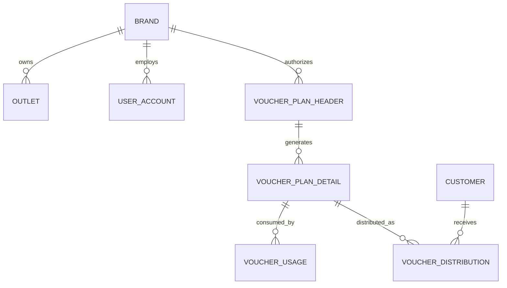
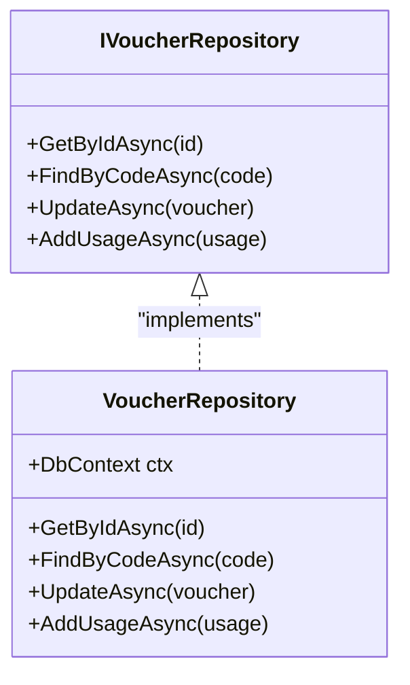
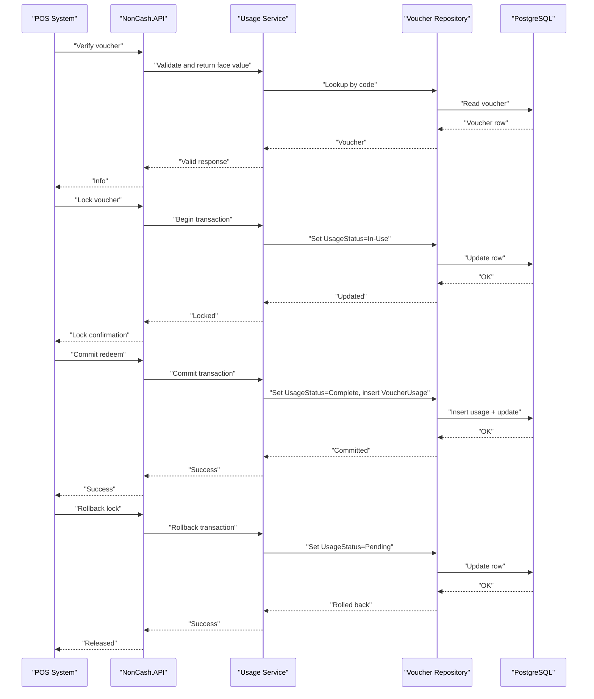
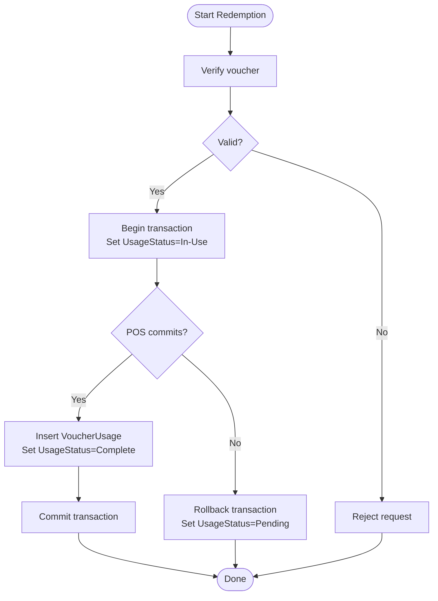
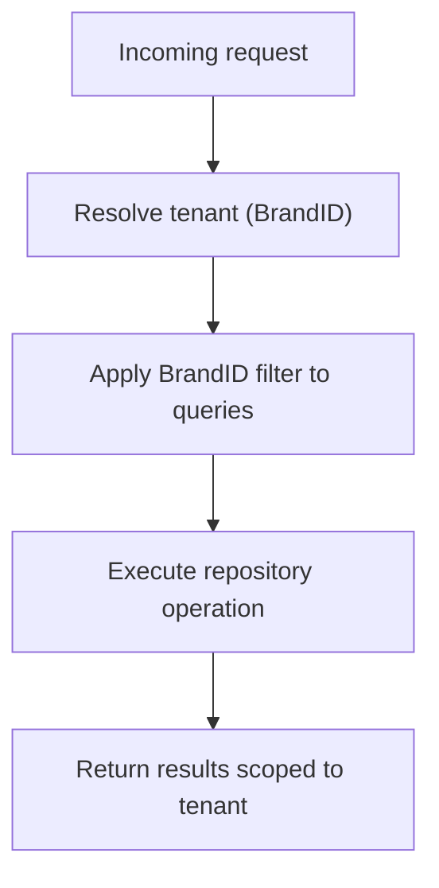
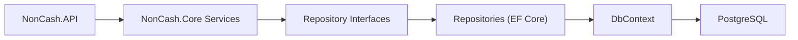
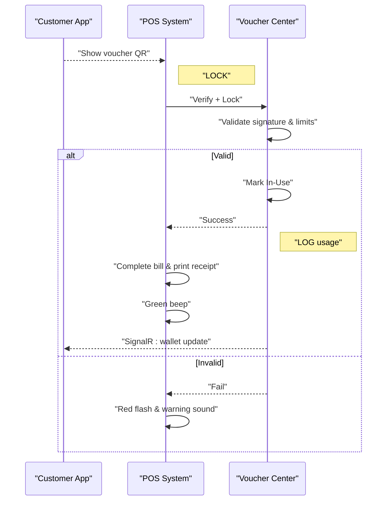

# Data Access Patterns

<cite>
**Referenced Files in This Document**
- [architecture.md](file://docs/architecture.md)
- [data-models.md](file://docs/data-models.md)
- [source-tree-analysis.md](file://docs/source-tree-analysis.md)
- [api-contracts.md](file://docs/api-contracts.md)
- [implementation-readiness-report-2026-04-17.md](file://_bmad-output/planning-artifacts/implementation-readiness-report-2026-04-17.md)
- [epics.md](file://_bmad-output/planning-artifacts/epics.md)
- [ux-design-specification.md](file://_bmad-output/planning-artifacts/ux-design-specification.md)
- [Key Functionalities.txt](file://Key Functionalities.txt)
</cite>

## Table of Contents
1. [Introduction](#introduction)
2. [Project Structure](#project-structure)
3. [Core Components](#core-components)
4. [Architecture Overview](#architecture-overview)
5. [Detailed Component Analysis](#detailed-component-analysis)
6. [Dependency Analysis](#dependency-analysis)
7. [Performance Considerations](#performance-considerations)
8. [Troubleshooting Guide](#troubleshooting-guide)
9. [Conclusion](#conclusion)
10. [Appendices](#appendices)

## Introduction
This document explains the Data Access Layer (DAL) design and implementation patterns for the NonCash project. It focuses on how Entity Framework Core and the repository pattern decouple business logic from database operations, enable multi-tenant isolation, and support transactional workflows for POS redemption. It also covers PostgreSQL schema design, connection management, and performance optimization strategies derived from the project’s architecture and functional specifications.

## Project Structure
The target architecture organizes the system into three layers: GUI (Blazor), Business Logic Layer (microservices), and Data Access Layer (EF Core with PostgreSQL). The DAL is implemented under NonCash.Infrastructure and includes:
- Data: EF Core DbContext and entity configurations
- Repositories: EF Core implementations of repository interfaces
- Migrations: PostgreSQL schema migrations

**Diagram sources**
- [source-tree-analysis.md:15-18](file://docs/source-tree-analysis.md#L15-L18)
- [architecture.md:28-34](file://docs/architecture.md#L28-L34)

**Section sources**
- [source-tree-analysis.md:1-50](file://docs/source-tree-analysis.md#L1-L50)
- [architecture.md:28-34](file://docs/architecture.md#L28-L34)

## Core Components
- Entity Framework Core with PostgreSQL: The DAL uses EF Core to manage relational data and migrations.
- Repository Pattern: Abstraction over data operations enables easy schema updates and technology changes.
- Multi-tenancy via BrandID: Tenant isolation is enforced at the data level to ensure data separation across brands.
- Transactional POS Redemption: The system implements Lock -> Commit/Rollback semantics to guarantee consistency during POS usage.

**Section sources**
- [architecture.md:28-34](file://docs/architecture.md#L28-L34)
- [data-models.md:63-97](file://docs/data-models.md#L63-L97)
- [implementation-readiness-report-2026-04-17.md:91-93](file://_bmad-output/planning-artifacts/implementation-readiness-report-2026-04-17.md#L91-L93)

## Architecture Overview
The DAL sits beneath the Business Logic Layer and exposes repository abstractions to microservices. The POS integration layer (NonCash.API) orchestrates redemption workflows that require strict transactional guarantees.

**Diagram sources**
- [source-tree-analysis.md:10-26](file://docs/source-tree-analysis.md#L10-L26)
- [architecture.md:28-34](file://docs/architecture.md#L28-L34)

**Section sources**
- [source-tree-analysis.md:10-26](file://docs/source-tree-analysis.md#L10-L26)
- [architecture.md:28-34](file://docs/architecture.md#L28-L34)

## Detailed Component Analysis

### Data Models and Multi-Tenant Design
The data model centers on voucher lifecycle, distribution, usage, and identity/operations. Multi-tenancy is achieved by anchoring entities to BrandID, ensuring tenant isolation.

**Diagram sources**
- [data-models.md:11-97](file://docs/data-models.md#L11-L97)

**Section sources**
- [data-models.md:11-97](file://docs/data-models.md#L11-L97)

### Repository Pattern Implementation
Repositories encapsulate data access logic behind interfaces consumed by services. This decouples business logic from EF Core specifics, enabling:
- Easy schema updates
- Technology migration (e.g., swapping EF Core)
- Testability via interface mocking

**Diagram sources**
- [source-tree-analysis.md:12](file://docs/source-tree-analysis.md#L12)
- [source-tree-analysis.md:17](file://docs/source-tree-analysis.md#L17)

**Section sources**
- [source-tree-analysis.md:12](file://docs/source-tree-analysis.md#L12)
- [source-tree-analysis.md:17](file://docs/source-tree-analysis.md#L17)

### POS Redemption Workflows: Lock, Commit, Rollback
The POS redemption lifecycle requires strict consistency. The API contract defines endpoints for verification, locking, committing, and rolling back.

**Diagram sources**
- [api-contracts.md:14-87](file://docs/api-contracts.md#L14-L87)
- [epics.md:278-317](file://_bmad-output/planning-artifacts/epics.md#L278-L317)
- [Key Functionalities.txt:135-147](file://Key Functionalities.txt#L135-L147)

**Section sources**
- [api-contracts.md:14-87](file://docs/api-contracts.md#L14-L87)
- [epics.md:278-317](file://_bmad-output/planning-artifacts/epics.md#L278-L317)
- [Key Functionalities.txt:135-147](file://Key Functionalities.txt#L135-L147)

### Transaction Management for POS Redemption
Transactions ensure atomicity across:
- Setting UsageStatus to In-Use
- Recording VoucherUsage on commit
- Reverting to Pending on rollback

**Diagram sources**
- [epics.md:278-317](file://_bmad-output/planning-artifacts/epics.md#L278-L317)
- [Key Functionalities.txt:135-147](file://Key Functionalities.txt#L135-L147)

**Section sources**
- [epics.md:278-317](file://_bmad-output/planning-artifacts/epics.md#L278-L317)
- [Key Functionalities.txt:135-147](file://Key Functionalities.txt#L135-L147)

### Multi-Tenant Isolation with BrandID
Tenant isolation is enforced by anchoring entities to BrandID. This ensures:
- Queries filter by BrandID by default
- Data separation between brands
- Consistent security boundaries across services

**Section sources**
- [data-models.md:63-97](file://docs/data-models.md#L63-L97)
- [architecture.md:38](file://docs/architecture.md#L38)

## Dependency Analysis
The DAL depends on EF Core and PostgreSQL, while services depend on repository interfaces. The API depends on services to orchestrate POS workflows.

**Diagram sources**
- [source-tree-analysis.md:10-26](file://docs/source-tree-analysis.md#L10-L26)
- [architecture.md:28-34](file://docs/architecture.md#L28-L34)

**Section sources**
- [source-tree-analysis.md:10-26](file://docs/source-tree-analysis.md#L10-L26)
- [architecture.md:28-34](file://docs/architecture.md#L28-L34)

## Performance Considerations
Derived from the project’s architecture and functional needs:
- Use database transactions for POS redemption to avoid partial writes and maintain consistency.
- Apply multi-tenant filters at the query level to minimize cross-tenant scans.
- Indexes on frequently queried columns (e.g., VoucherCode, OutletID, BrandID) improve lookup performance.
- Batch operations for distribution and usage logs reduce round-trips.
- Connection pooling and efficient DbContext lifetime management reduce overhead.
- Asynchronous repository methods prevent thread blocking during IO-bound operations.

[No sources needed since this section provides general guidance]

## Troubleshooting Guide
Common issues and resolutions:
- Duplicate usage attempts: Enforce uniqueness and concurrency checks on VoucherCode and UsageStatus transitions.
- Transaction conflicts: Use optimistic concurrency tokens and retry logic for transient failures.
- Cross-tenant data leakage: Verify BrandID filtering in all repository queries.
- Slow POS verification: Add indexes and consider read replicas for reporting queries.
- Migration errors: Review migration scripts and ensure consistent schema across environments.

**Section sources**
- [epics.md:278-317](file://_bmad-output/planning-artifacts/epics.md#L278-L317)
- [data-models.md:11-97](file://docs/data-models.md#L11-L97)

## Conclusion
The NonCash project employs a clean separation of concerns: the Business Logic Layer consumes repository abstractions, while the Data Access Layer manages EF Core and PostgreSQL. The repository pattern and multi-tenant design enable easy schema evolution and strong data isolation. Transactional POS redemption workflows ensure consistency across lock, commit, and rollback operations, supporting reliable point-of-sale integrations.

[No sources needed since this section summarizes without analyzing specific files]

## Appendices

### API Endpoints for POS Redemption
- Verify voucher: POST /pos/verify
- Lock voucher: POST /pos/lock
- Redeem voucher (commit): POST /pos/redeem
- Rollback lock: POST /pos/rollback

**Section sources**
- [api-contracts.md:14-87](file://docs/api-contracts.md#L14-L87)

### UX Flow for POS Redemption
The user journey illustrates the end-to-end POS redemption process, including validation, deduction, logging, and feedback.

**Diagram sources**
- [ux-design-specification.md:211-240](file://_bmad-output/planning-artifacts/ux-design-specification.md#L211-L240)

**Section sources**
- [ux-design-specification.md:211-240](file://_bmad-output/planning-artifacts/ux-design-specification.md#L211-L240)