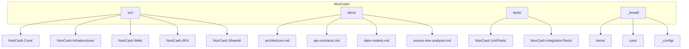
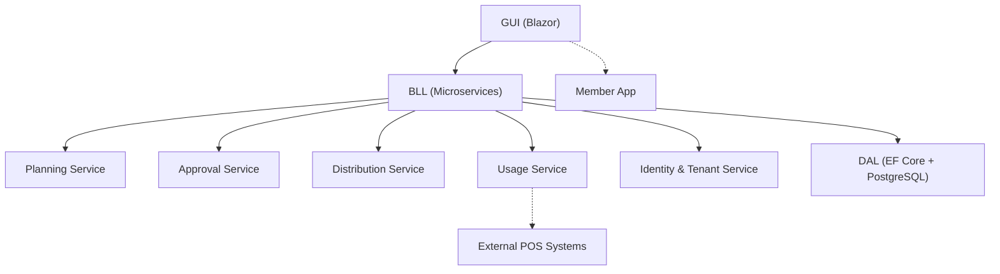
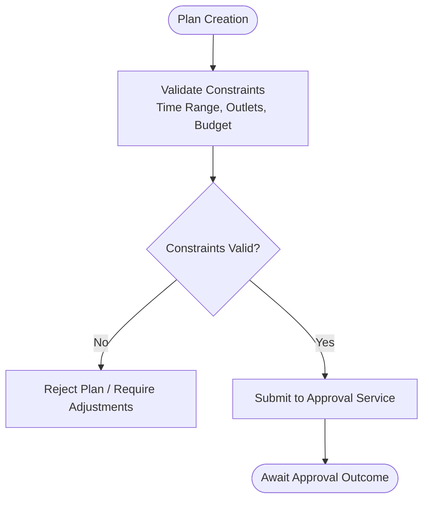
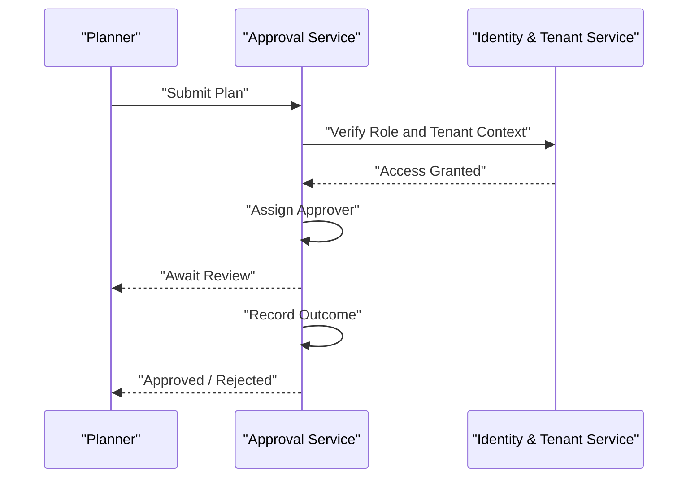
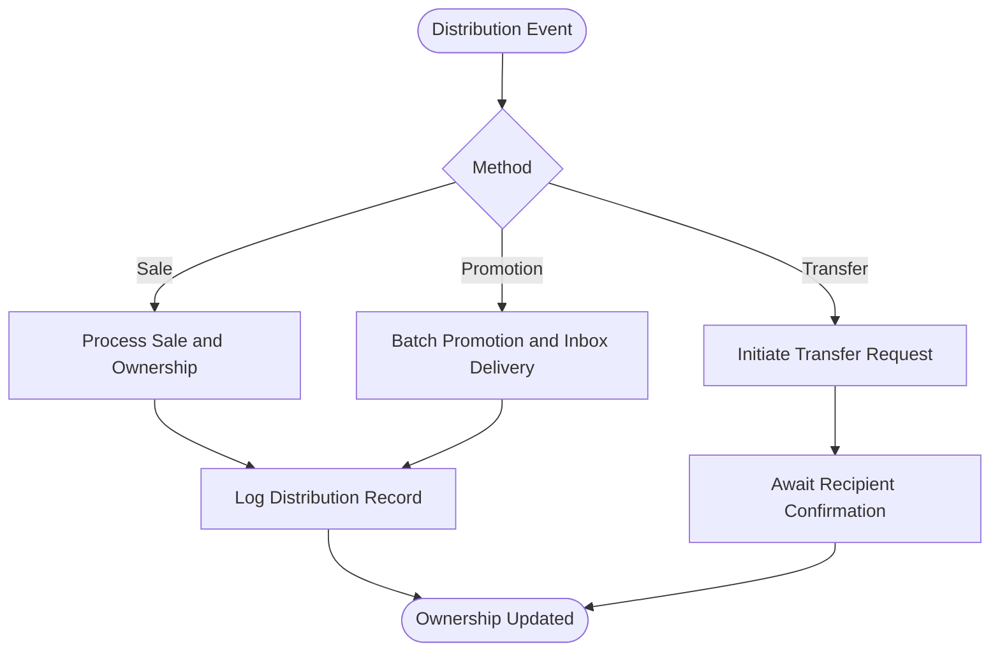
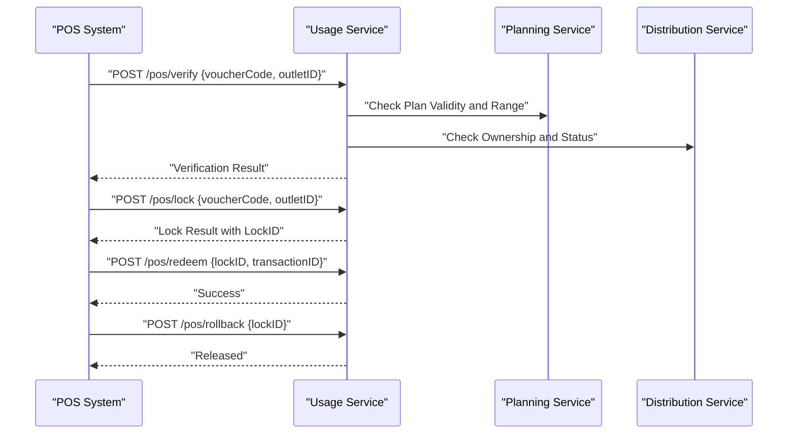
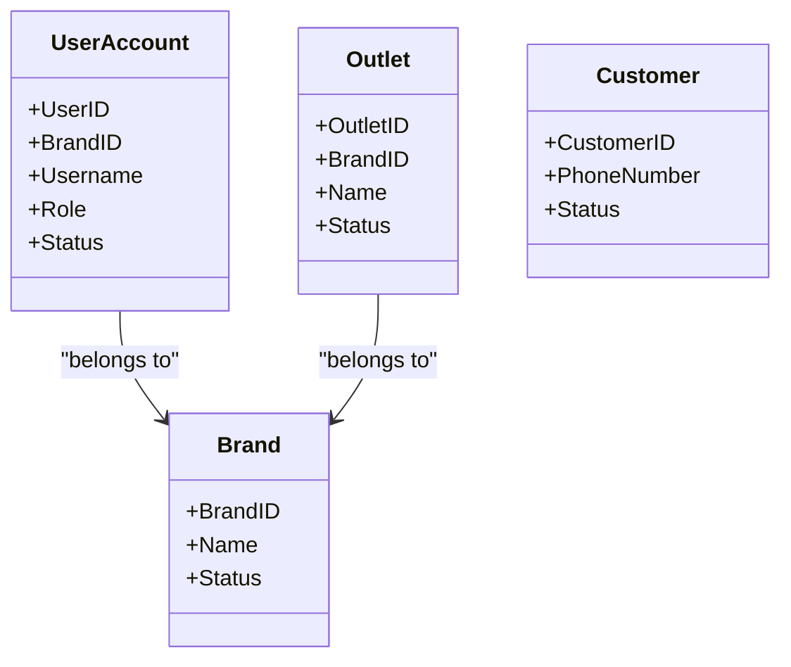
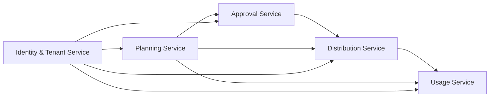
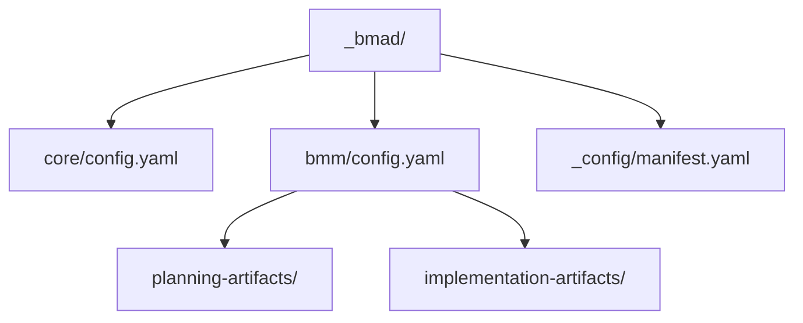

# Microservices Design Pattern

<cite>
**Referenced Files in This Document**
- [BMAD_STRUCTURE.md](file://BMAD_STRUCTURE.md)
- [Key Functionalities.txt](file://Key Functionalities.txt)
- [description.txt](file://description.txt)
- [docs/architecture.md](file://docs/architecture.md)
- [docs/api-contracts.md](file://docs/api-contracts.md)
- [docs/data-models.md](file://docs/data-models.md)
- [docs/source-tree-analysis.md](file://docs/source-tree-analysis.md)
- [_bmad/bmm/module-help.csv](file://_bmad/bmm/module-help.csv)
- [_bmad/core/config.yaml](file://_bmad/core/config.yaml)
- [_bmad/bmm/config.yaml](file://_bmad/bmm/config.yaml)
- [_bmad/_config/manifest.yaml](file://_bmad/_config/manifest.yaml)
</cite>

## Table of Contents
1. [Introduction](#introduction)
2. [Project Structure](#project-structure)
3. [Core Components](#core-components)
4. [Architecture Overview](#architecture-overview)
5. [Detailed Component Analysis](#detailed-component-analysis)
6. [Dependency Analysis](#dependency-analysis)
7. [Performance Considerations](#performance-considerations)
8. [Troubleshooting Guide](#troubleshooting-guide)
9. [Conclusion](#conclusion)
10. [Appendices](#appendices)

## Introduction
This document explains the microservices architecture for NonCash, focusing on five core services: Planning Service, Approval Service, Distribution Service, Usage Service, and Identity & Tenant Service. It details service boundaries, responsibilities, and inter-service communication patterns. It also covers how microservices enable independent scalability, technology flexibility, and fault isolation, and how the system supports BMAD methodology for automated documentation generation.

## Project Structure
The NonCash project follows a 3-layer SaaS architecture with a microservices-based Business Logic Layer (BLL). The target layout organizes responsibilities across dedicated folders for core business logic, data access, user interface, integration APIs, and shared models.

**Diagram sources**
- [docs/source-tree-analysis.md:7-34](file://docs/source-tree-analysis.md#L7-L34)

**Section sources**
- [docs/source-tree-analysis.md:1-50](file://docs/source-tree-analysis.md#L1-L50)

## Core Components
The BLL is structured as microservices to achieve loose coupling and independent scalability. Each service encapsulates a bounded responsibility and collaborates with others through well-defined contracts.

- Planning Service
  - Responsibilities: Create and manage voucher production plans, define budgets, targets, validity ranges, and publishing dates. Track plan approvals and outcomes.
  - Boundaries: Owns VoucherPlanHeader and related planning entities; coordinates with Approval Service for state transitions.
  - Interactions: Publishes plan metadata and constraints; triggers downstream Distribution and Usage flows upon approval.

- Approval Service
  - Responsibilities: Route plans for review, enforce single-level approval workflow, and record reviewer actions and outcomes.
  - Boundaries: Manages approval state transitions and audit trails; integrates with Identity & Tenant Service for role-based access.
  - Interactions: Receives plan submissions; emits approval events to Planning Service; informs downstream services of publish readiness.

- Distribution Service
  - Responsibilities: Handle sales, promotions, and inbox deliveries. Manage ownership assignments and transfer requests between members.
  - Boundaries: Tracks distribution methods (Sale, Promotion, Transfer); maintains distribution records and member ownership.
  - Interactions: Consumes plan details post-approval; updates ownership and distribution logs; supports member app interactions.

- Usage Service
  - Responsibilities: Orchestrate POS redemption with strict transaction semantics (Lock -> Commit/Rollback). Validate vouchers, lock during transactions, and finalize/redemption or release locks.
  - Boundaries: Enforces dynamic voucher code validation and temporal constraints; ensures atomicity across POS operations.
  - Interactions: Exposes RESTful endpoints for POS systems; integrates with Planning/Distribution for eligibility checks.

- Identity & Tenant Service
  - Responsibilities: Provide RBAC for UserAccount, multi-tenancy for Brand and Outlet, and customer profile management. Enforce tenant isolation via BrandID.
  - Boundaries: Centralizes identity, roles, and tenant membership; governs access to data and operations across other services.
  - Interactions: Authenticates and authorizes internal and external callers; supplies tenant context for cross-service queries.

**Section sources**
- [docs/architecture.md:17-26](file://docs/architecture.md#L17-L26)
- [Key Functionalities.txt:7-167](file://Key Functionalities.txt#L7-L167)
- [docs/data-models.md:63-98](file://docs/data-models.md#L63-L98)

## Architecture Overview
NonCash adopts a 3-layer SaaS architecture:
- GUI (Blazor): Manages user interactions for business admins and marketing staff.
- BLL (Microservices): Encapsulates business logic and orchestrates workflows across Planning, Approval, Distribution, Usage, and Identity & Tenant services.
- DAL (Infrastructure): Handles database operations via Entity Framework Core with PostgreSQL, using the repository pattern for abstraction.

**Diagram sources**
- [docs/architecture.md:9-34](file://docs/architecture.md#L9-L34)
- [docs/source-tree-analysis.md:19-26](file://docs/source-tree-analysis.md#L19-L26)

**Section sources**
- [docs/architecture.md:5-52](file://docs/architecture.md#L5-L52)
- [description.txt:16-31](file://description.txt#L16-L31)

## Detailed Component Analysis

### Planning Service
- Purpose: Define production schedules, budgets, and targets; manage validity ranges and publishing constraints.
- Data: VoucherPlanHeader and related attributes (e.g., brand, type, face/net values, expiry/publish dates, sales/outlet ranges).
- Responsibilities:
  - Create and update plan headers.
  - Validate plan constraints (time range, outlet acceptance).
  - Coordinate with Approval Service for submission and state transitions.
- Coupling: Loosely coupled with Approval/Distribution/Usage via plan metadata and approval events.

**Diagram sources**
- [docs/data-models.md:11-33](file://docs/data-models.md#L11-L33)
- [Key Functionalities.txt:7-86](file://Key Functionalities.txt#L7-L86)

**Section sources**
- [docs/data-models.md:11-33](file://docs/data-models.md#L11-L33)
- [Key Functionalities.txt:7-86](file://Key Functionalities.txt#L7-L86)

### Approval Service
- Purpose: Single-level approval workflow with reviewer assignment and outcome logging.
- Responsibilities:
  - Route submitted plans to approvers.
  - Record reviewer actions and approval outcomes.
  - Notify downstream services when plans are approved and ready for distribution/publication.
- Coupling: Integrates with Identity & Tenant Service for role-based access and tenant isolation.

**Diagram sources**
- [docs/architecture.md:20-25](file://docs/architecture.md#L20-L25)
- [Key Functionalities.txt:70-86](file://Key Functionalities.txt#L70-L86)

**Section sources**
- [docs/architecture.md:20-25](file://docs/architecture.md#L20-L25)
- [Key Functionalities.txt:70-86](file://Key Functionalities.txt#L70-L86)

### Distribution Service
- Purpose: Manage voucher distribution via sales, promotions, and transfers; track ownership and distribution methods.
- Responsibilities:
  - Record distribution events (Sale, Promotion, Transfer).
  - Assign ownership to members and maintain distribution logs.
  - Support member app interactions for ownership visibility and transfer initiation.
- Coupling: Consumes plan details post-approval; updates ownership and distribution records.

**Diagram sources**
- [docs/data-models.md:55-62](file://docs/data-models.md#L55-L62)
- [Key Functionalities.txt:87-134](file://Key Functionalities.txt#L87-L134)

**Section sources**
- [docs/data-models.md:55-62](file://docs/data-models.md#L55-L62)
- [Key Functionalities.txt:87-134](file://Key Functionalities.txt#L87-L134)

### Usage Service
- Purpose: Secure POS redemption with strict transaction semantics and dynamic voucher code validation.
- Responsibilities:
  - Verify voucher eligibility and availability.
  - Lock vouchers during transactions to prevent double-spending.
  - Commit/redemption on successful transactions or rollback on failure.
- Coupling: Exposes RESTful endpoints for POS systems; integrates with Planning/Distribution for eligibility checks.

**Diagram sources**
- [docs/api-contracts.md:14-87](file://docs/api-contracts.md#L14-L87)
- [docs/data-models.md:46-54](file://docs/data-models.md#L46-L54)

**Section sources**
- [docs/api-contracts.md:14-87](file://docs/api-contracts.md#L14-L87)
- [docs/data-models.md:46-54](file://docs/data-models.md#L46-L54)

### Identity & Tenant Service
- Purpose: Provide RBAC for UserAccount, multi-tenancy for Brand and Outlet, and customer profile management.
- Responsibilities:
  - Enforce tenant isolation via BrandID.
  - Manage user roles (Admin, Planner, Approver) and access controls.
  - Support customer profiles and blacklisting.
- Coupling: Supplies tenant and role context to other services; governs access to data and operations.

**Diagram sources**
- [docs/data-models.md:81-98](file://docs/data-models.md#L81-L98)

**Section sources**
- [docs/data-models.md:81-98](file://docs/data-models.md#L81-L98)
- [docs/architecture.md:36-41](file://docs/architecture.md#L36-L41)

## Dependency Analysis
The microservices collaborate through explicit contracts and shared models. The following diagram illustrates key dependencies and interactions across services.

**Diagram sources**
- [docs/architecture.md:17-26](file://docs/architecture.md#L17-L26)
- [docs/data-models.md:11-62](file://docs/data-models.md#L11-L62)

**Section sources**
- [docs/architecture.md:17-26](file://docs/architecture.md#L17-L26)
- [docs/data-models.md:11-62](file://docs/data-models.md#L11-L62)

## Performance Considerations
- Independent Scalability: Each microservice can scale independently based on workload (e.g., spikes in POS usage can be isolated to Usage Service).
- Technology Flexibility: Services can adopt different technologies or frameworks without affecting others, enabling gradual modernization.
- Fault Isolation: Failures in one service (e.g., Distribution) do not cascade to others, improving resilience.
- Data Consistency: Transactions are enforced at critical points (e.g., POS redemption) to maintain consistency across services.
- API Gateway and Service Discovery: While not explicitly defined in the current documentation, adopting an API gateway pattern and service discovery would improve routing, monitoring, and resilience in production deployments.

## Troubleshooting Guide
Common operational concerns and mitigations:
- POS Redemption Failures
  - Symptoms: Voucher lock not released or redemption not committed.
  - Actions: Verify lockID validity, ensure rollback endpoint is invoked on failures, confirm transactionID uniqueness.
- Approval Bottlenecks
  - Symptoms: Delayed plan publication.
  - Actions: Monitor approver assignments and role permissions via Identity & Tenant Service.
- Distribution Discrepancies
  - Symptoms: Ownership mismatches or missing distribution logs.
  - Actions: Cross-check distribution records and plan details; validate method-specific flows (Sale/Promotion/Transfer).
- Tenant Isolation Issues
  - Symptoms: Unauthorized access across tenants.
  - Actions: Confirm BrandID enforcement and role-based access controls; audit user and outlet associations.

**Section sources**
- [docs/api-contracts.md:14-87](file://docs/api-contracts.md#L14-L87)
- [docs/data-models.md:46-62](file://docs/data-models.md#L46-L62)
- [docs/architecture.md:36-41](file://docs/architecture.md#L36-L41)

## Conclusion
NonCash microservices architecture enables clear service boundaries, independent scalability, and strong fault isolation. The five services—Planning, Approval, Distribution, Usage, and Identity & Tenant—collaborate through well-defined contracts to support the complete voucher lifecycle. The system’s 3-layer SaaS design, combined with robust security and multi-tenancy, positions NonCash as a scalable and maintainable SaaS platform.

## Appendices

### API Contracts Overview
- POS Integration API
  - Base URL: https://api.noncash.service/v1
  - Authentication: API Key (Header: X-API-Key) and JWT (Bearer Token)
  - Endpoints: Verify, Lock, Redeem, Rollback
- Member App API
  - Endpoints: List My Vouchers, Transfer Voucher

**Section sources**
- [docs/api-contracts.md:5-109](file://docs/api-contracts.md#L5-L109)

### BMAD Methodology and Automated Documentation
- BMAD Modules
  - Core and BMM modules configured for project documentation and planning.
  - Skills and workflows support research, planning, architecture creation, and implementation readiness checks.
- Configuration
  - Output folders and languages defined for planning and implementation artifacts.
  - Manifest lists installed modules and IDE integrations.

**Diagram sources**
- [_bmad/core/config.yaml:1-10](file://_bmad/core/config.yaml#L1-L10)
- [_bmad/bmm/config.yaml:1-17](file://_bmad/bmm/config.yaml#L1-L17)
- [_bmad/_config/manifest.yaml:1-25](file://_bmad/_config/manifest.yaml#L1-L25)

**Section sources**
- [_bmad/bmm/module-help.csv:1-35](file://_bmad/bmm/module-help.csv#L1-L35)
- [_bmad/core/config.yaml:1-10](file://_bmad/core/config.yaml#L1-L10)
- [_bmad/bmm/config.yaml:1-17](file://_bmad/bmm/config.yaml#L1-L17)
- [_bmad/_config/manifest.yaml:1-25](file://_bmad/_config/manifest.yaml#L1-L25)