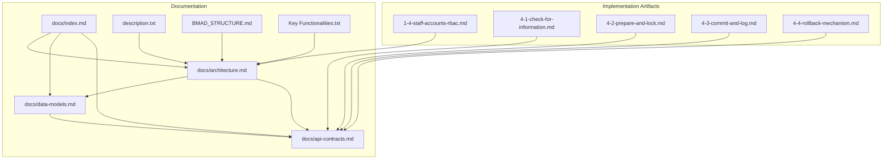
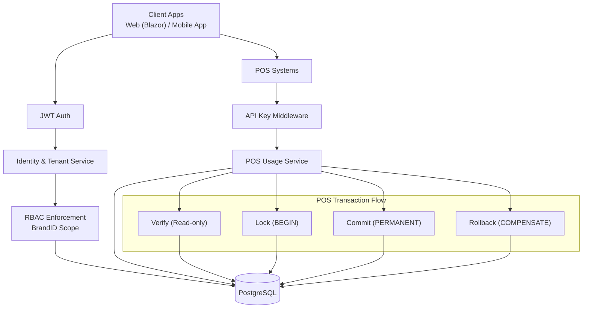
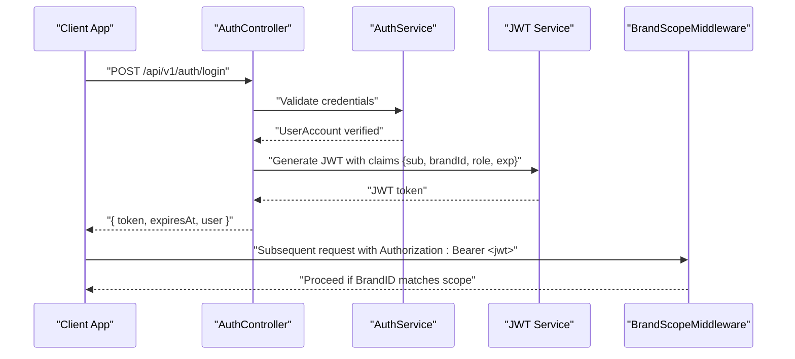
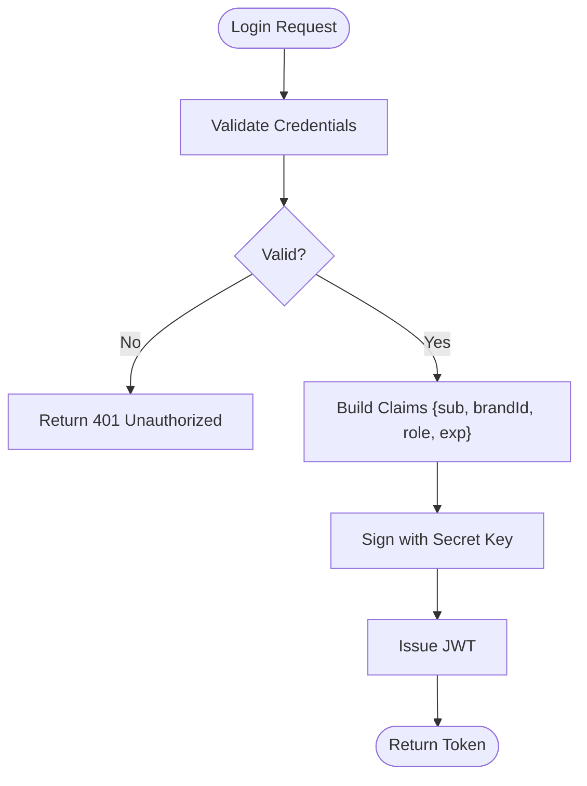
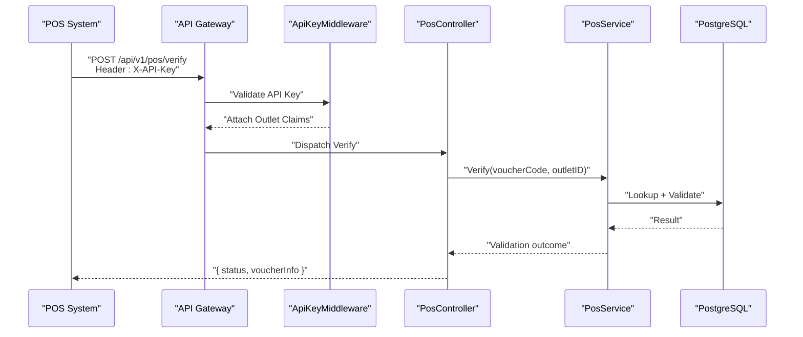
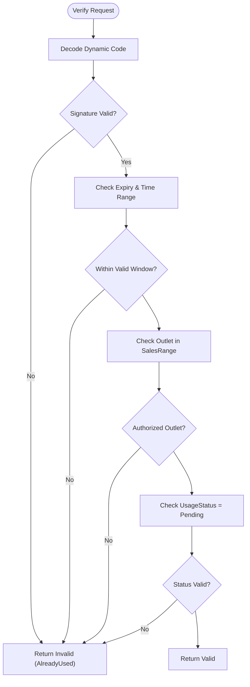
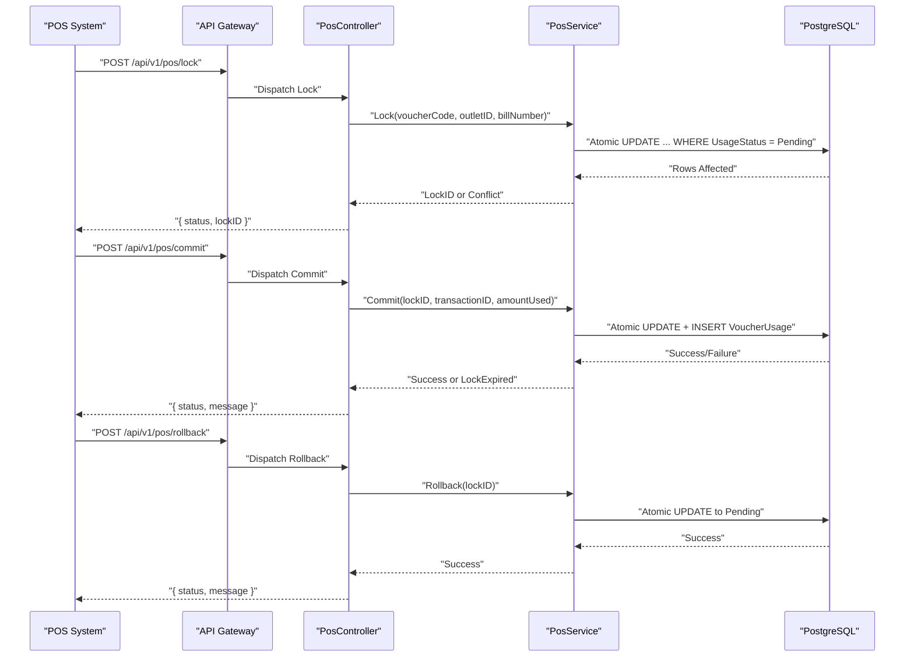
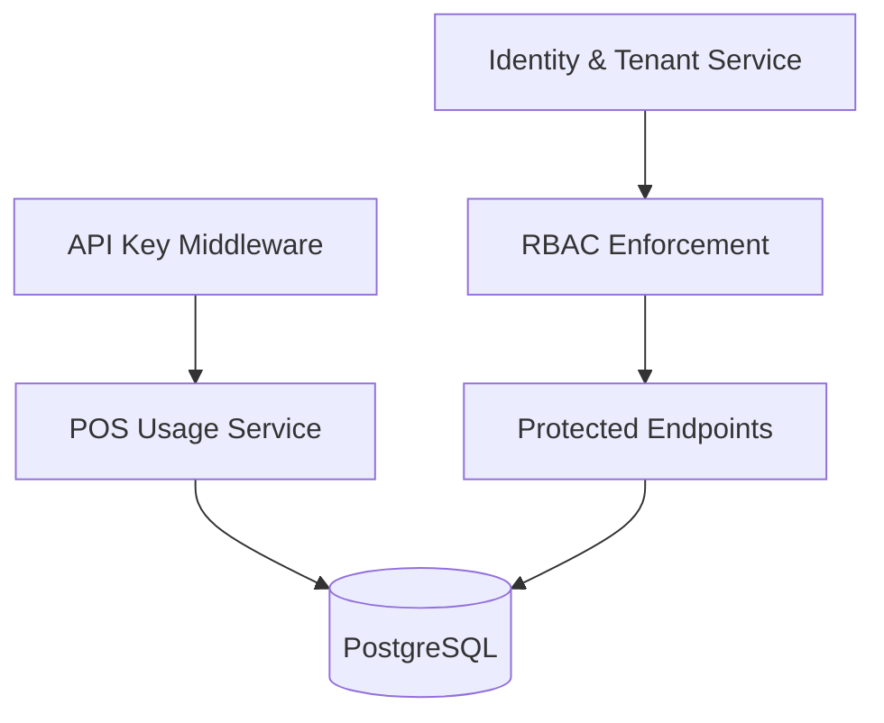

# Security Architecture

<cite>
**Referenced Files in This Document**
- [BMAD_STRUCTURE.md](file://BMAD_STRUCTURE.md)
- [description.txt](file://description.txt)
- [docs/index.md](file://docs/index.md)
- [docs/architecture.md](file://docs/architecture.md)
- [docs/data-models.md](file://docs/data-models.md)
- [docs/api-contracts.md](file://docs/api-contracts.md)
- [Key Functionalities.txt](file://Key Functionalities.txt)
- [1-4-staff-accounts-rbac.md](file://_bmad-output/implementation-artifacts/1-4-staff-accounts-rbac.md)
- [4-1-check-for-information.md](file://_bmad-output/implementation-artifacts/4-1-check-for-information.md)
- [4-2-prepare-and-lock.md](file://_bmad-output/implementation-artifacts/4-2-prepare-and-lock.md)
- [4-3-commit-and-log.md](file://_bmad-output/implementation-artifacts/4-3-commit-and-log.md)
- [4-4-rollback-mechanism.md](file://_bmad-output/implementation-artifacts/4-4-rollback-mechanism.md)
</cite>

## Table of Contents
1. [Introduction](#introduction)
2. [Project Structure](#project-structure)
3. [Core Components](#core-components)
4. [Architecture Overview](#architecture-overview)
5. [Detailed Component Analysis](#detailed-component-analysis)
6. [Dependency Analysis](#dependency-analysis)
7. [Performance Considerations](#performance-considerations)
8. [Troubleshooting Guide](#troubleshooting-guide)
9. [Conclusion](#conclusion)
10. [Appendices](#appendices)

## Introduction
This document presents the security architecture for the NonCash SaaS platform. It covers multi-tenancy enforcement via BrandID, authentication mechanisms (JWT for web/member apps and API keys for POS), dynamic voucher code generation to prevent reuse and unauthorized scanning, and transaction security patterns for lock/commit/rollback with audit trails and integrity guarantees. Cross-cutting concerns such as role-based access control (RBAC), data encryption, and secure API communication are addressed alongside practical implementation guidance derived from the project’s documentation and implementation artifacts.

## Project Structure
The NonCash project organizes its security-relevant logic across three primary layers and supporting documentation:
- Documentation layer: architecture, data models, API contracts, and implementation artifacts define security policies and flows.
- Backend services: microservices implementing identity, planning, approval, distribution, and usage orchestration.
- Data access: PostgreSQL-backed repositories enforcing tenant scoping and transactional integrity.

**Diagram sources**
- [docs/index.md:1-41](file://docs/index.md#L1-L41)
- [docs/architecture.md:1-52](file://docs/architecture.md#L1-L52)
- [docs/data-models.md:1-98](file://docs/data-models.md#L1-L98)
- [docs/api-contracts.md:1-109](file://docs/api-contracts.md#L1-L109)
- [description.txt:1-31](file://description.txt#L1-L31)
- [BMAD_STRUCTURE.md:1-82](file://BMAD_STRUCTURE.md#L1-L82)
- [Key Functionalities.txt:1-167](file://Key Functionalities.txt#L1-L167)
- [1-4-staff-accounts-rbac.md:1-125](file://_bmad-output/implementation-artifacts/1-4-staff-accounts-rbac.md#L1-L125)
- [4-1-check-for-information.md:1-116](file://_bmad-output/implementation-artifacts/4-1-check-for-information.md#L1-L116)
- [4-2-prepare-and-lock.md:1-115](file://_bmad-output/implementation-artifacts/4-2-prepare-and-lock.md#L1-L115)
- [4-3-commit-and-log.md:1-116](file://_bmad-output/implementation-artifacts/4-3-commit-and-log.md#L1-L116)
- [4-4-rollback-mechanism.md:1-112](file://_bmad-output/implementation-artifacts/4-4-rollback-mechanism.md#L1-L112)

**Section sources**
- [docs/index.md:12-41](file://docs/index.md#L12-L41)
- [docs/architecture.md:5-52](file://docs/architecture.md#L5-L52)
- [description.txt:16-31](file://description.txt#L16-L31)
- [BMAD_STRUCTURE.md:37-82](file://BMAD_STRUCTURE.md#L37-L82)

## Core Components
- Multi-tenant identity and RBAC: JWT tokens carry BrandID and role claims; BrandID scopes all tenant-aware repository queries. Staff accounts are mapped to Brand and role, with strict enforcement of cross-brand access.
- POS integration security: API Key authentication per outlet; endpoints are read-only for verification and state-changing for lock/commit/rollback.
- Dynamic voucher code generation: rotating codes (similar to JWT logic) prevent static reuse and unauthorized scanning; validation ensures expiry, time windows, and outlet scope.
- Transaction security: POS flow enforces BEGIN (lock), COMMIT (permanent state change), and ROLLBACK (compensating transaction) with atomic updates, idempotency, and audit trail records.

**Section sources**
- [docs/architecture.md:36-41](file://docs/architecture.md#L36-L41)
- [docs/api-contracts.md:5-109](file://docs/api-contracts.md#L5-L109)
- [Key Functionalities.txt:56-68](file://Key Functionalities.txt#L56-L68)
- [1-4-staff-accounts-rbac.md:19-44](file://_bmad-output/implementation-artifacts/1-4-staff-accounts-rbac.md#L19-L44)
- [4-1-check-for-information.md:13-43](file://_bmad-output/implementation-artifacts/4-1-check-for-information.md#L13-L43)
- [4-2-prepare-and-lock.md:13-39](file://_bmad-output/implementation-artifacts/4-2-prepare-and-lock.md#L13-L39)
- [4-3-commit-and-log.md:13-42](file://_bmad-output/implementation-artifacts/4-3-commit-and-log.md#L13-L42)
- [4-4-rollback-mechanism.md:13-38](file://_bmad-output/implementation-artifacts/4-4-rollback-mechanism.md#L13-L38)

## Architecture Overview
The security architecture integrates:
- Multi-tenancy via BrandID across identity, planning, approval, distribution, and usage services.
- Authentication:
  - JWT for web/member app users (login, RBAC enforcement).
  - API Keys for POS systems (per outlet).
- Dynamic voucher code validation to prevent reuse and unauthorized scanning.
- Transactional integrity for POS operations with audit logs.

**Diagram sources**
- [docs/architecture.md:17-35](file://docs/architecture.md#L17-L35)
- [docs/api-contracts.md:14-88](file://docs/api-contracts.md#L14-L88)
- [1-4-staff-accounts-rbac.md:28-44](file://_bmad-output/implementation-artifacts/1-4-staff-accounts-rbac.md#L28-L44)
- [4-1-check-for-information.md:13-43](file://_bmad-output/implementation-artifacts/4-1-check-for-information.md#L13-L43)
- [4-2-prepare-and-lock.md:13-39](file://_bmad-output/implementation-artifacts/4-2-prepare-and-lock.md#L13-L39)
- [4-3-commit-and-log.md:13-42](file://_bmad-output/implementation-artifacts/4-3-commit-and-log.md#L13-L42)
- [4-4-rollback-mechanism.md:13-38](file://_bmad-output/implementation-artifacts/4-4-rollback-mechanism.md#L13-L38)

## Detailed Component Analysis

### Multi-Tenancy with BrandID
- Tenant boundary: BrandID isolates data between businesses in the SaaS environment. All tenant-scoped operations enforce BrandID at query time.
- Identity and RBAC:
  - JWT includes subject (UserID), BrandID, role, and expiration.
  - BrandID in JWT overrides any request-body BrandID for tenant-scoped endpoints.
  - Role-based rights govern access to planning, approval, distribution, and outlet/customer management within a Brand.
- Enforcement:
  - Middleware enforces BrandID scope for all tenant-aware endpoints.
  - Passwords are hashed with salt; JWT secret key is securely managed.

**Diagram sources**
- [1-4-staff-accounts-rbac.md:28-44](file://_bmad-output/implementation-artifacts/1-4-staff-accounts-rbac.md#L28-L44)
- [1-4-staff-accounts-rbac.md:77-99](file://_bmad-output/implementation-artifacts/1-4-staff-accounts-rbac.md#L77-L99)
- [docs/architecture.md:38](file://docs/architecture.md#L38)

**Section sources**
- [1-4-staff-accounts-rbac.md:19-44](file://_bmad-output/implementation-artifacts/1-4-staff-accounts-rbac.md#L19-L44)
- [1-4-staff-accounts-rbac.md:101-117](file://_bmad-output/implementation-artifacts/1-4-staff-accounts-rbac.md#L101-L117)
- [docs/architecture.md:38](file://docs/architecture.md#L38)

### JWT Token Management (Web Applications)
- Login flow issues a signed JWT with claims: subject (UserID), BrandID, role, and expiration.
- All subsequent protected endpoints require Authorization: Bearer <JWT>.
- JWT secret key must be at least 32 characters and stored in environment variables.

**Diagram sources**
- [1-4-staff-accounts-rbac.md:28-32](file://_bmad-output/implementation-artifacts/1-4-staff-accounts-rbac.md#L28-L32)

**Section sources**
- [1-4-staff-accounts-rbac.md:108-117](file://_bmad-output/implementation-artifacts/1-4-staff-accounts-rbac.md#L108-L117)
- [docs/api-contracts.md:7](file://docs/api-contracts.md#L7)

### API Key Authentication (POS Integration)
- POS systems authenticate via API Key header (X-API-Key).
- API Key middleware validates the key against outlet-defined secrets and attaches outlet claims to the HTTP context.
- POS endpoints:
  - Verify: read-only, returns validity without mutating state.
  - Lock: begins transaction by locking the voucher atomically.
  - Commit: permanently marks usage and logs transaction.
  - Rollback: compensates a failed transaction by releasing the lock.

**Diagram sources**
- [4-1-check-for-information.md:13-26](file://_bmad-output/implementation-artifacts/4-1-check-for-information.md#L13-L26)
- [4-1-check-for-information.md:72-79](file://_bmad-output/implementation-artifacts/4-1-check-for-information.md#L72-L79)
- [docs/api-contracts.md:14-34](file://docs/api-contracts.md#L14-L34)

**Section sources**
- [4-1-check-for-information.md:52-70](file://_bmad-output/implementation-artifacts/4-1-check-for-information.md#L52-L70)
- [docs/api-contracts.md:14-34](file://docs/api-contracts.md#L14-L34)

### Dynamic Voucher Code Generation and Validation
- Voucher code is dynamic (rotating) to prevent reuse and unauthorized scanning.
- Validation logic checks:
  - Signature correctness (same secret/key used for generation).
  - Expiry date and time window constraints.
  - Outlet scope authorization (must be in plan’s SalesRange).
  - Usage status is Pending.
- Verify is read-only and never mutates state.

**Diagram sources**
- [4-1-check-for-information.md:13-26](file://_bmad-output/implementation-artifacts/4-1-check-for-information.md#L13-L26)
- [Key Functionalities.txt:56](file://Key Functionalities.txt#L56)

**Section sources**
- [4-1-check-for-information.md:13-43](file://_bmad-output/implementation-artifacts/4-1-check-for-information.md#L13-L43)
- [Key Functionalities.txt:56-68](file://Key Functionalities.txt#L56-L68)

### POS Transaction Security: Lock/Commit/Rollback
- Lock (BEGIN):
  - Validates dynamic code, outlet scope, time window, and status.
  - Atomically transitions UsageStatus from Pending to In-Use using conditional update.
  - Returns LockID for subsequent commit/rollback.
  - Idempotent: duplicate requests return the same LockID.
- Commit (PERMANENT):
  - Validates LockID and non-expired lock.
  - Atomic update: mark Complete, set UsedDate, clear LockID.
  - Inserts VoucherUsage record with TransactionID and AmountUsed.
  - Idempotent: duplicate commits do not create duplicate records.
- Rollback (COMPENSATE):
  - Validates LockID and In-Use status.
  - Atomic update: revert to Pending, clear lock fields.
  - Does not create VoucherUsage records.
  - Idempotent: duplicate rollbacks are safe.
- Audit trail:
  - VoucherUsage captures POSID, TransactionID, UsageDate, AmountUsed for traceability.

**Diagram sources**
- [4-2-prepare-and-lock.md:13-39](file://_bmad-output/implementation-artifacts/4-2-prepare-and-lock.md#L13-L39)
- [4-3-commit-and-log.md:13-42](file://_bmad-output/implementation-artifacts/4-3-commit-and-log.md#L13-L42)
- [4-4-rollback-mechanism.md:13-38](file://_bmad-output/implementation-artifacts/4-4-rollback-mechanism.md#L13-L38)
- [docs/api-contracts.md:36-88](file://docs/api-contracts.md#L36-L88)

**Section sources**
- [4-2-prepare-and-lock.md:42-76](file://_bmad-output/implementation-artifacts/4-2-prepare-and-lock.md#L42-L76)
- [4-3-commit-and-log.md:44-77](file://_bmad-output/implementation-artifacts/4-3-commit-and-log.md#L44-L77)
- [4-4-rollback-mechanism.md:46-75](file://_bmad-output/implementation-artifacts/4-4-rollback-mechanism.md#L46-L75)
- [docs/data-models.md:46-62](file://docs/data-models.md#L46-L62)

### Data Encryption and Secure API Communication
- Data-at-rest: PostgreSQL is the target database; encryption at rest should be enabled at the storage layer.
- Data-in-motion: TLS termination at the ingress/load balancer; all internal and external APIs use HTTPS.
- Secrets management: JWT signing key and API keys are stored in environment variables; never in source code.
- Hashing: Passwords are hashed with salt; API keys are stored as hashes.

**Section sources**
- [description.txt:13](file://description.txt#L13)
- [1-4-staff-accounts-rbac.md:115-117](file://_bmad-output/implementation-artifacts/1-4-staff-accounts-rbac.md#L115-L117)
- [4-1-check-for-information.md:95](file://_bmad-output/implementation-artifacts/4-1-check-for-information.md#L95)

### Role-Based Access Control (RBAC)
- Roles:
  - Admin: full system access, cross-brand user management.
  - BrandManager: manage Outlets, Customers, view plans within Brand.
  - Planner: create/edit VoucherPlanHeaders within Brand.
  - Approver: approve/reject plans within Brand.
- Enforcement:
  - JWT carries role claims; middleware enforces role-per-action.
  - Multi-tenancy: BrandID in JWT overrides any request-body BrandID for tenant-scoped endpoints.

**Section sources**
- [1-4-staff-accounts-rbac.md:19-44](file://_bmad-output/implementation-artifacts/1-4-staff-accounts-rbac.md#L19-L44)
- [1-4-staff-accounts-rbac.md:113-115](file://_bmad-output/implementation-artifacts/1-4-staff-accounts-rbac.md#L113-L115)

## Dependency Analysis
The security architecture depends on:
- Identity & Tenant Service for JWT issuance and BrandID scoping.
- POS Usage Service orchestrating lock/commit/rollback with database transactions.
- API Key Middleware for POS endpoint authentication.
- Data models enforcing referential integrity and audit trail records.

**Diagram sources**
- [docs/architecture.md:25](file://docs/architecture.md#L25)
- [docs/api-contracts.md:7](file://docs/api-contracts.md#L7)
- [docs/data-models.md:46-62](file://docs/data-models.md#L46-L62)

**Section sources**
- [docs/architecture.md:25-35](file://docs/architecture.md#L25-L35)
- [docs/data-models.md:46-62](file://docs/data-models.md#L46-L62)

## Performance Considerations
- Concurrency control: use conditional updates and row-level locking to prevent race conditions during lock acquisition.
- Idempotency: design POS endpoints to tolerate retries without side effects.
- Audit logging: minimize write amplification by batching non-critical audit entries; keep VoucherUsage minimal and indexed.
- API key rotation: automate periodic rotation and maintain historical keys for short transition windows.

[No sources needed since this section provides general guidance]

## Troubleshooting Guide
Common issues and resolutions:
- Invalid dynamic code:
  - Cause: forged/expired/invalid signature.
  - Resolution: return Invalid with reason; ensure client retries do not mutate state.
- Outlet not authorized:
  - Cause: POS outlet not in plan’s SalesRange.
  - Resolution: enforce outlet scope validation; return Invalid with reason.
- Already in use:
  - Cause: concurrent lock attempts.
  - Resolution: return AlreadyInUse; clients should wait or retry.
- Lock expired:
  - Cause: background cleanup or manual timeout.
  - Resolution: advise re-verify and re-lock; reject commit with LockExpired.
- Already completed:
  - Cause: voucher already marked Complete.
  - Resolution: return AlreadyCompleted on rollback; do not create usage records.
- Duplicate commit/rollback:
  - Cause: network retry.
  - Resolution: idempotent handling; do not create duplicates.

**Section sources**
- [4-1-check-for-information.md:28-43](file://_bmad-output/implementation-artifacts/4-1-check-for-information.md#L28-L43)
- [4-2-prepare-and-lock.md:22-39](file://_bmad-output/implementation-artifacts/4-2-prepare-and-lock.md#L22-L39)
- [4-3-commit-and-log.md:32-42](file://_bmad-output/implementation-artifacts/4-3-commit-and-log.md#L32-L42)
- [4-4-rollback-mechanism.md:21-38](file://_bmad-output/implementation-artifacts/4-4-rollback-mechanism.md#L21-L38)

## Conclusion
The NonCash security architecture establishes strong multi-tenancy via BrandID, robust authentication using JWT for web/member apps and API keys for POS, and a secure, transactional voucher redemption flow. Dynamic code validation and strict RBAC enforcement protect tenant isolation and prevent fraud. The lock/commit/rollback pattern with atomic updates, idempotency, and audit trails ensures transaction integrity and traceability.

[No sources needed since this section summarizes without analyzing specific files]

## Appendices
- Cross-cutting security guidelines:
  - Enforce HTTPS for all APIs.
  - Rotate JWT and API keys regularly.
  - Store secrets in environment variables.
  - Monitor and log authentication failures and RBAC denials.

[No sources needed since this section provides general guidance]