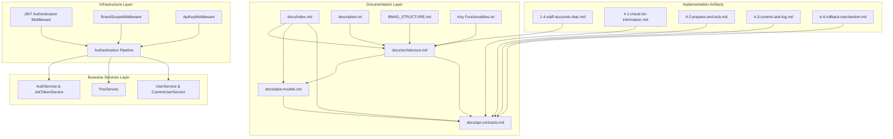
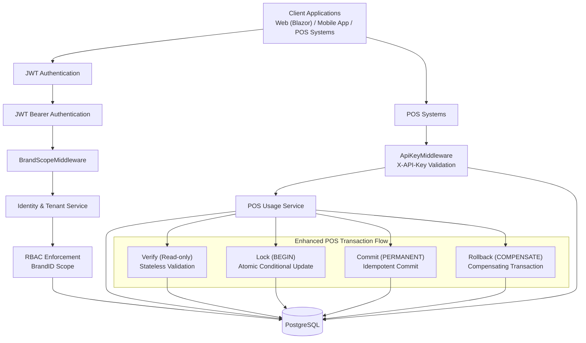
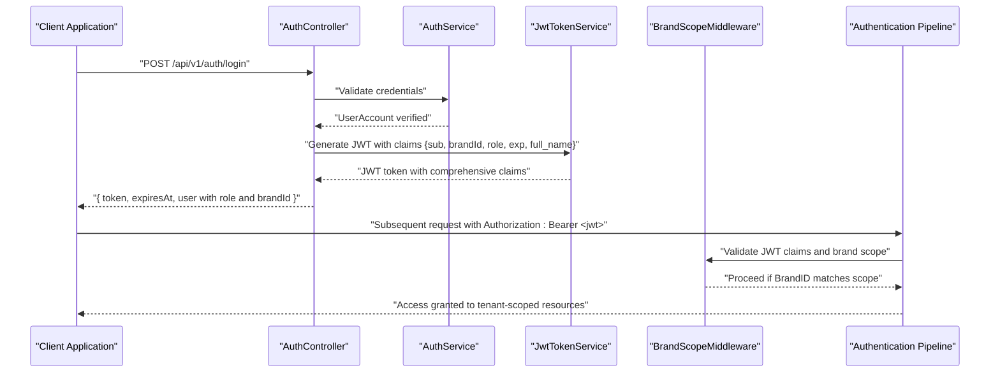
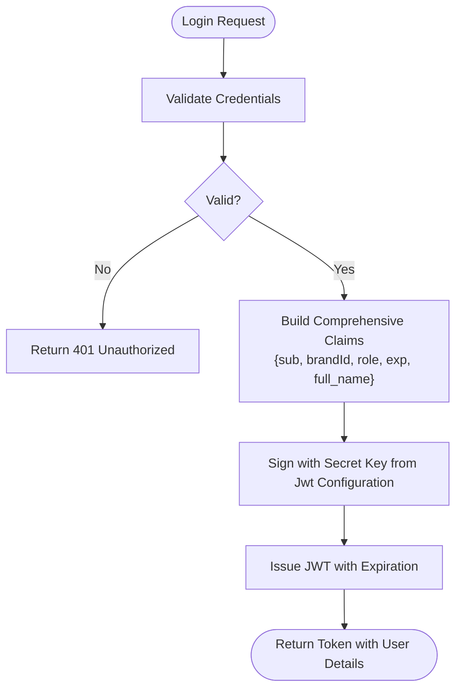
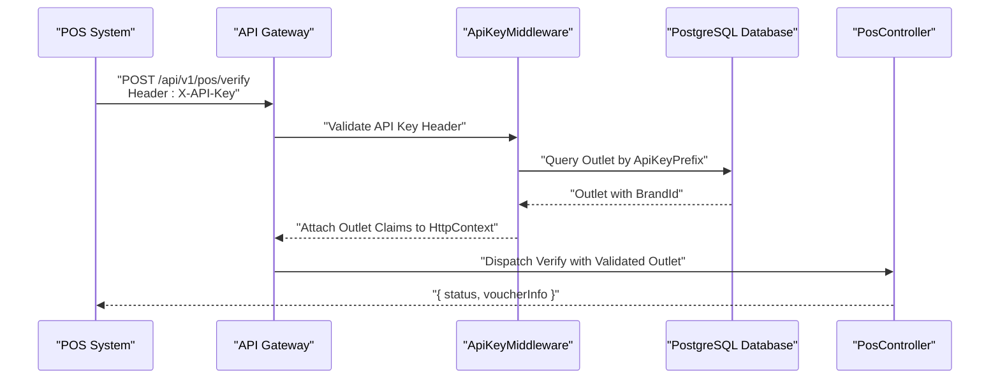
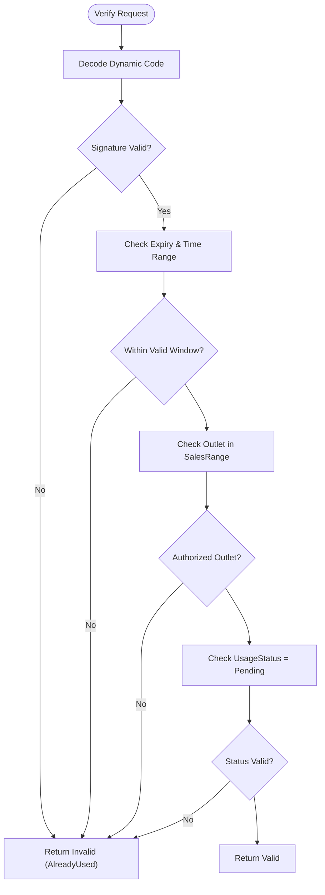
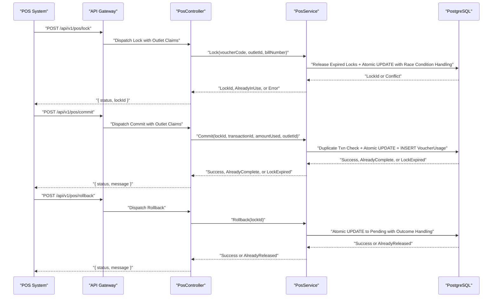
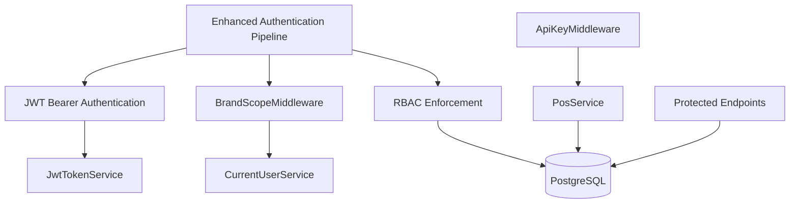

# Security Architecture

<cite>
**Referenced Files in This Document**
- [Program.cs](file://src/NonCash.API/Program.cs)
- [appsettings.json](file://src/NonCash.API/appsettings.json)
- [ApiKeyMiddleware.cs](file://src/NonCash.API/Middleware/ApiKeyMiddleware.cs)
- [BrandScopeMiddleware.cs](file://src/NonCash.API/Middleware/BrandScopeMiddleware.cs)
- [JwtTokenService.cs](file://src/NonCash.API/Services/JwtTokenService.cs)
- [CurrentUserService.cs](file://src/NonCash.API/Services/CurrentUserService.cs)
- [AuthController.cs](file://src/NonCash.API/Controllers/AuthController.cs)
- [AuthDtos.cs](file://src/NonCash.API/DTOs/AuthDtos.cs)
- [PosController.cs](file://src/NonCash.API/Controllers/PosController.cs)
- [IPosService.cs](file://src/NonCash.Core/Interfaces/IPosService.cs)
- [PosService.cs](file://src/NonCash.Core/Services/PosService.cs)
- [IJwtTokenService.cs](file://src/NonCash.Core/Interfaces/IJwtTokenService.cs)
- [ICurrentUserService.cs](file://src/NonCash.Core/Interfaces/ICurrentUserService.cs)
- [UserAccount.cs](file://src/NonCash.Core/Entities/UserAccount.cs)
- [Outlet.cs](file://src/NonCash.Core/Entities/Outlet.cs)
- [BMAD_STRUCTURE.md](file://BMAD_STRUCTURE.md)
- [description.txt](file://description.txt)
- [docs/index.md](file://docs/index.md)
- [docs/architecture.md](file://docs/architecture.md)
- [docs/data-models.md](file://docs/data-models.md)
- [docs/api-contracts.md](file://docs/api-contracts.md)
- [Key Functionalities.txt](file://Key Functionalities.txt)
- [1-4-staff-accounts-rbac.md](file://_bmad-output/implementation-artifacts/1-4-staff-accounts-rbac.md)
- [4-1-check-for-information.md](file://_bmad-output/implementation-artifacts/4-1-check-for-information.md)
- [4-2-prepare-and-lock.md](file://_bmad-output/implementation-artifacts/4-2-prepare-and-lock.md)
- [4-3-commit-and-log.md](file://_bmad-output/implementation-artifacts/4-3-commit-and-log.md)
- [4-4-rollback-mechanism.md](file://_bmad-output/implementation-artifacts/4-4-rollback-mechanism.md)
</cite>

## Update Summary
**Changes Made**
- Enhanced JWT token support with comprehensive claim structure and validation
- Added dedicated API key middleware for POS system authentication
- Implemented comprehensive role-based access control with multi-tenant enforcement
- Strengthened multi-tenant architecture with brand scoping middleware
- Integrated new authentication and authorization infrastructure throughout the platform

## Table of Contents
1. [Introduction](#introduction)
2. [Project Structure](#project-structure)
3. [Core Components](#core-components)
4. [Architecture Overview](#architecture-overview)
5. [Detailed Component Analysis](#detailed-component-analysis)
6. [Dependency Analysis](#dependency-analysis)
7. [Performance Considerations](#performance-considerations)
8. [Troubleshooting Guide](#troubleshooting-guide)
9. [Conclusion](#conclusion)
10. [Appendices](#appendices)

## Introduction
This document presents the enhanced security architecture for the NonCash SaaS platform. The architecture has been significantly strengthened with new JWT token support, dedicated API key middleware for POS systems, comprehensive role-based access control, and robust multi-tenant enforcement via BrandID. The platform now implements a layered security approach covering authentication mechanisms (JWT for web/member apps and API keys for POS), dynamic voucher code generation to prevent reuse and unauthorized scanning, and transaction security patterns for lock/commit/rollback with audit trails and integrity guarantees. Cross-cutting concerns such as role-based access control (RBAC), data encryption, and secure API communication are addressed alongside practical implementation guidance derived from the project's documentation and implementation artifacts.

## Project Structure
The NonCash project organizes its enhanced security-relevant logic across four primary layers with supporting documentation:
- Documentation layer: architecture, data models, API contracts, and implementation artifacts define security policies and flows.
- Backend services: microservices implementing identity, planning, approval, distribution, and usage orchestration with enhanced authentication.
- Infrastructure layer: middleware components providing authentication and authorization enforcement.
- Data access: PostgreSQL-backed repositories enforcing tenant scoping and transactional integrity.

```mermaid
graph TB
subgraph "Documentation Layer"
IDX["docs/index.md"]
ARCH["docs/architecture.md"]
DM["docs/data-models.md"]
API["docs/api-contracts.md"]
DESC["description.txt"]
BMAD["BMAD_STRUCTURE.md"]
KF["Key Functionalities.txt"]
end
subgraph "Infrastructure Layer"
JWTMW["JWT Authentication Middleware"]
BRANDMW["BrandScopeMiddleware"]
APIKEYMW["ApiKeyMiddleware"]
AUTHPIPE["Authentication Pipeline"]
end
subgraph "Business Services Layer"
AUTHSVC["AuthService & JwtTokenService"]
POSSVC["PosService"]
USERSVC["UserService & CurrentUserService"]
end
subgraph "Implementation Artifacts"
RBAC["1-4-staff-accounts-rbac.md"]
VERIFY["4-1-check-for-information.md"]
LOCK["4-2-prepare-and-lock.md"]
COMMIT["4-3-commit-and-log.md"]
ROLLBACK["4-4-rollback-mechanism.md"]
end
IDX --> ARCH
IDX --> DM
IDX --> API
ARCH --> DM
ARCH --> API
DM --> API
BMAD --> ARCH
DESC --> ARCH
KF --> ARCH
RBAC --> ARCH
VERIFY --> API
LOCK --> API
COMMIT --> API
ROLLBACK --> API
JWTMW --> AUTHPIPE
BRANDMW --> AUTHPIPE
APIKEYMW --> AUTHPIPE
AUTHPIPE --> AUTHSVC
AUTHPIPE --> POSSVC
AUTHPIPE --> USERSVC
```

**Diagram sources**
- [Program.cs:69-107](file://src/NonCash.API/Program.cs#L69-L107)
- [docs/index.md:1-41](file://docs/index.md#L1-L41)
- [docs/architecture.md:1-52](file://docs/architecture.md#L1-L52)
- [docs/data-models.md:1-98](file://docs/data-models.md#L1-L98)
- [docs/api-contracts.md:1-109](file://docs/api-contracts.md#L1-L109)
- [description.txt:1-31](file://description.txt#L1-L31)
- [BMAD_STRUCTURE.md:1-82](file://BMAD_STRUCTURE.md#L1-L82)
- [Key Functionalities.txt:1-167](file://Key Functionalities.txt#L1-L167)
- [1-4-staff-accounts-rbac.md:1-125](file://_bmad-output/implementation-artifacts/1-4-staff-accounts-rbac.md#L1-L125)
- [4-1-check-for-information.md:1-116](file://_bmad-output/implementation-artifacts/4-1-check-for-information.md#L1-L116)
- [4-2-prepare-and-lock.md:1-115](file://_bmad-output/implementation-artifacts/4-2-prepare-and-lock.md#L1-L115)
- [4-3-commit-and-log.md:1-116](file://_bmad-output/implementation-artifacts/4-3-commit-and-log.md#L1-L116)
- [4-4-rollback-mechanism.md:1-112](file://_bmad-output/implementation-artifacts/4-4-rollback-mechanism.md#L1-L112)

**Section sources**
- [Program.cs:69-107](file://src/NonCash.API/Program.cs#L69-L107)
- [docs/index.md:12-41](file://docs/index.md#L12-L41)
- [docs/architecture.md:5-52](file://docs/architecture.md#L5-L52)
- [description.txt:16-31](file://description.txt#L16-L31)
- [BMAD_STRUCTURE.md:37-82](file://BMAD_STRUCTURE.md#L37-L82)

## Core Components
- **Enhanced Multi-tenant Identity and RBAC**: JWT tokens carry comprehensive claims including subject (UserID), BrandID, role, and expiration; BrandID scopes all tenant-aware repository queries. Staff accounts are mapped to Brand and role, with strict enforcement of cross-brand access through BrandScopeMiddleware.
- **Dedicated POS Integration Security**: API Key authentication per outlet with dedicated ApiKeyMiddleware validating X-API-Key headers and attaching outlet claims to HTTP context for downstream processing.
- **Dynamic Voucher Code Generation**: Rotating codes (similar to JWT logic) prevent static reuse and unauthorized scanning; validation ensures expiry, time windows, and outlet scope.
- **Transactional Integrity**: POS flow enforces BEGIN (lock), COMMIT (permanent state change), and ROLLBACK (compensating transaction) with atomic updates, idempotency, and audit trail records.
- **Comprehensive Authentication Pipeline**: Layered approach combining JWT bearer authentication, custom brand scoping middleware, and API key validation for different client types.

**Section sources**
- [Program.cs:69-107](file://src/NonCash.API/Program.cs#L69-L107)
- [ApiKeyMiddleware.cs:1-69](file://src/NonCash.API/Middleware/ApiKeyMiddleware.cs#L1-L69)
- [BrandScopeMiddleware.cs:1-34](file://src/NonCash.API/Middleware/BrandScopeMiddleware.cs#L1-L34)
- [JwtTokenService.cs:1-59](file://src/NonCash.API/Services/JwtTokenService.cs#L1-L59)
- [docs/architecture.md:36-41](file://docs/architecture.md#L36-L41)
- [docs/api-contracts.md:5-109](file://docs/api-contracts.md#L5-L109)
- [Key Functionalities.txt:56-68](file://Key Functionalities.txt#L56-L68)
- [1-4-staff-accounts-rbac.md:19-44](file://_bmad-output/implementation-artifacts/1-4-staff-accounts-rbac.md#L19-L44)
- [4-1-check-for-information.md:13-43](file://_bmad-output/implementation-artifacts/4-1-check-for-information.md#L13-L43)
- [4-2-prepare-and-lock.md:13-39](file://_bmad-output/implementation-artifacts/4-2-prepare-and-lock.md#L13-L39)
- [4-3-commit-and-log.md:13-42](file://_bmad-output/implementation-artifacts/4-3-commit-and-log.md#L13-L42)
- [4-4-rollback-mechanism.md:13-38](file://_bmad-output/implementation-artifacts/4-4-rollback-mechanism.md#L13-L38)

## Architecture Overview
The enhanced security architecture integrates:
- **Multi-tenancy via BrandID**: Across identity, planning, approval, distribution, and usage services with comprehensive brand scoping enforcement.
- **Dual Authentication Mechanisms**:
  - JWT for web/member app users with comprehensive claim structure and validation.
  - API Keys for POS systems with dedicated middleware and outlet-specific authentication.
- **Enhanced Transaction Security**: POS flow with improved lock/commit/rollback operations, comprehensive validation, and robust audit trails.
- **Comprehensive RBAC**: Role-based access control with multi-tenant enforcement and strict authorization boundaries.

```mermaid
graph TB
Client["Client Applications<br/>Web (Blazor) / Mobile App / POS Systems"] --> Auth["JWT Authentication"]
Client --> POS["POS Systems"]
Auth --> JWTMW["JWT Bearer Authentication"]
JWTMW --> BrandMW["BrandScopeMiddleware"]
BrandMW --> IdentitySvc["Identity & Tenant Service"]
IdentitySvc --> RBAC["RBAC Enforcement<br/>BrandID Scope"]
POS --> ApiKeyMW["ApiKeyMiddleware<br/>X-API-Key Validation"]
ApiKeyMW --> PosSvc["POS Usage Service"]
PosSvc --> DB[("PostgreSQL")]
RBAC --> DB
ApiKeyMW --> DB
subgraph "Enhanced POS Transaction Flow"
Verify["Verify (Read-only)<br/>Stateless Validation"]
Lock["Lock (BEGIN)<br/>Atomic Conditional Update"]
Commit["Commit (PERMANENT)<br/>Idempotent Commit"]
Rollback["Rollback (COMPENSATE)<br/>Compensating Transaction"]
end
PosSvc --> Verify
PosSvc --> Lock
PosSvc --> Commit
PosSvc --> Rollback
Verify --> DB
Lock --> DB
Commit --> DB
Rollback --> DB
```

**Diagram sources**
- [Program.cs:69-107](file://src/NonCash.API/Program.cs#L69-L107)
- [ApiKeyMiddleware.cs:1-69](file://src/NonCash.API/Middleware/ApiKeyMiddleware.cs#L1-L69)
- [BrandScopeMiddleware.cs:1-34](file://src/NonCash.API/Middleware/BrandScopeMiddleware.cs#L1-L34)
- [PosController.cs:1-193](file://src/NonCash.API/Controllers/PosController.cs#L1-L193)
- [docs/architecture.md:17-35](file://docs/architecture.md#L17-L35)
- [docs/api-contracts.md:14-88](file://docs/api-contracts.md#L14-L88)
- [1-4-staff-accounts-rbac.md:28-44](file://_bmad-output/implementation-artifacts/1-4-staff-accounts-rbac.md#L28-L44)
- [4-1-check-for-information.md:13-43](file://_bmad-output/implementation-artifacts/4-1-check-for-information.md#L13-L43)
- [4-2-prepare-and-lock.md:13-39](file://_bmad-output/implementation-artifacts/4-2-prepare-and-lock.md#L13-L39)
- [4-3-commit-and-log.md:13-42](file://_bmad-output/implementation-artifacts/4-3-commit-and-log.md#L13-L42)
- [4-4-rollback-mechanism.md:13-38](file://_bmad-output/implementation-artifacts/4-4-rollback-mechanism.md#L13-L38)

## Detailed Component Analysis

### Enhanced Multi-Tenant Architecture with BrandID
- **Tenant Boundary**: BrandID isolates data between businesses in the SaaS environment. All tenant-scoped operations enforce BrandID at query time through comprehensive middleware enforcement.
- **Enhanced Identity and RBAC**:
  - JWT includes comprehensive claims: subject (UserID), BrandID, role, expiration, and full_name.
  - BrandID in JWT overrides any request-body BrandID for tenant-scoped endpoints.
  - Role-based rights govern access to planning, approval, distribution, and outlet/customer management within a Brand.
  - BrandScopeMiddleware enforces that non-admin users must have a brand_id in their token.
- **Middleware Enforcement**:
  - BrandScopeMiddleware validates JWT claims and ensures proper tenant assignment.
  - Authentication pipeline combines JWT bearer authentication with custom brand scoping.
  - Passwords are hashed with salt; JWT secret key is securely managed in configuration.

```mermaid
sequenceDiagram
participant Client as "Client Application"
participant Auth as "AuthController"
participant AuthService as "AuthService"
participant JwtSvc as "JwtTokenService"
participant BrandMW as "BrandScopeMiddleware"
participant AuthPipe as "Authentication Pipeline"
Client->>Auth : "POST /api/v1/auth/login"
Auth->>AuthService : "Validate credentials"
AuthService-->>Auth : "UserAccount verified"
Auth->>JwtSvc : "Generate JWT with claims {sub, brandId, role, exp, full_name}"
JwtSvc-->>Auth : "JWT token with comprehensive claims"
Auth-->>Client : "{ token, expiresAt, user with role and brandId }"
Client->>AuthPipe : "Subsequent request with Authorization : Bearer <jwt>"
AuthPipe->>BrandMW : "Validate JWT claims and brand scope"
BrandMW-->>AuthPipe : "Proceed if BrandID matches scope"
AuthPipe-->>Client : "Access granted to tenant-scoped resources"
```

**Diagram sources**
- [AuthController.cs:19-41](file://src/NonCash.API/Controllers/AuthController.cs#L19-L41)
- [JwtTokenService.cs:20-50](file://src/NonCash.API/Services/JwtTokenService.cs#L20-L50)
- [BrandScopeMiddleware.cs:14-32](file://src/NonCash.API/Middleware/BrandScopeMiddleware.cs#L14-L32)
- [Program.cs:69-107](file://src/NonCash.API/Program.cs#L69-L107)

**Section sources**
- [AuthController.cs:19-41](file://src/NonCash.API/Controllers/AuthController.cs#L19-L41)
- [JwtTokenService.cs:20-50](file://src/NonCash.API/Services/JwtTokenService.cs#L20-L50)
- [BrandScopeMiddleware.cs:14-32](file://src/NonCash.API/Middleware/BrandScopeMiddleware.cs#L14-L32)
- [Program.cs:69-107](file://src/NonCash.API/Program.cs#L69-L107)
- [1-4-staff-accounts-rbac.md:19-44](file://_bmad-output/implementation-artifacts/1-4-staff-accounts-rbac.md#L19-L44)
- [1-4-staff-accounts-rbac.md:101-117](file://_bmad-output/implementation-artifacts/1-4-staff-accounts-rbac.md#L101-L117)
- [docs/architecture.md:38](file://docs/architecture.md#L38)

### JWT Token Management (Web Applications)
- **Enhanced Login Flow**: Issues a signed JWT with comprehensive claims including subject (UserID), BrandID, role, expiration, and full_name.
- **Protected Endpoints**: All subsequent protected endpoints require Authorization: Bearer <JWT> with comprehensive claim validation.
- **Configuration Management**: JWT secret key must be at least 32 characters and stored in environment variables under the Jwt configuration section.
- **Token Validation**: Authentication pipeline validates issuer, audience, lifetime, and signing key with configurable clock skew.

```mermaid
flowchart TD
Start(["Login Request"]) --> Validate["Validate Credentials"]
Validate --> Valid{"Valid?"}
Valid --> |No| Return401["Return 401 Unauthorized"]
Valid --> |Yes| Claims["Build Comprehensive Claims<br/>{sub, brandId, role, exp, full_name}"]
Claims --> Sign["Sign with Secret Key from Jwt Configuration"]
Sign --> Issue["Issue JWT with Expiration"]
Issue --> End(["Return Token with User Details"])
```

**Diagram sources**
- [AuthController.cs:21-41](file://src/NonCash.API/Controllers/AuthController.cs#L21-L41)
- [JwtTokenService.cs:28-47](file://src/NonCash.API/Services/JwtTokenService.cs#L28-L47)
- [appsettings.json:12-16](file://src/NonCash.API/appsettings.json#L12-L16)

**Section sources**
- [AuthController.cs:21-41](file://src/NonCash.API/Controllers/AuthController.cs#L21-L41)
- [JwtTokenService.cs:20-59](file://src/NonCash.API/Services/JwtTokenService.cs#L20-L59)
- [docs/api-contracts.md:7](file://docs/api-contracts.md#L7)
- [appsettings.json:12-16](file://src/NonCash.API/appsettings.json#L12-L16)

### API Key Authentication (POS Integration)
- **Dedicated API Key Middleware**: Validates X-API-Key header for POS endpoints with route prefix /api/v1/pos.
- **Outlet-Specific Authentication**: Matches supplied key against outlet's ApiKeyPrefix and ensures outlet status is Active.
- **Context Attachment**: On successful validation, attaches outlet_id and brand_id to HttpContext.Items for downstream processing.
- **POS Endpoint Security**: All POS endpoints are gated by ApiKeyMiddleware and use outlet claims for authorization.

```mermaid
sequenceDiagram
participant POS as "POS System"
participant API as "API Gateway"
participant KeyMW as "ApiKeyMiddleware"
participant DB as "PostgreSQL Database"
participant PosCtrl as "PosController"
POS->>API : "POST /api/v1/pos/verify<br/>Header : X-API-Key"
API->>KeyMW : "Validate API Key Header"
KeyMW->>DB : "Query Outlet by ApiKeyPrefix"
DB-->>KeyMW : "Outlet with BrandId"
KeyMW-->>API : "Attach Outlet Claims to HttpContext"
API->>PosCtrl : "Dispatch Verify with Validated Outlet"
PosCtrl-->>POS : "{ status, voucherInfo }"
```

**Diagram sources**
- [ApiKeyMiddleware.cs:22-60](file://src/NonCash.API/Middleware/ApiKeyMiddleware.cs#L22-L60)
- [PosController.cs:22-52](file://src/NonCash.API/Controllers/PosController.cs#L22-L52)
- [Outlet.cs:15](file://src/NonCash.Core/Entities/Outlet.cs#L15)

**Section sources**
- [ApiKeyMiddleware.cs:1-69](file://src/NonCash.API/Middleware/ApiKeyMiddleware.cs#L1-L69)
- [PosController.cs:18-52](file://src/NonCash.API/Controllers/PosController.cs#L18-L52)
- [docs/api-contracts.md:14-34](file://docs/api-contracts.md#L14-L34)

### Dynamic Voucher Code Generation and Validation
- **Enhanced Voucher Code Logic**: Voucher code is dynamic (rotating) to prevent reuse and unauthorized scanning.
- **Comprehensive Validation**: Validation logic checks signature correctness, expiry date and time window constraints, outlet scope authorization, and usage status.
- **Stateless Verification**: Verify operation is read-only and never mutates state, ensuring idempotent operations.
- **Enhanced Error Handling**: Distinguishes between forged codes, expired codes, and outlet authorization failures.

```mermaid
flowchart TD
Start(["Verify Request"]) --> Decode["Decode Dynamic Code"]
Decode --> ValidateSig{"Signature Valid?"}
ValidateSig --> |No| Invalid["Return Invalid (Forged)"]
ValidateSig --> |Yes| CheckTime["Check Expiry & Time Range"]
CheckTime --> TimeOK{"Within Valid Window?"}
TimeOK --> |No| Invalid["Return Invalid (Expired/NotYetValid)"]
TimeOK --> CheckOutlet["Check Outlet in SalesRange"]
CheckOutlet --> OutletOK{"Authorized Outlet?"}
OutletOK --> |No| Invalid["Return Invalid (OutletNotAuthorized)"]
OutletOK --> CheckStatus["Check UsageStatus = Pending"]
CheckStatus --> StatusOK{"Status Valid?"}
StatusOK --> |No| Invalid["Return Invalid (AlreadyUsed)"]
StatusOK --> Valid["Return Valid"]
```

**Diagram sources**
- [PosService.cs:33-43](file://src/NonCash.Core/Services/PosService.cs#L33-L43)
- [PosService.cs:158-237](file://src/NonCash.Core/Services/PosService.cs#L158-L237)
- [Key Functionalities.txt:56](file://Key Functionalities.txt#L56)

**Section sources**
- [PosService.cs:33-43](file://src/NonCash.Core/Services/PosService.cs#L33-L43)
- [PosService.cs:158-237](file://src/NonCash.Core/Services/PosService.cs#L158-L237)
- [Key Functionalities.txt:56-68](file://Key Functionalities.txt#L56-L68)

### Enhanced POS Transaction Security: Lock/Commit/Rollback
- **Improved Lock (BEGIN)**:
  - Validates dynamic code, outlet scope, time window, and status with enhanced error handling.
  - Atomic conditional update Pending → InUse using TryAcquireLockAsync with race condition handling.
  - Returns LockID for subsequent commit/rollback with comprehensive idempotency support.
  - Enhanced duplicate detection for same outlet+bill combinations.
- **Robust Commit (PERMANENT)**:
  - Validates LockID and non-expired lock with duplicate transaction prevention.
  - Atomic update with duplicate transaction detection by TransactionId.
  - Inserts VoucherUsage record with comprehensive audit trail.
  - Idempotent handling for duplicate commits.
- **Enhanced Rollback (COMPENSATE)**:
  - Validates LockID and In-Use status with comprehensive outcome handling.
  - Atomic update reverting to Pending with enhanced error scenarios.
  - Does not create VoucherUsage records.
  - Idempotent handling for AlreadyReleased and LockNotFound scenarios.
- **Comprehensive Audit Trail**: VoucherUsage captures POSID, TransactionID, UsageDate, AmountUsed for complete traceability.

```mermaid
sequenceDiagram
participant POS as "POS System"
participant API as "API Gateway"
participant PosCtrl as "PosController"
participant PosSvc as "PosService"
participant DB as "PostgreSQL"
POS->>API : "POST /api/v1/pos/lock"
API->>PosCtrl : "Dispatch Lock with Outlet Claims"
PosCtrl->>PosSvc : "Lock(voucherCode, outletId, billNumber)"
PosSvc->>DB : "Release Expired Locks + Atomic UPDATE with Race Condition Handling"
DB-->>PosSvc : "LockId or Conflict"
PosSvc-->>PosCtrl : "LockId, AlreadyInUse, or Error"
PosCtrl-->>POS : "{ status, lockId }"
POS->>API : "POST /api/v1/pos/commit"
API->>PosCtrl : "Dispatch Commit with Outlet Claims"
PosCtrl->>PosSvc : "Commit(lockId, transactionId, amountUsed, outletId)"
PosSvc->>DB : "Duplicate Txn Check + Atomic UPDATE + INSERT VoucherUsage"
DB-->>PosSvc : "Success, AlreadyComplete, or LockExpired"
PosSvc-->>PosCtrl : "Success, AlreadyComplete, or LockExpired"
PosCtrl-->>POS : "{ status, message }"
POS->>API : "POST /api/v1/pos/rollback"
API->>PosCtrl : "Dispatch Rollback"
PosCtrl->>PosSvc : "Rollback(lockId)"
PosSvc->>DB : "Atomic UPDATE to Pending with Outcome Handling"
DB-->>PosSvc : "Success or AlreadyReleased"
PosSvc-->>PosCtrl : "Success or AlreadyReleased"
PosCtrl-->>POS : "{ status, message }"
```

**Diagram sources**
- [PosController.cs:58-95](file://src/NonCash.API/Controllers/PosController.cs#L58-L95)
- [PosController.cs:101-135](file://src/NonCash.API/Controllers/PosController.cs#L101-L135)
- [PosController.cs:140-167](file://src/NonCash.API/Controllers/PosController.cs#L140-L167)
- [PosService.cs:45-95](file://src/NonCash.Core/Services/PosService.cs#L45-L95)
- [PosService.cs:97-133](file://src/NonCash.Core/Services/PosService.cs#L97-L133)
- [PosService.cs:135-154](file://src/NonCash.Core/Services/PosService.cs#L135-L154)
- [docs/api-contracts.md:36-88](file://docs/api-contracts.md#L36-L88)

**Section sources**
- [PosController.cs:58-95](file://src/NonCash.API/Controllers/PosController.cs#L58-L95)
- [PosController.cs:101-135](file://src/NonCash.API/Controllers/PosController.cs#L101-L135)
- [PosController.cs:140-167](file://src/NonCash.API/Controllers/PosController.cs#L140-L167)
- [PosService.cs:45-95](file://src/NonCash.Core/Services/PosService.cs#L45-L95)
- [PosService.cs:97-133](file://src/NonCash.Core/Services/PosService.cs#L97-L133)
- [PosService.cs:135-154](file://src/NonCash.Core/Services/PosService.cs#L135-L154)
- [docs/data-models.md:46-62](file://docs/data-models.md#L46-L62)

### Data Encryption and Secure API Communication
- **Data-at-Rest**: PostgreSQL is the target database; encryption at rest should be enabled at the storage layer.
- **Data-in-Motion**: TLS termination at the ingress/load balancer; all internal and external APIs use HTTPS.
- **Secrets Management**: JWT signing key and API keys are stored in configuration files; never in source code.
- **Enhanced Hashing**: Passwords are hashed with salt using secure hashing algorithms; API keys are stored as hashes with prefix validation.

**Section sources**
- [description.txt:13](file://description.txt#L13)
- [appsettings.json:12-16](file://src/NonCash.API/appsettings.json#L12-L16)
- [Outlet.cs:15](file://src/NonCash.Core/Entities/Outlet.cs#L15)

### Enhanced Role-Based Access Control (RBAC)
- **Comprehensive Role Structure**:
  - Admin: full system access, cross-brand user management with unrestricted operations.
  - BrandManager: manage Outlets, Customers, view plans within Brand with administrative privileges.
  - Planner: create/edit VoucherPlanHeaders within Brand with planning capabilities.
  - Approver: approve/reject plans within Brand with authorization responsibilities.
- **Enhanced Enforcement**:
  - JWT carries comprehensive role claims; middleware enforces role-per-action with multi-tenant context.
  - BrandScopeMiddleware ensures non-admin users have proper brand assignment in JWT claims.
  - Multi-tenancy: BrandID in JWT overrides any request-body BrandID for tenant-scoped endpoints.
  - CurrentUserService provides centralized access to current user context across the application.

**Section sources**
- [UserAccount.cs:3-9](file://src/NonCash.Core/Entities/UserAccount.cs#L3-L9)
- [BrandScopeMiddleware.cs:21-28](file://src/NonCash.API/Middleware/BrandScopeMiddleware.cs#L21-L28)
- [CurrentUserService.cs:15-50](file://src/NonCash.API/Services/CurrentUserService.cs#L15-L50)
- [1-4-staff-accounts-rbac.md:19-44](file://_bmad-output/implementation-artifacts/1-4-staff-accounts-rbac.md#L19-L44)
- [1-4-staff-accounts-rbac.md:113-115](file://_bmad-output/implementation-artifacts/1-4-staff-accounts-rbac.md#L113-L115)

## Dependency Analysis
The enhanced security architecture depends on:
- **Authentication Pipeline**: JWT bearer authentication with comprehensive claim validation and BrandScopeMiddleware for tenant enforcement.
- **POS Processing**: Dedicated API key middleware for outlet authentication and POS service orchestration with database transactions.
- **User Context Management**: CurrentUserService providing centralized access to current user claims and brand context.
- **Data Models**: Entities enforcing referential integrity, outlet API key validation, and user role assignments.
- **Service Layer**: Enhanced PosService with comprehensive validation, error handling, and transaction management.

```mermaid
graph TB
AuthPipe["Enhanced Authentication Pipeline"] --> JWTAuth["JWT Bearer Authentication"]
AuthPipe --> BrandMW["BrandScopeMiddleware"]
JWTAuth --> JwtSvc["JwtTokenService"]
BrandMW --> CurrentUser["CurrentUserService"]
AuthPipe --> RBAC["RBAC Enforcement"]
ApiKeyMW["ApiKeyMiddleware"] --> PosSvc["PosService"]
PosSvc --> DB[("PostgreSQL")]
RBAC --> DB
AllEndpoints["Protected Endpoints"] --> DB
```

**Diagram sources**
- [Program.cs:69-107](file://src/NonCash.API/Program.cs#L69-L107)
- [JwtTokenService.cs:11-18](file://src/NonCash.API/Services/JwtTokenService.cs#L11-L18)
- [CurrentUserService.cs:6-13](file://src/NonCash.API/Services/CurrentUserService.cs#L6-L13)
- [ApiKeyMiddleware.cs:11-20](file://src/NonCash.API/Middleware/ApiKeyMiddleware.cs#L11-L20)
- [PosService.cs:6-31](file://src/NonCash.Core/Services/PosService.cs#L6-L31)
- [docs/architecture.md:25](file://docs/architecture.md#L25)
- [docs/data-models.md:46-62](file://docs/data-models.md#L46-L62)

**Section sources**
- [Program.cs:69-107](file://src/NonCash.API/Program.cs#L69-L107)
- [docs/architecture.md:25-35](file://docs/architecture.md#L25-L35)
- [docs/data-models.md:46-62](file://docs/data-models.md#L46-L62)

## Performance Considerations
- **Enhanced Concurrency Control**: Use conditional updates and row-level locking to prevent race conditions during lock acquisition with comprehensive race condition handling.
- **Improved Idempotency**: Design POS endpoints to tolerate retries without side effects with enhanced duplicate detection mechanisms.
- **Optimized Audit Logging**: Minimize write amplification by batching non-critical audit entries; keep VoucherUsage minimal and indexed for performance.
- **API Key Rotation**: Automate periodic rotation and maintain historical keys for short transition windows with enhanced security.
- **JWT Token Management**: Implement token expiration and refresh strategies to balance security and performance.
- **Database Optimization**: Indexes on BrandId, OutletId, and VoucherCode fields for optimal query performance.

## Troubleshooting Guide
Common issues and resolutions with enhanced error handling:
- **Invalid Dynamic Code**:
  - Cause: forged/expired/invalid signature or validation failure.
  - Resolution: return Invalid with specific reason; ensure client retries do not mutate state.
- **Outlet Not Authorized**:
  - Cause: POS outlet not in plan's SalesRange or outlet claims mismatch.
  - Resolution: enforce outlet scope validation; return Invalid with specific reason.
- **Already In Use**:
  - Cause: concurrent lock attempts or race conditions.
  - Resolution: return AlreadyInUse with LockId for idempotent handling; clients should wait or retry.
- **Lock Expired**:
  - Cause: background cleanup or manual timeout with enhanced TTL management.
  - Resolution: advise re-verify and re-lock; reject commit with LockExpired.
- **Already Completed**:
  - Cause: voucher already marked Complete with enhanced duplicate transaction detection.
  - Resolution: return AlreadyCompleted on rollback; do not create usage records.
- **Duplicate Commit/Rollback**:
  - Cause: network retry with enhanced idempotency handling.
  - Resolution: comprehensive idempotent handling; do not create duplicates.
- **JWT Validation Failures**:
  - Cause: expired tokens, invalid signatures, or missing claims.
  - Resolution: implement token refresh mechanisms and comprehensive error reporting.
- **API Key Authentication Issues**:
  - Cause: missing headers, invalid keys, or inactive outlets.
  - Resolution: enhanced error responses with specific failure reasons.

**Section sources**
- [PosController.cs:27-51](file://src/NonCash.API/Controllers/PosController.cs#L27-L51)
- [PosController.cs:63-94](file://src/NonCash.API/Controllers/PosController.cs#L63-L94)
- [PosController.cs:106-134](file://src/NonCash.API/Controllers/PosController.cs#L106-L134)
- [PosController.cs:145-166](file://src/NonCash.API/Controllers/PosController.cs#L145-L166)
- [ApiKeyMiddleware.cs:33-53](file://src/NonCash.API/Middleware/ApiKeyMiddleware.cs#L33-L53)
- [BrandScopeMiddleware.cs:21-28](file://src/NonCash.API/Middleware/BrandScopeMiddleware.cs#L21-L28)

## Conclusion
The enhanced NonCash security architecture establishes robust multi-tenancy via comprehensive BrandID enforcement, sophisticated authentication using JWT for web/member apps with enhanced claim structure and API keys for POS systems with dedicated middleware. The architecture incorporates comprehensive role-based access control with strict tenant isolation, dynamic code validation with enhanced security measures, and a secure, transactional voucher redemption flow with improved error handling and audit trails. The layered approach combining JWT bearer authentication, custom brand scoping middleware, and API key validation ensures transaction integrity, traceability, and protection against unauthorized access across all client types.

## Appendices
- **Enhanced Cross-Cutting Security Guidelines**:
  - Enforce HTTPS for all APIs with certificate validation.
  - Rotate JWT and API keys regularly with enhanced key management.
  - Store secrets in configuration files with proper environment variable management.
  - Monitor and log authentication failures, RBAC denials, and security events.
  - Implement comprehensive error handling with informative but non-sensitive error messages.
  - Regular security audits of authentication and authorization mechanisms.
  - Implement rate limiting and abuse detection for authentication endpoints.
  - Maintain comprehensive audit logs for all security-relevant operations.