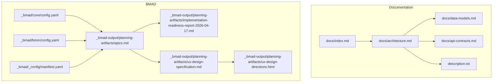
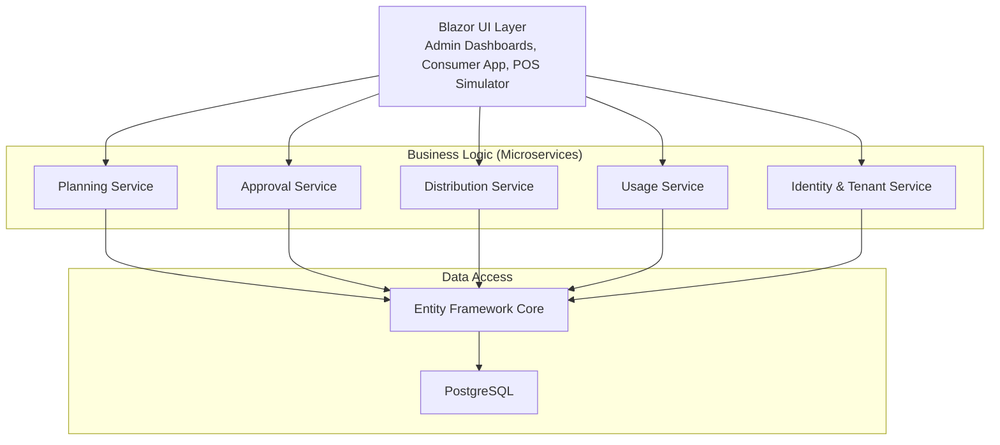
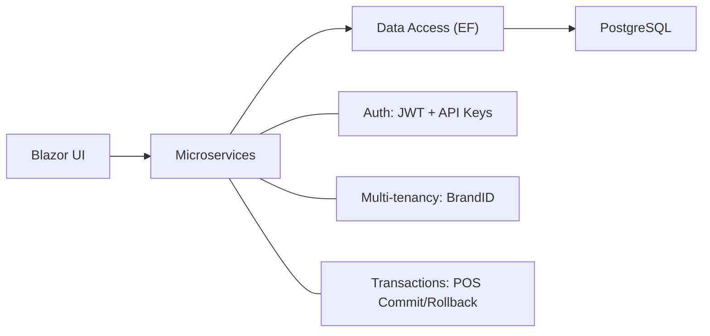
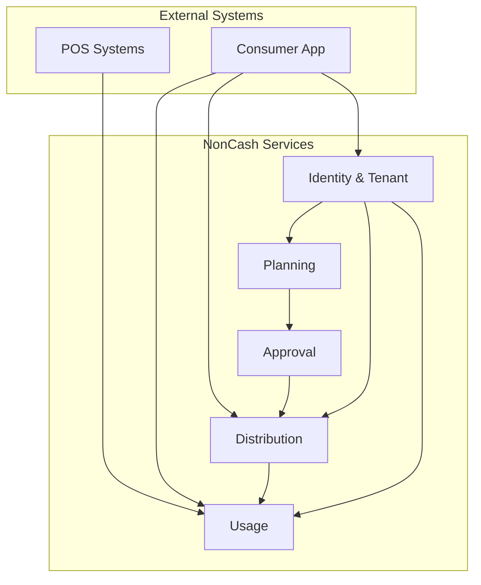
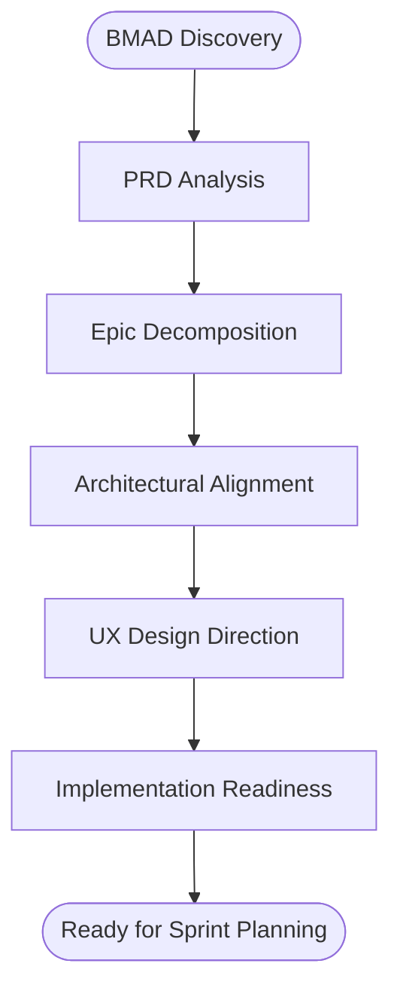

# System Architecture

<cite>
**Referenced Files in This Document**
- [architecture.md](file://docs/architecture.md)
- [index.md](file://docs/index.md)
- [data-models.md](file://docs/data-models.md)
- [api-contracts.md](file://docs/api-contracts.md)
- [description.txt](file://description.txt)
- [BMAD_STRUCTURE.md](file://BMAD_STRUCTURE.md)
- [epics.md](file://_bmad-output/planning-artifacts/epics.md)
- [implementation-readiness-report-2026-04-17.md](file://_bmad-output/planning-artifacts/implementation-readiness-report-2026-04-17.md)
- [ux-design-specification.md](file://_bmad-output/planning-artifacts/ux-design-specification.md)
- [ux-design-directions.html](file://_bmad-output/planning-artifacts/ux-design-directions.html)
- [config.yaml (core)](file://_bmad/core/config.yaml)
- [config.yaml (bmm)](file://_bmad/bmm/config.yaml)
- [manifest.yaml](file://_bmad/_config/manifest.yaml)
</cite>

## Table of Contents
1. [Introduction](#introduction)
2. [Project Structure](#project-structure)
3. [Core Components](#core-components)
4. [Architecture Overview](#architecture-overview)
5. [Detailed Component Analysis](#detailed-component-analysis)
6. [Dependency Analysis](#dependency-analysis)
7. [Performance Considerations](#performance-considerations)
8. [Troubleshooting Guide](#troubleshooting-guide)
9. [Conclusion](#conclusion)
10. [Appendices](#appendices)

## Introduction
This document presents the system architecture for the NonCash SaaS platform, focusing on the three-layer SaaS architecture and microservices design pattern. The platform enables businesses to plan, approve, distribute, and securely redeem vouchers through POS systems. The architecture separates concerns across:
- User Interface Layer (Blazor)
- Business Logic Layer (Microservices)
- Data Access Layer (Entity Framework, PostgreSQL)

Cross-cutting concerns include security (JWT and API keys), multi-tenancy (BrandID), and transaction management for POS redemption workflows.

## Project Structure
The repository organizes documentation and BMAD artifacts to support the 3-layer SaaS architecture and microservices design. Key areas:
- docs: High-level architecture, data models, API contracts, and project index
- _bmad: BMAD configuration and planning artifacts
- Root-level project description and functional specifications

**Diagram sources**
- [index.md:1-41](file://docs/index.md#L1-L41)
- [architecture.md:1-52](file://docs/architecture.md#L1-L52)
- [data-models.md:1-98](file://docs/data-models.md#L1-L98)
- [api-contracts.md:1-109](file://docs/api-contracts.md#L1-L109)
- [description.txt:1-31](file://description.txt#L1-L31)
- [config.yaml (core):1-10](file://_bmad/core/config.yaml#L1-L10)
- [config.yaml (bmm):1-17](file://_bmad/bmm/config.yaml#L1-L17)
- [manifest.yaml:1-25](file://_bmad/_config/manifest.yaml#L1-L25)
- [epics.md:1-319](file://_bmad-output/planning-artifacts/epics.md#L1-L319)
- [implementation-readiness-report-2026-04-17.md:1-127](file://_bmad-output/planning-artifacts/implementation-readiness-report-2026-04-17.md#L1-L127)
- [ux-design-specification.md:1-353](file://_bmad-output/planning-artifacts/ux-design-specification.md#L1-L353)
- [ux-design-directions.html:1-133](file://_bmad-output/planning-artifacts/ux-design-directions.html#L1-L133)

**Section sources**
- [index.md:1-41](file://docs/index.md#L1-L41)
- [architecture.md:1-52](file://docs/architecture.md#L1-L52)
- [BMAD_STRUCTURE.md:1-82](file://BMAD_STRUCTURE.md#L1-L82)

## Core Components
- User Interface (Blazor): Manages user interactions for administrators and consumers, dashboards for planning/approval, and voucher usage visualization.
- Business Logic (Microservices): Organized into Planning, Approval, Distribution, Usage, and Identity & Tenant services. Each service encapsulates domain capabilities and collaborates via internal APIs.
- Data Access (Entity Framework, PostgreSQL): Repository pattern abstracts persistence, enabling transactions and schema evolution.

Security and multi-tenancy:
- JWT-based authentication for users
- API keys for POS systems
- Multi-tenancy enforced by BrandID to isolate data per tenant

**Section sources**
- [architecture.md:9-35](file://docs/architecture.md#L9-L35)
- [description.txt:11-25](file://description.txt#L11-L25)
- [epics.md:55-76](file://_bmad-output/planning-artifacts/epics.md#L55-L76)

## Architecture Overview
The NonCash architecture follows a 3-layer SaaS design with microservices for the Business Logic Layer. The UI layer (Blazor) communicates with microservices, which in turn interact with the Data Access Layer (Entity Framework, PostgreSQL). Cross-cutting concerns include security, multi-tenancy, and transaction management.

**Diagram sources**
- [architecture.md:9-35](file://docs/architecture.md#L9-L35)
- [data-models.md:1-98](file://docs/data-models.md#L1-L98)

## Detailed Component Analysis

### Planning Service
Responsibilities:
- Create and manage VoucherPlanHeader and VoucherPlanDetail
- Enforce approval workflow and plan versioning
- Generate dynamic voucher codes aligned with security requirements

Data models:
- VoucherPlanHeader and VoucherPlanDetail define campaign metadata, validity ranges, budgets, and target metrics.

Security and multi-tenancy:
- BrandID isolation ensures only authorized Brand contexts can create or modify plans.

**Section sources**
- [data-models.md:9-43](file://docs/data-models.md#L9-L43)
- [epics.md:139-197](file://_bmad-output/planning-artifacts/epics.md#L139-L197)

### Approval Service
Responsibilities:
- Route plans for review and enforce approval status transitions
- Maintain audit trail of approvals and rejections

Workflow:
- Pending → Approved/Rejected with approver identity recorded

**Section sources**
- [epics.md:171-183](file://_bmad-output/planning-artifacts/epics.md#L171-L183)

### Distribution Service
Responsibilities:
- Support self-purchase (Sale) and batch promotion (Promotion)
- Track distribution events and enable batch transfer (Gifting)

Data models:
- VoucherDistribution records method, timestamps, and ownership changes

**Section sources**
- [data-models.md:55-62](file://docs/data-models.md#L55-L62)
- [epics.md:199-257](file://_bmad-output/planning-artifacts/epics.md#L199-L257)

### Usage Service
Responsibilities:
- POS redemption orchestration with Lock → Commit/Rollback
- Maintain VoucherUsage logs with POS and transaction identifiers

API contracts:
- Verify, Lock, Redeem (Commit), and Rollback endpoints

**Section sources**
- [data-models.md:46-54](file://docs/data-models.md#L46-L54)
- [api-contracts.md:14-87](file://docs/api-contracts.md#L14-L87)
- [epics.md:259-317](file://_bmad-output/planning-artifacts/epics.md#L259-L317)

### Identity & Tenant Service
Responsibilities:
- RBAC for UserAccount roles (Admin, Planner, Approver)
- Multi-tenancy via BrandID and Outlet scoping
- Customer profile management

**Section sources**
- [data-models.md:63-98](file://docs/data-models.md#L63-L98)
- [epics.md:79-137](file://_bmad-output/planning-artifacts/epics.md#L79-L137)

### Data Access Layer (Repository Pattern)
- Entity Framework Core with PostgreSQL
- Repository pattern decouples business logic from persistence
- Transactions ensure consistency for POS usage workflows

**Section sources**
- [architecture.md:28-35](file://docs/architecture.md#L28-L35)
- [data-models.md:1-98](file://docs/data-models.md#L1-L98)

### UI Layer (Blazor)
- Admin dashboards for planning and reporting
- Consumer wallet for voucher viewing and transfer
- POS simulator with color-coded feedback

**Section sources**
- [architecture.md:9-16](file://docs/architecture.md#L9-L16)
- [ux-design-specification.md:17-85](file://_bmad-output/planning-artifacts/ux-design-specification.md#L17-L85)

### Microservices Integration Patterns
- Internal service-to-service calls for cross-domain operations
- Event-driven updates (e.g., SignalR for real-time consumer app updates)
- API contracts define POS and member app interactions

**Section sources**
- [api-contracts.md:5-109](file://docs/api-contracts.md#L5-L109)
- [ux-design-specification.md:206-267](file://_bmad-output/planning-artifacts/ux-design-specification.md#L206-L267)

## Dependency Analysis
The system exhibits clear layering and bounded contexts:
- UI depends on microservices
- Microservices depend on the Data Access Layer
- Data Access Layer depends on PostgreSQL

**Diagram sources**
- [architecture.md:9-35](file://docs/architecture.md#L9-L35)
- [data-models.md:1-98](file://docs/data-models.md#L1-L98)
- [api-contracts.md:5-109](file://docs/api-contracts.md#L5-L109)

**Section sources**
- [architecture.md:36-52](file://docs/architecture.md#L36-L52)
- [data-models.md:1-98](file://docs/data-models.md#L1-L98)

## Performance Considerations
- Asynchronous processing for large-scale distribution (batch generation)
- Real-time UI updates via SignalR to minimize polling overhead
- UI optimization for mobile and POS terminals with minimal DOM and responsive breakpoints
- Database indexing and transaction boundaries for POS redemption to reduce contention

[No sources needed since this section provides general guidance]

## Troubleshooting Guide
Common areas to investigate:
- POS redemption failures: Verify Lock/Commit/Rollback sequences and transaction boundaries
- Authentication issues: Confirm JWT tokens and API keys for POS systems
- Multi-tenancy errors: Ensure BrandID propagation across requests
- UI responsiveness: Validate asynchronous tasks and real-time updates

**Section sources**
- [api-contracts.md:14-87](file://docs/api-contracts.md#L14-L87)
- [ux-design-specification.md:206-267](file://_bmad-output/planning-artifacts/ux-design-specification.md#L206-L267)

## Conclusion
NonCash employs a robust 3-layer SaaS architecture with microservices to achieve scalability, maintainability, and strong security. The separation of concerns, combined with explicit cross-cutting concerns (security, multi-tenancy, transactions), provides a solid foundation for voucher lifecycle management from planning to POS redemption.

[No sources needed since this section summarizes without analyzing specific files]

## Appendices

### System Context Diagrams

**Diagram sources**
- [epics.md:55-76](file://_bmad-output/planning-artifacts/epics.md#L55-L76)
- [api-contracts.md:14-109](file://docs/api-contracts.md#L14-L109)

### BMAD Methodology Implementation
- Business objectives and target users drive service boundaries
- Three-layer architecture and microservices align with project goals
- Data models and repository pattern support maintainability
- Security measures (API keys, JWT) integrated across layers
- Planning artifacts (epics, readiness report) validate coverage and quality

**Diagram sources**
- [BMAD_STRUCTURE.md:1-82](file://BMAD_STRUCTURE.md#L1-L82)
- [epics.md:1-319](file://_bmad-output/planning-artifacts/epics.md#L1-L319)
- [implementation-readiness-report-2026-04-17.md:1-127](file://_bmad-output/planning-artifacts/implementation-readiness-report-2026-04-17.md#L1-L127)

**Section sources**
- [BMAD_STRUCTURE.md:1-82](file://BMAD_STRUCTURE.md#L1-L82)
- [epics.md:1-319](file://_bmad-output/planning-artifacts/epics.md#L1-L319)
- [implementation-readiness-report-2026-04-17.md:1-127](file://_bmad-output/planning-artifacts/implementation-readiness-report-2026-04-17.md#L1-L127)