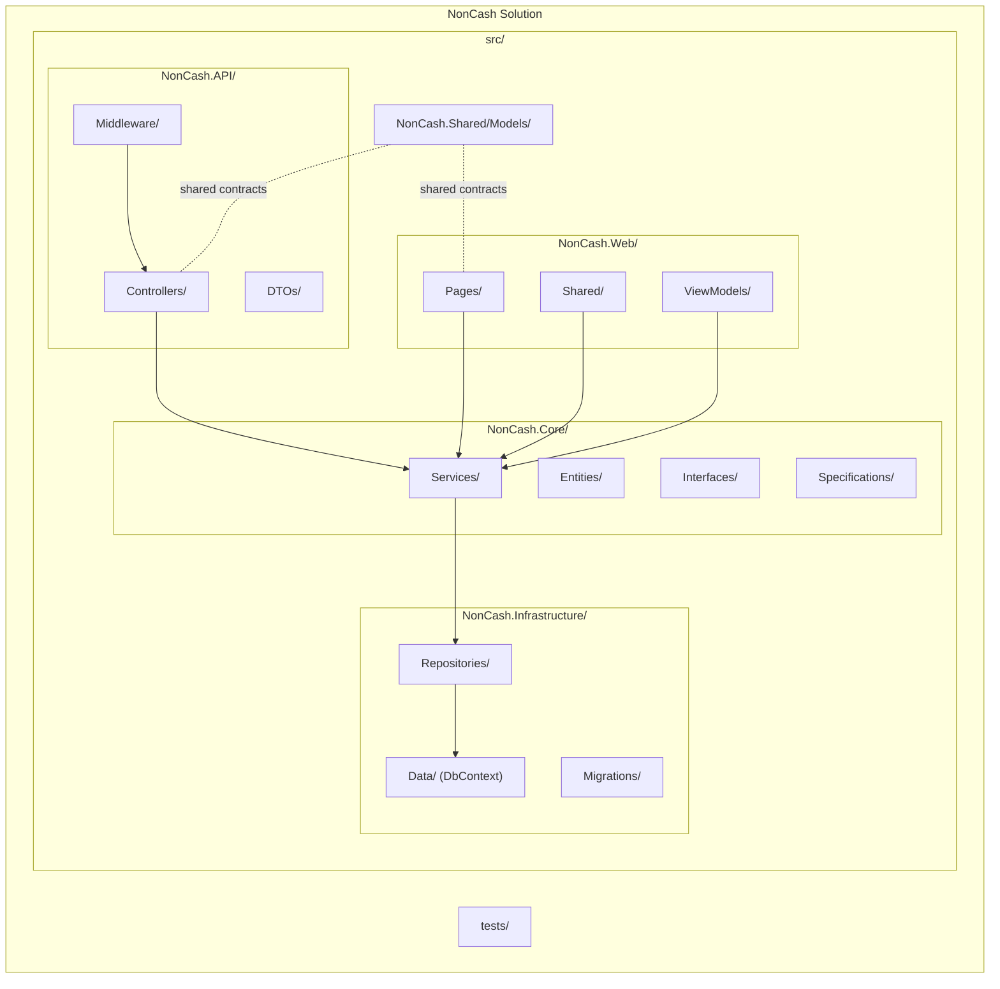
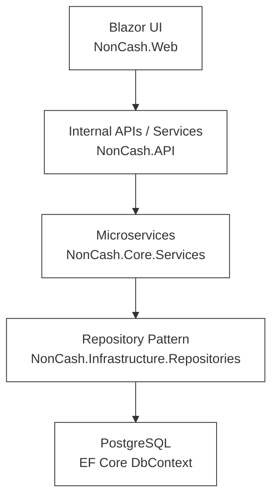
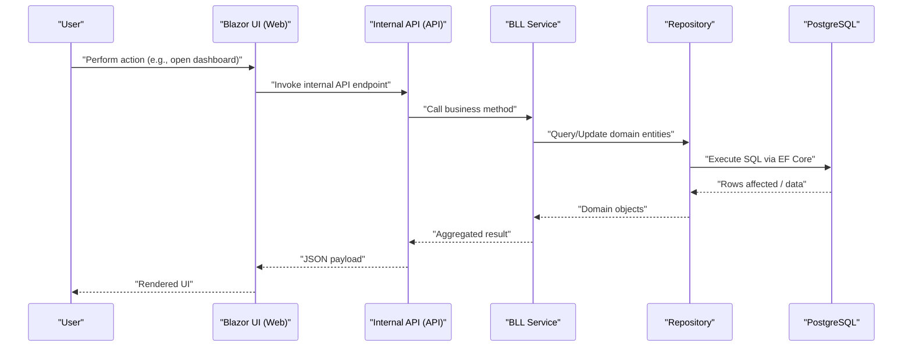
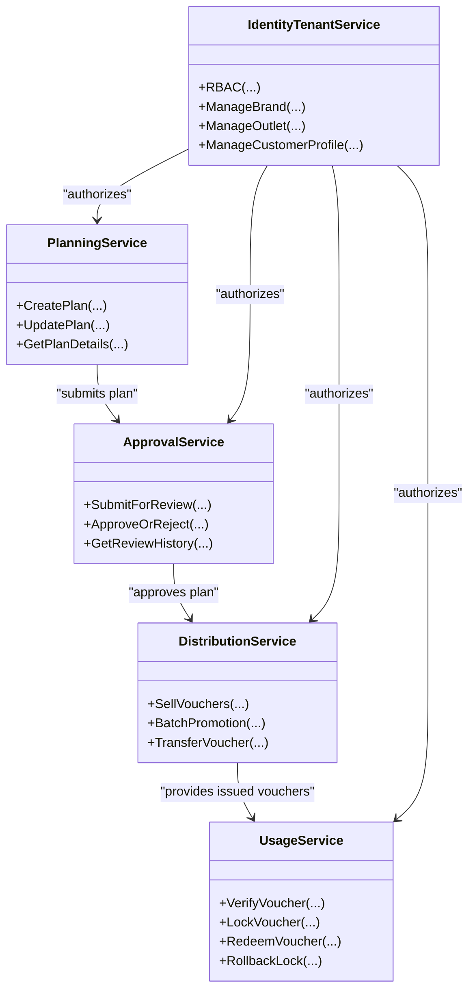
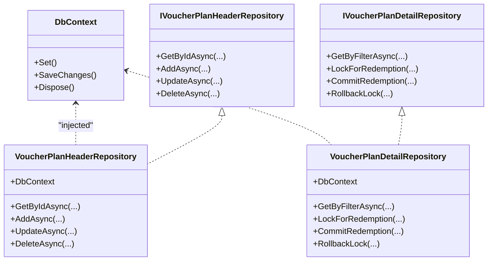
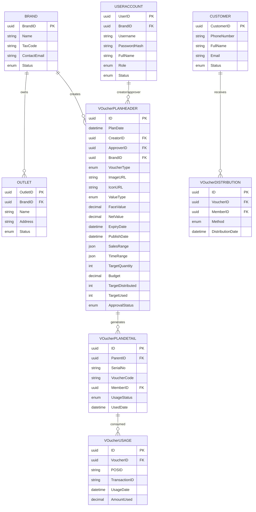
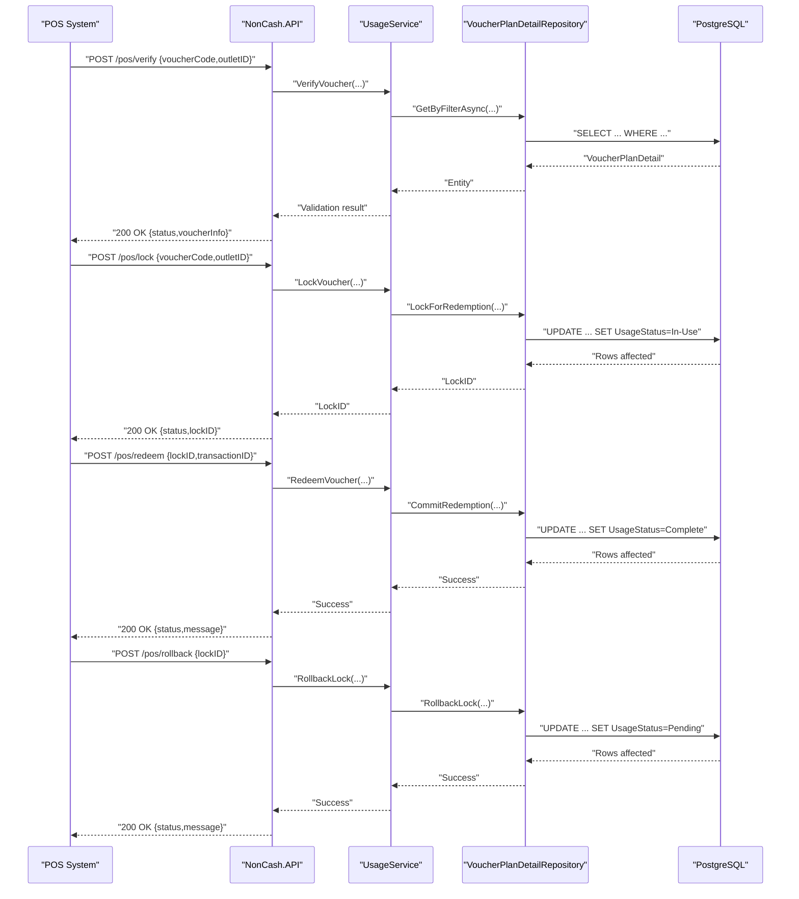
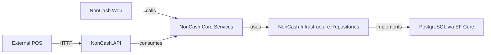

# Three-Layer Architecture

<cite>
**Referenced Files in This Document**
- [architecture.md](file://docs/architecture.md)
- [data-models.md](file://docs/data-models.md)
- [api-contracts.md](file://docs/api-contracts.md)
- [source-tree-analysis.md](file://docs/source-tree-analysis.md)
- [index.md](file://docs/index.md)
- [description.txt](file://description.txt)
- [BMAD_STRUCTURE.md](file://BMAD_STRUCTURE.md)
- [implementation-readiness-report-2026-04-17.md](file://_bmad-output/planning-artifacts/implementation-readiness-report-2026-04-17.md)
- [epics.md](file://_bmad-output/planning-artifacts/epics.md)
- [ux-design-specification.md](file://_bmad-output/planning-artifacts/ux-design-specification.md)
</cite>

## Table of Contents
1. [Introduction](#introduction)
2. [Project Structure](#project-structure)
3. [Core Components](#core-components)
4. [Architecture Overview](#architecture-overview)
5. [Detailed Component Analysis](#detailed-component-analysis)
6. [Dependency Analysis](#dependency-analysis)
7. [Performance Considerations](#performance-considerations)
8. [Troubleshooting Guide](#troubleshooting-guide)
9. [Conclusion](#conclusion)
10. [Appendices](#appendices)

## Introduction
This document explains the three-layer SaaS architecture of NonCash: User Interface Layer (Blazor frontend), Business Logic Layer (C#/.NET Core microservices), and Data Access Layer (Entity Framework Core with PostgreSQL). It details responsibilities, technologies, and communication patterns across layers, and demonstrates how the layered architecture enforces separation of concerns, scalability, and maintainability. It also shows how independent development and deployment of services are supported, and provides component interaction diagrams that trace data flow from GUI through the Business Logic Layer to the Data Access Layer.

## Project Structure
The NonCash project organizes code into a clean 3-layer structure with dedicated folders for each layer and supporting cross-cutting concerns. The target layout is defined in the source tree analysis and aligns with the 3-layer SaaS architecture.

**Diagram sources**
- [source-tree-analysis.md:7-34](file://docs/source-tree-analysis.md#L7-L34)

**Section sources**
- [source-tree-analysis.md:3-34](file://docs/source-tree-analysis.md#L3-L34)
- [index.md:9](file://docs/index.md#L9)

## Core Components
- User Interface Layer (Blazor)
  - Responsibilities: Manage user interactions for business admins and marketing staff, provide dashboards for production planning and approval tracking, visualize voucher usage and performance metrics.
  - Communication: Calls into the Business Logic Layer via service-to-service calls or internal APIs.
  - Technologies: Blazor Server or WebAssembly.
- Business Logic Layer (BLL)
  - Organization: Structured as microservices for loose coupling and independent scalability.
  - Key services: Planning Service, Approval Service, Distribution Service, Usage Service, Identity & Tenant Service.
  - Security: Implements JWT-based authentication and specialized logic for dynamic voucher code generation.
- Data Access Layer (DAL)
  - Technology: Entity Framework Core with PostgreSQL.
  - Pattern: Repository Pattern for data abstraction.
  - Responsibilities: Handle all database CRUD operations, decoupled from BLL, manage database consistency through transactions (especially for POS usage).

These responsibilities and technologies are defined consistently across the architecture and system documentation.

**Section sources**
- [architecture.md:9-34](file://docs/architecture.md#L9-L34)
- [description.txt:16-21](file://description.txt#L16-L21)
- [BMAD_STRUCTURE.md:39-56](file://BMAD_STRUCTURE.md#L39-L56)

## Architecture Overview
NonCash adopts a 3-layer SaaS architecture:
- Layer 1 (GUI): Blazor application for management staff and dashboards.
- Layer 2 (BLL): C#/.NET Core microservices encapsulating business capabilities.
- Layer 3 (DAL): PostgreSQL-backed EF Core repositories abstracting persistence.

**Diagram sources**
- [architecture.md:9-34](file://docs/architecture.md#L9-L34)
- [source-tree-analysis.md:10-28](file://docs/source-tree-analysis.md#L10-L28)

## Detailed Component Analysis

### User Interface Layer (Blazor)
- Responsibilities
  - Manage user interactions for business admins and marketing staff.
  - Provide dashboards for production planning and approval tracking.
  - Visualize voucher usage and performance metrics.
- Technologies
  - Blazor Server or WebAssembly.
- Interaction with BLL
  - Communicates with the Business Logic Layer via service-to-service calls or internal APIs.

**Diagram sources**
- [architecture.md:9-15](file://docs/architecture.md#L9-L15)
- [source-tree-analysis.md:19-22](file://docs/source-tree-analysis.md#L19-L22)
- [source-tree-analysis.md:23-26](file://docs/source-tree-analysis.md#L23-L26)

**Section sources**
- [architecture.md:9-15](file://docs/architecture.md#L9-L15)
- [source-tree-analysis.md:19-22](file://docs/source-tree-analysis.md#L19-L22)

### Business Logic Layer (Microservices)
- Responsibilities
  - Encapsulate business capabilities and orchestrate workflows.
  - Enforce business rules and maintain consistency across operations.
- Organization
  - Structured as microservices for loose coupling and independent scalability.
- Key services
  - Planning Service: plan creation, budgeting, and targets.
  - Approval Service: routing and state management of plan reviews.
  - Distribution Service: sales, batch promotions, and inbox delivery.
  - Usage Service: POS redemption workflow (Lock → Commit/Rollback).
  - Identity & Tenant Service: RBAC for UserAccount, multi-tenancy for Brand & Outlet, profile management for Customer.
- Security
  - JWT-based authentication and specialized logic for dynamic voucher code generation.

**Diagram sources**
- [architecture.md:20-26](file://docs/architecture.md#L20-L26)

**Section sources**
- [architecture.md:17-26](file://docs/architecture.md#L17-L26)
- [epics.md:26-37](file://_bmad-output/planning-artifacts/epics.md#L26-L37)

### Data Access Layer (EF Core + PostgreSQL)
- Responsibilities
  - Handle all database CRUD operations.
  - Decoupled from BLL, enabling easy schema updates or technology changes.
  - Manage database consistency through transactions, especially for POS usage.
- Pattern
  - Repository Pattern for data abstraction.
- Technologies
  - Entity Framework Core with PostgreSQL.

**Diagram sources**
- [source-tree-analysis.md:15-18](file://docs/source-tree-analysis.md#L15-L18)
- [data-models.md:9-42](file://docs/data-models.md#L9-L42)

**Section sources**
- [architecture.md:28-34](file://docs/architecture.md#L28-L34)
- [data-models.md:7-98](file://docs/data-models.md#L7-L98)
- [source-tree-analysis.md:15-18](file://docs/source-tree-analysis.md#L15-L18)

### Data Models and Transactions
- Core entities and relationships are relational (PostgreSQL) and managed via EF Core.
- Example entities:
  - VoucherPlanHeader (plan header)
  - VoucherPlanDetail (individual vouchers)
  - VoucherUsage (POS redemption history)
  - VoucherDistribution (distribution tracking)
  - Brand, Outlet, UserAccount, Customer (identity and operations)

**Diagram sources**
- [data-models.md:9-98](file://docs/data-models.md#L9-L98)

**Section sources**
- [data-models.md:9-98](file://docs/data-models.md#L9-L98)

### POS Integration API (External Consumer)
- Overview
  - Base URL: https://api.noncash.service/v1
  - Authentication: API Key (Header: X-API-Key) and JWT (Bearer Token)
  - Format: JSON
- Endpoints
  - Verify Voucher: POST /pos/verify
  - Lock Voucher: POST /pos/lock
  - Redeem Voucher (Commit): POST /pos/redeem
  - Rollback Lock: POST /pos/rollback
- Member App API
  - List My Vouchers: GET /member/vouchers (Authorization: Bearer <JWT>)
  - Transfer Voucher: POST /member/transfer

**Diagram sources**
- [api-contracts.md:5-109](file://docs/api-contracts.md#L5-L109)
- [data-models.md:46-53](file://docs/data-models.md#L46-L53)
- [data-models.md:34-42](file://docs/data-models.md#L34-L42)

**Section sources**
- [api-contracts.md:5-109](file://docs/api-contracts.md#L5-L109)

## Dependency Analysis
- Separation of concerns
  - UI depends on BLL abstractions; BLL depends on DAL abstractions; DAL depends on database storage.
- Coupling and cohesion
  - Microservices encapsulate cohesive business capabilities; repositories abstract persistence.
- External dependencies
  - POS systems integrate via RESTful API with API Key and JWT authentication.
- Multi-tenancy and identity
  - BrandID isolates tenant data; Identity & Tenant Service manages RBAC and profiles.

**Diagram sources**
- [source-tree-analysis.md:10-28](file://docs/source-tree-analysis.md#L10-L28)
- [architecture.md:36-40](file://docs/architecture.md#L36-L40)

**Section sources**
- [source-tree-analysis.md:10-28](file://docs/source-tree-analysis.md#L10-L28)
- [architecture.md:36-40](file://docs/architecture.md#L36-L40)

## Performance Considerations
- Layered architecture enables:
  - Independent scaling of UI, microservices, and database.
  - Technology substitution within layers (e.g., swapping databases or UI frameworks) without affecting other layers.
  - Clear boundaries for caching, batching, and transaction management at the DAL level.
- Practical guidance:
  - Use asynchronous patterns in BLL and DAL to minimize blocking.
  - Apply pagination and filtering at the UI and BLL to reduce payload sizes.
  - Employ connection pooling and efficient queries in EF Core.
  - Keep UI logic lean; delegate heavy computation to microservices.

[No sources needed since this section provides general guidance]

## Troubleshooting Guide
- Multi-tenancy isolation failures
  - Ensure BrandID is enforced in all queries and writes.
- POS double-spending risks
  - Verify that Lock → Commit/Rollback sequences are executed atomically in the Usage Service and DAL.
- Authentication errors
  - Confirm API Key presence for POS and JWT validity for internal calls.
- Transaction anomalies
  - Audit repository-level updates and ensure transactions wrap critical operations.

**Section sources**
- [architecture.md:36-40](file://docs/architecture.md#L36-L40)
- [data-models.md:46-53](file://docs/data-models.md#L46-L53)

## Conclusion
NonCash’s three-layer SaaS architecture cleanly separates concerns across the Blazor UI, C#/.NET Core microservices, and PostgreSQL-backed EF Core DAL. This design supports scalability, maintainability, and independent development/deployment of services. The explicit separation of responsibilities, repository pattern, and microservice organization enable robust, extensible systems that can evolve with changing business needs while preserving transactional integrity and strong security controls.

[No sources needed since this section summarizes without analyzing specific files]

## Appendices

### Benefits of the 3-Layer SaaS Pattern for NonCash
- Separation of concerns: UI, business logic, and data are clearly separated, simplifying development and maintenance.
- Scalability: Each layer can be scaled independently; microservices allow targeted horizontal scaling.
- Maintainability: Changes in one layer rarely impact others; DAL can evolve without touching UI or BLL.
- Security: Centralized identity and tenant management, plus dynamic voucher codes, protect sensitive operations.
- Independent deployment: Microservices can be deployed and versioned separately, enabling continuous delivery.

**Section sources**
- [architecture.md:5-52](file://docs/architecture.md#L5-L52)
- [index.md:34-37](file://docs/index.md#L34-L37)

### UX and Frontend Guidance
- UI framework choices: Blazor for admin dashboards; Tailwind-based custom components for customer-facing experiences.
- Component strategy: Use MudBlazor for admin grids and Ant Design Blazor where appropriate; keep client app lightweight with Tailwind.

**Section sources**
- [ux-design-specification.md:116-128](file://_bmad-output/planning-artifacts/ux-design-specification.md#L116-L128)
- [ux-design-specification.md:276-292](file://_bmad-output/planning-artifacts/ux-design-specification.md#L276-L292)