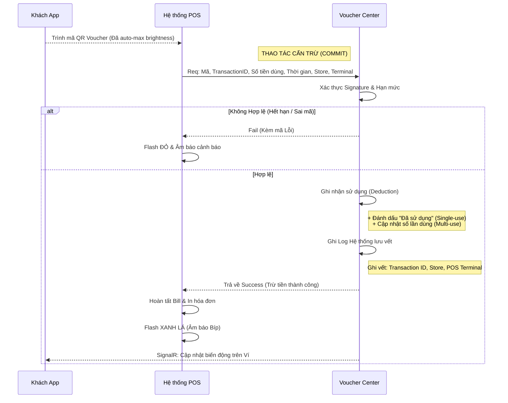
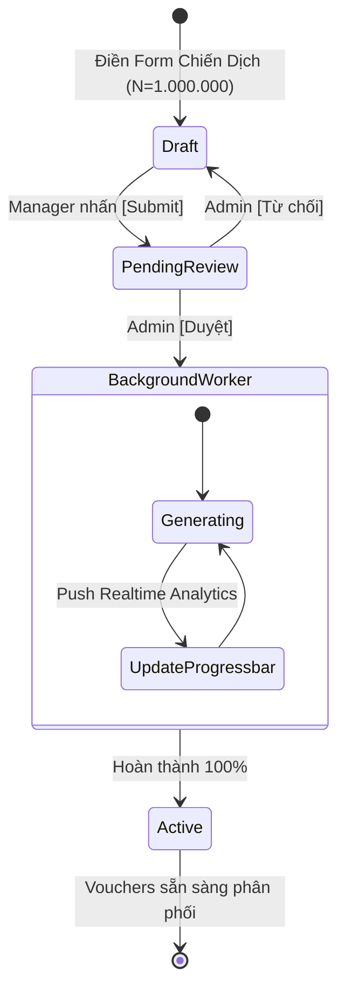

# UX Design Specification NonCash

**Author:** Bac
**Date:** 2026-04-17

---

<!-- UX design content will be appended sequentially through collaborative workflow steps -->

## Executive Summary

### Project Vision
NonCash là một nền tảng SaaS kiến trúc 3 lớp, chuyên tối ưu hóa trọn vòng đời của vòng luân chuyển Voucher Số: Từ khâu xét duyệt ngân sách, phân phối đa kênh (mua bán/khuyến mãi) đến lúc quy đổi bảo mật qua POS 6-steps. 

### Target Users
- **Brand Managers:** Người dùng B2B, cần tương tác qua các bảng điều khiển (Dashboards) dày đặc số liệu, thao tác quản trị phức tạp.
- **End Consumers (B2B/B2C):** Khách hàng hoặc tổ chức sỉ, cần một giao diện Ví Voucher tối giản, trực quan cho các thao tác Mua và Cho/Tặng (Transfer).
- **POS Cashiers:** Nhân viên tại quầy vật lý, cần điểm chạm có tính phản hồi tốc độ, trạng thái màu sắc gắt gao rõ ràng khi xử lý mã động.

### Key Design Challenges
- Đơn giản hóa quá trình phân bổ mã voucher lô lớn (Batch Distribution / Transfer) mà không cồng kềnh.
- Thiết kế hệ thống cảnh báo (Warning/Error flows) dễ hiểu ở quầy POS khi hệ thống Back-end rollback mã.

### Design Opportunities
- Thể hiện sự sống động của "Mã động an ninh xoay vòng" bằng UI đếm ngược thời gian như Token, tạo cảm giác công nghệ cao cho Consumers.
- Ứng dụng Glassmorphism và layout trung tâm cho Dashboard lập kế hoạch của Manager để mang dáng vấp Premium.

## Core User Experience

### Defining Experience
Hành động quan trọng nhất, mang tính "sinh tử" của nền tảng là quá trình **Trình mã - Quẹt mã tại POS (Redemption)**. Mọi thao tác lập kế hoạch hay mua bán trước đó đều vô nghĩa nếu giây phút thanh toán gặp lỗi.
Trải nghiệm phải mang tính "Ma thuật" (Magical): Code được sinh ra sống động, quẹt cái là xong, bỏ qua mọi khái niệm chờ đợi.

### Platform Strategy
- **Cho Bảng điều khiển Quản trị (Manager/Admin):** Dùng Web Application (Blazor) tối ưu cho màn hình Desktop, chú trọng Layout không gian rộng (Widescreen) để hiển thị Data Grid / Chart.
- **Cho Người dùng cuối (Consumers/Khách hàng sỉ):** Ưu tiên Mobile-first Web App hoặc PWA. Cần giao diện vuốt/chạm mượt mà, tải nhanh ngay cả ở điều kiện 3G/4G yếu.
- **Cho Quầy POS:** Tích hợp gọn lẹ (API), phản hồi trạng thái hoàn toàn bằng bảng màu báo động (Xanh-Đỏ-Vàng) trên thiết bị của thu ngân, không cần đọc chữ.

### Effortless Interactions
1. **Ví mã Động (Dynamic Voucher Viewer):** Khách hàng mở app là mã QR to đùng "nhảy số" liên tục ngay giữa màn hình, không cần bấm thêm nút "Hiển thị mã".
2. **Batch Generation:** Người quản lý nhập số lượng N=1.000.000 và bấm cấp phép, thanh tiến trình tự động tải nền, không làm đơ giật UI.
3. **Chuyển nhượng (Transfer) 1 chạm:** Chọn số điện thoại từ danh bạ/Excel, ấn nút là Voucher bay thẳng đến túi người nhận mà không qua những màn hình cảnh báo cồng kềnh.

### Critical Success Moments
- **Tiếng "Bíp" cấn trừ (The Green Beep):** Khi thu ngân quẹt mã, hệ thống Lock -> Checkout -> Commit diễn ra dưới 0.5 giây. Trả về đúng 1 thông báo SUCCESS xanh lè. Đây là khoảnh khắc người dùng thấy an tâm tuyệt đối.
- **Biểu đồ Real-time:** Khi Brand Manager nhìn thấy số lượng Voucher đã sử dụng (Redeemed) nhảy số "live" trên Dashboard.

### Experience Principles
1. **Trực quan hóa sự an toàn (Security You Can See):** Các cơ chế bảo mật (như mã xoắn động) phải được biểu diễn ra ngoài bằng hiệu ứng đếm ngược thời gian để User cảm nhận được nó đang tự bảo vệ họ.
2. **Giấu nhẹm sự phức tạp (Transparent Complexity):** Khối lượng tính toán rollback/commit 6 bước ở back-end không bao giờ được phép làm rối mắt người dùng.
3. **Màu sắc thay lời nói (Color over Text):** Tại các điểm thao tác khẩn trương (POS), dẹp hết chữ, dùng màu và khối để làm tín hiệu.

## Desired Emotional Response

### Primary Emotional Goals
- **Brand Managers:** Trao quyền (Empowered), Kiểm soát toàn diện (In control) và Tự tin (Confident).
- **Khách hàng cuối (Consumers):** An tâm tuyệt đối (Secure), Tin tưởng (Trustful) và Thích thú (Delighted) khi nhận được quà.
- **Thu ngân (Cashiers):** Nhẹ nhõm (Relieved) và Tốc độ (Efficient).

### Emotional Journey Mapping
- **Khi Khách hàng mở ứng dụng:** Cảm thấy Ngạc nhiên & Thích thú vì mã QR sinh ra có hiệu ứng bộ đếm thời gian.
- **Khi Thu ngân thao tác quét mã đứt điểm:** Cảm giác Nhẹ nhõm. Một cú flash màn hình Xanh lá báo hiệu xong ngay lập tức!
- **Khi Quản lý cấp cao duyệt đợt phát hành 1 Triệu Voucher:** Cảm giác Quyền lực vô song. Chỉ một nút bấm và thanh tiến trình chạy mượt mà.

### Micro-Emotions
- **Sự Tin tưởng (Trust) lấn át Sự Nghi ngờ (Skepticism):** Bằng cách cho người dùng thấy rành rành mã voucher "đang sống" và nhảy liên tục cứ mỗi 30s.
- **Sự Tự tin (Confidence) triệt tiêu Sự Phân vân (Confusion):** Bằng cách phân định rạch ròi màu sắc ở POS.

### Design Implications
- **Niềm tin của Khách hàng $\rightarrow$ UX Tokens:** Thêm một vòng tròn loading mỏng bao quanh mã QR/Barcode. Cứ 30s vòng tròn sẽ reset.
- **Sự tự tin của Thu ngân $\rightarrow$ Flash Screen UI:** UI của POS nháy màu toàn bộ màn hình hoặc hiện một dấu Checkmark khổng lồ.
- **Sức mạnh của Quản lý $\rightarrow$ Layout Chữ ký:** Sử dụng Typography số thật to, các nút [Duyệt] / [Từ chối] phải to bản, tách bạch bằng màu sắc.

### Emotional Design Principles
- UI phải "đồng cảm" với sự khẩn trương của Thu ngân.
- UI phải "xoa dịu" sự nghi ngờ của Khách hàng bằng hình ảnh bảo mật động.
- UI phải "tôn vinh" quyền thiết lập chiến dịch của Manager.

## UX Pattern Analysis & Inspiration

### Inspiring Products Analysis
1. **Google Authenticator / Authy:**
   - *Điểm xuất sắc UX:* Xử lý mô hình "Mã biến động liên tục" vô cùng thanh thoát. Hiển thị dãy số to, rõ và một vòng cung thời gian nhỏ gọn đếm ngược bên cạnh.
   - *Áp dụng cho:* Trải nghiệm khách hàng hiển thị mã Dynamic Voucher code.
2. **Starbucks App / Apple Wallet:**
   - *Điểm xuất sắc UX:* Trải nghiệm thanh toán (Redemption). Khi người dùng nhấn vào thẻ/voucher, ứng dụng lập tức phóng to mã Barcode/QR lên chiếm 80% màn hình, và tự động tăng max độ sáng.
   - *Áp dụng cho:* Màn hình trình mã Voucher tại quầy POS.
3. **Stripe Dashboard / Shopify Admin:**
   - *Điểm xuất sắc UX:* Bậc thầy về B2B Dashboard. Các nút bấm tác vụ chính nổi bật, cấu trúc Sidebar tối ưu cho màn hình rộng (Widescreen).
   - *Áp dụng cho:* Cổng quản trị phân phối Voucher của Brand Manager.

### Transferable UX Patterns
- **Tự động đẩy sáng màn hình (Auto-max Brightness):** Cho app người dùng khi chạm vào chi tiết Voucher. Sẽ giảm tới 90% lỗi quẹt mã không nhận.
- **Micro-animation đếm ngược:** Vòng tròn chạy ngược 30 giây đặt quanh mã QR Code (học từ Authenticator). Giúp thể hiện tính bảo mật cao (NFR1).
- **Cấu trúc Widescreen Sidebar:** Áp dụng cho Brand Admin. Nhìn tổng quan mọi chức năng trong một cái liếc mắt.

### Anti-Patterns to Avoid
- **Hamburger Menu cho B2B Desktop:** Dẹp! Tất cả Menu phải phơi ra ở Sidebar bên trái.
- **Mã QR bé tí xíu hoặc quá nhiều text xung quanh:** Khiến máy quét của quầy POS không đọc được do nhiễu vật liệu ảnh.
- **Popup xác nhận nhiều lớp (Confirmation Fatigue):** Chỉ áp dụng popup cho tác vụ đổi Tiền / Duyệt Plan.

### Design Inspiration Strategy
- **Sẽ ÁP DỤNG (Adopt):** UX "Giữ màn hình sáng" của Starbucks và Thiết kế Data-grid rõ nét của Stripe.
- **Sẽ BIẾN TẤU (Adapt):** Logic đếm ngược của Google Authenticator sẽ biến thành viền quét vòng tròn quanh mã QR.
- **Sẽ BÀI TRỪ (Avoid):** Giấu tính năng vào các Dropdown sâu vô tận.

## Design System Foundation

### 1.1 Design System Choice
Áp dụng chiến lược **Hybrid Design System (Lai ghép)**:
1. **Dành cho Balo B2B (Brand Manager/Admin):** Khuyến nghị sử dụng **MudBlazor** (dựa trên Material Design) hoặc **Ant Design Blazor**.
2. **Dành cho Balo B2C (Customer Voucher Wallet):** Khuyến nghị sử dụng **Tailwind CSS** kết hợp với custom components.

### Rationale for Selection
- **MudBlazor / Ant Design (Cho Admin):** Các nền tảng này có sẵn những thành phần dữ liệu "nặng đô" như Data-grids (Bảng biểu), Date-pickers (Chọn ngày tháng), Pagination (Phân trang) phức tạp. Việc dùng hàng có sẵn giúp tiết kiệm 70% thời gian code giao diện cho khối Back-office, đảm bảo sự nghiêm túc, chuẩn mực.
- **Tailwind CSS (Cho Khách hàng):** Ứng dụng B2C cần cá tính riêng, hiệu ứng mượt mà (như Glassmorphism) và các vi hiệu ứng (Vòng đếm ngược của mã động). Tailwind mang tính linh hoạt tuyệt đối ("Themeable") để tùy biến trải nghiệm "như phép thuật" mà không bị cứng nhắc như Material.

### Implementation Approach
- **Thiết lập Base:** Tách bạch 2 Layout. `AdminLayout.razor` sẽ import script/css của thư viện MudBlazor. `ClientLayout.razor` sẽ được build độc lập bằng Tailwind CLI.
- **Tối ưu Tốc độ:** Với phía Khách hàng, chỉ load các utility CSS thực sự dùng (qua PurgeCSS của Tailwind) để đảm bảo tốc độ mở app (Redemption) siêu tốc bằng 3G/4G.

### Customization Strategy
- **Design Tokens (Biến số thiết kế):** Khởi tạo một file `_variables.scss` hoặc `tailwind.config.js` chứa mã màu chuẩn của thương hiệu (Brand Colors), hệ thống Typography (Inter hoặc Roboto) để đồng bộ trải nghiệm từ B2B đến B2C.
## Defining Core Experience

### 2.1 Defining Experience
Khoảnh khắc quyết định thành/bại của NonCash: **Khách hàng đưa điện thoại ra -> Thu ngân dùng súng tít mã -> Hệ thống ăn khớp trong 0.5 giây**. 
Nếu chúng ta làm trải nghiệm này mượt như Apple Pay hay Momo, khách hàng sẽ yêu thích nó. Ngược lại, nếu thu ngân phải loay hoay bắt vòng lặp đọc mã lỗi, ứng dụng sẽ bị tẩy chay.

### 2.2 User Mental Model
- **Kỳ vọng:** Khách hàng kỳ vọng giống như lúc thanh toán bằng App ngân hàng: Mở app sẽ thấy mã liền, đưa ra quét nghe "bíp" là thanh toán xong, đi về.
- **Vấn đề thường gặp:** Các app hiện tại hay bị lỗi độ sáng màn hình thấp, hoặc mã tĩnh bị chụp màn hình gửi đi gửi lại gây gian lận. 
- **Cách người dùng lách luật:** Họ hay chụp màn hình (Screenshot) để gửi cho bạn bè dùng giùm -> Đây là rủi ro bảo mật lớn nhất mà UX phải giải quyết.

### 2.3 Success Criteria
- Mã QR/Barcode hiện ra trong <= 1 giây sau khi ấn "Sử dụng".
- Độ sáng màn hình tự động đẩy lên MAX 100%.
- Cú pháp thanh toán tại POS trả về kết quả dưới 500ms (0.5s).
- Rào cản Screenshot: Giao diện phải báo hiệu rõ ràng mã này là "mã sống" (chụp ảnh sẽ không xài được).

### 2.4 Novel UX Patterns
- **Cũ (Established):** Thao tác đưa mã QR ra cho súng quét (Đã rất quen thuộc).
- **Mới (Novel):** Mã QR sẽ có bộ đếm giờ (30s) và cảnh báo chạy chữ *“Mã thay đổi liên tục. Cấm chụp màn hình”* ở viền dưới. 

### 2.5 Experience Mechanics
1. **Khởi phát (Initiation):**
   - User chạm vào nút [Dùng ngay] trên cái Voucher. 
   - App giữ cho màn hình không bị tắt (Screen lock prevention) và tự tăng độ sáng.
2. **Tương tác (Interaction):**
   - Một QR code khổng lồ (kèm Barcode bên dưới) hiện ra.
   - Vòng tròn đếm ngược xoay dần về 0 sau mỗi 30s. Khi về 0, mã QR chớp nhẹ một cái để đổi sang mã mới.
3. **Phản hồi (Feedback):**
   - Màn hình POS nhá lên một khối XANH LÁ CÂY bự chảng, hoặc một khối ĐỎ nếu mã nảy sinh lỗi.
4. **Hoàn thành (Completion):**
   - Trạng thái Voucher trên điện thoại Khách hàng tự động trượt sang tab "Đã dùng".

## Visual Design Foundation

### Color System
- **Primary Color:** Deep Tech Blue (`#0A2540`). Màu xanh đen thẫm mang lại cảm giác bảo mật tuyệt đối.
- **Accent Color:** Vibrant Mint Green (`#20D489`). Màu xanh bạc hà dạ quang dùng cho nút bấm chính và hiệu ứng thành công.
- **Semantic Colors:** 
  - *Error:* Bright Red (`#E02424`) cho voucher hết hạn/lỗi.
  - *Pending/Lock:* Amber (`#F59E0B`) cho trạng thái chờ POS xử lý.

### Typography System
- **Typeface duy nhất:** `Inter` (Google Fonts). Phù hợp tuyệt vời cho số liệu tài chính và rõ nét trên Mobile.
- **Hierarchy:**
  - POS / QRCode PIN: `64px` Bold.
  - Data-grid Admin: `14px` Regular.

### Spacing & Layout Foundation
- **B2B Admin Dashboard (Dense Layout):** Hệ quy chiếu 4px/8px. Tối đa hóa dữ liệu hiển thị.
- **B2C Consumer App (Airy Layout):** Hệ quy chiếu 16px. Khoảng cách rộng rãi tránh chạm nhầm trên điện thoại.

### Accessibility Considerations
- **Contrast Ratios:** Chữ trên phông nền Primary Blue bắt buộc là Trắng (White) để đạt chuẩn WCAG AAA.
- **Color-blindness Safe:** Ở quầy POS, trạng thái báo động kèm Icon rõ ràng (Dấu X hoặc Dấu Tick ✔️) cực lớn.

## Design Direction Decision

### Design Directions Explored
Bản Preview HTML đã giới thiệu 3 phương án:
1. **Minimal Bank:** Tối giản, nền trắng, chữ Navy. Đề cao tính chuyên nghiệp, rõ ràng tuyệt đối.
2. **Neon Cyber:** Giao diện tối (Dark mode) viền phản quang Mint. Đề cao cảm giác bảo mật công nghệ cao.
3. **Glassmorphism:** Sử dụng dải màu Gradient và hiệu ứng kính mờ (Backdrop-blur) để bo viền mã QR Voucher.

### Chosen Direction
- **Phương án được chọn:** Direction 3 (Glassmorphism).

### Design Rationale
- Lựa chọn này xuất sắc trong việc mang lại cảm giác **Tương lai (Future), Mượt mà (Fluidity)** và **Đẳng cấp (Premium)** cho trải nghiệm nhận/tặng Voucher. Nó làm cho một chiếc điện thoại di động bình thường khi mở app lên cũng có giao diện như những hệ thống thẻ tín dụng cao cấp cấp độ Bạch kim/Đen (Elite). Việc kết hợp vòng đếm ngược chạy giấu chìm sau lớp kính mờ không gây rối mắt nhưng vẫn đủ sức mạnh truyền tải thông điệp "Đây là mã được bảo vệ bằng sức mạnh tính toán hiện đại".

### Implementation Approach
- Khối Front-end App/PWA (Customer) sẽ sử dụng tiện ích `backdrop-filter` của Tailwind CSS.
- Mảng màu nền sử dụng dải Gradient chạy ngang từ Indigo, Purple đến Emerald.
- Thẻ Component chính mang background trong suốt `rgba(255,255,255,0.05)` viền bo góc lớn (`rounded-3xl` hoặc `rounded-[3rem]`).

## User Journey Flows

### 1. Luồng Thanh toán tại quầy POS (The Defining Experience Journey)
Luồng thao tác được chốt chặt về mặt nghiệp vụ truyền nhận dữ liệu giữa máy POS vật lý và hệ thống máy chủ trung tâm (Voucher Center), hỗ trợ xử lý linh hoạt 2 dòng thẻ: Single-use và Multi-use.

### 2. Luồng Brand Manager phát hành Voucher số lượng lớn (Batch Generation)
Giải quyết bài toán tạo 1.000.000 mã Voucher mà không làm treo trình duyệt nhờ Background Task.

### Flow Optimization Principles (Nguyên tắc Tối ưu)
- **Tối giản nút bấm (Zero-click philosophy tại POS):** Thu ngân không cần bấm thêm nút "Đồng ý" nào trên màn hình máy tính sau khi quét mã. Nếu hệ thống trả `Hợp lệ`, việc cấn trừ giá trị bill là tự động.
- **Tách luồng xử lý nặng (Asynchronous Magic):** Mọi hành động có số lượng lớn (Batch) đều đẩy sang *BackgroundWorker* để giao diện không bị treo.
- **Phản hồi thời gian thực (Real-time loops):** Sử dụng SignalR để App Khách hàng ngay lập tức cập nhật trạng thái Voucher mà không cần tải lại trang.

## Component Strategy

### Design System Components (Thư viện dùng sẵn)
Ưu tiên sử dụng 100% MudBlazor cho phân hệ Thương hiệu (Brand Admin) để đẩy nhanh tiến độ làm các tính năng quản trị:
- **MudDataGrid:** Xử lý hiển thị danh sách hàng triệu Voucher, đi kèm khả năng lướt (Virtualize), Lọc, và Phân trang (Pagination) mượt mà.
- **MudDateRangePicker:** Dùng để set thời hạn bắt đầu/kết thúc cho chiến dịch.
- **MudDrawer & MudAppBar:** Tạo khung sườn Sidebar Navigation hiện đại, ổn định cho giao diện màn hình rộng.

### Custom Components (Thành phần Tự Thiết kế hoàn toàn)
Với ứng dụng của Khách hàng, chúng ta không dùng MudBlazor để tránh nặng trang mà sẽ code tay 2 siêu Component (Super-components) này:

1. **`DynamicVoucherQR` Component**
   - **Mục đích:** Trái tim của quy trình Redemption. Vừa hiển thị QR Code, vừa thực hiện đếm ngược thời gian xoay vòng.
   - **Anatomy:** Lớp nền vòng tròn SVG đếm lùi thời gian (30s), Lớp giữa chứa QR Code, Lớp trên cùng cảnh báo chống chụp màn hình.
   - **Behavior:** Cứ sau 30s, kích hoạt event gọi C# SignalR lấy Token mới và cập nhật UI.

2. **`GlassCard` Component**
   - **Mục đích:** Card chứa thông tin Voucher mang tính thẩm mỹ cao cấp.
   - **Anatomy:** Sử dụng `backdrop-filter: blur(10px)` của Tailwind.

3. **`PosTerminalFlash` Component (Phục vụ POS Web/Simulator)**
   - **Mục đích:** Phản hồi trạng thái cực nhanh.
   - **Behavior:** Màn hình chớp XANH/ĐỎ 1.5 giây kèm audio rồi biến mất.

### Component Implementation Strategy
- **Bảo chứng ranh giới (Isolation):** Nghiêm cấm đưa thư viện MudBlazor vào Project Khách hàng ClientApp để giữ App size siêu nhẹ.
- **Tái sử dụng:** Dữ liệu đẩy vào các Component phải được cấu trúc hóa thông qua `ViewModels` dùng chung ở Project Shared.

## UX Consistency Patterns

### Button Hierarchy (Phân cấp Nút bấm)
Sự rõ ràng là tối thượng. Mỗi màn hình chỉ được phép có **1** hành động chính yếu.
- **Primary Action:** Button đổ nền Solid màu Mint Green (`#20D489`). Ví dụ: `[Dùng Ngay]`, `[Duyệt Chiến dịch]`.
- **Secondary Action:** Button dạng Outline hoặc Ghost. Dùng cho `[Hủy]`, `[Đóng]`.
- **Destructive Action:** Bắt buộc đổ nền Solid Red (`#E02424`) kèm icon Cảnh báo. Áp dụng cho: `[Hủy Kế hoạch]`, `[Thu hồi Voucher]`.

### Feedback Patterns (Cơ chế Phản hồi Trạng thái)
- **Tại quầy POS:** Flash Screen toàn màn hình. **Xanh Lá + 1 tiếng Bíp** = Thành công. **Đỏ + 2 tiếng Tít Tít** = Thất bại.
- **Tại Khách hàng (Ví App):** Sử dụng *Top Toast Notification* trượt từ mép trên màn hình xuống.
- **Tại Brand Admin:** Inline OnBlur Validation ngay khi rời khỏi ô nhập liệu.

### Form & Data Patterns (Giao thức Nhập liệu)
- **Tiền tệ (Currency):** Mọi ô nhập tiền tệ lập tức tự động format dấu phẩy khi gõ (VD: Gõ `1000000` -> Tự format thành `1,000,000 VNĐ`).
- **Confirmation Fatigue:** Chỉ hiện Popup xác nhận đối với tác vụ ảnh hưởng đến Tiền hoặc thay đổi trạng thái Chiến dịch.

### Empty States & Loading Patterns
- **Skeleton thay vì Spinner:** Tuyệt đối không dùng Spinner. Dùng Skeleton Loading chớp nháy nhẹ.
- **Empty States có CTA:** Khi danh sách Voucher trống, hiển thị ảnh minh hữa giỏ quà trống kèm nút: `[Khám phá Voucher thả ga ngay]`.

## Responsive Design & Accessibility

### Responsive Strategy
NonCash có 2 tầng thiết bị cần xử lý riêng biệt:
- **Brand Admin (Desktop-first):** Giao diện tối ưu hóa trên màn hình ≥1280px. Sử dụng 3 cột: Sidebar điều hướng (220px) + Nội dung chính + Panel thông tin phụ. Khi thu nhỏ về Tablet thì ẩn Panel phụ bên phải, khi xuống Mobile thì Sidebar thu lại thành Tab Bar.
- **Customer App (Mobile-first):** Giao diện được thiết kế từ màn hình 375px (iPhone SE) trở lên. Nội dung single-column, tự giãn nảy trên màn hình lớn hơn.
- **POS Terminal (Context-first):** Ưu tiên cho thiết bị 10-15 inch (tablet mặt bàn quầy). UI cực kỳ đơn giản, 1 zone trung tâm duy nhất.

### Breakpoint Strategy
Tiêu chuẩn Tailwind CSS:

| Breakpoint | Kích thước | Hành vi |
|---|---|---|
| `xs` | < 375px | Ẩn icon label, co lại padding |
| `sm` | 375px - 767px | Bố cục chuẩn Mobile |
| `md` | 768px - 1023px | Tablet: Hiện 2 cột |
| `lg` | 1024px - 1279px | Desktop nhỏ |
| `xl` | ≥1280px | Full Admin 3-column |

### Accessibility Strategy
Hướng đến chuẩn **WCAG 2.1 Level AA**:
- **Contrast:** Text/nền đạt tỷ lệ ≥4.5:1.
- **Touch Target:** Mọi nút bấm tối thiểu 44×44px.
- **Keyboard Navigation:** Toàn bộ chức năng Brand Admin điều hướng được bằng bàn phím.
- **Icon + Text:** Mọi icon đơn lẻ phải có `aria-label` tiếng Việt.
- **Screen Reader:** `DynamicVoucherQR` có `aria-live="polite"` báo "Mã đã làm mới".

### Testing Strategy
- **Responsive:** Test thực tế trên iPhone 12/14, Samsung A-series, iPad 10th và Desktop 24".
- **Accessibility Auto-test:** Tích hợp **axe-core** vào CI/CD pipeline.
- **Performance:** Lighthouse Score ≥ 90 (Performance), ≥ 95 (Accessibility) trên Mobile.

### Implementation Guidelines
- Dùng đơn vị `rem` và `%` thay cho `px` cố định cho Typography và Spacing.
- Triển khai `prefers-reduced-motion` media query để tắt animation với người dùng nhạy cảm với chuyển động.
- Tất cả hình ảnh phải có `alt` text mô tả nội dung.
