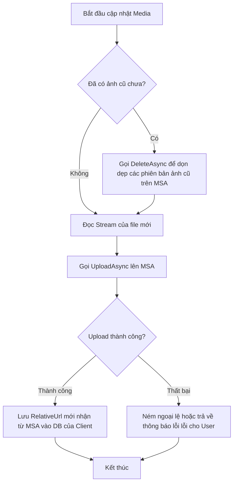

# 🤖 Agent Integration Guide — Media Storage Service (MSA)

> **Mục tiêu:** Tài liệu này là "Global Rule" (chỉ dẫn hệ thống) dành cho AI Agent khi được yêu cầu tích hợp **Media Storage Service (MSA)** vào bất kỳ dự án client nào trong hệ sinh thái. Agent cần tuân thủ nghiêm ngặt các quy tắc thiết kế DB, cấu hình, và luồng nghiệp vụ dưới đây.

---

## 📌 1. Bối Cảnh & Vai Trò Của MSA
**Media Storage Service (MSA)** là một microservice độc lập chuyên quản lý lưu trữ, phục vụ qua CDN nội bộ và xóa file media tập trung. 
* **Tên repo gốc:** `lamhongbac/MediaServiceAgency`
* **Swagger UI (Dev):** `{BaseUrl}/openapi`
* **Công nghệ tích hợp:** Dùng giao thức HTTP (REST API), truyền dữ liệu qua Multipart Form-Data (Upload) và JSON (Register/Delete).
* **Xác thực:** Sử dụng ApiKey thông qua HTTP Header `X-Api-Key`.

---

## 🛠️ 2. Quy Tắc Thiết Kế Database (Client)
Khi thiết kế database cho dự án client cần tích hợp ảnh/media, Agent **BẮT BUỘC** tuân thủ quy tắc sau:

| Quy tắc | Chi tiết và Lý do |
|:---|:---|
| **Chỉ lưu `RelativeUrl`** | Lưu đường dẫn tương đối nhận từ MSA. Ví dụ: `/pos/images/menuitem/f001/f001_20260512143022.jpg`. |
| **KHÔNG lưu `FullUrl`** | Tuyệt đối không lưu URL hoàn chỉnh (chứa domain) vào DB. Khi domain CDN thay đổi hoặc chuyển đổi môi trường (Dev/Staging/Production), hệ thống sẽ bị lỗi hàng loạt nếu lưu cứng domain. |
| **Kiểu dữ liệu phù hợp** | Dùng kiểu dữ liệu chuỗi có độ dài tối thiểu 500 ký tự (Ví dụ trong SQL Server: `NVARCHAR(500)`). |
| **Cách dựng URL hiển thị** | URL hiển thị trên giao diện sẽ được dựng động tại tầng Presentation/API của client: `{MSA_BaseUrl}/cdn/{RelativeUrl}`. |

---

## ⚙️ 3. Quy Cấu Hình Client (`appsettings.json`)
Agent phải thêm cấu hình sau vào file cấu hình của ứng dụng client:

```json
{
  "MSAConfig": {
    "BaseUrl": "https://media.agency.com",
    "AppCode": "YOUR_APP_CODE",
    "ApiKey": "YOUR_ASSIGNED_API_KEY"
  }
}
```

> [!WARNING]
> * `AppCode`: Phải viết hoa toàn bộ (`UPPER_CASE`), không dấu, không khoảng trắng (Ví dụ: `POS`, `CRM`, `HRM`).
> * `ApiKey`: Là thông tin nhạy cảm. Agent phải hướng dẫn người dùng không commit trực tiếp ApiKey thực tế vào Git (sử dụng User Secrets hoặc Environment Variables cho môi trường Production).

---

## 🔄 4. Quy Trình Đăng Ký Ứng Dụng (One-time Setup)
Nếu client chưa có `AppCode` và `ApiKey`, Agent cần hướng dẫn hoặc thực hiện đăng ký qua API sau:

* **Endpoint:** `POST {BaseUrl}/api/media/register`
* **Request Body (JSON):**
  ```json
  {
    "appName": "Tên Hiển Thị Của Ứng Dụng",
    "appCode": "MÃ_ỨNG_DỤNG"
  }
  ```
* **Response nhận được:**
  ```json
  {
    "appCode": "MÃ_ỨNG_DỤNG",
    "apiKey": "CHUỖI_API_KEY_ĐÃ_CẤP_PHÁT",
    "createdDate": "2026-05-12T14:30:00"
  }
  ```
* **Lưu ý:** Lưu lại `apiKey` ngay lập tức vào cấu hình client. Hệ thống MSA không hỗ trợ lấy lại ApiKey đã cấp phát.

---

## 💾 5. Hướng Dẫn Sinh Code Tích Hợp (C# .NET Client)
Khi Agent viết code tích hợp cho ứng dụng C# .NET, hãy sinh và đăng ký các thành phần sau:

### 1️⃣ DTOs phía Client
```csharp
public class MsaUploadResult
{
    public bool IsSuccess { get; set; }
    public string Message { get; set; }
    public string RelativeUrl { get; set; }
    public string FullUrl { get; set; }
    public long FileSize { get; set; }
}

public class MediaResponseDto
{
    public bool IsSuccess { get; set; }
    public string Message { get; set; }
    public string RelativeUrl { get; set; }
    public string FullUrl { get; set; }
    public long FileSize { get; set; }
    public string FileExtension { get; set; }
}
```

### 2️⃣ Client Service (`MsaMediaClient.cs`)
```csharp
using System.Net.Http.Headers;
using System.Text;
using System.Text.Json;
using Microsoft.Extensions.Configuration;

public class MsaMediaClient
{
    private readonly HttpClient _httpClient;
    private readonly string _appCode;
    private readonly string _apiKey;

    public MsaMediaClient(HttpClient httpClient, IConfiguration config)
    {
        _httpClient = httpClient;
        _appCode = config["MSAConfig:AppCode"] ?? throw new ArgumentNullException("MSAConfig:AppCode is missing");
        _apiKey = config["MSAConfig:ApiKey"] ?? throw new ArgumentNullException("MSAConfig:ApiKey is missing");
        
        var baseUrl = config["MSAConfig:BaseUrl"] ?? throw new ArgumentNullException("MSAConfig:BaseUrl is missing");
        _httpClient.BaseAddress = new Uri(baseUrl);
    }

    /// <summary>
    /// Upload file lên dịch vụ lưu trữ MSA.
    /// </summary>
    /// <param name="entity">Tên đối tượng nghiệp vụ (lowercase, ví dụ: "product", "avatar")</param>
    /// <param name="uniqueCode">Mã định danh duy nhất của record (ví dụ: "prod-102")</param>
    /// <param name="mediaType">Loại media ("images", "videos", "documents")</param>
    /// <param name="fileStream">Stream của file cần upload</param>
    /// <param name="fileName">Tên file gốc</param>
    public async Task<MsaUploadResult> UploadAsync(
        string entity, string uniqueCode, string mediaType,
        Stream fileStream, string fileName)
    {
        using var form = new MultipartFormDataContent();
        form.Add(new StringContent(_appCode), "AppCode");
        form.Add(new StringContent(mediaType.ToLower()), "MediaType");
        form.Add(new StringContent(entity.ToLower()), "Entity");
        form.Add(new StringContent(uniqueCode.ToLower()), "UniqueCode");

        var fileContent = new StreamContent(fileStream);
        fileContent.Headers.ContentType = new MediaTypeHeaderValue("application/octet-stream");
        form.Add(fileContent, "File", fileName);

        var request = new HttpRequestMessage(HttpMethod.Post, "/api/media/upload")
        {
            Content = form
        };
        request.Headers.Add("X-Api-Key", _apiKey);

        var response = await _httpClient.SendAsync(request);

        if (!response.IsSuccessStatusCode)
        {
            var errContent = await response.Content.ReadAsStringAsync();
            return new MsaUploadResult { IsSuccess = false, Message = $"API Error: {response.StatusCode} - {errContent}" };
        }

        var json = await response.Content.ReadAsStringAsync();
        var mediaResponse = JsonSerializer.Deserialize<MediaResponseDto>(json,
            new JsonSerializerOptions { PropertyNameCaseInsensitive = true });

        return new MsaUploadResult
        {
            IsSuccess = mediaResponse!.IsSuccess,
            Message = mediaResponse.Message,
            RelativeUrl = mediaResponse.RelativeUrl,
            FullUrl = mediaResponse.FullUrl,
            FileSize = mediaResponse.FileSize
        };
    }

    /// <summary>
    /// Xóa toàn bộ file media liên kết với uniqueCode của thực thể nghiệp vụ.
    /// </summary>
    public async Task<bool> DeleteAsync(string entity, string uniqueCode, string mediaType)
    {
        var payload = new
        {
            appCode = _appCode,
            mediaType = mediaType.ToLower(),
            entity = entity.ToLower(),
            uniqueCode = uniqueCode.ToLower(),
            fileName = ""
        };

        var request = new HttpRequestMessage(HttpMethod.Delete, "/api/media/delete-by-metadata")
        {
            Content = new StringContent(
                JsonSerializer.Serialize(payload),
                Encoding.UTF8,
                "application/json")
        };
        request.Headers.Add("X-Api-Key", _apiKey);

        var response = await _httpClient.SendAsync(request);
        return response.IsSuccessStatusCode;
    }
}
```

### 3️⃣ Đăng ký DI trong `Program.cs`
Agent phải đăng ký `MsaMediaClient` thông qua `AddHttpClient` để tận dụng HttpClient Factory:
```csharp
builder.Services.AddHttpClient<MsaMediaClient>();
```

---

## 🔄 6. Luồng Nghiệp Vụ Cập Nhật Media Standard
Để tránh việc file rác tích tụ trên server lưu trữ do việc sinh timestamp ngẫu nhiên khi upload, Agent phải luôn áp dụng luồng nghiệp vụ **Xóa trước - Upload sau** khi cập nhật ảnh mới cho một thực thể nghiệp vụ:



### Ví dụ Service Implementation
```csharp
public async Task UpdateProductImageAsync(string productCode, IFormFile imageFile)
{
    // 1. Dọn dẹp ảnh cũ trước để tránh rác (MSA hỗ trợ xóa wildcard theo UniqueCode)
    await _msaClient.DeleteAsync(
        entity: "product",
        uniqueCode: productCode,
        mediaType: "images");

    // 2. Upload ảnh mới lên hệ thống lưu trữ
    using var stream = imageFile.OpenReadStream();
    var uploadResult = await _msaClient.UploadAsync(
        entity: "product",
        uniqueCode: productCode,
        mediaType: "images",
        fileStream: stream,
        fileName: imageFile.FileName);

    if (!uploadResult.IsSuccess)
    {
        throw new Exception($"Không thể lưu trữ hình ảnh sản phẩm: {uploadResult.Message}");
    }

    // 3. Chỉ lưu RelativeUrl vào database client
    await _productRepository.UpdateImageUrlAsync(productCode, uploadResult.RelativeUrl);
}
```

---

## 🔍 7. Checklist Kiểm Tra & Xác Nhận Của Agent
Trước khi kết thúc nhiệm vụ tích hợp MSA vào một dự án client, Agent phải xác nhận danh sách sau:

- [ ] Đã khai báo cấu hình `MSAConfig` trong `appsettings.json`.
- [ ] ApiKey đã được rút gọn ra Secret Manager hoặc biến môi trường ở cấu hình production.
- [ ] Bảng dữ liệu nghiệp vụ của ứng dụng client chỉ thiết kế lưu cột `RelativeUrl` loại chuỗi (độ rộng ~500 ký tự).
- [ ] Đã đăng ký `MsaMediaClient` thông qua HttpClient Factory trong DI container.
- [ ] Mọi tham số `AppCode`, `MediaType`, `Entity`, `UniqueCode` khi truyền qua API đều được đưa về chữ thường (lowercase) tự động để đồng bộ với cơ chế dọn dẹp thư mục của MSA (trừ `AppCode` viết hoa).
- [ ] Triển khai đúng luồng dọn dẹp ảnh cũ (`DeleteAsync`) trước khi upload mới (`UploadAsync`).
- [ ] Đã kiểm tra đầu ra hiển thị ảnh trên UI bằng cách cộng chuỗi chính xác: `{BaseUrl}/cdn/{RelativeUrl}`.
